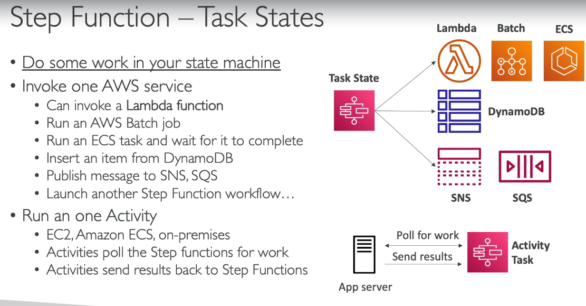
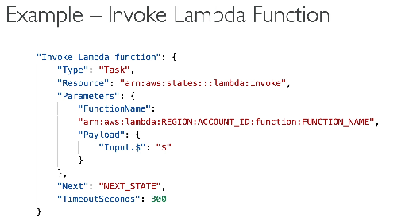
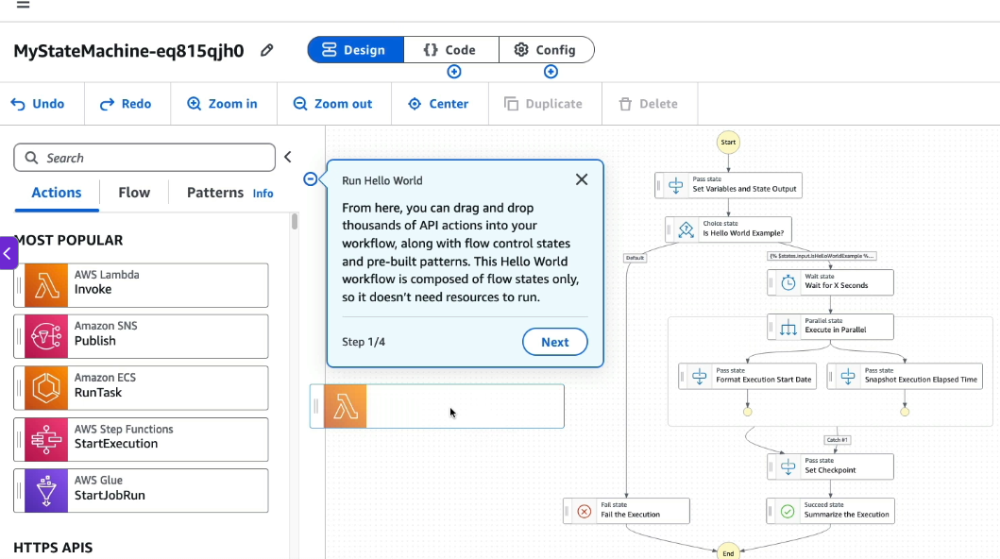
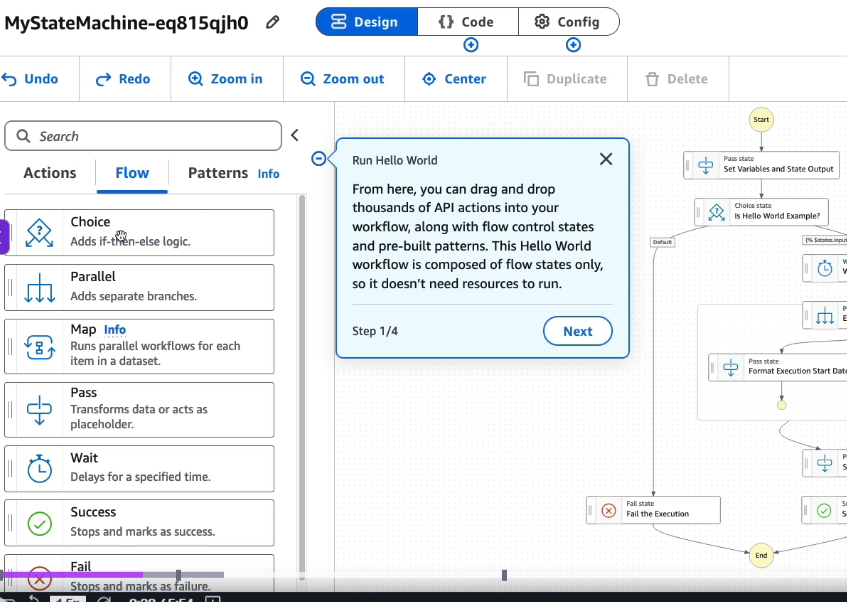

# AWS Step Functions

- A workflow orchestration service that coordinates multiple tasks and AWS services.
- Each step in the workflow can be a Lambda function, ECS task, API call, database operation, email notification, or even a human approval action.
- AWS Step Functions manages the sequence, retries, error handling, and state between steps.
- Useful when a business process involves multiple actions that must happen in a specific order.

**Example: Leave Approval Workflow**
1. Lambda: Store leave request in database.
2. Lambda: Send approval request to manager.
3. Human: Manager approves or rejects the request. (manual)
4. Lambda: Update leave status in database.
5. Lambda: Send notification to employee.

AWS Step Functions orchestrates all these steps and keeps track of the workflow state.

- **Step functions are written in JSON**

### Task state
> **A Task state performs a unit of work by invoking an external service, such as AWS Lambda, ECS, Batch, SNS, SQS, or another AWS SDK API.**

-   

- **different state types** - 
| State Type | Purpose | Example Use Case |
|------------|---------|------------------|
| **Task** | Perform a unit of work by invoking Lambda, ECS, Batch, SNS, SQS, or any AWS SDK API | Process an order using a Lambda function |
| **Pass** | Pass input to the next state without doing any work | Add static data or test a workflow |
| **Choice** | Branch workflow based on conditions | If payment succeeds → ship order; else → cancel order |
| **Wait** | Pause execution for a duration or until a specific time | Wait 5 minutes before retrying |
| **Succeed** | Successfully end the workflow | Order processing completed |
| **Fail** | End the workflow with an error | Payment validation failed |
| **Parallel** | Execute multiple branches simultaneously | Process payment, inventory, and notification in parallel |
| **Map** | Repeat the same workflow for each item in a collection | Process each order item independently |

  
- see that the type here is task, it can be any from the above table, like choice, parallel

#### Creating Step functions
- this is drag and drop
- goto step function, click create state machine, select task
  
- then select flow
  
- once done, it will give us json for the step function, which we can then execute

# Problem Statement

> **Invoke a Lambda function, examine its output, and continue the workflow only if the output contains `"Stephane"`; otherwise fail the workflow.**

---

# Step Function Definition (Explained)

```jsonc
{
  // Description of the workflow
  "Comment": "A Hello World example of the Amazon States Language using Pass states",

  // Workflow starts from this state
  "StartAt": "Lambda Invoke",

  // All states are defined here
  "States": {

    // -------------------------------
    // State 1: Invoke Lambda
    // -------------------------------
    "Lambda Invoke": {

      // Executes some work
      "Type": "Task",

      // Built-in Step Functions integration for Lambda
      "Resource": "arn:aws:states:::lambda:invoke",

      // Only pass the Lambda's Payload to the next state.
      // Without this, the output contains metadata as well.
      "OutputPath": "$.Payload",

      // Input sent to Lambda
      "Parameters": {

        // Pass the entire Step Function input as the Lambda event.
        "Payload.$": "$",

        // Lambda function to invoke
        "FunctionName": "<ENTER FUNCTION NAME HERE>"
      },

      // Retry if Lambda invocation fails
      "Retry": [
        {

          // Retry only for these errors
          "ErrorEquals": [
            "Lambda.ServiceException",
            "Lambda.AWSLambdaException",
            "Lambda.SdkClientException",
            "Lambda.TooManyRequestsException"
          ],

          // Wait 1 second before first retry
          "IntervalSeconds": 1,

          // Retry up to 3 times
          "MaxAttempts": 3,

          // Double the wait time after every retry
          "BackoffRate": 2
        }
      ],

      // If successful, continue to Choice state
      "Next": "Choice State"
    },

    // -------------------------------
    // State 2: Decision
    // -------------------------------
    "Choice State": {

      // Conditional branching
      "Type": "Choice",

      "Choices": [

        {
          // Check the Lambda output
          "Variable": "$",

          // Does output contain "Stephane"?
          "StringMatches": "*Stephane*",

          // Yes -> go here
          "Next": "Is Teacher"
        }
      ],

      // Otherwise
      "Default": "Not Teacher"
    },

    // -------------------------------
    // Success State
    // -------------------------------
    "Is Teacher": {

      // Does nothing except return data
      "Type": "Pass",

      // Output returned
      "Result": "Woohoo!",

      // End workflow successfully
      "End": true
    },

    // -------------------------------
    // Failure State
    // -------------------------------
    "Not Teacher": {

      // Ends workflow with failure
      "Type": "Fail",

      // Error code
      "Error": "ErrorCode",

      // Error message
      "Cause": "Stephane the teacher wasn't found in the output of the Lambda Function"
    }
  }
}
```
