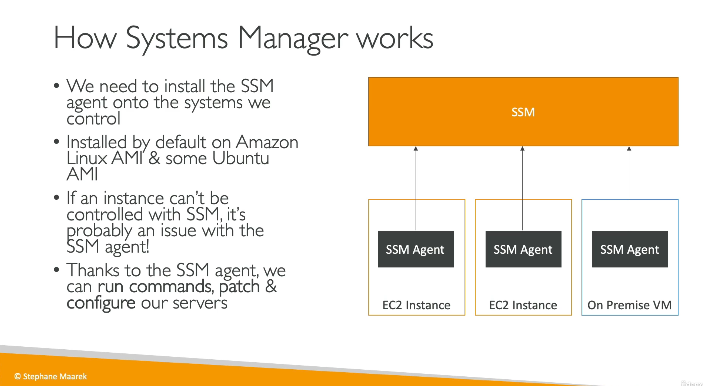
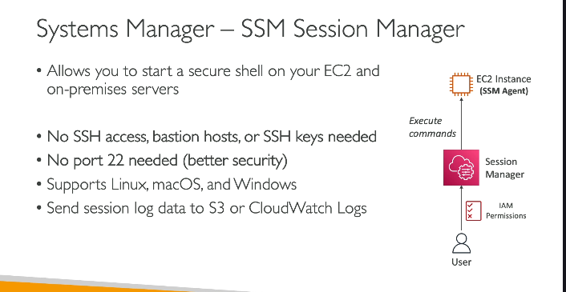

# Systems Manager (SSM)
- allows us to manage and operate AWS (like 20-30 EC2s) resources and on-premises infrastructure at scale
- Provides patch management, configuration management, automation
- so we can patch our EC2 instance fleet(like 10-15 EC2 instances, including any on-primises server we have)
- no need to run same patch commands for each individual EC2 instance 
- the way it works is we install SSM agents in all the server instances, and they talk to common SSM service on AWS and do the stuff

 

## SSM Session manager
- allows us to ssh into EC2 instances without SSH Keys, so the underlying EC2 instances don't need to open port 22 
- we connect to SSH session manager, and it will on our behalf execute commands on EC2 instances which have SSH agents running

 