# VPC
- Virtual Private Cloud
- divided into public and private subnets
- EC2 instances inside public subnets are accessible over the internet
- Under private subnets, EC2's are not reachable from internet, however EC2's can access internet using NAT
- Internet gateways allows EC2 instances from VPC to be publicly available
- even if we don't create any VPC, all our resources are added into default VPC by AWS

> [!NOTE]
> ## CIDR (Classless Inter-Domain Routing)
>
> - **CIDR** is a notation used to define an **IP address range** for a network.
> - It is written as **`IP Address/Prefix Length`**, where the prefix length determines how many IP addresses are available.
>
> ---
>
> ### Format
>
> ```text
> 10.0.0.0/16
> │        │
> │        └── Prefix Length
> └────────── Network Address
> ```
>
> - **Smaller prefix** → More IP addresses.
> - **Larger prefix** → Fewer IP addresses.
>
> ---
>  
> 
> ---
> - A **VPC** is assigned a CIDR block (e.g., `10.0.0.0/16`).
> - **Subnets** must use CIDR ranges **within the VPC's CIDR**.
> - Subnet CIDRs **cannot overlap**.

> [!NOTE]
> -  

## Default VPC
- All new AWS accounts have a default VPC, and this VPC has access to internet
- New EC2 instances are launched into this default VPC by default  
  
- Default VPC has 3 subnets (each subnet for each AZ within the region), and each subnet will get CIDR assigned  
- These subnet CIDRs will determine IP address of EC2 launched inside this VPC / subnet  
  
- the default VPC attaches Internet gateway to routing rules so all EC2 instances within that VPC / subnet will have access to the internet  
   
- Note - EC2 can access intennet means, from EC2 instnance we can access internet, and it is not the other way around, for EC2 to be accessed over the internet, EC2 must be (in public subnet, have public IPv4, appropriate sec grp and NACL rules configured)

## VPC
  

#### Creating VPC
  
- Note the CIDR block cannot go beyond 10.0.0.0/15 - because max limit is /16 in AWS

> [!NOTE]
> ## Subnets
>
> - A **Subnet** is a **portion of a VPC's IP address range (CIDR block)** where AWS resources (EC2, RDS, Lambda ENIs, etc.) are deployed.
> - Every resource launched in a subnet receives a **private IP address** from that subnet's CIDR range.
>
> ---
>
> ### How it Works
>
> ```text
> VPC
> CIDR: 10.0.0.0/16
>         │
>         ├──────────────┐
>         ▼              ▼
> Public Subnet     Private Subnet
> 10.0.1.0/24       10.0.2.0/24
>      │                 │
>      ▼                 ▼
> EC2: 10.0.1.10    EC2: 10.0.2.15
> ```
>
> ---
>
> ### Why are Subnets Needed?
>
> - Divide a VPC into **smaller networks**.
> - Organize resources (e.g., Public and Private).
> - Control network routing and security.
> - Each subnet exists in **one Availability Zone (AZ)**.
>
> -    

### Creating subnet
  
- after selecting VPC, we need to select - CIDR range and to which AZ, then subnet will cater to
- generally for public subnets - the IP ranges are kept smaller (since public IPs are need for only few services like ALB), and for private subnets, the range should be more
    
- create multiple subnets inside the same VPC, catering to different AZs  
   
- above we have created 4 subnets inside 1 VPC, only the names are public and private subnets, they are not yet configured to be public / private subnets
- **We need to create Internet Gateway to**  
- 1. allow resources (like EC2, Lambda) to access internet
- **Internet gateway needs to be** - 
- 1. Created separately from VPC
- 2. Then must be attached to VPC - only one IGW can be attached to 1 VPC
- 3. Attaching IGW to VPC alone will not give intert access, we must edit route tables to allow internet access  

  
- 1. Edit route table to connect to EC2 instance inside public subnet
- 2. Route table connects to IGW which then connectes to internet

#### Creating Internet Gateway (IGW)
1. goto VPC, select IGW
2. give name and click on create
3. attach the created IGW to the VPC we created above
4. this still does not give access to internet for resources (like EC2 created inside the VPC we created above)
5. We need to edit route tables

#### Creating Route tables
1.  Create Route tables, select VPC to which this Route table will be assinged  
  
2. Once Route table is created, then associate the subnets within the VPC (we attached in step 1)  
  
3. We created 2 Route tables (for public and provate subnets), and associated those subnets to resp. Route tables  
  
4. So 2 public subnets attached to 1 public route table, and 2 private subntes are attched to 1 private Route table (Note - still the public / private Route tables and public / private subnets are still names, nothing differentiates public and private yet)
5. Now the IMP part - editing route tables  
  
- the frst rule is autocreated when route table is created
- this rules states that any source IP within the CIDR (10.0.0.0/16) - (this CIDR is of our VPC which we gave while creating), can connect directly 
- the second rule is what we crated which states, any IP over the world will connect to IGW, and can connect to VPC resources

### Now with the above setting we have 
> [!NOTE]
> #### Outbound Flow (EC2 → Internet)
>
> ```text
> EC2
> (10.0.1.10)
>        │
> Wants to access google.com
> (142.x.x.x)
>        │
>        ▼
> Route Table checks destination
>        │
> Destination NOT in 10.0.0.0/16
>        │
>        ▼
> Match:
> 0.0.0.0/0 → Internet Gateway
>        │
>        ▼
> Internet Gateway
>        │
>        ▼
> Internet
> ```
>
> **Meaning:** The route tells AWS **how to send outgoing traffic** to the Internet.
>
> ---
>
> #### Inbound Flow (Internet → EC2)
>
> ```text
> Internet User
>        │
> Sends request to EC2 Public IP
>        │
>        ▼
> Internet Gateway
>        │
> Delivers packet into the VPC
>        │
>        ▼
> EC2
> (Security Group + NACL checked)
> ```
>
> **Notice:** The route table is **not consulted** for the incoming packet.
>
> AWS already knows:
>
> - this Public IP belongs to this EC2
> - this EC2 is inside this subnet
>
> so it delivers the packet directly.
>
> ---
>
> #### So what does `0.0.0.0/0 → Internet Gateway` actually do?
>
> **It provides Internet connectivity (ONLY FOR resources in PUBLIC SUBNET) for the subnet.**
>
> - ✅ Allows resources in the subnet to **send traffic to the Internet**.
> - ✅ Allows **return traffic** from the Internet back to the EC2.
> - ✅ Allows SSH connection to EC2, because SSH is 2 way communication and this rule must be present
> - ❌ Does **not** by itself allow Internet users to connect to EC2.
>
> Internet users can connect only if **all** of these exist:
>
> - Public IP / Elastic IP
> - Internet Gateway
> - Security Group allows inbound
> - NACL allows inbound

### Giving Internet access to resources inside PRIVATE SUBNETs
#### Bastion Host  
  
**GOAL** - Allow users from Internet to connect to EC2s which are inside private subnets
**Working logic**  
- Bastion host (BH) is nothing but an EC2 instance launched inside public subnet of a VPC
- Since BH is in same VPC, it can connect to EC2 instances from private VPCs
- We configure Sec grp of Private EC2s to allows traffic only from BH
- We configure Sec grp of BH to allow traffic from internet (but only from restricted CIDRs, such that only Corporate IP ranges can access this BH)

**DEMO**  
1. We create BH in public subnet and 1 EC2 in private subnet
2. Then we SSH into BH, and then from that BH, we SSH into the private EC2  
  
- 10.0.0.72 is IP of BH and we SSH and 10.0.22.82 is IP of private EC2
- So we can access private EC2 from BH, but still private EC2 cannot access internet - see in the image - the ping command failed
- Soultion - use **NAT instances**   

### NAT instances
  
- NAT is another EC2 living in public subnet
- It re-writes the Source and Dest IP at packet levels hence Source / Destination check of IPs at EC2 level must be disabled  
- NAT instances are getting decommissioned
- There is a pre-configured AMI available for NAT instances
- **Disadvantages**
- 1. It is not highly available / scalable
- 2. Traffic bandwidth depends on your EC2 instance type

#### Configuring NAT instances
1. Launch EC2 - select NAT AMI from AWS or Marketplace
2. In the launch console, configure Network settings to allow traffic only from VPC resources (configure CIDR range of the VPC we have created). NAT is used to allow resources from private subnet to access the internet. It does not allow outside resources to connect to your private EC2s
3. Once NAT instance is created, edit it's settings to disable source / destination IP check (becuase NAT will re-write the IPs)
4. Now goto Route tables, which caters to private subnets, and add a second rule  
  
- So for any desitination initiated by any resource from this private subnet, the request will go through NAT instances, and they we re-write packets and send to the actual intert server
- Now we can ssh to bastion host, then ssh to private EC2, now if we do ping www.google.com, now the command should work prooving that private EC2s can access the internet

### NAT Gateways
- These are AWS managed NAT instances
- so highly available / scalable, no administration needed
- hence can manage large traffic networks, can autoscale
- it is created in specific AZ and will have an elastic IP
- we should create multiple NAT gateways in multiple AZs for fault tolerance (**remember? while creating subnets, we choose AZ? so for each AZ, in this case subnet, create a NAT gateway**)  

#### Configuring NAT Gatways
1. Click create, choose subnet to which NAT gateway will cater to and allocate Elastic IP  
   
2. Then edit the rules inside route table associated with the subnet and add the newly created NAT gateway as target  
   

#### Regional NAT
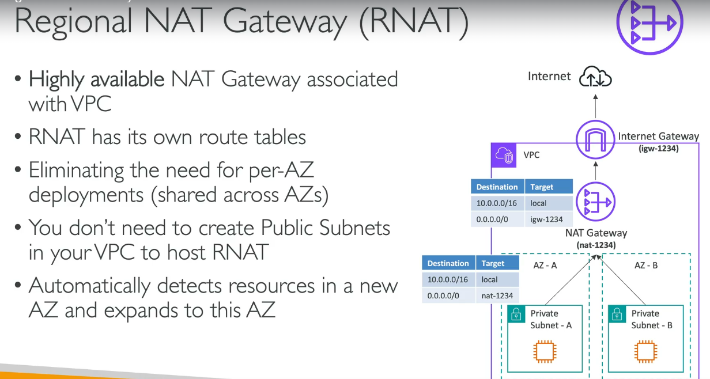   
- Normal NAT gateways were associated with subnets, RNAT is assoicated at VPC level

> [!NOTE]
> # Summary
>
> - **Internet Gateway (IGW):** Enables **Internet connectivity** for resources in a **public subnet** (supports both inbound and outbound Internet traffic, provided the resource has a Public IP and security rules allow it).
> - **Bastion Host:** Use Bastion Host to allow internet users to connect to resources inside private subnets
> - **NAT Gateway:** Allows resources in **private subnets** to **initiate outbound Internet connections**, while **preventing inbound connections initiated from the Internet**.

#### Now once VPC and subnets are configured, we can launch EC2 instances inside a specific VPC / subnets we created above  
  

## NACL - Network Access Control List
- Allow / Block traffic (firewall) at subnet level
- NACLs are stateless (so an incoming request will also need it's corresponding outbound rule), where as security groups are stateful, which means any traffic that comes, the security group will allow it to go out 
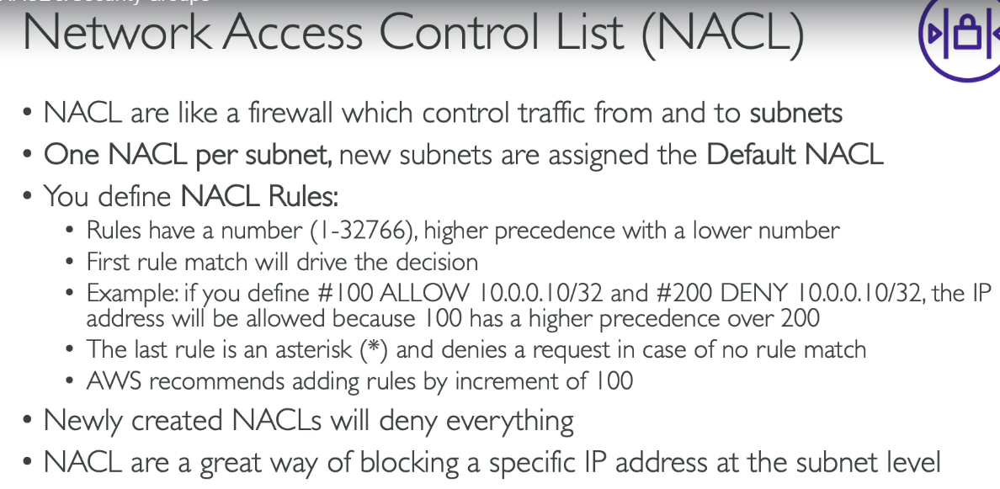  
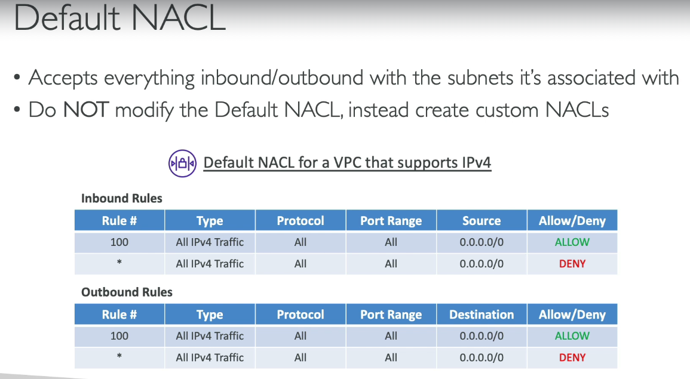  

#### Ephemeral ports
- it is a standard TCP/IP networking concept
- An **Ephemeral Port** is a **temporary, automatically assigned source port** used by the client when initiating a network connection.
- It exists only for the duration of the connection and is released afterward. 
- ports numbers typically used are from 1024-65535 
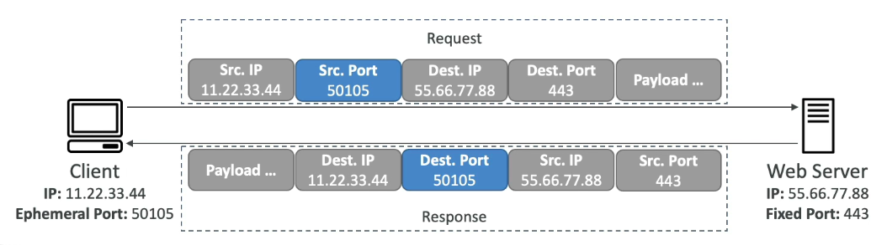  
- The **client** initiates the connection and the OS automatically assigns a temporary **ephemeral source port** (`50105`).
- The request is sent from **`11.22.33.44:50105`** to the web server **`55.66.77.88:443`** (HTTPS).
- The web server processes the request and sends the response **from port `443` back to the client's ephemeral port `50105`**.
- The client uses the ephemeral port to identify **which application/process** should receive the response.

#### NACL with Ephemeral ports
- since we know NACL are stateless, and Ephemeral ports can be any, to establish a connection we need to whitelist all the ports
- same issue does not occur with security groups, because they are stateful  
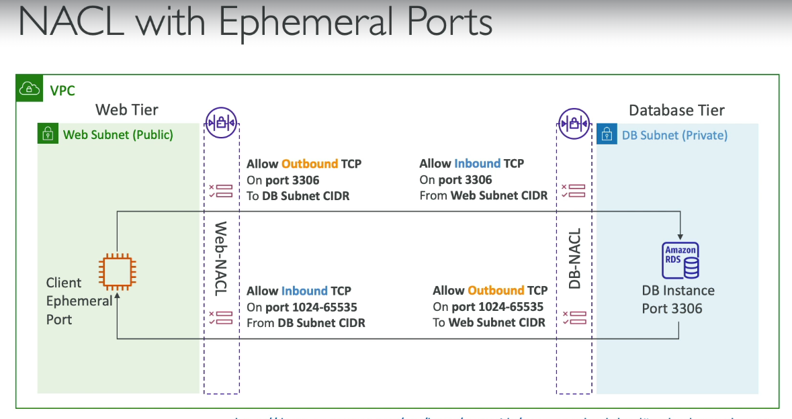  
- The web server sends a request to the database on **port 3306**, so the **Web NACL** must allow **outbound TCP 3306**, and the **DB NACL** must allow **inbound TCP 3306**.
- The database sends the response back to the web server's **ephemeral port (1024–65535)**, so the **DB NACL** must allow **outbound ephemeral ports**, and the **Web NACL** must allow **inbound ephemeral ports**.
- This is required because **Network ACLs are stateless**, so both the request and the response must be explicitly allowed.  
- see below default inbound rules for Default NACL created for Default VPC (it associates with all the subnets by default in a given VPC)  
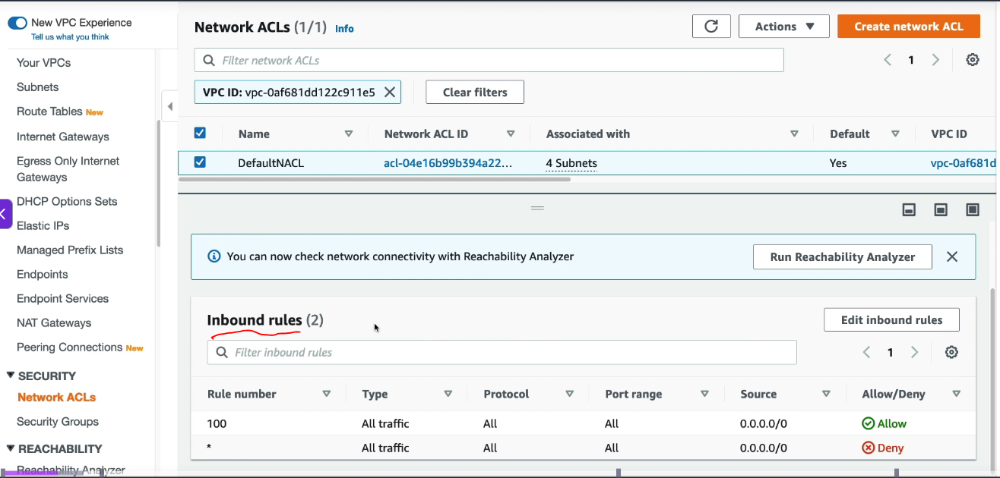  

## VPC peering
- Connects 1 VPC with another VPC **privately**
- VPC peering connection is not transitive (if VPC A and B are connected, and B and C are connected, that does not mean that A and C can connect, they still need a separate VPC peering)
- VPCs that needs to be connected must not have overlapping CIDRs  
- without VPC peering, we cannot 2 EC2s from different VPCs cannot talk to each other
**Creating VPC peering**
1. Create VPC peering
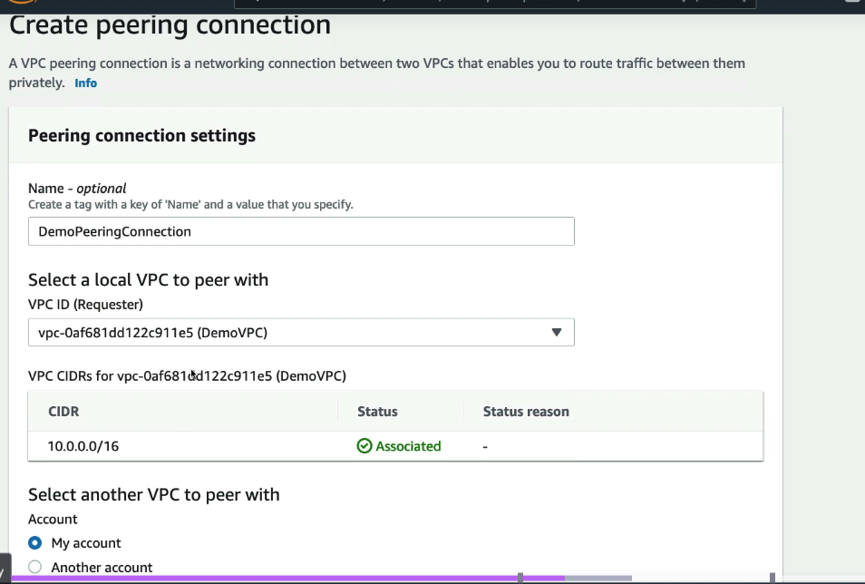  
2.  Once VPC peering connection is created, the non local VPC (see above image), needs to accept the VPC peering connection  
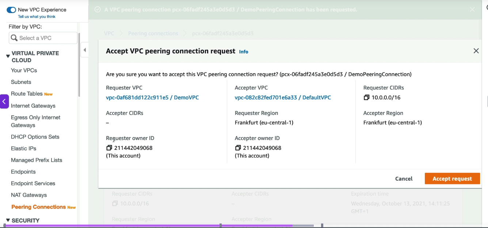  
3. Now we need to edit route tables to send traffic to that other VPC
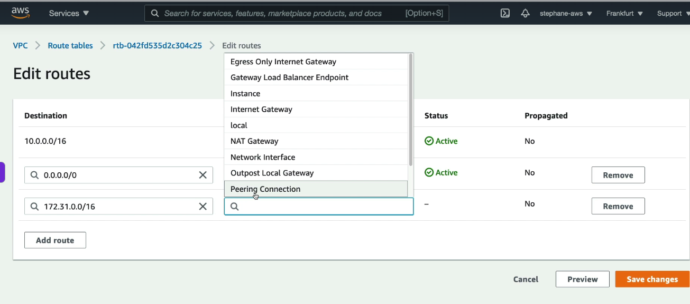  
- here the destination IP is the CIDR of the other VPC we want to peer with
- we need to do the same thing in the other VPC's route table and add current VPC's CIDR in the routing rules

## VPC endpoints
- since all AWS services like SNS, DynamoDB are publicly available, if our EC2s inside private subnet needs to connect to SNS / DynamoDB, then the flow us from EC2 -> NAT -> IGW -> SNS / DynamoDB, (see below image) and connection between IGW to SNS / DynamoDB is over the public internet
- instead use VPC endpoints, which directly and privately connects to AWS services (SNS / DynamoDB)
- thus providing more security (because of private connection), and improved latency (because of reducing hops and provate connection)  
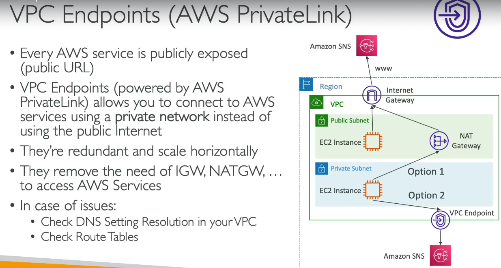  


> [!NOTE]
> ### Endpoint types
> 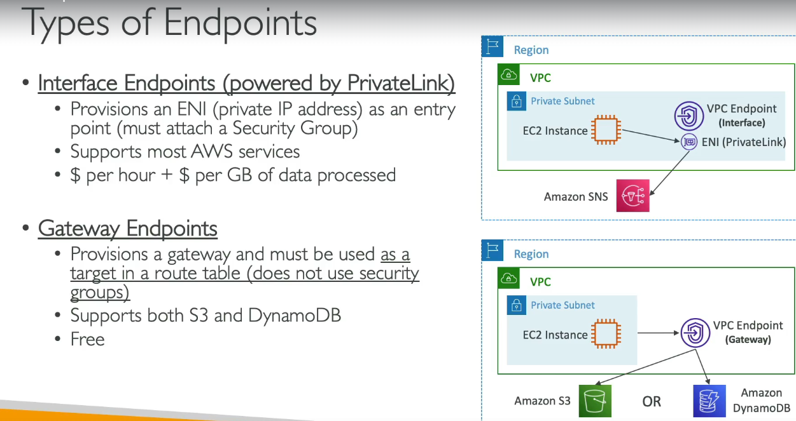  
>
> ### Interface Endpoint (AWS PrivateLink)
>
> **Configuration**
>
> 1. Create an **Interface VPC Endpoint** for an AWS service (e.g., SNS, SQS, Secrets Manager).
> 2. AWS creates an **ENI (private IP)** in your selected subnet.
> 3. Attach a **Security Group** to the endpoint ENI.
>    - **Inbound:** Allow traffic **from your EC2/application** (e.g., TCP 443).
>    - **Outbound:** Allow all (default), so the endpoint can communicate with the AWS service.
>
> **Working**
>
> - EC2 sends an HTTPS request to the AWS service.
> - DNS resolves the service name to the **endpoint's private IP**.
> - The request first reaches the **endpoint ENI**, whose **Security Group** verifies that the EC2 is allowed.
> - The endpoint privately forwards the request to the AWS service over the AWS network (no Internet Gateway or NAT Gateway required).
>
> ---
>
> ### Gateway Endpoint
>
> **Configuration**
>
> 1. Create a **Gateway Endpoint** for **S3** or **DynamoDB**.
> 2. Associate the required **route table(s)**.
> 3. AWS automatically adds a route to the Gateway Endpoint.
> 4. (Optional) Attach an **Endpoint Policy** to restrict access.
>
> **Working**
>
> - EC2 sends a request to S3/DynamoDB.
> - The route table directs the traffic to the **Gateway Endpoint**.
> - The request reaches S3/DynamoDB privately without using an Internet Gateway or NAT Gateway.
>
> **Key Difference**
>
> - **Interface Endpoint:** Uses an **ENI + Security Group**.
> - **Gateway Endpoint:** Uses a **Route Table** (no Security Group).

### VPC Endpoint DEMO
- our EC2 inside private subnet is able to access the internet because of the 2nd rule in the below image  
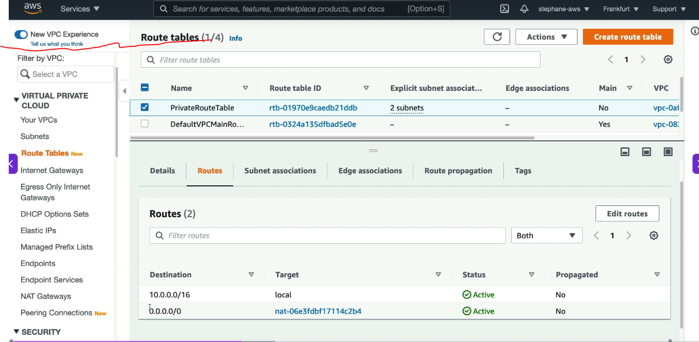  
- the rule 0.0.0.0/0 -> NAT instance basically lets EC2s to access internet
- so if we SSH into our private EC2 (obviously via Baistion Host), and if we do ```aws s3 ls``` (the connection is eastablished via NAT -> publick internet -> S3), we will get the list of buckets
- if we remove that rule, then internet connection is lost and ```aws s3 ls``` fails
- Now we will establish the connection via VPC endpoint
1. Click on create endpoint
2. select the service to which this endpoint (Interface / Gateway endpoint) will cater to s3, SNS?  
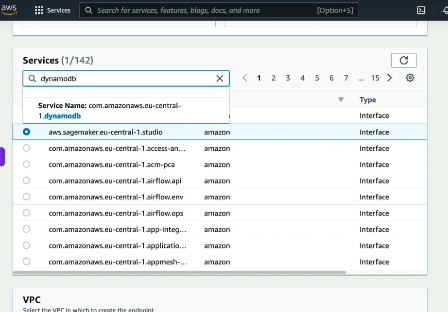  
3. Then select the VPC and AZ to which the endpoint needs to be deplyed  
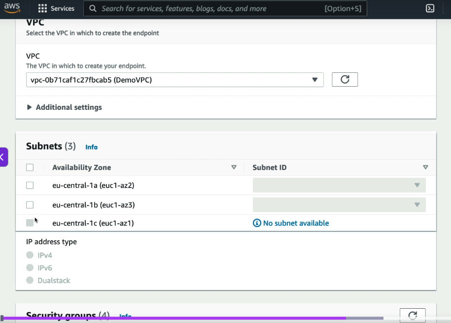  
4. Then select secgrp (if it is interface endpoint) for this VPC endpoint (so when req. comes from EC2 to access outside internet, it can accept / block the req. based on thsi rule)  
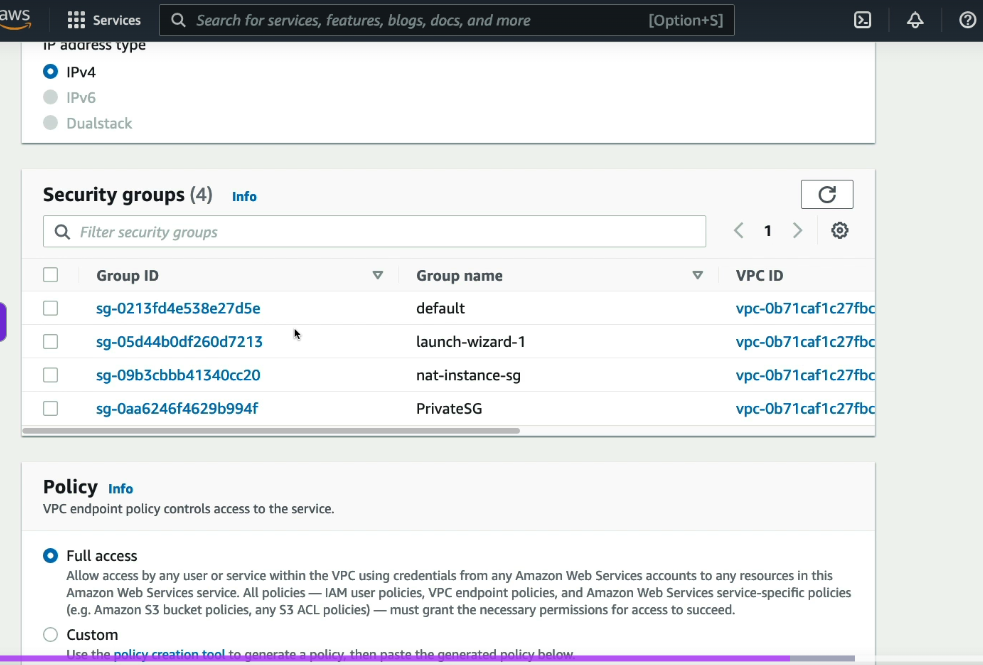  
4. b. if it is a gateway endpoint, then select the route table which needs to be modified for this endpoint (so that AWS behind the scene will update the routing rules so that any req made within the selected VPC and subnet will route the reqs to this VPC endpoint)  
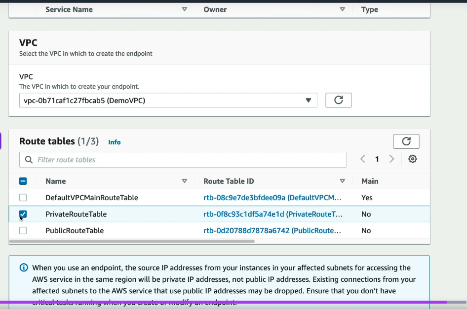  

- **so key advantage of VPC - we can access s3 service, and our EC2 still does not have access to the internet**  

> [!NOTE]
> #### Interface VPC Endpoint Flow
>
> **Example:** EC2 in a private subnet needs to access **Secrets Manager**.
>
> ### Step 1
>
> Create an **Interface VPC Endpoint** for Secrets Manager in your subnet.
>
> ---
>
> ### Step 2
>
> AWS creates an **ENI** inside the subnet.
>
> Example:
>
> ```text
> EC2             : 10.0.1.10
> VPC Endpoint ENI: 10.0.1.100
> ```
>
> ---
>
> ### Step 3
>
> Attach a **Security Group** to the endpoint ENI.
>
> Example:
>
> ```text
> Inbound:
> Allow TCP 443
> Source = EC2 Security Group
> ```
>
> This means **only your EC2 instances are allowed to connect to the endpoint.**
>
> ---
>
> ### Step 4
>
> EC2 makes an HTTPS request to Secrets Manager.
>
> If **Private DNS** is enabled:
>
> ```text
> secretsmanager.amazonaws.com
>        │
>        ▼
> Resolves to
> 10.0.1.100 (Endpoint ENI)
> ```
>
> ---
>
> ### Step 5
>
> The request reaches the **Endpoint ENI**.
>
> The endpoint's **Security Group** checks whether the EC2 is allowed to connect.
>
> ---
>
> ### Step 6
>
> If allowed, AWS privately forwards the request from the endpoint to **Secrets Manager** over the AWS network.
>
> ---
>
> ### Result
>
> - No Internet Gateway required.
> - No NAT Gateway required.
> - Traffic never leaves the AWS private network.


## VPC FLow logs
- captures info about IP traffic going through (VPC, Subnet, ENI)  
- log data gets stored in S3, Cloudwatch, KDS
- can also capture logs for ELB, RDS, Redshift  
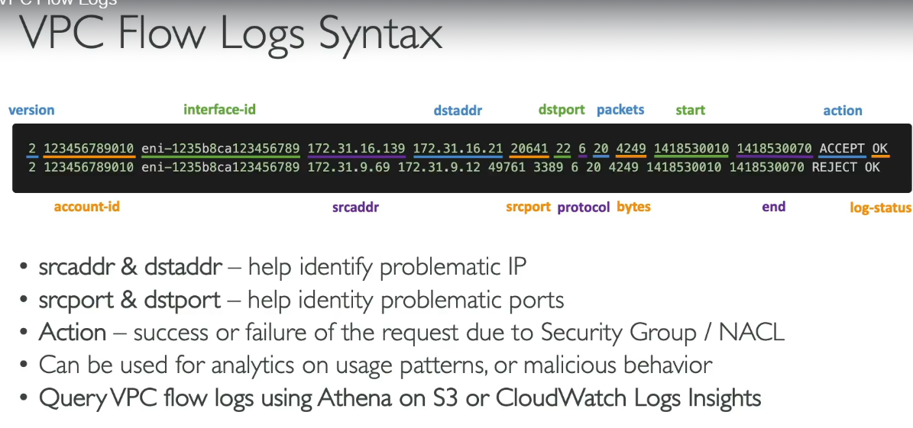  

#### Creating VPC FLow logs
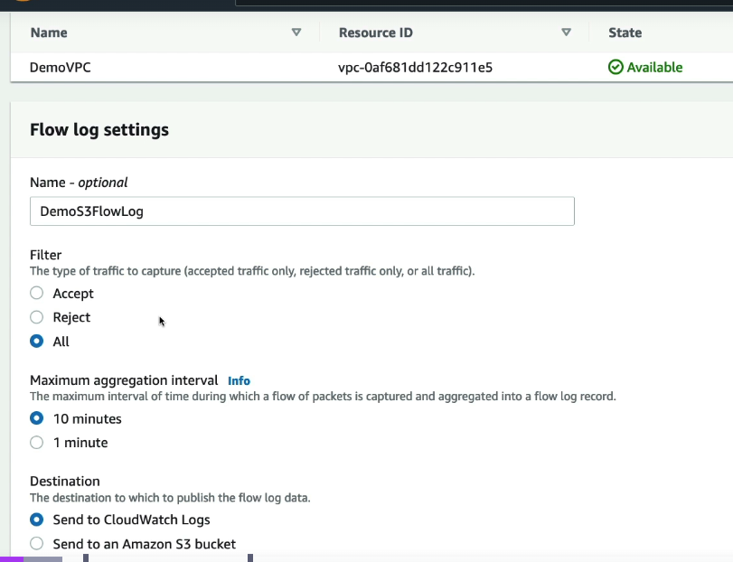  

**AWS Private link** - allows us to connect a service running in our VCP to a service running in another VPC

- **Note - if EC2, connects with S3, the connetion and all the HTTP calls are made via Public internet**  
- this is true for all the resoruces in AWS that talk to each other
- if we wan't AWS services to connect over private connection, then we use VPC endpoints

#### Connecting on-prem datacenter with cloud - 
1. using site-to-site VPN  
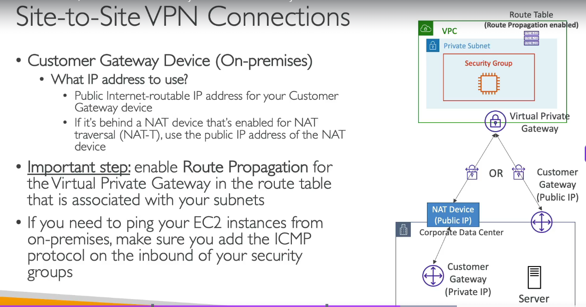   
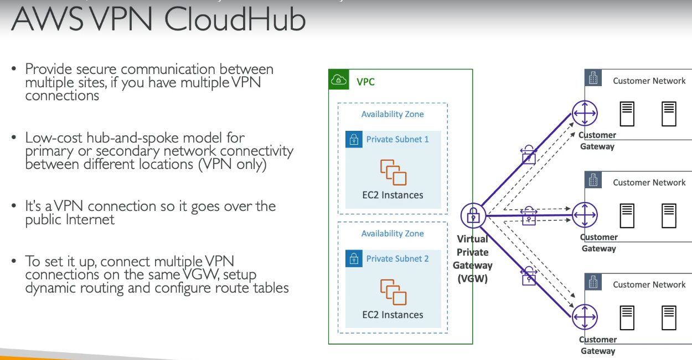   

2. Direct connect (DX)  
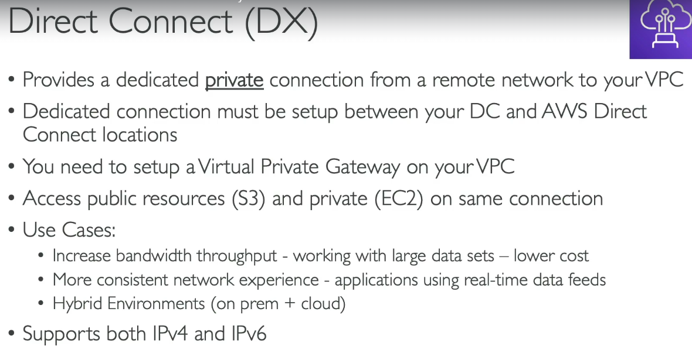   
- if we want to setup direct connect with multiple VPCs, then we use DX-Gateway  
- Connection in DX is not encrypted, because it is private conn, if still want encryted conn - use DX + VPN
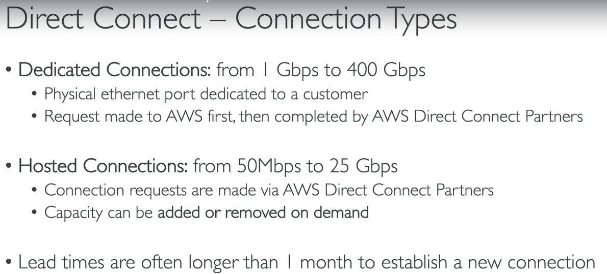   
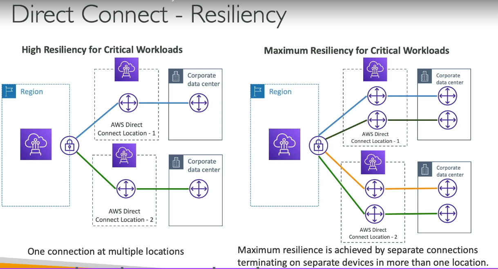   

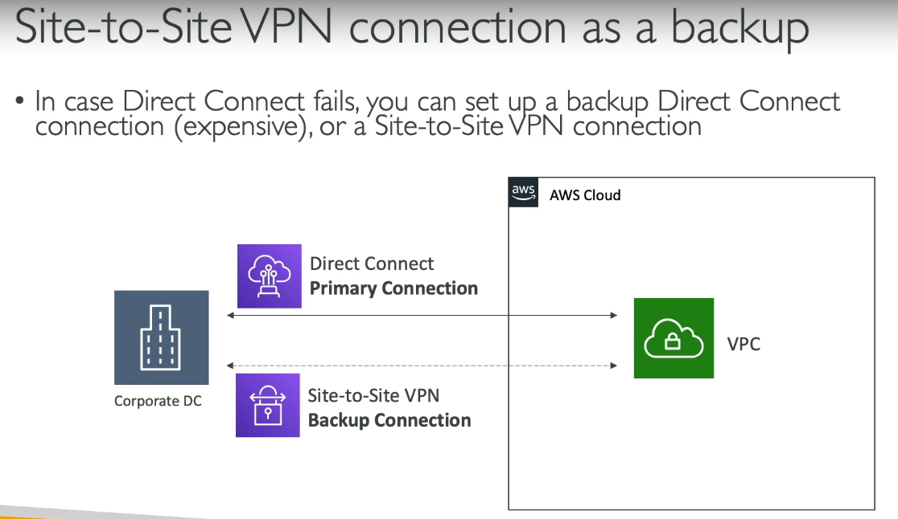   

managing and communicating between VPC can become complicated, solution - **Transit Gateway** 
   
- Transit gateway is the only service that uses IP Multicast  

> [!NOTE]
> ### VPC Traffic Mirroring
>
> - **VPC Traffic Mirroring** copies **network packets** from an EC2 instance's **Elastic Network Interface (ENI)** to another destination for monitoring and analysis.
> - It is used for **packet inspection, security monitoring, troubleshooting, and intrusion detection** without affecting the original traffic.
>
> ---
>
> #### How it Works
>
> 1. Choose the **source ENI** whose traffic you want to monitor.
> 2. (Optional) Apply **Traffic Mirror Filters** to capture only specific traffic (e.g., TCP 443).
> 3. Configure a **Traffic Mirror Target** (e.g., EC2 running Wireshark, IDS/IPS, or a Network Load Balancer).
> 4. AWS copies matching packets and sends them to the target, while the original traffic continues normally.
>
