# VPC
- Virtual Private Cloud
- divided into public and private subnets
- EC2 instances inside public subnets are accessible over the internet
- Under private subnets, EC2's are not reachable from internet, however EC2's can access internet using NAT
- Internet gateways allows EC2 instances from VPC to be publicly available
- even if we don't create any VPC, all our resources are added into default VPC by AWS

> [!NOTE]
> ## CIDR (Classless Inter-Domain Routing)
>
> - **CIDR** is a notation used to define an **IP address range** for a network.
> - It is written as **`IP Address/Prefix Length`**, where the prefix length determines how many IP addresses are available.
>
> ---
>
> ### Format
>
> ```text
> 10.0.0.0/16
> │        │
> │        └── Prefix Length
> └────────── Network Address
> ```
>
> - **Smaller prefix** → More IP addresses.
> - **Larger prefix** → Fewer IP addresses.
>
> ---
> 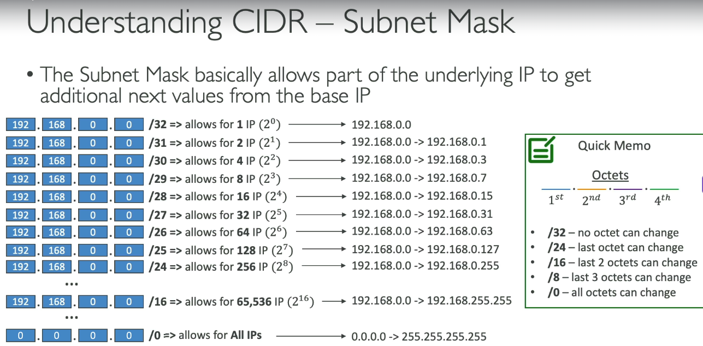 
> 
> ---
> - A **VPC** is assigned a CIDR block (e.g., `10.0.0.0/16`).
> - **Subnets** must use CIDR ranges **within the VPC's CIDR**.
> - Subnet CIDRs **cannot overlap**.

> [!NOTE]
> - 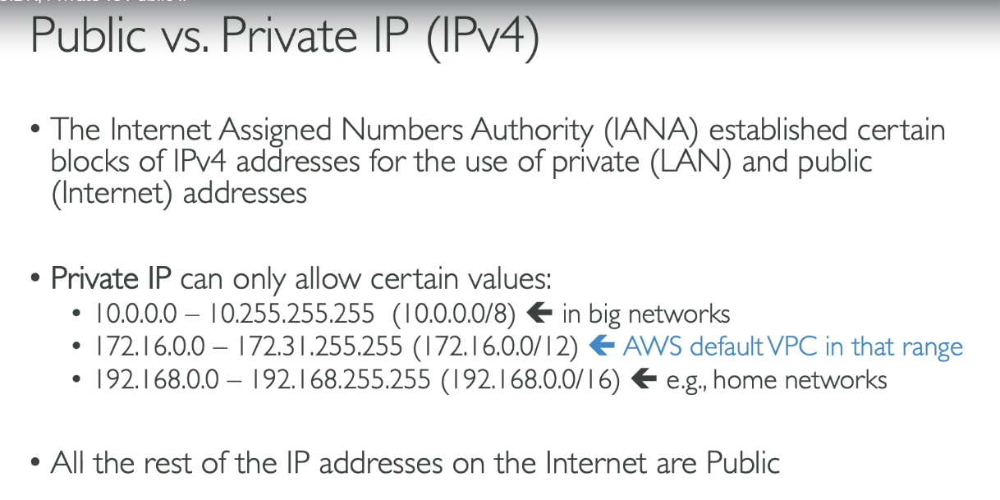 

## Default VPC
- All new AWS accounts have a default VPC, and this VPC has access to internet
- New EC2 instances are launched into this default VPC by default  
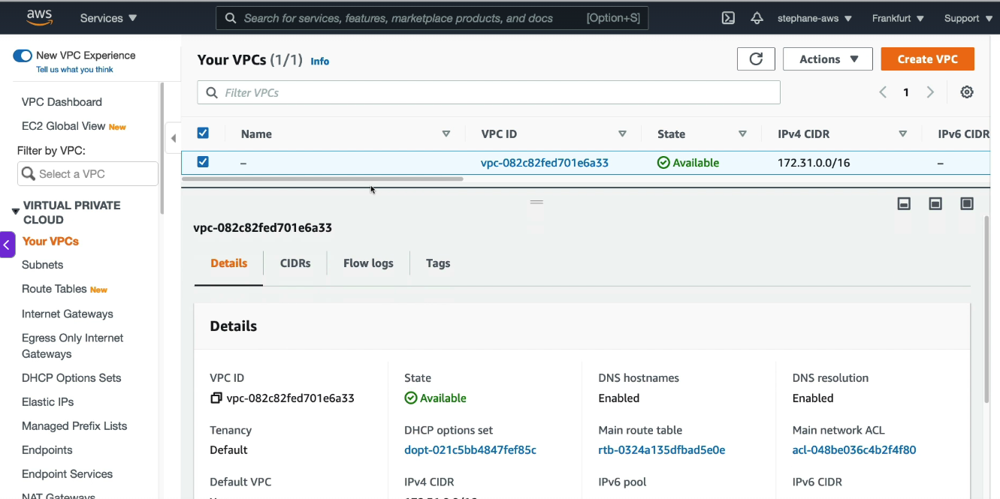  
- Default VPC has 3 subnets (each subnet for each AZ within the region), and each subnet will get CIDR assigned  
- These subnet CIDRs will determine IP address of EC2 launched inside this VPC / subnet  
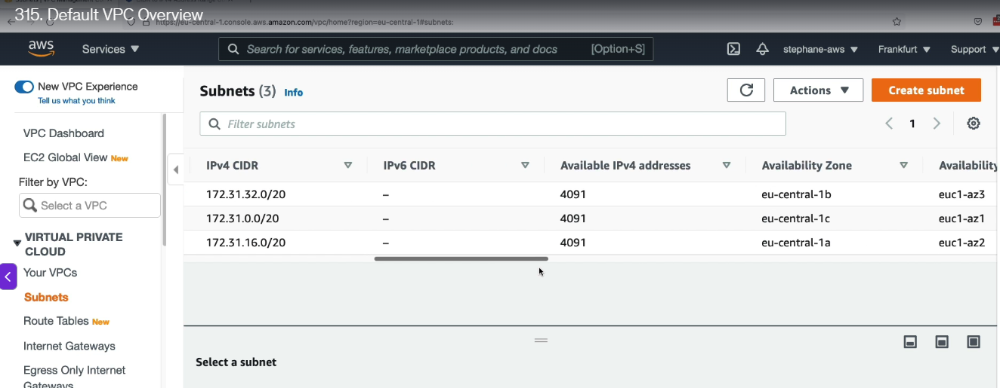  
- the default VPC attaches Internet gateway to routing rules so all EC2 instances within that VPC / subnet will have access to the internet  
 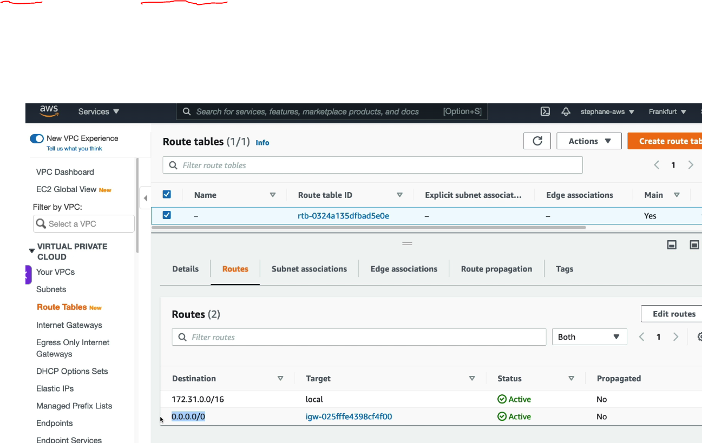  
- Note - EC2 can access intennet means, from EC2 instnance we can access internet, and it is not the other way around, for EC2 to be accessed over the internet, EC2 must be (in public subnet, have public IPv4, appropriate sec grp and NACL rules configured)

## VPC
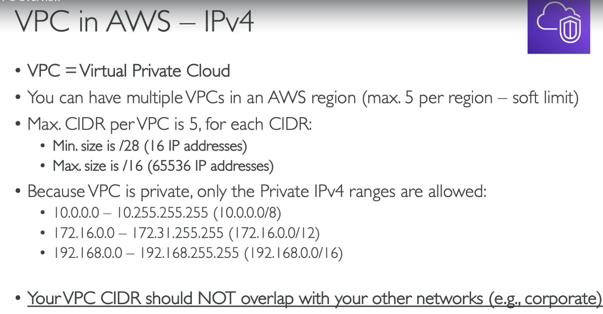  

#### Creating VPC
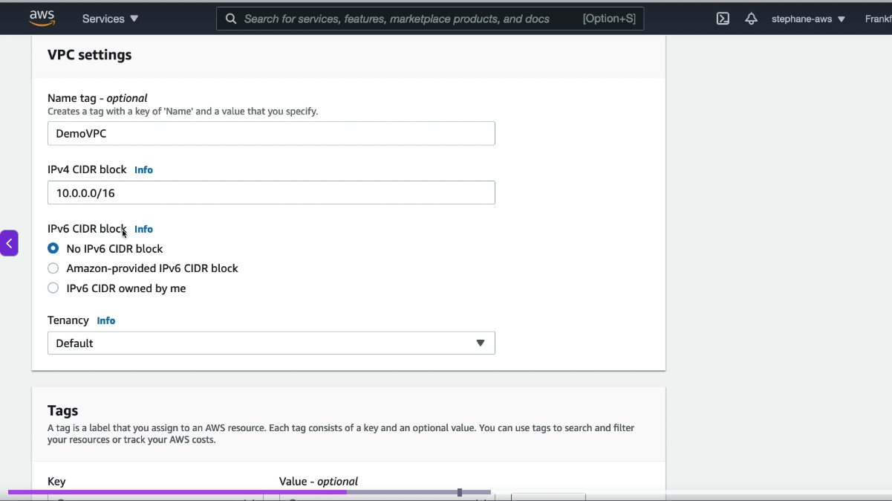  
- Note the CIDR block cannot go beyond 10.0.0.0/15 - because max limit is /16 in AWS

> [!NOTE]
> ## Subnets
>
> - A **Subnet** is a **portion of a VPC's IP address range (CIDR block)** where AWS resources (EC2, RDS, Lambda ENIs, etc.) are deployed.
> - Every resource launched in a subnet receives a **private IP address** from that subnet's CIDR range.
>
> ---
>
> ### How it Works
>
> ```text
> VPC
> CIDR: 10.0.0.0/16
>         │
>         ├──────────────┐
>         ▼              ▼
> Public Subnet     Private Subnet
> 10.0.1.0/24       10.0.2.0/24
>      │                 │
>      ▼                 ▼
> EC2: 10.0.1.10    EC2: 10.0.2.15
> ```
>
> ---
>
> ### Why are Subnets Needed?
>
> - Divide a VPC into **smaller networks**.
> - Organize resources (e.g., Public and Private).
> - Control network routing and security.
> - Each subnet exists in **one Availability Zone (AZ)**.
>
> - 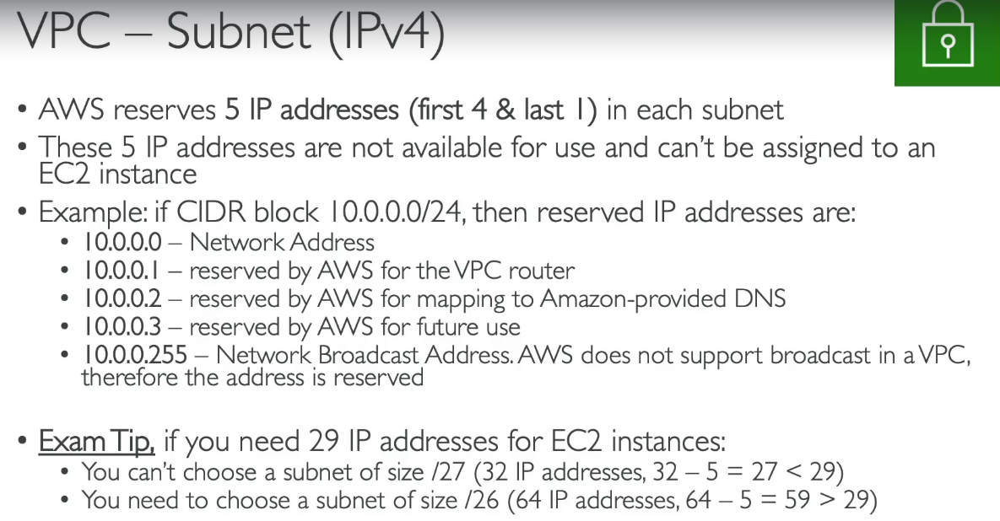   

### Creating subnet
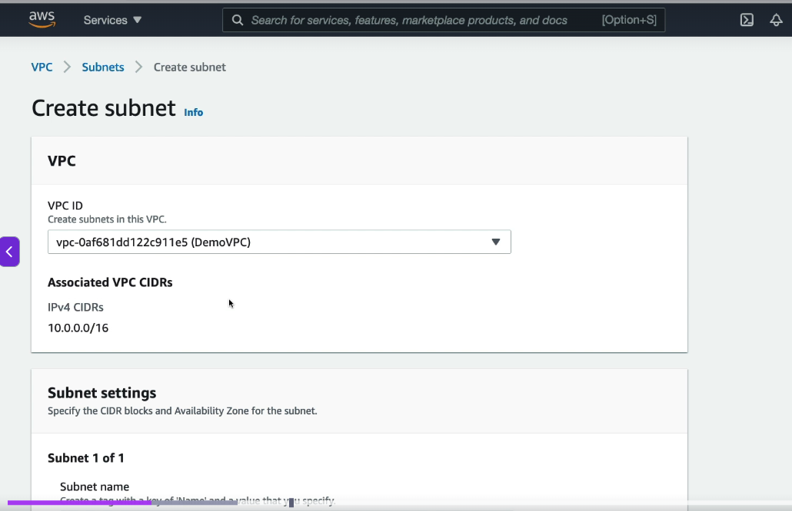  
- after selecting VPC, we need to select - CIDR range and to which AZ, then subnet will cater to
- generally for public subnets - the IP ranges are kept smaller (since public IPs are need for only few services like ALB), and for private subnets, the range should be more
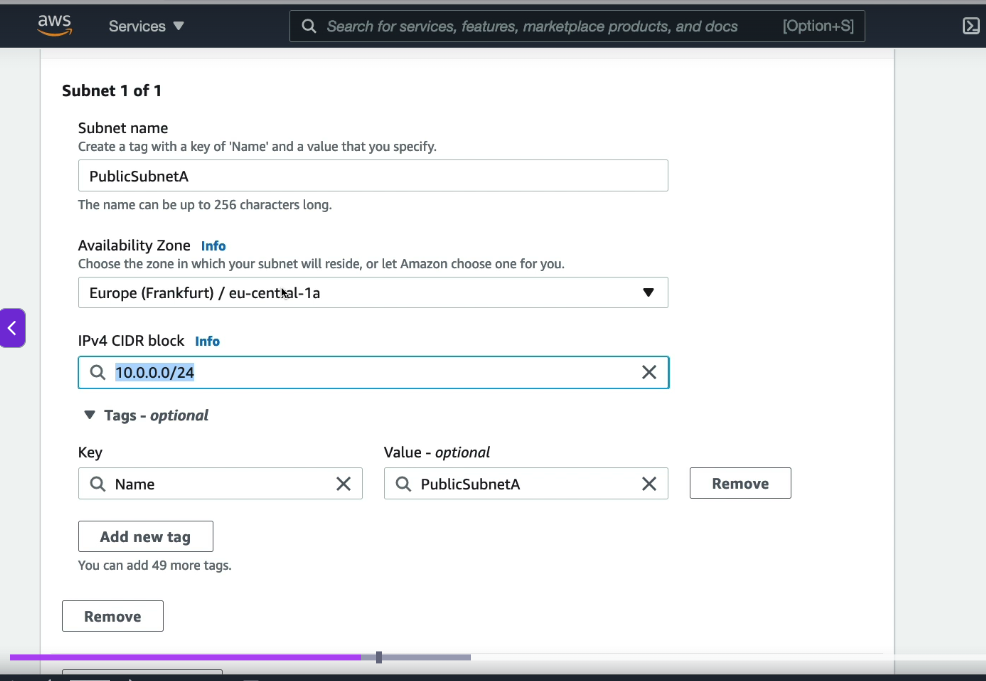    
- create multiple subnets inside the same VPC, catering to different AZs  
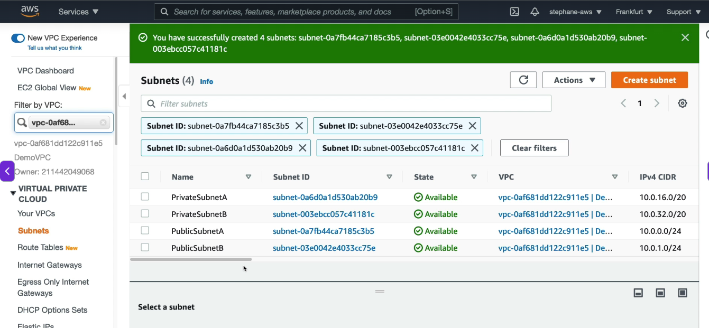   
- above we have created 4 subnets inside 1 VPC, only the names are public and private subnets, they are not yet configured to be public / private subnets
- **We need to create Internet Gateway to**  
- 1. allow resources (like EC2, Lambda) to access internet
- **Internet gateway needs to be** - 
- 1. Created separately from VPC
- 2. Then must be attached to VPC - only one IGW can be attached to 1 VPC
- 3. Attaching IGW to VPC alone will not give intert access, we must edit route tables to allow internet access  

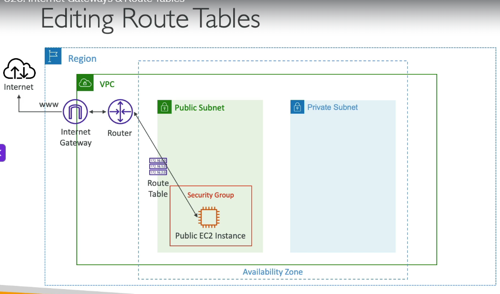  
- 1. Edit route table to connect to EC2 instance inside public subnet
- 2. Route table connects to IGW which then connectes to internet

#### Creating Internet Gateway (IGW)
1. goto VPC, select IGW
2. give name and click on create
3. attach the created IGW to the VPC we created above
4. this still does not give access to internet for resources (like EC2 created inside the VPC we created above)
5. We need to edit route tables

#### Creating Route tables
1.  Create Route tables, select VPC to which this Route table will be assinged  
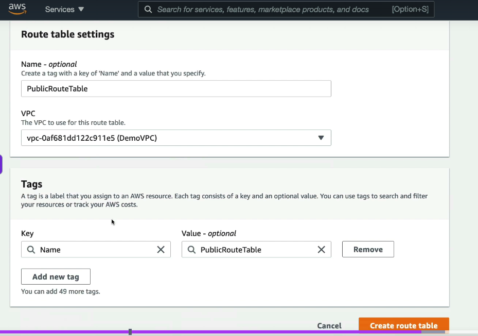  
2. Once Route table is created, then associate the subnets within the VPC (we attached in step 1)  
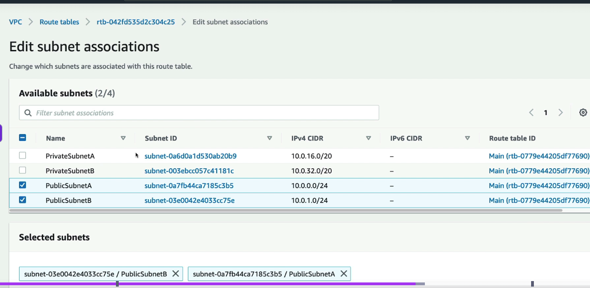  
3. We created 2 Route tables (for public and provate subnets), and associated those subnets to resp. Route tables  
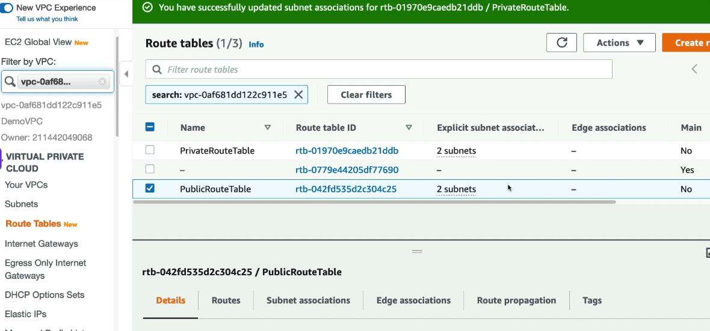  
4. So 2 public subnets attached to 1 public route table, and 2 private subntes are attched to 1 private Route table (Note - still the public / private Route tables and public / private subnets are still names, nothing differentiates public and private yet)
5. Now the IMP part - editing route tables  
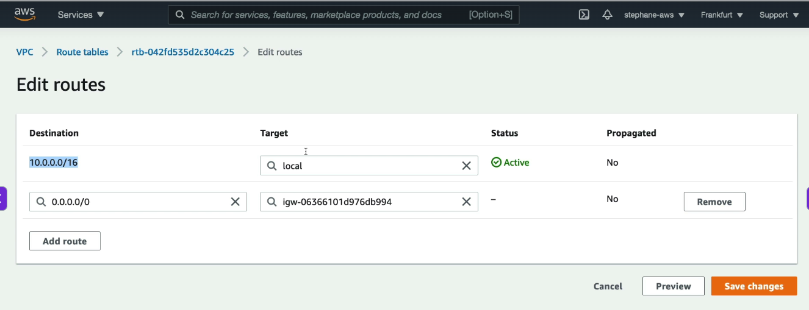  
- the frst rule is autocreated when route table is created
- this rules states that any source IP within the CIDR (10.0.0.0/16) - (this CIDR is of our VPC which we gave while creating), can connect directly 
- the second rule is what we crated which states, any IP over the world will connect to IGW, and can connect to VPC resources

### Now with the above setting we have 
> [!NOTE]
> #### Outbound Flow (EC2 → Internet)
>
> ```text
> EC2
> (10.0.1.10)
>        │
> Wants to access google.com
> (142.x.x.x)
>        │
>        ▼
> Route Table checks destination
>        │
> Destination NOT in 10.0.0.0/16
>        │
>        ▼
> Match:
> 0.0.0.0/0 → Internet Gateway
>        │
>        ▼
> Internet Gateway
>        │
>        ▼
> Internet
> ```
>
> **Meaning:** The route tells AWS **how to send outgoing traffic** to the Internet.
>
> ---
>
> #### Inbound Flow (Internet → EC2)
>
> ```text
> Internet User
>        │
> Sends request to EC2 Public IP
>        │
>        ▼
> Internet Gateway
>        │
> Delivers packet into the VPC
>        │
>        ▼
> EC2
> (Security Group + NACL checked)
> ```
>
> **Notice:** The route table is **not consulted** for the incoming packet.
>
> AWS already knows:
>
> - this Public IP belongs to this EC2
> - this EC2 is inside this subnet
>
> so it delivers the packet directly.
>
> ---
>
> #### So what does `0.0.0.0/0 → Internet Gateway` actually do?
>
> **It provides Internet connectivity (ONLY FOR resources in PUBLIC SUBNET) for the subnet.**
>
> - ✅ Allows resources in the subnet to **send traffic to the Internet**.
> - ✅ Allows **return traffic** from the Internet back to the EC2.
> - ✅ Allows SSH connection to EC2, because SSH is 2 way communication and this rule must be present
> - ❌ Does **not** by itself allow Internet users to connect to EC2.
>
> Internet users can connect only if **all** of these exist:
>
> - Public IP / Elastic IP
> - Internet Gateway
> - Security Group allows inbound
> - NACL allows inbound

### Giving Internet access to resources inside PRIVATE SUBNETs
#### Bastion Host  
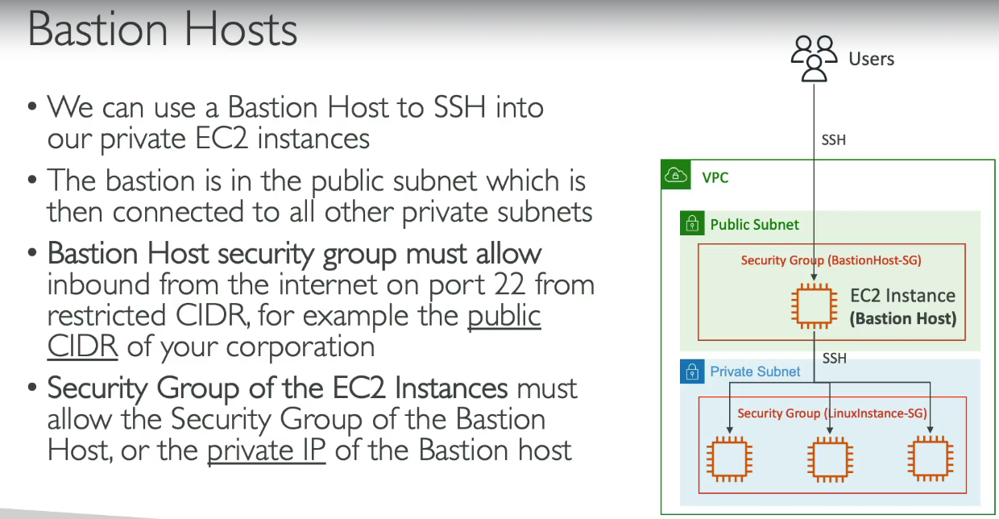  
**GOAL** - Allow users from Internet to connect to EC2s which are inside private subnets
**Working logic**  
- Bastion host (BH) is nothing but an EC2 instance launched inside public subnet of a VPC
- Since BH is in same VPC, it can connect to EC2 instances from private VPCs
- We configure Sec grp of Private EC2s to allows traffic only from BH
- We configure Sec grp of BH to allow traffic from internet (but only from restricted CIDRs, such that only Corporate IP ranges can access this BH)

**DEMO**  
1. We create BH in public subnet and 1 EC2 in private subnet
2. Then we SSH into BH, and then from that BH, we SSH into the private EC2  
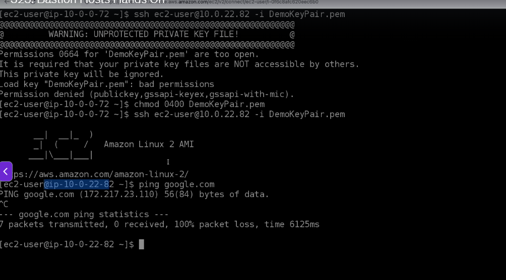  
- 10.0.0.72 is IP of BH and we SSH and 10.0.22.82 is IP of private EC2
- So we can access private EC2 from BH, but still private EC2 cannot access internet - see in the image - the ping command failed
- Soultion - use **NAT instances**   

### NAT instances
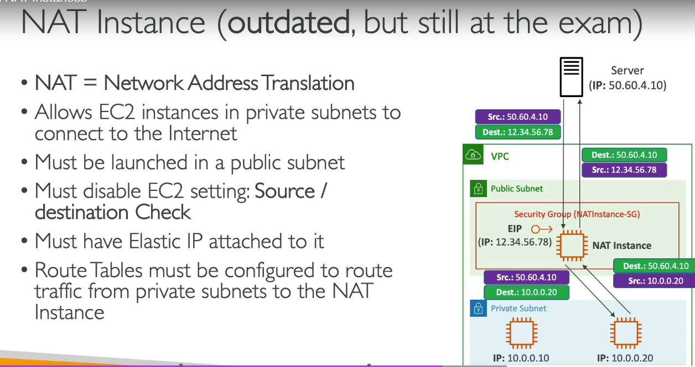  
- NAT is another EC2 living in public subnet
- It re-writes the Source and Dest IP at packet levels hence Source / Destination check of IPs at EC2 level must be disabled  
- NAT instances are getting decommissioned
- There is a pre-configured AMI available for NAT instances
- **Disadvantages**
- 1. It is not highly available / scalable
- 2. Traffic bandwidth depends on your EC2 instance type

#### Configuring NAT instances
1. Launch EC2 - select NAT AMI from AWS or Marketplace
2. In the launch console, configure Network settings to allow traffic only from VPC resources (configure CIDR range of the VPC we have created). NAT is used to allow resources from private subnet to access the internet. It does not allow outside resources to connect to your private EC2s
3. Once NAT instance is created, edit it's settings to disable source / destination IP check (becuase NAT will re-write the IPs)
4. Now goto Route tables, which caters to private subnets, and add a second rule  
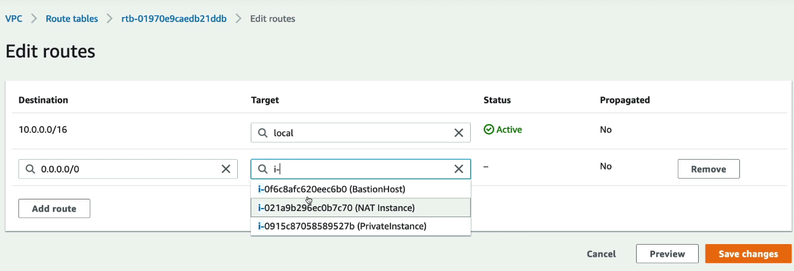  
- So for any desitination initiated by any resource from this private subnet, the request will go through NAT instances, and they we re-write packets and send to the actual intert server
- Now we can ssh to bastion host, then ssh to private EC2, now if we do ping www.google.com, now the command should work prooving that private EC2s can access the internet

> [!NOTE]
> # Summary
>
> - **Internet Gateway (IGW):** Enables **Internet connectivity** for resources in a **public subnet** (supports both inbound and outbound Internet traffic, provided the resource has a Public IP and security rules allow it).
> - **Bastion Host:** Use Bastion Host to allow internet users to connect to resources inside private subnets
> - **NAT Gateway:** Allows resources in **private subnets** to **initiate outbound Internet connections**, while **preventing inbound connections initiated from the Internet**.

### NAT Gateways
- These are AWS managed NAT instances
- so highly available / scalable, no administration needed
- hence can manage large traffic networks, can autoscale
- it is created in specific AZ and will have an elastic IP
- we should create multiple NAT gateways in multiple AZs for fault tolerance (**remember? while creating subnets, we choose AZ? so for each AZ, in this case subnet, create a NAT gateway**)  

#### Configuring NAT Gatways
1. Click create, choose subnet to which NAT gateway will cater to and allocate Elastic IP  
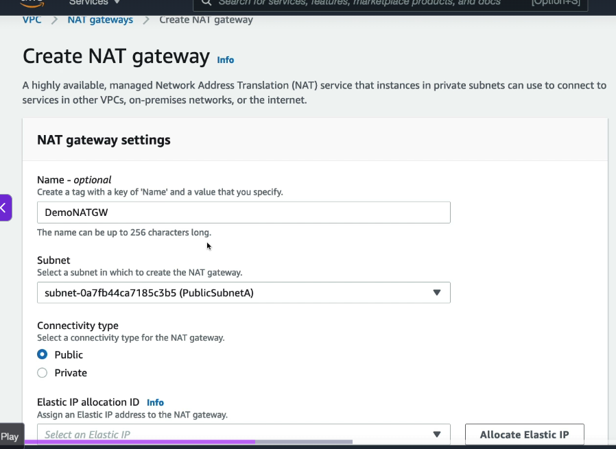   
2. Then edit the rules inside route table associated with the subnet and add the newly created NAT gateway as target  
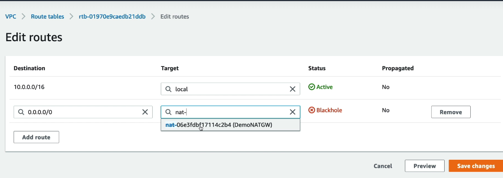   


#### Now once VPC and subnets are configured, we can launch EC2 instances inside a specific VPC / subnets we created above  
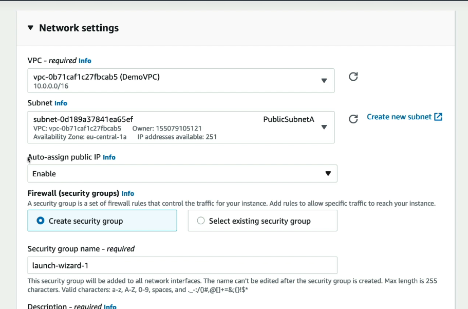  

  
  
  


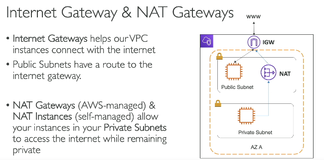 

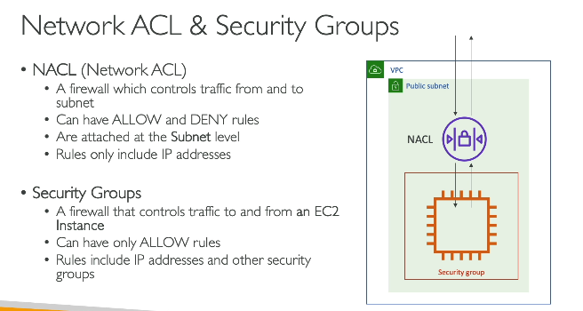 

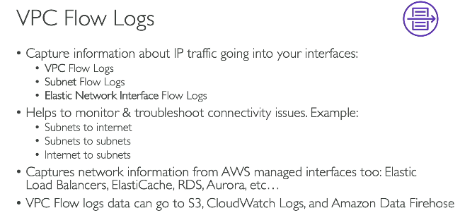 

**AWS Private link** - allows us to connect a service running in our VCP to a service running in another VPC

- **Note - if EC2, connects with S3, the connetion and all the HTTP calls are made via Public internet**  
- this is true for all the resoruces in AWS that talk to each other
- if we wan't AWS services to connect over private connection, then we use VPC endpoints

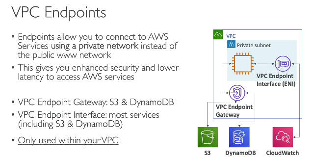 
- note in e.g. above EC2 is inside provate subnet, howevrer we could have used NAT, to give EC2 access to the internet and then eventally talk to s3 / dynamo db, but using IGW, but then this gives our EC2 access to all of the internet, so to enhance security, we can use VPC endpoints 

#### Connecting on-prem datacenter with cloud - 
1. using site-to-site VPN
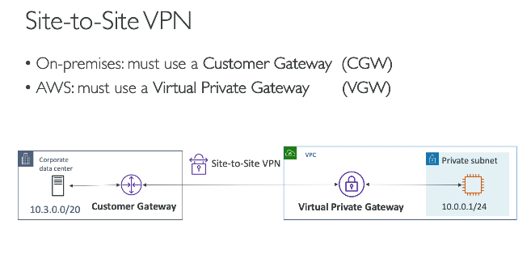 
2. Direct connect (DX) - a private phical network needs to be build, which takes upto months, adv - private so secure, and fast

managing and communicating between VPC can become complicated, solution - **Transit Gateway** 
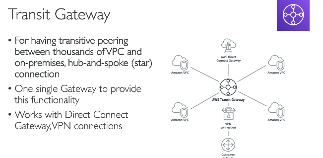  
