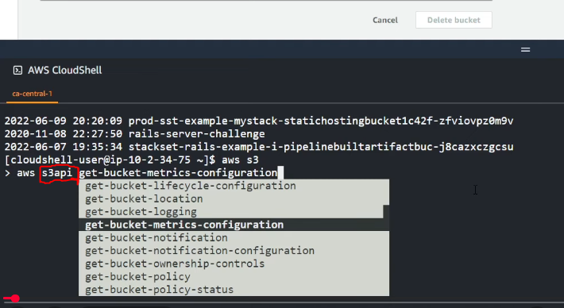
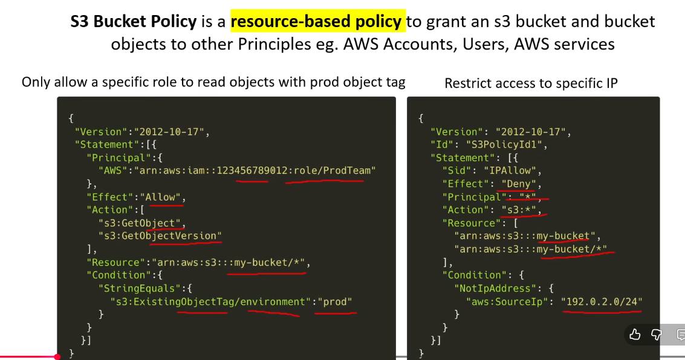
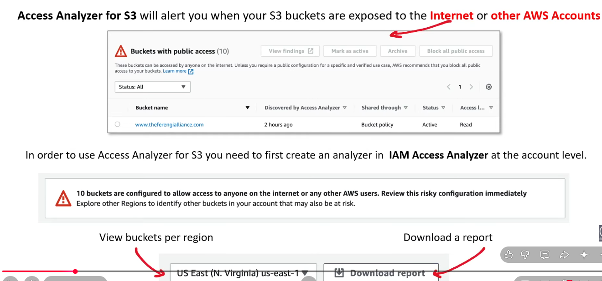

# Amazon S3 – Simple Storage Service

## Key Points

- **Object storage** — not a traditional file system
- **Unlimited total storage**
- Maximum **object/file size = 5 TB**
- files larger than 100MB, use multipart upload
- max buckets/account - 100, use service request to increase
- no limit on no of objects / folders in a bucket
- **S3 is globally accessible**, but each **S3 bucket belongs to a specific AWS Region**
- **Encryption is enabled by default** — SSE-S3
- Encryption can be configured at the **bucket level** and can also be specified **per object**
- **Storage class is configured at the object level**; objects in the same bucket can use different storage classes

### S3 CLI Commands

```bash
# Copy a local file to S3
aws s3 cp <local-file-path> s3://<bucket-name>/

# other commands
aws s3 ls, cp, mv, mb(make bucket), rb(emove bucket)

# Generate a pre-signed URL
aws s3 presign s3://<bucket-name>/<object-key>

# copy entire local directory to a bucket
aws s3 sync localfolder/ s3://<bucket url>
```

#### S3API

What you saw above is s3 commands, but instead we can use s3api, which is more granular

  

#### SDK
```javascript
import {
  S3Client,
  PutObjectCommand,
  CreateBucketCommand,
  GetObjectCommand,
} from "@aws-sdk/client-s3";
export async function main() {
  // A region and credentials can be declared explicitly. For example
  // `new S3Client({ region: 'us-east-1', credentials: {...} })` would
  
  const s3Client = new S3Client({});

  // Create an Amazon S3 bucket. The epoch timestamp is appended
  // to the name to make it unique.
  const bucketName = `test-bucket-${Date.now()}`;
  await s3Client.send(
    new CreateBucketCommand({
      Bucket: bucketName,
    }),
  );
}
```


IaaC options  
1. Cloudformation - only for AWS
2. CDK - genereate CF using your programming language
3. SAM - yml template at high level which will again generate CF
4. Terraform - same as Cloudformation, but it is cloud agnostic
4. Pulumi - same as CDK, but again cloud agnostic

2 Types of S3 buckets  
1. General purpose S3  (default)
 - use flat hierarchy to store objects  
2. Directory bukcet
 - organizes data internally in folder structure
 - can only be used with s3 express one zone storage class
 - used for sub milisecond latency for GET and PUT operations

**Note** - even though in the s3 console, we can create folders for general purpose buckets, that is just for UI, but internally AWS stores all the objects in flat hierarchy, there is no directory strucutre for general purpose buckets


##### S3 object properties
1. ETag - it is http res header that indicates if the requested resource has changed or not (without downloading the content), value is typically SHA of the content
2. Checksum - used to verify data integrity, so basically when you upload object, chesum is generated, and again while downloading, we run checksum algo, and check if the generated checksum matches the returned checksum, if match, then data is intact, if not, then maybe data lost / corrupted while coming through network
3. Prefixes - any string that preceeds the object name - /abc/pqr/myimage.jpg - here /abc/pqr is a prefix, and object key = prefix + objname - so entire /abc/pqr/myimage.jpg - is an object key
4. Object metadata - 2 types - 1. system defined (content-type / content-encoding / cache-control etc), 2. user defined - any key value pair (must start with x-amz-meta-)


#### WORM
write once ready many  

- **Note** - se reads are always strongly consistent

#### S3 object locks
- does not allow anyone to delete a given s3 object
- for regulatory / compliance
- can be enabled / disabled only at the time of bucket creation
- 2 types of holds
- 1. Retention holds (protects obj for a fixed amt of time) (again 2 types of retention holds)
 - 1.a. - Compliance - obj cannot be deleted / overwritten by anyone, not even by root user, lock period cannot be shorten
 - 1.b - Governance - obj can be deleted, only by special users, and those users can shorten the lock period (IAM permission for those special users - s3:ByPassGovernanceRetention)
- 2. Legal Holds - same as retention hold (can delete / override obj), but there is not fixed amt of time for protection, we just remove the loegalhold flag anytime obj becomes normal. Usecase - for legal case, where there is no predefined time. Only users with specific IAM permission can add the legal hold flag

**s3 bucket uri** - s3://bucket-name/photo.jpg

### S3 Dual-Stack endpoint
- allow accessing S3 over IPv4 OR IPv6.

### S3 storage class  
In below sections, sotrage class is arranged from most expensive to least expensive class  
so Standard storage class is most expensive and glacier depp archive is least expensive  

#### 1. S3 Standard

- **Retrieval time:** Milliseconds.
- **Pricing:** Based on **storage + requests + applicable data transfer**.
  - Example: If you store **100 GB** and make millions of GET/PUT requests in a month:
    - **100 GB storage cost**
    - **GET/PUT request charges**
- **Retrieval fee:** ❌ **No retrieval fee**.
  - Example: If you retrieve 80 GB of data, there is **no S3 Standard retrieval fee** based on the amount retrieved.
- **Don't confuse request charges with retrieval fees:**
  - **Request charge** → Charge for making an S3 API request (e.g., GET, PUT, LIST).
  - **Retrieval fee** → Charge based on the **amount of data retrieved** from certain storage classes.
- **Summary of pricing:**
  - **Storage:** ✅ Per GB-month
  - **Requests:** ✅ Per request
  - **Retrieval fee:** ❌ None
  - **Minimum storage duration:** ❌ None
  - Storage and request cost is application for all storage classes
- **Use case:** **General-purpose storage** where data is accessed frequently or unpredictably.

#### 2. S3 Standard-IA

- **Retrieval time:** Milliseconds, same as S3 Standard.
- **Use when:** Data is **accessed less frequently** but still needs rapid access.
- **Storage cost:** 50% Lower than S3 Standard, but with a caveat.
- **Caveat:** There is a **data retrieval fee** based on the amount of data retrieved.
  - If you access data frequently, these retrieval fees can make Standard-IA **more expensive than S3 Standard**.
  - Therefore, Standard-IA is intended for **infrequently accessed data**.
- **Minimum storage duration:** 30 days.
  - If you store an object for only 1 day and delete it, you are still charged for **30 days of storage**.
- use case - use for backup of critical resources for disaster recovery


**Note that Storage class is at Object-level and Lifecycle configuration is at Bucket-level**

#### 3. S3 express one zone

- **Retrieval time:** Single digit milliseconds. (other classes are milisecond, so it can be 100ms, 80ms), single digit means it can be 10X faster - like 8ms
- only class with single digit milisecond latency
- **Use when:** lowest latency is required
- **Storage cost:** 50% lower then standard S3, and 10X faster (isn't this strange? - see below 2 caveats)
- Caveat - data is stored only in 1 AZ (user selected), so availabilty gone
- Caveat2 - flat per request charge, what is flat per request charge (The request charge does not vary based on whether the request is GET, PUT, LIST, etc.), generally GET requsts charge per 1000 req is lower that PUT etc, but here all request type charge is same

#### 4. S3 One Zone IA

- **Retrieval time:** Milliseconds, same as S3 Standard.
- **Use when:** Data is **accessed less frequently** and ok to have lower availability.
- **Storage cost:** 20% lower then S3 standard IA, so 50% lower that Standard S3 + 20% lower on top of 50%
- **Has retrival fee**
- **Minimum storage duration** - 30 days
- **Usecase** - use as secondary backup, or store backup of non mission critical components

#### 5. S3 Glacier instant retrival

- **Retrieval time:** Milliseconds, same as S3 Standard.
- **Use when:** Data is **accessed Rarely**.
- **Storage cost:** 60% lower then S3 standard IA, so 50% lower that Standard S3 + 68% lower on top of 50%
- **Has retrival fee**
- **Minimum storage duration** - 90 days
- **Usecase** - use to store medical records / some reports accessed quaterly/yearly
- If storage cost is less than Standrd IA, while retirval time is same as STandard IA, then why to every use Standard IA, why not use Glacier instant retirval, always? - Glacier instant retrival is to store rarely accessed data (archived data), if you access this data as frequently as STandard IA, then Glacier instant retrival's cost will be more than Standard IA, because retrival fee is much higher than STandard IA

#### 6. S3 Glacier Flexible retrival

- there are 3 retrival tiers in this flexible retrival, 
- the faster the retrival, the costlier the tier
- 1. Expediated tier - retrieve data in 1-5 mins
- 2. Standard tier (default) - retrieve data in 3-5 hrs
- 3. Bulk tier - retrieve data in 5-12 hrs
- **Has retrival fee**
- **Minimum storage duration** - 90 days
- AWS adds around 40KB of metadata for each of these objects (for it's internal purpose), so remember, it is always better to store fewer but larger objects as opposed to lesser and smaller objects

#### 7. S3 Glacier Deep archive

- there are 2 retrival tiers in this deep archieve, 
- the faster the retrival, the costlier the tier
- 1. **Standard** → typically **within 12 hours**
- 2. **Bulk** → typically **within 48 hours**
- **Has retrival fee**
- **Minimum storage duration** - 90 days
- AWS adds around 40KB of metadata for each of these objects (for it's internal purpose), so remember, it is always better to store fewer but larger objects as opposed to lesser and smaller objects
- this is the cheapest storage class
- again remember, these have lowest price, but retrival fee would be heavy, so they need to be accessed rarely

**Note -** for Glacier deep archive and flexible retrival, we cannot fetch the object directly via API, first we need to restore the object to the bucket (which will take 3-5 hrs for flexible and upto 12 hrs for deep archieve), then we can call s3 API to access the object

#### 8. S3 intelligent tearing

- auto move objects to different storage tiers based on their access pattern
- this does not charge for any storage or retirval fee
- but it charges for object monitroing and automation
- if we store the object with Intelligent tiering storage class then
1. By default it will be in Standard S3 storage class
2. After 30 days, if not accessed, it will be moved to Standard IA
3. After 90 days, if not accessed, then to Glacier Instant access
4. After 180 days, if not accessed, Glacier Deep archieve


## S3 Security

### 1. S3 Block Public Access

- **Purpose:** Prevent S3 buckets and objects from being made publicly accessible.
- **Default:** Enabled by default for new S3 buckets/accounts.
- **Priority:** Block Public Access settings can override permissions that would otherwise make a bucket/object **publicly accessible**.
- If Block Public Access prevents public access:
  - ❌ Public bucket policy → won't work
  - ❌ Public ACL → won't work
  - ❌ Public access through other supported mechanisms → won't work

**Important clarification**

- Block Public Access **does NOT block all access**.
- Private access can still work if explicitly permitted.

- if we disable this, then there are 4 settings we can use to still narrow down public access  

| Setting | Meaning |
|---|---|
| **BlockPublicAcls** | Blocks **new public ACLs** from being created |
| **IgnorePublicAcls** | Ignores **existing public ACLs**, so if any ACL gives public access, it will get ignored and overridden by this setting. ACLs have checkbox to give access to everybody, so that gets ignored |
| **BlockPublicPolicy** | Blocks **public bucket policies** from being created |
| **RestrictPublicBuckets** | Restricts access when a **public bucket policy exists**, so public bucket polilcy will get ignored and overriden by this setting|

### 2. Access Control List (ACL)
- legacy, they are like bucket polcies (but very limited capability) was used before bucket polices were introduced
- it **allows other AWS accounts to access S3 buckets from your account**
- you cannot grant permissions to user in your own account, using this feature

### 3. Bucket policy  
  
- IMP thing to note is after adding principal account's ARN / User ARN, the access is granted, as opposed to if we do STS or instead of a particula user, we need to give access to a particular IAM role from different account access to bucket, then we need to do STS thing, and do assumeRole
- Not needed in this case

### 4. AWS Private Link
- Private link is VPC Interface endpoint (note that is it not VPC Gateway endpoint)
### 5. CORS
- we know

### 6. IAM Access Analyzer for S3
  
- so if you attach a bucket policy where action is allow, and principal is *, then this make a bucket publicly available, and IAM access analyzer will notice it

### 7. Internetwork Traffic Privacy
- this is nothing but transmitting data via a private network and not via public network
- achieved via VPC Interface Endpoints (aka Private link), or achieved via VPC Gateway endpoints

### 8. Access Points
- give access to specific folders to differnt users inside a bucket
- so you can create specific access policy for those folders
- so we reduce the complexity of a bucket policy if there are 100s of folders, each requiring specific type of access
- also we can now have block public access (which we saw earlier) now at folder level
- technically, these access points are named netowrk endpoints
- so can create VPC origin for each access point, which will allow objects linked to those access points to be access privately
- thus, we can access s3 objects **from same bucket** either via public network (default) or via private network (via VPC origin for access point) 

### 9. Access Grants
- Lets us **map users/groups from an identity provider** (like IAM center, Active Directory, Okta) to access S3 data  

### 10. Versioning
- recover easily from accidental delete
- deleting a versioned object, just adds a delete marker, and in API it returns 404 with header - x-amz-delete-marker: true
- permanantly deleting current object, will make previous version as the latets version

### 11. MFA Delete
- we know

### 12. Server Side and Client Side Encryption

- Encryption is transit is achieved via TLS / SSL
- Encrytion at rest is done via client side encryption and server side encryption

**Note -** You can have different encryption types for different objects in the **same S3 bucket**.

#### Client side Encryption
- when we don't trust AWS to not see plain data
- strict security / compliance req. from your company to not send sensitive data to cloud before encrypting

#### Server side encryption

##### 1. Server side encryption (SSE3)
- free, default
- AWS manages key rotation automatically

##### 2. Server side encryption with KMS service (SSE-KMS)
- you use KMS keys to encrypt data, so first create keys in KMS
- this is not free, need to pay price for using KMS keys
- KMS will handle key rotation
- if this is not free, why should we use this and not use SSE3, which is free and default
- SSE-KMS provides granular access, like we can specify which users can access the keys, so if user can't access keys, then they cannot encrypt using the KMS keys
- another reason to choose SSEKMS or SSE-S3, is auditing, because now we know who used keys and when using cloudtrail
- again another reason - if company policy require to use **customer-controlled encryption keys**


##### 3. Server side encryption with customer managed key (SSE-C)
- free, but customer has to provide the key
- so additinal maintenance of storing Keys securly, rotating now becomes customer's job
- why choose over SSE-S3
- 1. compliance requirement to manage key at customer side
- why choose over SSE-KMS
- 1. free
- why choose SSE-KMS over SSE-C, when SSE-C is free
- 1. using SSE-KMS, we don't need to manages key maintenance like key storage, rotation

##### 4. DSSE-KMS
- Dual layer server side encryption. Encryption done first at client side, then at server side
- this is SSE-KMS + client side encryption
- one thing to note is that client side encryption here is little different
- here the client side encryption will use KMS key only and not the key from the client side

**Note** - we also have **S3 bucket key** - so for SSE-KMS, for every request, the KMS API is called to get the Key, and then encrypt, this results in lower performance and increased cost, instead use bucket key so it will use a short-lived key per requestor to reduce cost by 99%
- bucket key can be used for SSE-KMS and SSE-S3 


## S3 object Replication

### 1. Cross Region Replication
- replicate bucket objects to a bucket in different region
- versioning must be enabled for both source and target bucket
- CRR can be done from 1 bucket in 1 AWS acc, to diff bucket, in diff AWS acc
- only new objects will be replicated, object added before setting up replication will not be replicated

### 2. Same Region replication
- bucket objs replicated to different bucket, but in same region
- why needed? - for your webapp to get images, etc for dev env, fetch from dev bucket, for prod env, fecth data from prod bucket
- again, versioning to be enabled, can replicate data to diff AWS acc, but in same region
- only new obj replicated

### 3. Bi-directional replication
- bucket objects replicated from both buckets when new objects are added to either bucket
- why needed? - for bucket failovers, of bucket A fail, get data from bucket B
- again versinoning, cross account replication possible
- only new obj replicated

### 4. S3 batch replication
- for all the above 3, replication happens automaatically within 15 mins of new objs created
- S3 batch replication is on-demand
- this will replciate existing objects as well which were added before we had set CRR or SRR 

**For all above, if we want to replciate data across accounts** - we need to setup IAM role via issumerole and trust policy  
- Setting up replication will not delete object from 1 bucket, if it got deleted from other bucket

## S3 Lifecycle
- Move objects to different storage classes, or delete objects based on rules
- Intelligent tiering is ML based and it will move objects on it's own
- Lifecycle -> we provide fixed set of rules, like after 30 days, move object to different class (irrespective of if the object was frequently accessed or not, as opposed to intelligent tiering, where is strictly checks on access pattern), after 60 days, delete
- so lifecycle is rule based, Intelligent tiering is ML based and based on access pattern
- lifecycle rule will transition from higher price storage to lower price storage class, it can't do vice-versa
- we can also filter objects in lifecycle so that only objects we need are part of these lifecyle rules

## S3 transfer acceleration
- enables fast and secure file transfer over long distance between user and your bucket
- uses cloudfront's edge location, and from there on, uses private AWS's private network to transfer files
- so onlt the connection between user and CF location is public, then rest connection is private

## S3 presigned URLs
- gives temporary access to upload / download objects via URL

## S3 object lambda access points
- allows us to transform s3 object, before it is sent back to the user
- this doesnot change the underlying object
- for end users, it feels like normal s3 get request, but they get a transformed object
- transfomration is done by lambda which is attched to s3 bucket via object lambda access point
- why needed? - you have stored critical info in the object, and you want to share the object, by removing that critical info

## Mountpoint for s3
- it is open source client which allows us to mount s3 bucket to linus file system

## S3 requestor pay
- with this, the one who is making a request to our s3 bucket will have to pay the transfer charges
- for s3, remember we pay for storage and transfers (req, via API or amount of data downloaded)
- with requestor pay, now bucket owner will pay only for storage, while the requesting the object will pay transfer fees
- for this the requestor must be an AWS account or some role from some other account
- with this, now anonymous users cannot get objects from this bucket
- usecase - for collaborative projects

## S3 Batch Operations

- Allows you to perform **bulk operations on many S3 objects**.
- You provide a **manifest** containing the objects to process.
- Supported operations include:
  - **Copy objects**
  - **Delete objects**
  - **Replace/delete object tags**
  - **Invoke AWS Lambda**
  - Restore objects from S3 Glacier
  - Apply S3 Object Lock retention/legal hold

##### Invoke AWS Lambda for batch operations
- S3 Batch Operations invokes the Lambda function for **each object in the batch**.
- The Lambda receives information about the object and can execute your **custom processing logic**.
 
- A single S3 Batch Operations job can process **up to billions of objects**.

## S3 select
- allows us to use SQL language to filter the contents of an s3 object
- for this the object needs to be in csv, json or parquet format
- Athena also uses SQL, but it used to query across multiple objects
- where as s3 select uses SQL query to query file contents

## S3 Object tags
- apply tags at object level
- using this we can do fine-grain level access contorl using IAM policies filtering on tahs
- fine-grain object lifecycle management
- resource tags are different, they are attached to AWS resource like EC2, lambda, S3 buckets
- object tags are applied to S3 object

## S3 server logs
- log every action happend in your bucket, like objects fetched, uploaded
- we need to specify the target bucket, where the logs should be stored

## S3 Event Notifications
- allows your bucket to invoke other AWS services when an evant happens in s3 bucket
- Events will include
1. New objects added / removed / restored
2. Any replication event hapenned
3. Lifecycle transition / expiration event hapenned
4. Intelligent tiering moving objects
5. Any object got tagged / or tag removed
- These S3 events will trigger varous AWS services like
1. SNS, SQS (FIFO queue not supported), Lambda and EventBridge  
