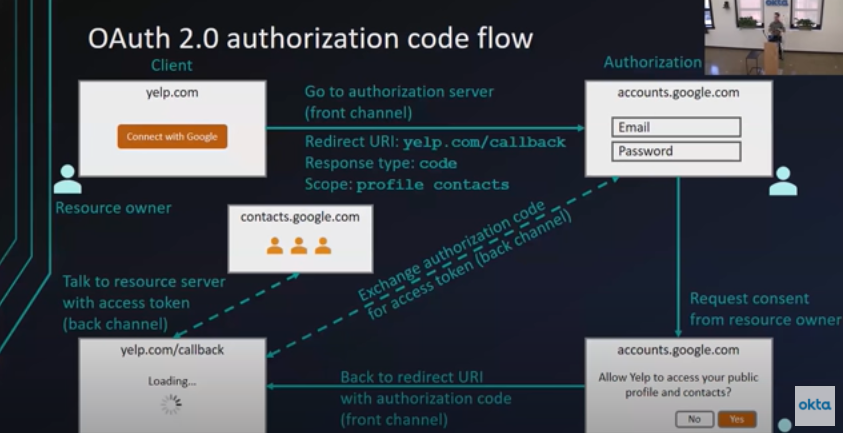
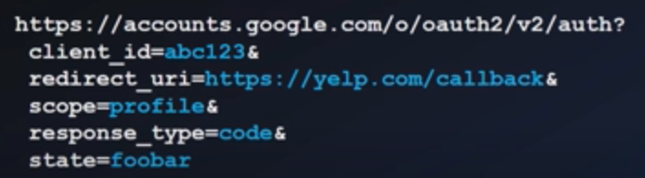
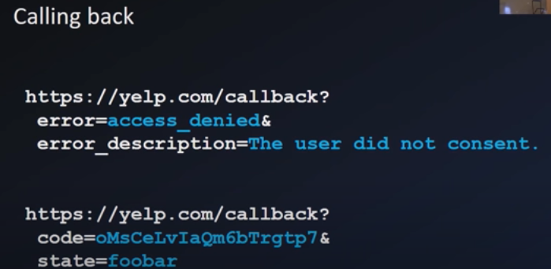
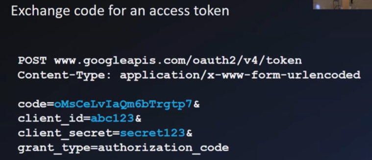
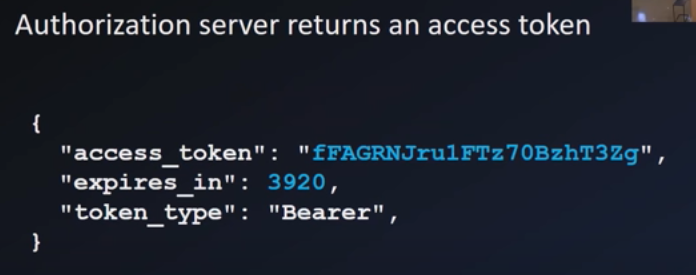

## Index
1. **Ways to Authenticate** - Form, SAML (SSO), OpenID connect (Mobile Apps), OAuth (delegated authorization)(clientid/secret)(Apigee), api keys
2. **OAuth (Open Authorization)** - terms (resource owner, client, auth server, resource server, auth agent(temp code to get acess key), redirect url, access token, scope(auth server has list of scopes, client gets data on what the scope s defined), front/back channel)
3. **OAuth flow** - First we register an app with OAuth provider to get client Id/secret, then steps - 1. resource owner goes to client website, 2. clicks on signin with google/fb 3. req goes to auth server, req includes (client ID, redirect uri, response type=code, scope-profile/contacts), 4. auth server asks for login and consent, 5. if success auth server redirects to redirect uri with auth code 6. in redirect uri, pass auth code(auth code, clientid/secret) to auth server and get access token (back channel, all other steps are front channel), 7. now we can get google/fb data. Because of front channel, step 6 exists for security. This is code flow (see step 3 - res-type), there are other flows, where res-type=implicit, here step 6 does not exist, usecase - where you only have frontend or SPA
4. **OAuth problems** - was build for delegated authorization and not for authentication, you cannot always get standard user information like email, phone no. etc (to identify user). You have to build your own code to create a user's database based on the data you recieve from resource server
5. **OpenID connect** - Extension to OAuth 2.0 which is used for authentication, flow is nearly same, differences (1. n scope we pass openid along with the profile, 2. Auth server provides Token ID along with the access token to identify the who the user is), it provides additional info like (user ID token, userinfo endoint, standart set of scopes( so that for all auth server we get same basic user info))

## Ways to Authenticate
1. Form authentication  
Get user name and password from web form, and valiadte it against DB. Not recommended as security and maintainance is upto us  
2. SAML (Security Assertion Markup Language) - for single sign-on  
3. Mobile app authentication (OpenID connect)  
4. Delegated Authorization - OAuth

## OAuth (Open uthentication)
#### Terminologies
1. Resource owner - u n me
2. Client - the one who wants to get access to data
3. Authorization Server - system where owner gives the consent 
4. Resource server - sysytem that holds the data (sometimes auth and resource servers are same)
5. Authorization Agent - temporary code to get access key
6. Redirect Url - redirect url
7. Access token - key that client uses to access data from resource server
8. Scope - Auth server has list of scopes and based on scope, client can access only those data and only read/write operations defined in the scope
9. Back (secured server to server communication) channel and front (less secure e.g. browser to server communication) channel

#### Flow
  
In back channel, the authorization grant is passed to auth serveer along with a secret to get access key. So we get auth grant and then we make a request to access key for secruity since auth grant code is visible in the browser  
So how do we get a secret?  
There are other flows as well (The above flow is OAuth code flow)  
**Implicit flow** - here auth server directly passes access toek in the front channel, instaed of passing grant code and then separate request to get access token. Use when you don't have backend or in JS apps (SPA)  
We create a client app on google.com or any other auth server and get the client ID and client secret.  
In case of OpenID connect, only technical difference is  
1. In scope we pass openid along with the profile
2. Auth server provides Token ID along with the access token to identify the who the user is  

**when you clik on signup**  
  
  
  
   

#### Problem with OAuth
It was build for delegated authorization and not for authentication.  
So even if you use OAuth, you cannot always get standard user information like email, phone no. etc. You have to build your own code to create a user's database based on the data you recieve from resource server.  

#### OpenID connect
Extension to OAuth 2.0 which is used for authentication  
**What OpenID connect adds?**  
1. ID token - identify user in the resource server like gives name, email (it is JWT)
2. UserInfo endpoint - to get more user information
3. Standard set of scopes - so that for all auth server we get same basic user info
4. Standardized implementation
