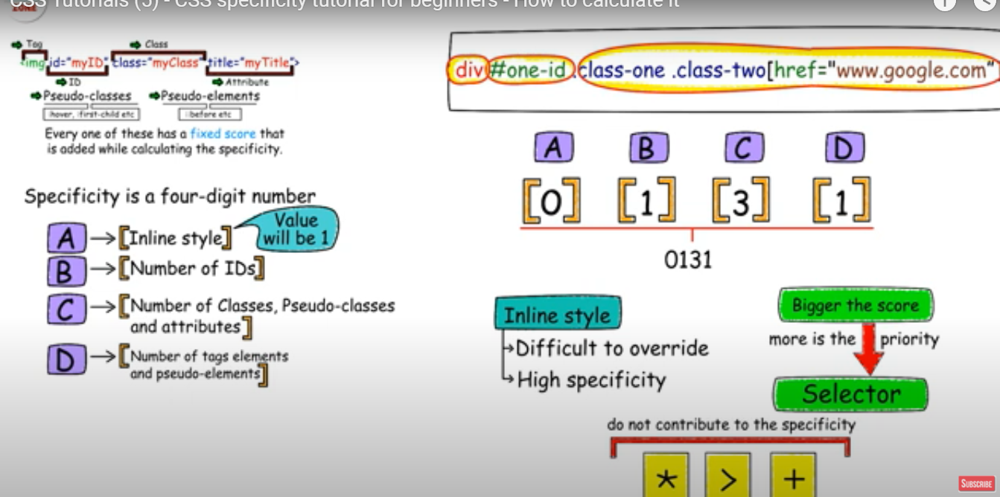
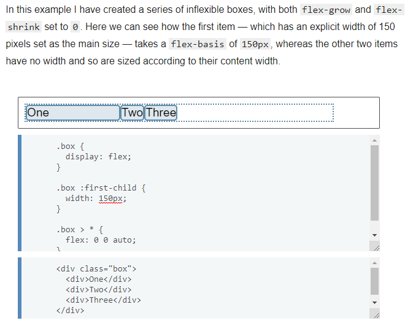
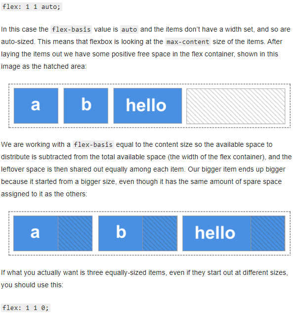
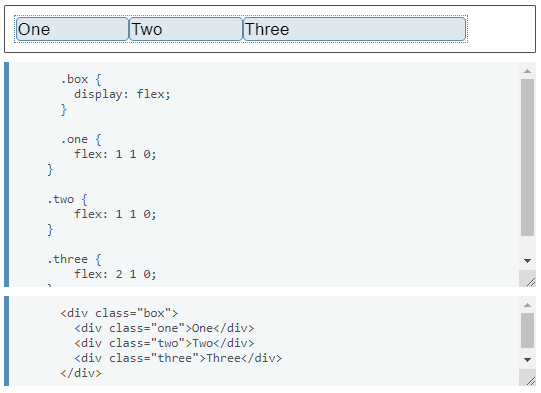
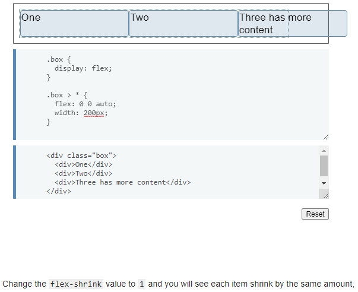

## Index
1. **CSS3** - new (media queries, @import)
2. **Styling** - (8) 2 tags(h1, h2), all tags(star), all inside div(div star), class(.nm), id(#nm), all class in p(p.nm), only id and ol (#id ol), all p with specific class (p[.nm]) 
3. **Combinators + pseudo** - (4) - descendent(div p - all p in div), child(div > p - only direct child), adjacent(div + p - all p immediately after p), sibling(div ~ p - all p with same parent as div), pseudo element - (to style a part of the elem - p::first-line/frst-letter), pseudo classes (to style specific state of the elem - a:link/hover.visited, for input - checked/focused/enabled)
4. **Positioning** -  (5) - block vs inline - (line break), 1. static (default), 2. relative (relative to static), 3. fixed (not moved even if scrolled), 4. absoulte (relative to parent but removes elem from normal doc flow (bad thing)), 5. sticky - (b/w first relative, when offset met, becomes fixed - (pos:sticky; top:0), top:0 is offeset), for all 5 types syntax - (position: (1 of 5), top/right/bottom/left:0px)
5. **Specificity** - tells which style would apply (when 2 styles target same elem, style with highest specificity no. is applied), 4 digit no. (in order) [1 1 3 1], [inline(T/F), no. of Ids, no of classes/pseduo-classes, no. of tags/pseudo-elem]
6. **BEM naming convention** - block-name__elem-name_mod-name_mod-val
7. **Flex-box** - 1D layout model, css-grid - 2D, main-axis(row, row-reverse, column, clmn-rev), syntax - display:flex; flex-direction:(main-axis), id row is selected, elems are put left-right in a row,  **flex-size properties** (1. flex-grow (if all items do not fill entire flex (row/column) space), then free space id distributed based on flex-grow, it is a ratio (free space is given based on this ratio), 2. flex-shrink - opp. of flex-grow, flex-basis - initial size of the flex item before any space distribution happens) e.g. - .item { flex: 2 1 auto; } - flex-frow:2, shrink:1, basis:auto, flex: 1 1 0, all items with eq. size even if inital size of diff.
8. **Media queries** - @media rule - CSS2(device type had to be specified, now we have 100 of devices), Media querie - CSS3(based on screen-size), syntax - @media (orientation: portrait) and (max-width: 500px) {css code}
9. **Animations + Transitions** - **ani** - gradually changing from one set of CSS styles to another using keyframes, syntax - .class-name{animation-name:name;ani-duration:4s;ani-delay:2s;}, @keyframe name {0% {color: white;} 25%, 50/75/100%}, **Trans** - user action required, .class-name{tran-property: width/height(any prop that needs to be trans), when to trans(onhover)- class-name:hover{width/height: Xpx;}  

## CSS
**Diff between CSS2 and CSS3**
1. CSS3 introduces media queries 

## CSS2 and CSS3
Importing css in a css, possible only in css3  
@import "heading.css"  
1. To style 2 tags at one time
```css
h1, h2 {
	color: white;
}
```
2. To style all tags
```css
* {
	color: white;
}
```
3. To style all tags inside a div
```css
div * {
	color: white;
}
```
4. To style a class
```css
.sitelink {
	color: white;
}
```
5. To style id
```css
#sitelink {
	color: white;
}
```
6. classes named sitelink only inside a paragraph
```css
p.sitelink {
	color: white;
}
```
7. span only with specific id
```css
span#sitelink {
	color: white;
}
```
8. target an id, and only ol
```css
#sitelink ol {
	color: white;
}
```
9. target first p inside h3 tag
```css
h3 + p {
	color: white;
}
```
10. target a inside first p of h3
```css
h3 + p > a {
	color: white;
}
```
11. to target all p with specific class, notice the diff. with pt. no 6.
```css
p[sitelink] {
	color: white;
}

//for ids same as class
p[sitelink] {
	color: white;
}
```
12. combinators
```css
1. Descendant combinator
// The following example selects all <p> elements inside <div> elements:  
 div p {
  background-color: yellow;
}

2. Child combinator
// The following example selects all <p> elements that are children of a <div> element:
div > p {
  background-color: yellow;
}
// here diff. between descendent selector is that it will not style a p tag if it is not a DIRECT child

3. Adjacent sibling combinator
// The following example selects all <p> elements that are placed immediately after <div> elements:
div + p {
  background-color: yellow;
}

4. General sibling combinator
// The following example selects all <p> elements that are siblings of <div> elements: 
// they have same parent
div ~ p {
  background-color: yellow;
}
```

#### pseudo classes and elements
1. Pseudo element  
A CSS pseudo-element is used to style specified parts of an element.  
```css
// syntax
selector::pseudo-element {
  property: value;
}

// The following example formats the first line of the text in all <p> elements:
p::first-line {
  color: #ff0000;
  font-variant: small-caps;
}
//similarly we have
div/p::first-letter
::before - used to insert some content before the content of an element
h1::before {
  content: url(smiley.gif);
}

::after - used to insert some content after the content of an element

//multiple combinations
p.intro::first-letter
```
2. Pseudo classes
A pseudo-class is used to define a special state of an element.
```css
//syntax
selector:pseudo-class {
  property: value;
}

a:link {
	color: red
}

//similarly
visited
hover
active
// above are for a, div tags

// for input tags we have
checked, enabled, focus, invalid
```


**Block vs Inline elements**
Block elements have line break, so every block element comes to new line.  
BLock elements have display: block/none, and inline have display: inline/none  

**postioning**  
1. static  
This is the default for every single page element.  
it just means that the element will flow into the page as it normally would.  
2. relative  
What it really means is “relative to itself”. If you set position: relative; on an element but no other positioning attributes (top, left, bottom or right), it will have no effect on it’s positioning at all, it will be exactly as it would be if you left it as position: static; But if you do give it some other positioning attribute, say, top: 10px;, it will shift its position 10 pixels down from where it would normally be.  
3. fixed  
A fixed position element is positioned relative to the viewport, or the browser window itself. The viewport doesn’t change when the window is scrolled, so a fixed positioned element will stay right where it is when the page is scrolled.  
This might be used for something like a navigation bar  

4. absolute  
Elements with position: absolute are positioned relative to their parent elements. In this case, the element is removed from the normal document flow. The other elements will behave as if that element is not in the document. No space is created for the element in the page layout. The values of left, top, bottom and right determine the final position of the element.  
If the closest parent element is not positioned, it is positioned relative to the next parent element that is positioned. If there's no positioned ancestor element, it is positioned relative to the <html> element.  
So for absolute top:0px means it would be at top but relative to the parent position  
Just avoid using it  

5. sticky  
A sticky element toggles between relative and fixed, depending on the scroll position. It is positioned relative until a given offset position is met in the viewport - then it "sticks" in place (like position:fixed).  
```css
div.sticky {
  position: sticky;
  top: 0; //offset
}
```
All postion type should have top, right, bottom, left parameters, or at lest one of them  

#### Specificty
1. Specificity is the means by which browsers decide which CSS property values are the most relevant to an element and, therefore, will be applied.  
2. It helps us understand why some styles are not being applied to an element when we think they should  
3. It's so easy to just slap an !important value on your CSS styles, but this causes your CSS to quickly spiral out of control  
4. When two or more styles target a particular element, the style with the highest specificity is the one that gets applied.  

**Calculate specificity**  
 

#### CSS naming conventions
**Use BEM (Block-Element-Modifier) standard**  
1. Block - Standalone entity that is meaningful on its own.  
e.g. - header, container, menu, checkbox, input  
2. Element - A part of a block that has no standalone meaning and is semantically tied to its block.  
e.g. - menu item, list item, checkbox caption, header title  
3. Modifier - A flag on a block or element. Things that change appearance or behavior.  
e.g. - disabled, highlighted, checked, fixed, size big, color yellow

**naming syntax**  
**block-name__elem-name_mod-name_mod-val**  
notice when to use - and _ and how many times

#### Flex-box
Is a one-dimensional layout model where as css-grid layout is 2 dimensional  
The main axis is defined by flex-direction, which has four possible values:  
1. row
2. row-reverse
3. column
4. column-reverse

.box {
  display: flex;
  flex-direction: row-reverse;
  flex-wrap: wrap; //no-wrap default
}  

**flex sizes property**  
1. flex-grow: How much of the positive free space does this item get?
2. flex-shrink: How much negative free space can be removed from this item?
3. flex-basis: What is the size of the item before growing and shrinking happens?  

 The following code would set the flex-grow property to 2, flex-shrink to 1 and flex-basis to auto.  
.item {
  flex: 2 1 auto;
}  

1. The flex-basis property  
The flex-basis property specifies the initial size of the flex item before any space distribution happens. The initial value for this property is auto.  
  

2. The flex-grow property  
The flex-grow property specifies the flex grow **factor (width increases by this factor)**, which determines how much the flex item will grow **Relative** to the rest of the flex items in the flex container when the positive free space is distributed. **it is a ratio**  
  
flex-basis + flex-grow
  

3. The flex-shrink property  
The flex-shrink property specifies the flex shrink factor, which determines how much the flex item will shrink relative to the rest of the flex items in the flex container when negative free space is distributed.  
  
flex-shrink + flex-grow works differently  

#### Media queries
The @media rule, introduced in CSS2, made it possible to define different style rules for different media types (like for computer screen, tv, mobile).  
CSS 3 introduces Media Queries  

Media queries in CSS3 extended the CSS2 media types idea: Instead of looking for a type of device, they look at the capability of the device such as width  and height, orientation and resolution  

```css
//syntax
@media not|only mediatype and (expressions) {
  CSS-Code;
}

mediatype can be screen, print (while printing this style would be applied), speech, all (default)

e.g. 1 - it will execute when screen size is less than 500px
@media screen and (max-width: 500px) {
	body {
		color: red;
	}
} 
screen & and words can be omitted fomr above as all is default

e.g. 2
@media (orientation: landscape) {
	body {
		color: blue;
	}
}
use landscape/portrait

e.g. combinations
@media (orientation: portrait) and (max-width: 500px) {
	body {
		color: red
	}
}
// to use or -  replace and with ,

// tu use between
@media screen and (max-width: 500px) and (min-width: 400px){
	body {
		color: red;
	}
} 
```

#### CSS animations
The animation is created by gradually changing from one set of CSS styles to another.  

Specify when the style change will happen in percent, or with the keywords "from" and "to", which is the same as 0% and 100%. 0% is the beginning of the animation, 100% is when the animation is complete

1. Keyframes  
Keyframes are used to achieve animation  
```css
//syntax + e.g.
// need to add animation-name in the element which you want to animate
.class-name {
	animation-name: name;
	animation-duration : 4s;
	animation-iteration-count: 2/infinite;
	animation-delay: 2s;
	animation-timing-function: ease-in/ease-out/ease-in-out;
	animation-fill-mode: forwards; // end animation in the last position // nydefault, elements go to their initial state once animation is complete
}
@keyframe name {
	0% {background-color: white; left 0px; top:0px;}
	25% {background-color: red; left 300px; top:0px;}
	50% {background-color: green; left 300px; top:300px;}
	75% {background-color: blue; left 0px; top:300px;}
	100% {background-color: white; left 0px; top:0px;}

}
```
2. Transitions  
CSS transitions allows you to change property values smoothly, over a given duration.  
User actions are required for transitions to work  
```css
//syntax + e.g.
.class-name {
	background: white;
	transistion-property: background, border-radius or all (to include all avaliable properties);
	transistion-duration: 4s, 2s;
	transition-delay: 2s;
	transistion-timing-function: ease-in/ease-out;
	transform;
}
//when to transition/ user activity
.class-name:hover {
	background: red;
	border-radius: 50%;
	transform: rotateY(180deg);
}
// when user hovers, background of element will change from white to red (in 4s), and will turn to circle (in 2s)
// some available transition properties
background-color
backgroung -position
opacity
z-index
width, height
top, right, bottom, left
```