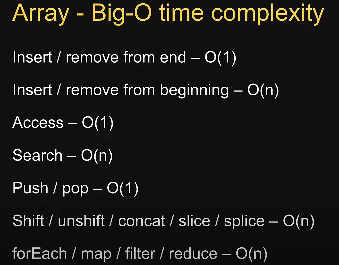
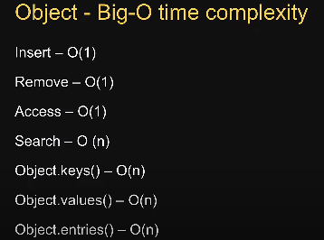

# TIme complexitiess

  

Searching and deleting in Sets is faster as compared to array



## Maps
Object store unordered colletion of key value pair, map stors ordered  
Key can be of any data type in Map, in Obj - only string or symbol

```javascript
cont map = new Map([['a',1], ['b', 2]])
```
