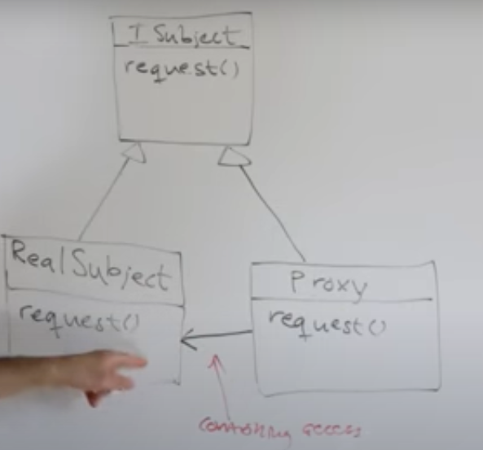
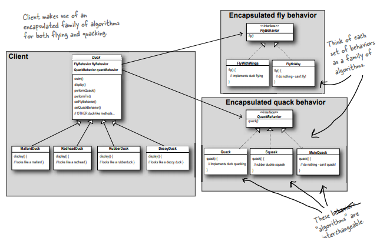
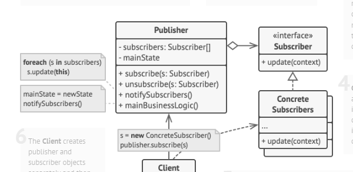

## Index
1. **Design patterns** - solution/template that can be applied to commonly occurring problems in software design, common vocabulary to communicate. 3 tyes - 1. Creational(constructor, factory, singleton), 2. Structural(Decorator, Facade, Proxy, Adapter) 3. Behavioral(Strategy, observer, iterator)
2. **Factory** - defines an interface for creating an object, but lets subclasses decide which class to instantiate. use - when obj creation is complex/depends on dynamic factor (e.g. asteriod game), func EmpFact() {this.create = (nm, type) => {switch(type) { case 1: return new Dev(nm) case 2: return new Tester(nm)}}}
3. **Singleton** - ensures a class has only one instance, and provides a global point of access to it. e.g. 1 country 1 PM, how-to - Using private constructor and static method, using static method if 1st then call private constructor, else return ref to same obj.
4. **Decorator** - attaches additional responsibilities to an object dynamically, avoids subclass explosion, coffee problem, is a comp n has an abstract comp (class caramel extends AddonDecorator {(abstract cls)Beverage b; constructor(Beverage b){this.b=b}; int cost(){return this.b.cost()+2}), Bev b = new Caramel(new Expresso())
5. **Facade** - the front of a building, provides a unified interface to a set of interfaces in a subsytem, watching a movie (HomeTheaterFacade = new HTF(amp, dvd, screen, light); HTF.watchMovie(), .endMovie())
6. **Proxy** - provides a placeholder for another object to control access to it, is a comp n has a concrete comp, usecase - caching - (func xAPIProxy(this.xapi=new xapi(), this.cache={}, this.getVal=func(abc){if not in cache return this.cache[abc] = this.api.getVal(abc) else return this.cache[abc]})), proxAPI = new xAPIProxy(), proxAPI.getVal(1)
7. **Adapter** - converts the interface of a class into another interface the clients expect, 
8. **Strategy** - duck problem, composition over inheritance (horizontal code share), The Strategy Pattern defines a family of algorithms, encapsulates each one, and makes them interchangeable. Strategy lets the algorithm vary independently from clients that use it. Main abstract class having lot of subclasses, flyable n quackable, moved to separate interface, all types of fly/quack now subclass of flyable n quackable n instance of fly/quack in the main abstract class, now in all subclass constructor do (quackbehavior = new SubtypeofQuackablenFlyable)
9. **Observer** - observers can subscribe to event/subject & get notified when signal occurs. use in chat apps. (IObservabe{add/remove(IObserver io), notify()}, IObserver{update()}, WetStation impls IObserveable{add/rem{this.obs.add/rem}, notify(foreach observer - ob.notify())}, phoneDisp impls IObserver{constructor{this.WetStation=wetstation}, update(){this.wetStation.getTemp()}}

## JS Design Patterns
A pattern is a reusable solution that can be applied to commonly occurring problems in software design  
It is a blueprint/template that you can use and modify to solve your particular problem  
It gives developers a common vocabulary to communicate  

**Why to use?**  
1. Reusing patterns assists in preventing minor issues that can cause major problems in the application development process
2. Certain patterns can actually decrease the overall file-size footprint of our code by avoiding repetition

**Three main types of Design patterns**  
1. Creational DP
2. Structural DP
3. Behavioural DP

### 1. Creational Design Patterns

**Patterns falling in this category** 
1. Factory
2. Singleton 

##### 1. Factory Pattern

**Problem -** - You have a logistic service, and you create RoadLogiscit class which return Truck object, now in future we need to add See logistics. With Factory patter, client code is decoupled, so we can add new classes with client code been broken
**Components** -  

1. **Interface** - this will include all common props, methods which different types of objects are supposed to have 
2. **Abstract class** - this will have factory method (abstract / concrete). Return type of this factory method must match the above interface (this ensures client code won't break, as client code can call any objects method, and we ensure all methods are present becuase of this return type)
3. **Concrete classes impleneting the interface**
4. **Differnet concrete classes extending abstract class** - they will implement or override the factory method in abstract class and will return new concrete class object created in step 3

  

```typescript
/**
 * The Creator class declares the factory method that is supposed to return an
 * object of a Product class. The Creator's subclasses usually provide the
 * implementation of this method.
 */
abstract class Creator {
    /**
     * Note that the Creator may also provide some default implementation of the
     * factory method.
     */
    public abstract factoryMethod(): Product;

    /**
     * Also note that, despite its name, the Creator's primary responsibility is
     * not creating products. Usually, it contains some core business logic that
     * relies on Product objects, returned by the factory method. Subclasses can
     * indirectly change that business logic by overriding the factory method
     * and returning a different type of product from it.
     */
    public someOperation(): string {
        // Call the factory method to create a Product object.
        const product = this.factoryMethod();
        // Now, use the product.
        return `Creator: The same creator's code has just worked with ${product.operation()}`;
    }
}

/**
 * Concrete Creators override the factory method in order to change the
 * resulting product's type.
 */
class ConcreteCreator1 extends Creator {
    /**
     * Note that the signature of the method still uses the abstract product
     * type, even though the concrete product is actually returned from the
     * method. This way the Creator can stay independent of concrete product
     * classes.
     */
    public factoryMethod(): Product {
        return new ConcreteProduct1();
    }
}

class ConcreteCreator2 extends Creator {
    public factoryMethod(): Product {
        return new ConcreteProduct2();
    }
}

/**
 * The Product interface declares the operations that all concrete products must
 * implement.
 */
interface Product {
    operation(): string;
}
/**
 * Concrete Products provide various implementations of the Product interface.
 */
class ConcreteProduct1 implements Product {
    public operation(): string {
        return '{Result of the ConcreteProduct1}';
    }
}

class ConcreteProduct2 implements Product {
    public operation(): string {
        return '{Result of the ConcreteProduct2}';
    }
}

/**
 * The client code works with an instance of a concrete creator, albeit through
 * its base interface. As long as the client keeps working with the creator via
 * the base interface, you can pass it any creator's subclass.
 */
function clientCode(creator: Creator) {
    // ...
    console.log('Client: I\'m not aware of the creator\'s class, but it still works.');
    console.log(creator.someOperation());
    // ...
}

/**
 * The Application picks a creator's type depending on the configuration or
 * environment.
 */
console.log('App: Launched with the ConcreteCreator1.');
clientCode(new ConcreteCreator1());
console.log('');

console.log('App: Launched with the ConcreteCreator2.');
clientCode(new ConcreteCreator2());

```

**Output ** - 
App: Launched with the ConcreteCreator1.
Client: I'm not aware of the creator's class, but it still works.
Creator: The same creator's code has just worked with {Result of the ConcreteProduct1}

App: Launched with the ConcreteCreator2.
Client: I'm not aware of the creator's class, but it still works.
Creator: The same creator's code has just worked with {Result of the ConcreteProduct2}

##### 2. Singleton Pattern

The Singleton Pattern ensures a class has only one instance, and provides a global point of access to it.  
E.g. a country would have only 1 PM , so only 1 object needs to be created for PM class  

**Steps** -  
1. Make constructor private
2. Create a static creation method that acts as a constructor

 

```typescript
/**
 * The Singleton class defines the `getInstance` method that lets clients access
 * the unique singleton instance.
 */
class Singleton {
    private static instance: Singleton;

    /**
     * The Singleton's constructor should always be private to prevent direct
     * construction calls with the `new` operator.
     */
    private constructor() { }

    /**
     * The static method that controls the access to the singleton instance.
     *
     * This implementation let you subclass the Singleton class while keeping
     * just one instance of each subclass around.
     */
    public static getInstance(): Singleton {
        if (!Singleton.instance) {
            Singleton.instance = new Singleton();
        }

        return Singleton.instance;
    }

    /**
     * Finally, any singleton should define some business logic, which can be
     * executed on its instance.
     */
    public someBusinessLogic() {
        // ...
    }
}

/**
 * The client code.
 */
function clientCode() {
    const s1 = Singleton.getInstance();
    const s2 = Singleton.getInstance();

    if (s1 === s2) {
        console.log('Singleton works, both variables contain the same instance.');
    } else {
        console.log('Singleton failed, variables contain different instances.');
    }
}

clientCode();
```

### 2. Structural Design Patterns
Structural patterns are concerned with object composition and typically identify simple ways to realize relationships between different objects. They help ensure that when one part of a system changes, the entire structure of the system doesn't need to do the same.  
Patterns that fall under this category include: Decorator, Facade, Flyweight, Adapter and Proxy.

**Patterns falling in this category**  
1. Decorator
2. Facade
3. Proxy
4. Adapter

##### 1. Decorator pattern (decorator class - extends the interface and has the interface (as a property))

The Decorator Pattern attaches additional responsibilities to an object dynamically.  

**Coffee problem** - **Avoid subclass explosion**
   

Instead of creating classes for all possible permutation / combination coffee variations, we need to create classes only for coffee variations and not for all combinations

**UML**  
  

**Components -**  
1. **Abstract class or interface** - this will have mthods all coffee subclasses need to have
2. **Decorator class** - it extends above class **+ it also has instance of above class** (this is imp)
3. **Only 1 concreate classes** - thet extend abstarct class in step 1 (simple coffee class)
4. **Decorator concrete classes** - extend decorator class

```typescript
/**
 * The base Component interface defines operations that can be altered by
 * decorators.
 */
interface Coffee {
    getCost(): number;
}

/**
 * Concrete Components provide default implementations of the operations. There
 * might be several variations of these classes.
 */
class SimpleCoffee implements Coffee {
    public getCost(): number {
        return 100;
    }
}

/**
 * The base Decorator class follows the same interface as the other Coffees.
 * The primary purpose of this class is to define the wrapping interface for all
 * concrete decorators. The default implementation of the wrapping code might
 * include a field for storing a wrapped Coffee and the means to initialize
 * it.
 */
class CoffeeDecorator implements Coffee {
    protected Coffee: Coffee;

    constructor(Coffee: Coffee) {
        this.Coffee = Coffee;
    }

    /**
     * The Decorator delegates all work to the wrapped Coffee.
     */
    public getCost(): number {
        return this.Coffee.getCost();
    }
}

/**
 * Concrete Decorators call the wrapped object and alter its result in some way.
 */
class Caramel extends CoffeeDecorator {
    /**
     * Decorators may call parent implementation of the operation, instead of
     * calling the wrapped object directly. This approach simplifies extension
     * of decorator classes.
     */
    public getCost(): number {
        return this.Coffee.getCost() + 50;
    }
}

/**
 * Decorators can execute their behavior either before or after the call to a
 * wrapped object.
 */
class Espresso extends CoffeeDecorator {
    public getCost(): number {
        return this.Coffee.getCost() + 20;
    }
}

/**
 * The client code works with all objects using the Coffee interface. This
 * way it can stay independent of the concrete classes of Coffees it works
 * with.
 */
function clientCode(Coffee: Coffee) {
    console.log(`Total cost: ${Coffee.getCost()}`);
}

/**
 * This way the client code can support both simple components...
 */
const simple = new SimpleCoffee();
console.log('Buying a simple coffee');
clientCode(simple);

/**
 * ...as well as decorated ones.
 *
 * Note how decorators can wrap not only simple components but the other
 * decorators as well.
 */
const caramel = new Caramel(simple);
console.log('Buying a coffee with extra caramel');
clientCode(new Caramel(new SimpleCoffee()))
const expressowithCaramel = new Espresso(caramel);
console.log('Buying a coffee with extra caramel + espresso flavour');
clientCode(new Espresso(new Caramel(new SimpleCoffee())))
console.log('Buying a coffee with extra caramel + espresso flavour + extra caramel (double caramel)');

clientCode(new Espresso(new Caramel(new Caramel(new SimpleCoffee()))))
// more readbale code for clientCode(new Espresso(new Caramel(new Caramel(new SimpleCoffee()))))
const doubleCaramelEspresso = new Caramel(expressowithCaramel)
clientCode(doubleCaramelEspresso)
// 
```

**Output** -  
Buying a simple coffee  
Total cost: 100  
Buying a coffee with extra caramel  
Total cost: 150  
Buying a coffee with extra caramel + espresso flavour  
Total cost: 170  
Buying a coffee with extra caramel + espresso flavour + extra caramel (double caramel)  
Total cost: 220  
Total cost: 220  

Hence we just need to create classes for all the different variations and not for all possible permutation / combination of those variations

##### 2. Facade (the front of a building) pattern
The Facade Pattern provides a unified interface to a set of interfaces in a subsytem. Facade defines a higherlevel interface that makes the subsystem easier to use.    
  

```typescript
// Subsystem: Authentication
class AuthenticationSystem {
    authenticate(username: string, password: string): boolean {
        // Simulate authentication logic
        console.log(`Authenticating user ${username}`);
        return true;
    }
}

// Subsystem: Payment Processing
class PaymentProcessor {
    processPayment(amount: number): boolean {
        // Simulate payment processing logic
        console.log(`Processing payment of $${amount}`);
        return true;
    }
}
// Subsystem: Movie Streaming
class MovieStreamer {
    playMovie(movieId: string): void {
        // Simulate movie streaming logic
        console.log(`Streaming movie with ID ${movieId}`);
    }
}
// Facade
class MovieStreamingFacade {
    private authenticationSystem: AuthenticationSystem;
    private paymentProcessor: PaymentProcessor;
    private movieStreamer: MovieStreamer;

    constructor() {
        this.authenticationSystem = new AuthenticationSystem();
        this.paymentProcessor = new PaymentProcessor();
        this.movieStreamer = new MovieStreamer();
    }

    watchMovie(username: string, password: string, movieId: string, amount: number): void {
        if (this.authenticationSystem.authenticate(username, password)) {
            if (this.paymentProcessor.processPayment(amount)) {
                this.movieStreamer.playMovie(movieId);
            } else {
                console.log("Payment failed. Unable to watch the movie.");
            }
        } else {
            console.log("Authentication failed. Unable to watch the movie.");
        }
    }
}
// Client code
const movieStreamingFacade = new MovieStreamingFacade();
movieStreamingFacade.watchMovie("john_doe", "password123", "12345", 10);
```

##### 3. Proxy Pattern
The Proxy Pattern provides a surrogate or placeholder for another object to control access to it.  
What is a proxy object?  
A proxy object is an object that acts as an interface (or placeholder) for something else. The proxy could be an interface to anything: an API, a network connection, a large object in memory, or some other resource that is expensive or impossible to duplicate.  
A proxy is a 'stand-in' object that is used to access the 'real' object behind the scenes. In the proxy, extra functionality can be provided, for example caching when operations on the real object are resource intensive.  
  
```javascript
//proxy allows to add additional functionalities, like caching
// External API Service
function CryptocurrencyAPI() {
  this.getValue = function(coin) {
    console.log("Calling External API...")
    switch(coin) {
      case "Bitcoin":
        return "$8,500"
      case "Litecoin":
        return "$50"
      case "Ethereum":
        return "$175"
       default:
        return "NA"
    }
  }
}
//we can use this but for 100 calls to this function
//we will have to make 100 api calls
const api = new CryptocurrencyAPI()
console.log("----------Without Proxy----------")
console.log(api.getValue("Bitcoin"))
console.log(api.getValue("Litecoin"))
console.log(api.getValue("Ethereum"))
console.log(api.getValue("Bitcoin"))
console.log(api.getValue("Litecoin"))
console.log(api.getValue("Ethereum"))
function CryptocurrencyProxy() {
  this.api = new CryptocurrencyAPI()
  this.cache = {}
  this.getValue = function(coin) {
    if(this.cache[coin] == null) {
      this.cache[coin] = this.api.getValue(coin)
    }
    return this.cache[coin]
  }
}
//instead we use proxy, so api response is cached
//and api call is not made everytime
console.log("----------With Proxy----------")
const proxy = new CryptocurrencyProxy()
console.log(proxy.getValue("Bitcoin"))
console.log(proxy.getValue("Litecoin"))
console.log(proxy.getValue("Ethereum"))
console.log(proxy.getValue("Bitcoin"))
console.log(proxy.getValue("Litecoin"))
console.log(proxy.getValue("Ethereum"))
```

##### 4. Adapter pattern (implements client interface and has Adaptee class (as a property))
The Adapter Pattern converts the interface of a class into another interface the clients expect. Adapter lets classes work together that couldn’t otherwise because of incompatible interfaces.  
This is used when clients want to call a sepcific method (in this case request) with a particular signature, but the actual method has a different signature  
  

**Components** - 

1. **Original interface which clients use**
2. **Adaptee class** - incompatibale with client code, need adapter to use this class
3. **Adapter class** - implements interface used by clients, and has Adaptee (as a property), hence in the interface method, (which we will implement in adapter class), we call the incompatible adaptee method and make the necessary changes from the response returned from that method  

**Use case**  
You have created a external library (used by many clients) which has a method meth(a,b), now you want to depricate this
method and now want the users to use new signature meth(b,a), here you can create an adapter, so that you son't replace the method all at once, some clients can still use the older signature via adapter

```typescript
/**
 * The Target defines the domain-specific interface used by the client code.
 */
class Target {
    public request(): string {
        return 'Target: The default target\'s behavior.';
    }
}

/**
 * The Adaptee contains some useful behavior, but its interface is incompatible
 * with the existing client code. The Adaptee needs some adaptation before the
 * client code can use it.
 */
class Adaptee {
    public specificRequest(): string {
        return '.eetpadA eht fo roivaheb laicepS';
    }
}

/**
 * The Adapter makes the Adaptee's interface compatible with the Target's
 * interface.
 */
class Adapter extends Target {
    private adaptee: Adaptee;

    constructor(adaptee: Adaptee) {
        super();
        this.adaptee = adaptee;
    }

    public request(): string {
        const result = this.adaptee.specificRequest().split('').reverse().join('');
        return `Adapter: (TRANSLATED) ${result}`;
    }
}

/**
 * The client code supports all classes that follow the Target interface.
 */
function clientCode(target: Target) {
    console.log(target.request());
}

console.log('Client: I can work just fine with the Target objects:');
const target = new Target();
clientCode(target);

console.log('');

const adaptee = new Adaptee();
console.log('Client: The Adaptee class has a weird interface. See, I don\'t understand it:');
console.log(`Adaptee: ${adaptee.specificRequest()}`);

console.log('');

console.log('Client: But I can work with it via the Adapter:');
const adapter = new Adapter(adaptee);
clientCode(adapter);
```

**Output -**  
Client: I can work just fine with the Target objects:
Target: The default target's behavior.

Client: The Adaptee class has a weird interface. See, I don't understand it:
Adaptee: .eetpadA eht fo roivaheb laicepS

Client: But I can work with it via the Adapter:
Adapter: (TRANSLATED) Special behavior of the Adaptee.


### 3. Behavioral Design Patterns
Behavioral patterns focus on improving or streamlining the communication between disparate objects in a system.

**Patterns falling in this category**  
1. Strategy
2. Observer
3. Iterator

##### 1. Strategy Design Pattern (when subclasses have common funcs / alogs, but parent does not)
**Note -** this pattern does not solve class explosion problem, this pattern solves duplication of common functions used across subclasses
**The duck problem**
  
In inheritance code sharing is done only top to down. But horizontal code sharing (2 subclasses having same method, but different than the parent), Inheritance fails.  
In the above design, we have used interface but then if there are 100 types if ducks, then we will have to create 100 types of functions (fly and quack), even if 50 classes have exact same method.  
**Solution**  
Separating what changes from what stays the same  
We know that fly() and quack() are the parts of the Duck class that vary across ducks.  
To separate these behaviors from the Duck class, we’ll pull both methods out of the Duck class and create a new set of classes to represent each behavior.  
  
  
HAS-A can be better than IS-A  
**Implementation of above design**  
  
  

**Definition**  
The Strategy Pattern defines a family of algorithms, encapsulates each one, and makes them interchangeable. Strategy lets the algorithm vary independently from clients that use it.  
From definition, you should now understand when to apply this design pattern  
```javascript
interface Quackable {
    quack(): string
}
interface Flyable {
    fly(): string
}
abstract class Duck {
    // this is where the common function of fly is solved
    // if we need flynoquack duck, just instantiate fly/quack behavior with necessary interface impl
    // similary if we want flywithquack, noflynoquack, only these instances needs to be changes
    quackBehavior: Quackable;
    flyBehaviour: Flyable;
    performQuack() {
        this.quackBehavior.quack()
    }
    performFly() {
        this.flyBehaviour.fly()
    }
}
class FlywithWings implements Flyable {
    fly() {
        return 'I fly with Wings '
    }
}
class FlywithoutWings implements Flyable {
    fly() {
        return 'I fly without Wings '
    }
}
class FlyableDuck extends Duck {
    constructor() {
        super();
        this.flyBehaviour = new FlywithWings(); // this is where the common function of fly is solved
        // if we need flynoquack duck, just instantiate fly/quack behavior with necessary interface impl
        // similary if we want flywithquack, noflynoquack, only these instances needs to be changes
    }
    performFly(): string {
        return this.flyBehaviour.fly()
    }
}
class NonFlyableDuck extends Duck {
    constructor() {
        super();
        this.flyBehaviour = new FlywithoutWings();
    }
    performFly(): string {
        return this.flyBehaviour.fly()
    }
}
const client = (duck: Duck) => {
    console.log(duck.performFly())
}
let flyDuck = new FlyableDuck();
let noflyDuck = new NonFlyableDuck();
client(flyDuck)
client(noflyDuck)
```

##### 2. Iterator Design Pattern  
The Iterator Pattern provides a way to access the elements of an aggregate object sequentially without exposing its underlying representation.  
E.g. Java collections have iterator.  
In java the Iterator can iterate through any collection (LinkedList, Tree, Set), and it does not matter to the iterator which DS it is iterating. This is a iterator pattern  
So in your app if you want to iterate over collection of objs, and each collection has different types of objects and you want to use a single iteration  

In addition, you may need to access the items in the collection in a certain order, such as, front to back, back to front, depth first (as in tree searches), skip evenly numbered objects, etc.  
The Iterator design pattern solves this problem by separating the collection of objects from the traversal of these objects by implementing a specialized 'iterator'!  

  
Here Aggregate means anything that is iterable.  
And for eash DS, we have a different concreteAggregate and concereteIterator.  
For code, see iterators in JS  

##### 3. Observer Design Pattern
The Observer pattern is a design pattern that offers a subscription model in which objects (known as 'observers') can subscribe to an event (known as a 'subject') and get notified when the event occurs (or when the subject sends a signal). This pattern is the cornerstone of event driven programming.  
Used in event handling systems  
Can be used in chat apps  
**Observer pattern**  
  
It's implementation
  
```javascript
function Subject() {
  this.observers = [] // array of observer functions
}
Subject.prototype = {
  subscribe: function(fn) {
    this.observers.push(fn)
  },
  unsubscribe: function(fnToRemove) {
    this.observers = this.observers.filter( fn => {
      if(fn != fnToRemove)
        return fn
    })
  },
  fire: function() {
    this.observers.forEach( fn => {
      fn.call()
    })
  }
}
const subject = new Subject()
function Observer1() {
  console.log("Observer 1 Firing!")
}
function Observer2() {
  console.log("Observer 2 Firing!")
}
subject.subscribe(Observer1)
subject.subscribe(Observer2)
subject.fire() 
subject.unsubscribe(Observer1)
subject.fire()
```
**Observer vs Pub/Sub pattern**  
The Observer pattern requires that the observer (or object) wishing to receive topic notifications must subscribe this interest to the object firing the event (the subject).  
The Publish/Subscribe pattern however uses a topic/event channel which sits between the objects wishing to receive notifications (subscribers) and the object firing the event (the publisher). This event system allows code to define application specific events which can pass custom arguments containing values needed by the subscriber. The idea here is to avoid dependencies between the subscriber and publisher.  

