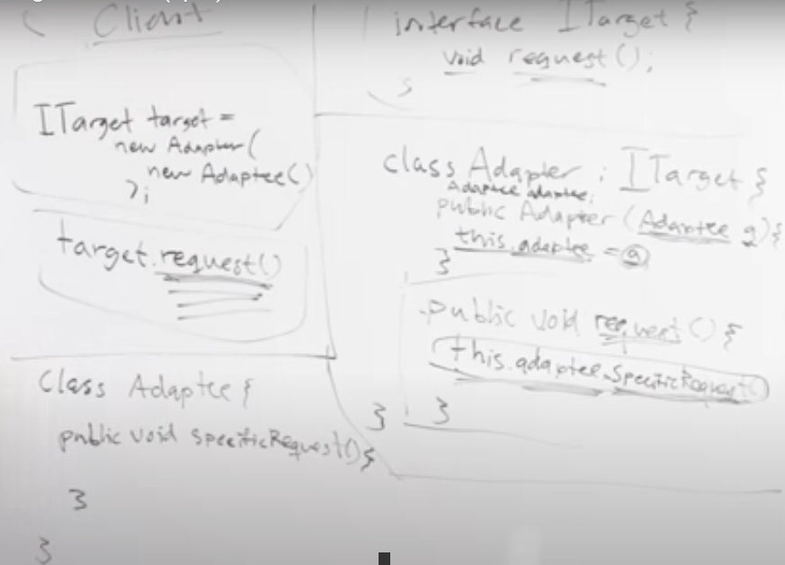

## Index
1. **Design patterns** - solution/template that can be applied to commonly occurring problems in software design, common vocabulary to communicate. 3 tyes - 1. Creational(constructor, factory, singleton), 2. Structural(Decorator, Facade, Proxy, Adapter) 3. Behavioral(Strategy, observer, iterator)
2. **Factory** - defines an interface for creating an object, but lets subclasses decide which class to instantiate. use - when obj creation is complex/depends on dynamic factor (e.g. asteriod game), func EmpFact() {this.create = (nm, type) => {switch(type) { case 1: return new Dev(nm) case 2: return new Tester(nm)}}}
3. **Singleton** - ensures a class has only one instance, and provides a global point of access to it. e.g. 1 country 1 PM, how-to - Using private constructor and static method, using static method if 1st then call private constructor, else return ref to same obj.
4. **Decorator** - attaches additional responsibilities to an object dynamically, avoids subclass explosion, coffee problem, is a comp n has an abstract comp (class caramel extends AddonDecorator {(abstract cls)Beverage b; constructor(Beverage b){this.b=b}; int cost(){return this.b.cost()+2})
5. **Facade** - the front of a building, provides a unified interface to a set of interfaces in a subsytem, watching a movie (HomeTheaterFacade = new HTF(amp, dvd, screen, light); HTF.watchMovie(), .endMovie())
6. **Proxy** - provides a placeholder for another object to control access to it, is a comp n has a concrete comp, usecase - caching - (func xAPIProxy(this.xapi=new xapi(), this.cache={}, this.getVal=func(abc){if not in cache return this.cache[abc] = this.api.getVal(abc) else return this.cache[abc]})), proxAPI = new xAPIProxy(), proxAPI.getVal(1)
7. **Adapter**
8. **Strategy** - 

## JS Design Patterns
A pattern is a reusable solution that can be applied to commonly occurring problems in software design  
It is a blueprint/template that you can use and modify to solve your particular problem  
It gives developers a common vocabulary to communicate  

**Why to use?**  
1. Reusing patterns assists in preventing minor issues that can cause major problems in the application development process
2. Certain patterns can actually decrease the overall file-size footprint of our code by avoiding repetition

**Three main types of Design patterns**  
1. Creational DP
2. Structural DP
3. Behavioural DP

### 1. Creational Design Patterns
Creational design patterns focus on handling object creation mechanisms where objects are created in a manner suitable for the situation we're working in. The basic approach to object creation might otherwise lead to added complexity in a project whilst these patterns aim to solve this problem by controlling the creation process.e, especially if you need to create many different types of many different objects  
**Patterns falling in this category**  
1. Constructor
2. Factory
3. Singleton 

##### 1. Constructor pattern
**Object Creation**  
The three common ways to create new objects in JavaScript are as follows:  

**Accessing obj. values (4 ways)**  

**Constructors with prototypes**  
```javascript
function Car( model, year, miles ) {
  this.model = model;
  this.year = year;
  this.miles = miles;
}
//a single instance of toString() will now be 
//shared between all of the Car objects.
Car.prototype.toString = function () {
  return this.model + " has done " + this.miles + " miles";
};
// Usage:
var civic = new Car( "Honda Civic", 2009, 20000 );
var mondeo = new Car( "Ford Mondeo", 2010, 5000 );
console.log( civic.toString() );
console.log( mondeo.toString() );
```

##### 2. Factory Pattern
The Factory Method Pattern defines an interface for creating an object, but lets subclasses decide which class to instantiate. Factory Method lets a class defer instantiation to subclasses.  
**We can create obj. on the fly, so why this is needed?**  
So that we can handle all the obj. creations at a centralized location  
The factory pattern is a creational design pattern that uses factory methods to create objects — rather than by calling a constructor.  
This is particularly useful if the object creation process is relatively complex, e.g. if it strongly depends on dynamic factors or application configuration  

  
  
So if we want to create obj. which we don't know before hand, this can be used.  
Real scenario, consider space game, you have so many asteriods that you need to destroy in the game.  
All asteriods are randomly coming in the game, and as level increases, more complex asteroids.  
We can creste Asteriod Factory which will handle all this

```javascript
function Developer(name) {
  this.name = name
  this.type = "Developer"
}
function Tester(name) {
  this.name = name
  this.type = "Tester"
}
//all obj creation logic resides in this function, centralized location
// here 1 means dev and 2 means tester
//in future we can add many other types (BA,PO) and this method can control
//those obj creation
function EmployeeFactory() {
  this.create = (name, type) => {
    switch(type) {
      case 1:
        return new Developer(name)
      case 2:
        return new Tester(name)
    }
  }
}
function say() {
  console.log("Hi, I am " + this.name + " and I am a " + this.type)
}
const employeeFactory = new EmployeeFactory()
const employees = []
employees.push(employeeFactory.create("Patrick", 1))
employees.push(employeeFactory.create("John", 2))
employees.push(employeeFactory.create("Jamie", 1))
employees.push(employeeFactory.create("Taylor", 1))
employees.push(employeeFactory.create("Tim", 2))
employees.forEach( emp => {
  say.call(emp)
})
```
**When to use?**  
1. When our object or component setup involves a high level of complexity
2. When we need to easily generate different instances of objects depending on the environment we are in
3. When we're working with many small objects or components that share the same properties

##### 3. Singleton Pattern
The Singleton Pattern ensures a class has only one instance, and provides a global point of access to it.  
E.g. a country would have only 1 PM , so only 1 object needs to be created for PM class  
Many people argue this pattern shouldn't be used, because we need to create that instance of the class as global, so any code accessing it only refers to the same object always. And we don't want globals  
In Java -  
**Using private constructor and static method**  
  
In JS -  
To implement use IIFE and in that IIFE call the constructor of the class whose instance you want to limit  
```javascript
//usecase - many processes but just one process manager
const Singleton = (function() {
  let pManager
  function ProcessManager() { this.state = 'starting'}
  function createProcessManager() {
    pManager = new ProcessManager()
    return pManager
  }
  return {
      getProcessManager: () => {
        if(!pManager)
          pManager = createProcessManager()
        return pManager
      }
  }
})()
const singleton = Singleton.getProcessManager()
const singleton2 = Singleton.getProcessManager()
console.log(singleton === singleton2) // true
```

### 2. Structural Design Patterns
Structural patterns are concerned with object composition and typically identify simple ways to realize relationships between different objects. They help ensure that when one part of a system changes, the entire structure of the system doesn't need to do the same.  
Patterns that fall under this category include: Decorator, Facade, Flyweight, Adapter and Proxy.

**Patterns falling in this category**  
1. Decorator
2. Facade
3. Proxy
4. Adapter

##### 1. Decorator pattern
The Decorator Pattern attaches additional responsibilities to an object dynamically. Decorators provide a flexible alternative to subclassing for extending functionality.  
**Coffee problem**  
  
**Decorator pattern**  
  
  
**UML**  
  
**Implementation**  
  
Here decorator pattern maynot be the best usecae, but if cost function differs greatly in in't impl, then decorator pattern is more suitable.

##### 2. Facade (the front of a building) pattern
The Facade Pattern provides a unified interface to a set of interfaces in a subsytem. Facade defines a higherlevel interface that makes the subsystem easier to use.    
  
Here and everywhere else client refers to some other piece of code
**TV problem**  
  
**solution**  
  
**Implementation**  
  
here, watch/end movie implementation is same as the one shown in facade-problem 

##### 3. Proxy Pattern
The Proxy Pattern provides a surrogate or placeholder for another object to control access to it.  
What is a proxy object?  
A proxy object is an object that acts as an interface (or placeholder) for something else. The proxy could be an interface to anything: an API, a network connection, a large object in memory, or some other resource that is expensive or impossible to duplicate.  
A proxy is a 'stand-in' object that is used to access the 'real' object behind the scenes. In the proxy, extra functionality can be provided, for example caching when operations on the real object are resource intensive.  
  
```javascript
//proxy allows to add additional functionalities, like caching
// External API Service
function CryptocurrencyAPI() {
  this.getValue = function(coin) {
    console.log("Calling External API...")
    switch(coin) {
      case "Bitcoin":
        return "$8,500"
      case "Litecoin":
        return "$50"
      case "Ethereum":
        return "$175"
       default:
        return "NA"
    }
  }
}
//we can use this but for 100 calls to this function
//we will have to make 100 api calls
const api = new CryptocurrencyAPI()
console.log("----------Without Proxy----------")
console.log(api.getValue("Bitcoin"))
console.log(api.getValue("Litecoin"))
console.log(api.getValue("Ethereum"))
console.log(api.getValue("Bitcoin"))
console.log(api.getValue("Litecoin"))
console.log(api.getValue("Ethereum"))
function CryptocurrencyProxy() {
  this.api = new CryptocurrencyAPI()
  this.cache = {}
  this.getValue = function(coin) {
    if(this.cache[coin] == null) {
      this.cache[coin] = this.api.getValue(coin)
    }
    return this.cache[coin]
  }
}
//instead we use proxy, so api response is cached
//and api call is not made everytime
console.log("----------With Proxy----------")
const proxy = new CryptocurrencyProxy()
console.log(proxy.getValue("Bitcoin"))
console.log(proxy.getValue("Litecoin"))
console.log(proxy.getValue("Ethereum"))
console.log(proxy.getValue("Bitcoin"))
console.log(proxy.getValue("Litecoin"))
console.log(proxy.getValue("Ethereum"))
```

##### 4. Adapter pattern
The Adapter Pattern converts the interface of a class into another interface the clients expect. Adapter lets classes work together that couldn’t otherwise because of incompatible interfaces.  
This is used when clients want to call a sepcific method (in this case request) with a particular signature, but the actual method has a different signature  
  
  
**Use case**  
You have created a external library (used by many clients) which has a method meth(a,b), now you want to depricate this
method and now want the users to use new signature meth(b,a), here you can create an adapter, so that you son't replace the method all at once, some clients can still use the older signature via adapter


### 3. Behavioral Design Patterns
Behavioral patterns focus on improving or streamlining the communication between disparate objects in a system.

**Patterns falling in this category**  
1. Strategy
2. Observer
3. Iterator

##### 1. Strategy Design Pattern
**The duck problem**
  
In inheritance code sharing is done only top to down. But horizontal code sharing (2 subclasses having same method, but different than the parent), Inheritance fails.  
In the above design, we have used interface but then if there are 100 types if ducks, then we will have to create 100 types of functions (fly and quack), even if 50 classes have exact same method.  
**Solution**  
Separating what changes from what stays the same  
We know that fly() and quack() are the parts of the Duck class that vary across ducks.  
To separate these behaviors from the Duck class, we’ll pull both methods out of the Duck class and create a new set of classes to represent each behavior.  
  
  
HAS-A can be better than IS-A  
**Implementation of above design**  
  
  

**Definition**  
The Strategy Pattern defines a family of algorithms, encapsulates each one, and makes them interchangeable. Strategy lets the algorithm vary independently from clients that use it.  
From definition, you should now understand when to apply this design pattern  
```javascript
//use case - companies fedex, ups & usps have different shipping calculations
// to calculate shiiping cost of the package
function Fedex(pkg) {
  this.calculate = () => {
    // Fedex calculations ...
    return 2.45
  }
}
function UPS(pkg) {
  this.calculate = () => {
    // UPS calculations ...
    return 1.56
  }
}
function USPS(pkg) {
  this.calculate = () => {
    // USPS calculations ...
    return 4.5
  }
}
const fedex = new Fedex()
const ups = new UPS()
const usps = new USPS()
const pkg = { from: "Alabama", to: "Georgia", weight: 1.56 } // Dummy package
//in normal scenario we would have done this
fedex.calculate();
usps.calculate(); ups.calculate(); // all wrong
// instead do this
// this is a strategry pattern
// pass objs at runtime and call that obj's calculate method
function Shipping() {
  this.company = null
  this.setStrategy = company => {
    this.company = company
  }
  this.calculate = pkg => {
    return this.company.calculate(pkg)
  }
}
const shipping = new Shipping()
shipping.setStrategy(fedex)
console.log("Fedex: " + shipping.calculate(pkg))
shipping.setStrategy(ups)
console.log("UPS: " + shipping.calculate(pkg))
shipping.setStrategy(usps)
console.log("USPS: " + shipping.calculate(pkg))
//one owuld say we can pass company name as args to a generic calculate function
//and in that we could have added if else and called that particular company's calculate method
// it is not a good design patter
// if we have 100 companys if will use that many if lese or switch case
// but here shipping function would still be of same size
```

##### 2. Iterator Design Pattern  
The Iterator Pattern provides a way to access the elements of an aggregate object sequentially without exposing its underlying representation.  
E.g. Java collections have iterator.  
In java the Iterator can iterate through any collection (LinkedList, Tree, Set), and it does not matter to the iterator which DS it is iterating. This is a iterator pattern  
So in your app if you want to iterate over collection of objs, and each collection has different types of objects and you want to use a single iteration  

In addition, you may need to access the items in the collection in a certain order, such as, front to back, back to front, depth first (as in tree searches), skip evenly numbered objects, etc.  
The Iterator design pattern solves this problem by separating the collection of objects from the traversal of these objects by implementing a specialized 'iterator'!  

  
Here Aggregate means anything that is iterable.  
And for eash DS, we have a different concreteAggregate and concereteIterator.  
For code, see iterators in JS  

##### 3. Observer Design Pattern
The Observer pattern is a design pattern that offers a subscription model in which objects (known as 'observers') can subscribe to an event (known as a 'subject') and get notified when the event occurs (or when the subject sends a signal). This pattern is the cornerstone of event driven programming.  
Used in event handling systems  
Can be used in chat apps  
**Observer pattern**  
  
It's implementation
  
```javascript
function Subject() {
  this.observers = [] // array of observer functions
}
Subject.prototype = {
  subscribe: function(fn) {
    this.observers.push(fn)
  },
  unsubscribe: function(fnToRemove) {
    this.observers = this.observers.filter( fn => {
      if(fn != fnToRemove)
        return fn
    })
  },
  fire: function() {
    this.observers.forEach( fn => {
      fn.call()
    })
  }
}
const subject = new Subject()
function Observer1() {
  console.log("Observer 1 Firing!")
}
function Observer2() {
  console.log("Observer 2 Firing!")
}
subject.subscribe(Observer1)
subject.subscribe(Observer2)
subject.fire() 
subject.unsubscribe(Observer1)
subject.fire()
```
**Observer vs Pub/Sub pattern**  
The Observer pattern requires that the observer (or object) wishing to receive topic notifications must subscribe this interest to the object firing the event (the subject).  
The Publish/Subscribe pattern however uses a topic/event channel which sits between the objects wishing to receive notifications (subscribers) and the object firing the event (the publisher). This event system allows code to define application specific events which can pass custom arguments containing values needed by the subscriber. The idea here is to avoid dependencies between the subscriber and publisher.  

