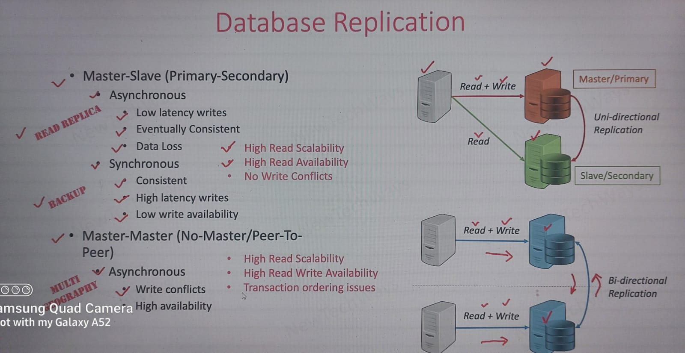
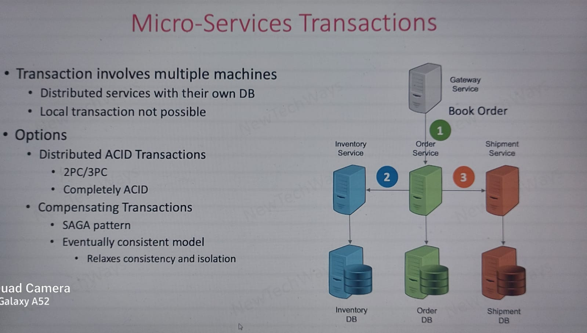
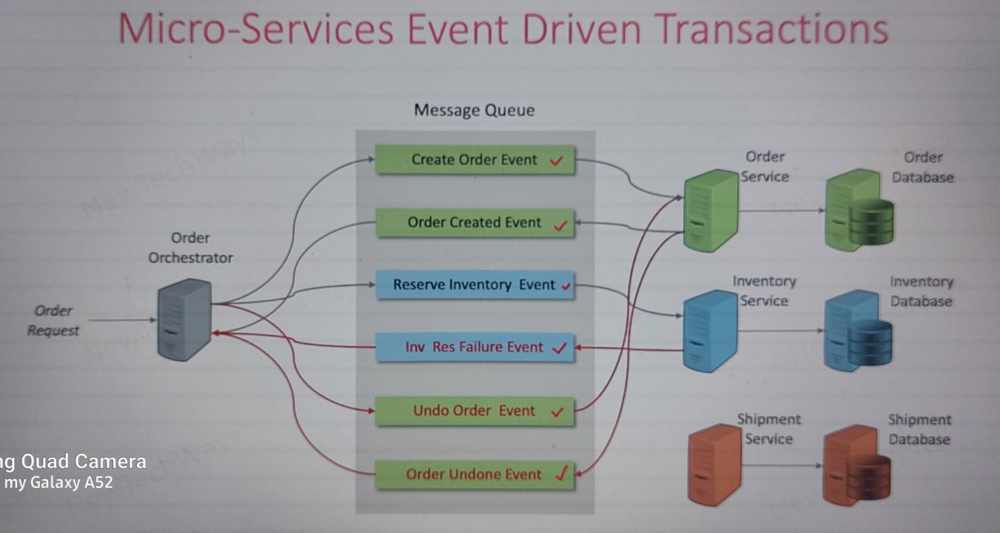
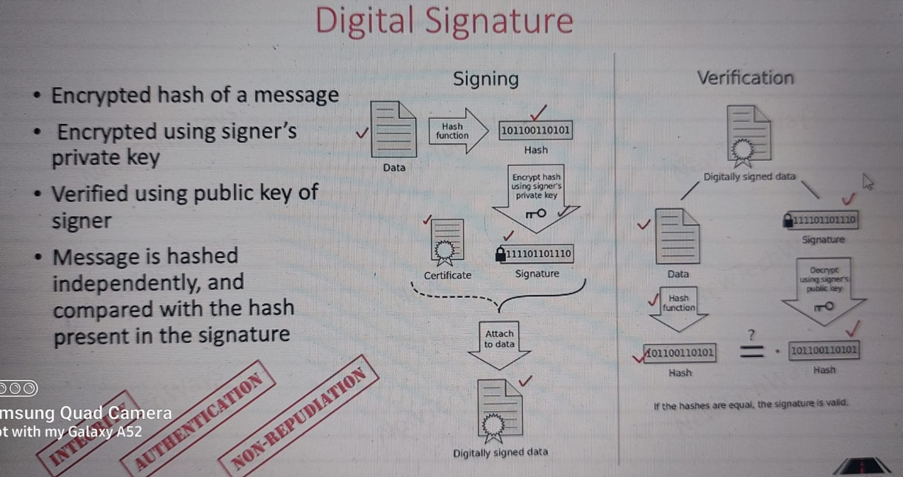
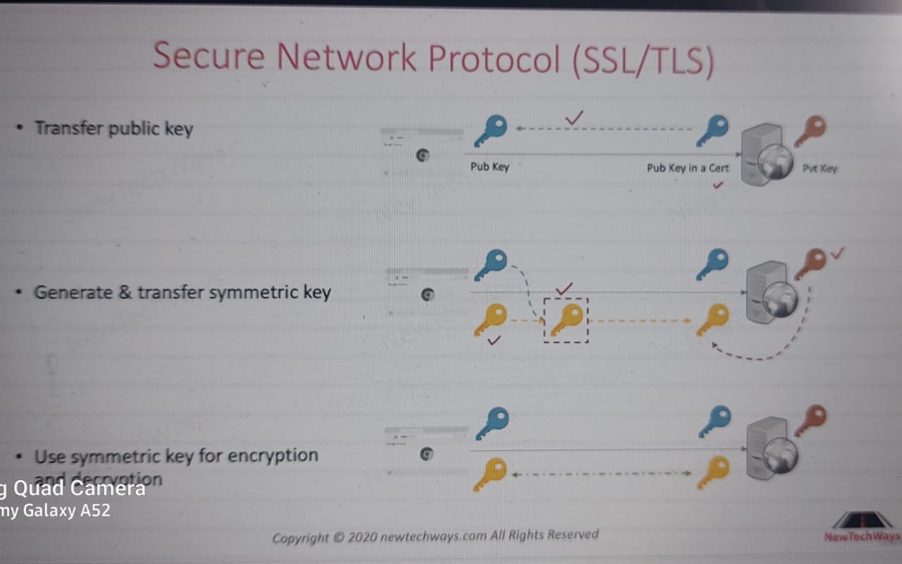

## 1. Performance
## 2. Scalibility
## 3. Reliability
## 4. Security
## 5. Deployment
## 6. Tech stack

## 1. Performance
How fast or responsive a system is under given load and under given hardware.  
How to identigy performance issue?  
It is caused due to some queue build-up in some part of the app (network queue, db queue, OS run queue)  
And reason for queue build-up  
1. Inefficient slow processing (inefficient code)
2. Serial resource access
3. Limited resource capability

#### 1. Latency
1. **Network latency**
-Do data compression while sending response, (do only id data is huge)  
-Cache static data  
2. **Memory latency** (optimum use of memory)
-Use weak/soft refrecnes (WeakMap, WeakSet), to free up memory
3. **Disk latency** (while doing I/O, db queries)
-3.1 **While logging**   
logging is a sequential I/O, means disk already know the memory_location where the next write would be. So since it is sequential I/O, disk latency is low, but logging need to be done asynchronously & try and log as many info at once.  
-3.2 **DB Disk latency**  
Schema optimization (Normalization), creating Indexes  
At hardware level - use SSD Disk(faster), user disks with higher IOPS(I/O per second)
4. **CPU latency**  
4.1 - Inefficient code (algorithms)  
4.2 - **Context Switching** - how to avoid?  
Batch multiple calls (batch DB calls and get data at once)  
Use Single threaded model, this way the main thread is always on CPU and avoids context switching  
Reduce thread pool size, that way, less no. of processes in 1 pool, less context switching, e.g. K8 pods

#### 2. Concurrency
Using mutliple threads
#### 3. Caching - (Data which is read a lot and doesnot change frequently is a candidate for caching)
At mutliple levels  
1. Server level - Redis
2. Session cache - user session data
3. Static data cache (css/js) - CDN
4. HTTP cache - browser cache (browser caches css/js files) - See REST_API module  

**Caching data at server**  
1. **Exclusive cache** - each node withing the cluster has it's own cache, so cache duplicate at diff. nodes also if the next req. is forwarded to some other node, that that node might not have the cached data  
2. **Shared cache** - Cache data stored in only one particular external node, this will have extra network hop for the nodes to reach out to this external cache

##### limitations of cache (cache hit ratio = # of cache hits/# of request)
1. Limited memory space  
Only cache frequently used data  
Cache small objs
2. Cache invalidation / cache inconsistency (stale data in cache)  
Using TTL - 
High TTL value - increase cache hits but also increases cache inconsistency  
Low TTL value - decreases cache inconsistency but decreases cache hits  
**Note - if caching strategy is bad it can affect performance negatively**

## 2. Scalibility
Ability to increase its throughput by adding more hardware capacity
#### 1. Vertical scaling - only 1 machine, but increase it's capacity (cpu, ram), limited scalibility
#### 2. Horizontal scaling - add more machine/hardware, unlimited scalibility  

**Scalibility principle**  
1. Decentralization - specialized services, more worker nodes (doing same job)
2. Independence - each worker needs to be independent

### **Ways to achieve scalibility** 
#### 1. Modularity - Business logic needs to be split into modules (order module, user module)
#### 2. Replication - replicate nodes, dbs  
Replicate nodes - Problem - if session is used on server, then the next request from client might go to some other node where the session is not created for that client. To solve this, use JWT (since user data is stored in the client side), if we still need to use server session, send the cookie to client with user data + node id, where the session is created, and when next time client makes the request, the load balancer gets the node id from cookie and reroutes the request to same node (this is called sticky session), other option - store session data in Redis (since it is distributed cache system)  
**Note - in multi-threading, we can use OS level locks to manage shared resources like reading a file. In replication, we cannot use OS level locks, since there is not just 1 OS, due to multiple nodes(machine), in this case we need to create a lock table, and when one node is accessing a shared resource, add new record in the lock table, once done release the lock on that row**  
  
In Master-slave - synchronous replica, when write query comes to DB, it is executed in master replica, and then DB will replicate same transaction on all the replica nodes, and only when this is successful, the execution returns to the server, which then sends response to client, this way it is consistent but will have high latency writes hence used in backup replicas

#### 3. Vertical partitioning (Micro-services)  
Create service of each business domain (Inventory, Order, Catalog, User) such that  
Inventory service connected to Invenotry DB, order service to order DB and so on.  
So instaed of having 1 DB, it is now partitioned vertically, so different tables in different DB. (Note - common tables should not be present in these different DBs)  
Verticle partitioning can scale only upto certain limit, if we have only 2 business domains, then only 2 different DBs. Also id order DB has large amount of data as compared to user DB, then orderDB would be bottleneck.  
So **Horizontal partitioning** -   
Partition the Vertically partitioned DB (OrderDB) in smaller dataset, rows are partitioned  
1. Range based partitioning - Distribution of data can be uneven 
2. Hash based partitioning (use consistent hashing algo)- data evenly distributed but, range queries (get rows between 100 and 400) are inefficient  

**Note - partitioned DBs no longer support ACID properties**  
But how does app know which partitioned DB to pass the query to? this is handled by DBs themeselves. We don't have to worry as app developer for e.g.  
1. MongoDB - it provides client (mongoClient package npm) router which is cluster aware (knows how many clusters are avaialble and what partition method (range/hash) is used and re-routes the request to appropriate partitioned DB)  
This is the case only when DB is partitioned horizontally, in case of vertical partition, we have already partitioned DB into separate DB and each separate DB is attached to the service like (Inventory service connected to Inventary DB) see above

#### 4. Load balancers
Each service can have 100 replicas which will have 100 Ips, so which one to call. Load balancer does this job. Client need send the request only to load balancer.  
Services have internal load balancers, in K8 (internal services) and app is exposed on external load balancers (in K8 - Ingress)  
**Discovery services** - keep track of each all instances of different services (catalog, user, inventory) are alive along with their IP addresses.  
Load balancer calls this discovery service, gets IPs of the service in needs to call, and based on the routing algo we define (Round robin, Least connection, Least res time)  
in K8, we don't have to worry about Discovery service, handeled by default for internal pods  

2 Types of LBs  
1. Hardware load balancers
2. Software load balancer (Apache, nginx)

#### 5. Micro-service architecture
Use when
1. Frequent Deployment
2. Independent deployment
3. Independent developmenst
4. Independent Services

Before micro-services we had SOA (Service oriented architecture)  
SOA -  
Each service has own tech stack, frameworks  
Each service can be scaled independently  
But all services accessed same DB  

In micro-service architecture  
Sepearte service and separate DB for each businness domain, like (Order, Inventory, User)  

**Problems with micro-services**  
1. Micro-service transactions  
See below example, we need to book an order, since we are using micro-services architecture (vertical partitioning as per business domains), we have 3 services (inventory, order and shipment) with their own DB, and different DBs don't have ACID properties  
So if an order is made, the app needs to ensure 3 things  
1. Call inventory service and deduct the count of product from inventory DB
2. Call shipment service and ensure the product can be delivered to the desired location, and add shipment related detials to shipment table
3. Call order service and add new order in the order DB  
Now we cannot gurantee consistency or ACID props here  
  
two solve this we have 2 solutions  
1. Distributed ACID transactions using 2PC (2 phase commit)  
Call inventory, shipment and order services, check if order can be placed then acquire locks on those tables, then commit the transaction  
Since we acquire locks, other requests can't do a write which defeats the purpose of scalibility, and we are using micro-services for scaling  
2. Using Saga pattern (Solves Distributed ACID transactions) (Eventual consistency) 
Instead of acquiring locks, make the updates in the DB, like (update inventory, create shipment record, place order), anywhere the transaction fails (let's say we updated the invenotry, but shipment on that address not possible), undo the changes in the inventory DB. (We need to write the entire undo logic) DB won't handle.  
But what would happen, if while doing undo, the inventory DB goes down?  use Event driven transactions  
**Event driven transactions**  
Use message queue  
The idea is to use messaging system, so that the main service can publish events to messaging queues and each micro-service (inventory, order) can subscribe to specific events and when that event occurs, they execute the process, if any service can't do the transaction (like shipment service says order can't be delivered to this location), then shipment service will send another event to messaging queue - (undo order transaction), which would be subscribed by the order service and to the necessary changes
  

## 3. Reliability  
In scalibility topic, we saw how system can fail at various levels, so we need system reliability  
Largescale/distributed systems can fail  
1. Partially - any node / component failure 
2. Single point of failure (bring entire system down, load balancer)  

System should be  
1. Reliable - continue to function correctly even in partial failures
2. Available - 
3. Fault tolerant - ability to detect, handle and recover partial failures  

#### Designing fault tolerant system
Using  
1. Redundancy - replicating critical components, secondary capacity is kept available in case primary is not available
2. Fault detection
3. Recovery

**1. Redundancy**  
Redundancy for stateless components just increase no. of nodes  
Redundancy for stateful components (DB, cache, MQs are stateful components) -  
For DB - (create db backups and not replicas, backups are synchronous replication (see DB scalability above))  
For MQs - same as DB redundancy. All the replication/backup is handled by respective DB/MQ vendors  
For Caches - Not really needed (since cache is secondary source of data). If data is lost from cache, we can always get from DB. Redis has capability to provide redundant cache data, memcache does not have this feature  
Redundancy for infrastructural components (Load balancers) - 
Use secondary load balancers if primary LB goes down  

**2. Fault Detection**  
Fault models  
1. Response failure - server fails to respond to client's request 
2. Timeout failure - server response longer than the timeout threshold
3. Crash failure - server went down  

Use monitoring system (Dynatrace/ AWS monitoring services) to detect faults

**3. Recovery**  
For stateless recovery - just restart failed pods/nodes or spin up new pods/nodes (K8 doeas this by default)  
For stateful recovery -  
1. For Load balancers - using floating IPs, we have 1 primary LB and a secondary LB and a floating IP which redirects requests to primary or secondary LB based on which is available  
2. For DBs - only in case of master slave setup  
a. Using synchronous replication (backups) (aka - hot standby), but writes are slow so if primary DB is down, we have backup  
b. Using asynchronous replication (db replica) (aka - warm standby) - possibility of loss of data, since if promary DB is down, and some data is yet to be replicated  
c. Database recovery (aka cold recovery) - keep taking backup every x hours, then take old backup and create new DB if DB goes down or corrupted, significant downtime  

#### Some steps to avoid make system more stable
**1. Timeouts on API calls**
**Add timeouts to the API calls, beacsue if some API slow down for some reason (specially if the api call is making another API call to some other server), then we need to set a timeout to our service, because if the dependent service slows down from some reason (out of our control), then the threads on our server would be occupied and if many clients keep calling this AIP, our server would start running out od threads since older threads are still busy. To avoid this set timeout on our API endpoints and return some msg to the suer after that timeout, so that the threads a re freed up**  
**2. Retries**  
In case of transient errors (e.g. 2 clients trying to book same seats in movie ticket, this will cause race condition, since only 1 client will be able to book the specified set). To avoid this ask other client to rety the request  
**Use idempotent tokens** -client makes a request, request is processed (let's say updating a DB), but while sending a response, node goes down. Client retires request, which goes to another node, but we have already updated the DB, if the server process the request, DB would be updated again, to avoid this, save the requestId in the DB is the request has been processed, so when new node processes the request, it will see the request Id is available in DB, so don't update the DB, send the response. Frequently we can keep deleting those requestIds from DB.  

## 4. Security
#### 1. Network security
**1. Symmetric key encryption**  
Both client and server have same key which is used to encrypt and decrypt messages  
But how do we share same key with client and server? Can't send in plain text.  Achieved using asymettric key encryption and SSL protocol (see below)
**2. Public/asymmetric key encryption**  
Public, private key, private & public key stored at server, public key on all clients but not private key, so ecah client can encrypt message which can be decoded only using private key, so no other client/hacker can decrypt message until they have private key  

**Digital signatures - ensure who has signed the doc and the doc is not altered once it is signed**  
  
2 Steps  
1. Digitally signing (server side) - hash of the data is generated (using md5, sha2 algos), and this hash is encryped using server's private key. Now data and the signature (encrypted has of data is a signature) is sent to the client  
2. Verify the signature (client side) - client calculate hash of the data using same algo, client decrypts the hashed signature using publick key, if both hash match it is digitally signed  

**Note - digital certificate is public key of server + digital signature of the server**

**3. SSL protocol (s in https)**  
  
3 Steps  
1. Transfer public key - client initiates https protocol, server sends public key to client using certificates (digitally signed using digital signature we saw above). Here publick key can be sent without any encryption since it is public key 
2. Generate & transfer symmetric key - cleint generates symmetric key and and encrypts this key using servers publick key (so only the server can decrypt the symmetric key via it's private key)
3. For all future calls between client and server - use the generated symmetric key for encrypting and decrypting the messages  
But why do we need secodn step(why to create symmetric key, we can use public/private keys for encrypting and decrypting messages) - Becasue symmetric key alogs are fast as compared to asymmetric keys  

**4. Firewalls**  
Firewall is a network component which sits between our app and external world. It allows or blocks the incomming/outgoing requests at various levels  
can be blocked at Source IP level, allow only range of IPs to pass to our app, Ports (allow communication only on specific ports), Protocols (allow communication only on certain protocols (TCP,FTP,SMTP))  

#### 2. Identiy management  
SSO, JWT, session based auth (express session), OAth2  

**Role based Access Control (RBAC)** - Industry wide approach  
3 Components  
1. Users - Create user groups, and assign each user to a group
2. Permissions - Create roles (based in business requirements) and assign these roles to user groups
3. Resources (APIs based on user role)  

Now based on user groups and permissions protect routes by following below steps  
1. In the API, get token from authorization header (JWT) and extract the user role from the token  
2. In the API, list all the permissions (store the permissions (roles) in a constant file) that are allowed to execute this API
3. From the user role obtained in step 1, check if this role can execute the API, by checking API permissions in step 2, if yes execute else 401 (unauthorized)  

**Note - all the 3 steps should be done in the middleware**  

#### 3. Access management
#### 4. Common vulnerabilities

