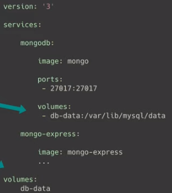

## Docker (container runtime)

#### Docker vs VM

**Levels in machine** - Hardware -> Kernel -> Applications  
**Docker** - Virtualization at application level, hence small in size, fast start/stop  
**VM** - at app + kernel level, large size in GBs, slow start/stop

# 🚀 Docker Commands Cheat Sheet

---

## 📦 Image Commands

| Command                           | Description                       |
| --------------------------------- | --------------------------------- |
| `docker pull <image>`             | Download an image from Docker Hub |
| `docker images`                   | List all downloaded images        |
| `docker rmi <image>`              | Remove an image                   |
| `docker build -t <name> .`        | Build an image from Dockerfile    |
| `docker tag <image> <repo>:<tag>` | Tag an image for a repository     |
| `docker push <repo>:<tag>`        | Push an image to a registry       |
| `docker history <image>`          | Show layers of an image           |
| `docker inspect <image>`          | Get detailed info about an image  |

---

## 🐳 Container Commands

| Command                                    | Description                                                  |
| ------------------------------------------ | ------------------------------------------------------------ |
| `docker ps`                                | List running containers                                      |
| `docker ps -a`                             | List all containers (including stopped)                      |
| `docker run <image>`                       | Run a container from image                                   |
| `docker run -it <image> bash`              | Run container in interactive mode with shell                 |
| `docker run -d -p 8080:80 <image>`         | Run in detached mode, map host port 8080 → container port 80 |
| `docker start <container>`                 | Start a stopped container                                    |
| `docker stop <container>`                  | Stop a running container                                     |
| `docker restart <container>`               | Restart a container                                          |
| `docker rm <container>`                    | Remove a container                                           |
| `docker logs <container>`                  | Show logs of a container                                     |
| `docker logs -f <container>`               | Follow logs in real-time                                     |
| `docker exec -it <container> bash`         | Run a shell inside running container                         |
| `docker inspect <container>`               | Get detailed info about a container                          |
| `docker stats`                             | Show live performance metrics                                |
| `docker cp <container>:<path> <host-path>` | Copy files from container to host                            |
| `docker cp <host-path> <container>:<path>` | Copy files from host to container                            |

---

## ⚙️ Docker Compose Commands

| Command                              | Description                                       |
| ------------------------------------ | ------------------------------------------------- |
| `docker-compose up`                  | Start services defined in `docker-compose.yml`    |
| `docker-compose up -d`               | Start services in detached mode                   |
| `docker-compose down`                | Stop and remove containers, networks, and volumes |
| `docker-compose stop`                | Stop services without removing them               |
| `docker-compose start`               | Start previously stopped services                 |
| `docker-compose restart`             | Restart services                                  |
| `docker-compose logs`                | Show logs from services                           |
| `docker-compose logs -f`             | Follow logs from services in real-time            |
| `docker-compose ps`                  | List containers created by Compose                |
| `docker-compose exec <service> bash` | Run shell inside a service container              |
| `docker-compose build`               | Build/rebuild images defined in Compose           |
| `docker-compose pull`                | Pull images defined in Compose                    |
| `docker-compose push`                | Push images defined in Compose                    |

## Reading docker compose file

### 📌 Predefined keys (must be written exactly like this)

- `version`
- `services`
- `volumes`
- `networks`

**Inside `services`:**

- `image`
- `build`
- `ports`
- `volumes`
- `environment`
- `depends_on`
- `restart`
- `deploy`
- etc.

---

### 🛠️ Custom names (you choose)

- **Service names:** `app`, `db`, `frontend`, etc.
- **Volume names:** `db_data`, `app_data`, etc.
- **Network names:** `app_network`

# ===========================================================

# 🐳 Docker Compose Reference Skeleton

# ===========================================================

```yaml
version: "3.9" # Compose file format version

# -------------------------------
# Services = containers to run
# -------------------------------
services:
  app: # 👈 custom name (you choose, e.g., app, api, backend)
    image: node:18 # Use prebuilt image
    # OR build from Dockerfile instead of image:
    build:
      context: ./app # Path to Dockerfile directory
      dockerfile: Dockerfile.dev # Specific Dockerfile name
      args: # Build arguments
        NODE_ENV: production

    container_name: my_app # Optional custom container name

    command: ["npm", "start"] # Override default CMD
    entrypoint: ["node", "server.js"] # Override ENTRYPOINT

    working_dir: /usr/src/app # Set working directory inside container

    ports: # Map host:container ports
      - "8080:3000"
      - "443:443"

    volumes: # Mount volumes
      - ./src:/usr/src/app # Bind mount (local dir → container dir)
      - app_data:/data # Named volume

    environment: # Environment variables
      - NODE_ENV=production
      - PORT=3000
    env_file: # Load env vars from file
      - .env

    depends_on: # Service dependencies (startup order)
      - db

    restart: always # Restart policy: no, always, on-failure, unless-stopped

  db: # 👈 Another service
    image: postgres:15
    environment:
      POSTGRES_USER: user
      POSTGRES_PASSWORD: pass
    volumes:
      - db_data:/var/lib/postgresql/data
    networks:
      - app_network
```

**for docker run commands flags need to be in sequence - docker run --name my-container -p 3000:3000 my-image** - here you cannot give port flag before --name flag

**port binding -**
Docker allows multiple apps with diff versions run simultaneously like 2 diff ver of redis can be run, here redis is opened to default port (6379), so now there are 2 containers (running instances of 2 diff redis version) and both exposing to port 6379, so this is possible because of -p hostport:containerport, no issues as long as host port is always diff.

## Sample application - create 3 node instances which servers APIs, and use NginX for loadbalancing

- See nginX-project folder, below are samle docker, docker compose files, imp to see NginX file

```dockerfile
# Use Node.js LTS (can override with build-arg)
ARG NODE_VERSION=18
FROM node:${NODE_VERSION}
# Set working directory
WORKDIR /app
# Copy only package files first (for layer caching)
COPY package*.json ./
# Install dependencies
RUN npm install
# Copy the rest of the app (respects .dockerignore)
COPY . .
# Expose app port
EXPOSE 3000
# Start the app
CMD ["npm", "start"]
```

```yaml
version: "3"

services:
  app1: # creating 3 upstream servers from the same Docker image for load balancing demo in nginx-project
    build: .
    ports:
      - "3001:3000"
    environment:
      - SERVER=SERVER1

  app2:
    build: .
    ports:
      - "3002:3000"
    environment:
      - SERVER=SERVER2

  app3:
    build: .
    ports:
      - "3003:3000"
    environment:
      - SERVER=SERVER3
```

`docker push <image-name:version>` also first do docker login  
Image names in docker registries (like AWS ECR)  
registryDomain/imageName:tag  
If we push to Dockerhub, registryDomain is not required it by default adds the dockerhub registry, but while pushing to other docker repos, we need to include registryDomain

### 9. Run the image pushed in step 8 on the actual prod server

From the server, amybe EC2, pull docker image and run the app using docker-compose command

#### Docker volumes - to persist data in docker

Container restarted data lost so need vloumes  
**Internal working** - a directory from virtual filesystem (container) is mounted to the host file system  
**3 Types** -

1. Host volumes - `docker run -v host-dir:container-dir`
2. Anonymosy volumes - `docker run -v container-dir` host-dir = /var/lib/docker/volumes/hash/\_data (for linux/mac)
3. Named values (preferred) - `docker run -v name:container-dir` host-dir - same as above

In docker compose above volumn settings is achieved via volume  
services -  
 mongodb:  
 image: mongo  
 ports: 27017:27017
volumes: ---- this volume specifies the named volume for this container

- db-data:/var/lib/mysql/data  
   volumes:
  db-data: (if we have multiple containers with multiple volumes, we need to specify all those volumes under this key)  
   driver:local

**Note - the contianer-dir defres for each DB**

1. For myslq - /var/lib/mysql
2. For mongo - /data/db
3. For postgres - /var/lib/postgres/data

in docoker-compose ->

