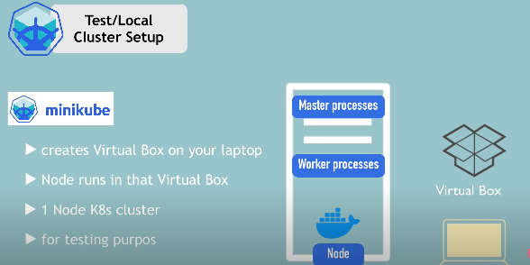
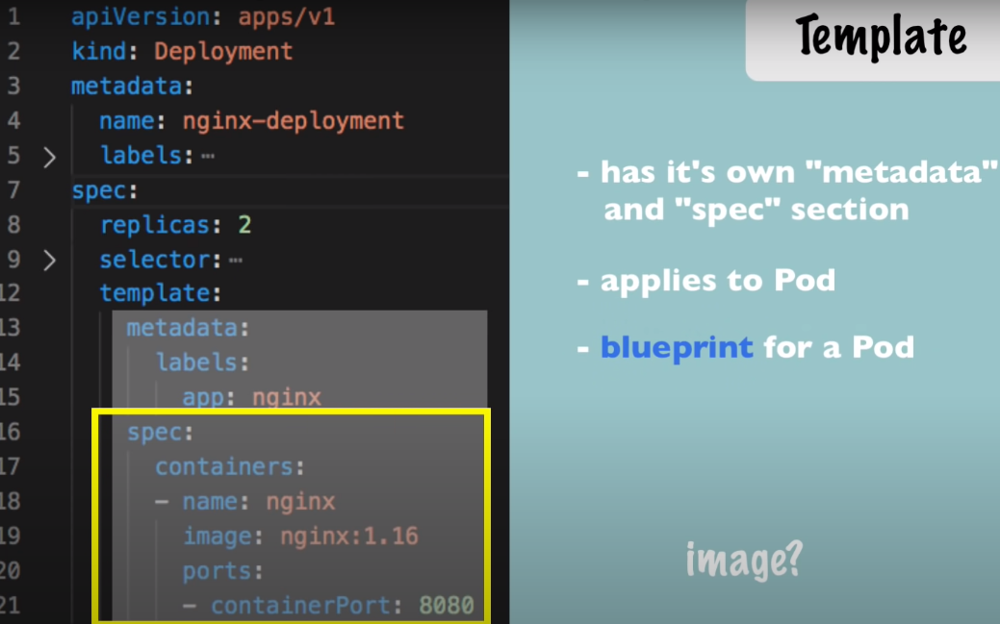
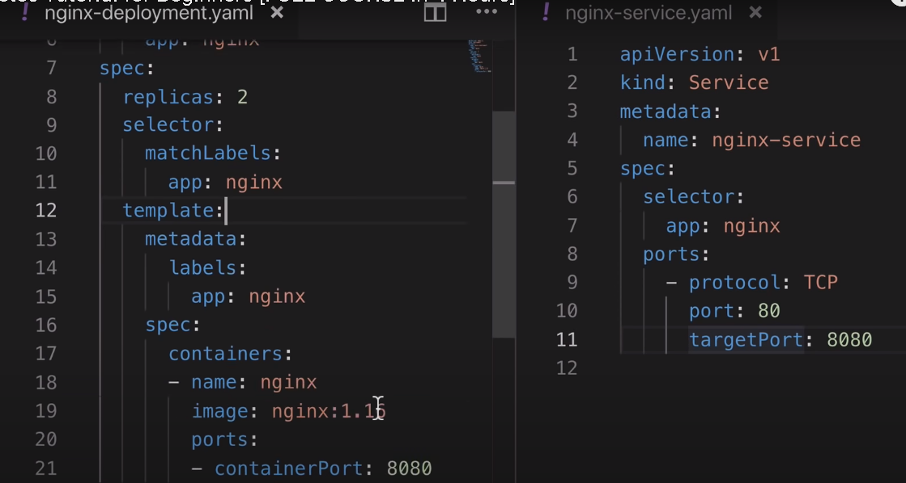

## Kubernetes - open source container orchestration tool by Google
**More microservices apps, more containers, hence need K8**  

###### Jobs of orchestration tool
1. High availability
2. Scalability
3. Managing and maintaing containers  

## K8 componenets
1. **Pod** - smallest unit (abstraction over container, additional layer over container, why, k8 interact with pod, because container runtime can change (mostly docker is used)), each pod gets IP, which is used to communicate between diff. pods
2. **Service** - permanent IP to pod, since pods may die, new pod is created, then IP would be diff. to avoid this - service, passes req from ingress to pod
3. **Ingress - External service -** allow external world (browser) to connect to pod, by passing the req, to internal services
4. **ConfigMap** - Env vars - no need to rebuild pod/images
5. **Secret** - Secret env vars - stores data in base64 format (encryption can be done)
6. **Volumes** - Data storage, can store (locally - in same host, or remote - on cloud)
7. **Deployment** - Blueprint for pods creation - relation - pods as to container (abstraction), similarly deployment as to pods
8. **StatefulSet** - (takes care of DB inconsistencies) In deployment we add replicas for a pod, so one pod dies, other is their to handle the req, same thing can't be done with DB pods, since DB is stateful, to handle this we have StatefulSet component, all DB pods should be created using this, same as deployment (i.e blueprint) but for DBs. Preferred to store DB outside of K8 cluster

## K8 architecture
  
1. **Worker Node** - (Machine physical/virtual), **Cluster** - Group of nodes, each node must have (1. Kube proxy (pass request from services to pods), 2. container runtime (docker), 3. Kublet (interacts with container and node to create pods))
2. **Master Node** - has 4 processes  
a. **API server** - client (kubectl) interacts with this api server to deploy app in K8 cluster, also does authentication of client  
b. **Scheduler** - intelligent (checks CPU, RAM) to decide on which node next pod needs to be scheduled, just schedules  
c. **Controller Manager (CM)** - Detect state changes like crashing of pods, and try to recover the cluster/node state by calling scheduler  
d. **etcd** - (cluster brain) - key value store of a cluster state, any state change like pod died/started is stored in this key-value store, CM checks this to understand cluster health, and scheduler check this key store to determine where next pod should be created 

## K8 local setup using minikube and kubectl
**minikube** - It mocks the k8 cluster on local machine (it is 1 node k8 cluster)
 

**kubectl** - cmd tool to interact with the API server in the master node to make deployments  
**kubectl comands**  
1. kubectl get node/pod/service/deployment/replicaset
2. kubectl create deployment(this is pod, u don't create a pod but a deployment) name --image=image  
e.g. ```kubectl create deployment nginx-depl --image=nginx``` this will create new pod from img-nginx(from docker)
3. kubectl describe (pod pod-name)
4. kubectl logs (pod-name)
5. kubectl exect -it (pod-name) -- /bin/bash      - open terminal for the pod
6. kubectl delete deployment (dep-nm)
7. kubectl apply/delete -f (file-name)
  
## K8 config.yaml files
**3. Parts**
1. Metadata
2. spec - all the config of a component/kind (spec keys differs from component to component)
3. status - we don't specify it, k8 does it internally (it checks the desired status and the actual status and if there is a diff, k8 tries to fix it), that's how self-healing works in k8 (using etcd)
 
**Deployment blueprint**  
  
kind = deployment, it can be service/  
Since deployment includes pods, everything inside template key is blueprint for pod  

**Connecting different components using selectors and labels (key-val pair)** 
  

Metadata containes lables -labels: app: nginx  
and spec contains selectors - selector: matchLabels: app: nginx  
kind = deployment must know which pods are in that deployment since deploy->replicas->pods->containers  
Hence, in kind=deploy, spec is nested and we need labels and selectors  
kind = service must know which pod/deply to connect hence use labels and selectors  

**Deployment component and Service component port mapping**  
kind = service must know on which port pod is running, so it has it's own port and target(for pod) port  
  
Now we can run the apply commands to start both the components  
```kubectl apply -f nginx-deployment.yml and kubectl apply -f nginx-service.yml ```   
```kubectl delete -f nginx-deployment.yml``` to delete the components

## Complelete application setup using K8
**App architecture**  
2 pods  
(1. mongoDB - which will be DB and would be exposed via internal service, so that only the components within same
K8 cluster can access the pod)  
(2. mongo-express - which will use config maps and secrests to connect to mongoDB and will also expose external service, so that browser can access the mongo-express pod)
[!alt text](PNG/app-architecture.PNG "Title")  

### Step 1 - Create mongo-deploy.yml
```yaml
apiVersion: apps/v1
kind: Deployment                          ------------ this specifies that this component is a pod
metadata:
  name: mongodb-deployment
  labels:
    app: mongodb    ----- this label is used in other comp's selector section, so that 2 comps can communicate
spec:
  replicas: 1
  selector:
    matchLabels:
      app: mongodb
  template:        -------- from here the blueprint for pod starts
    metadata:
      labels:
        app: mongodb
    spec:
      containers:
      - name: mongodb   
        image: mongo        -------- image on which the pod would be built
        ports:
        - containerPort: 27017  ------- this pod would be exposed on this port
        env:
        - name: MONGO_INITDB_ROOT_USERNAME  ----- env var name
          valueFrom:
            secretKeyRef:
              name: mongodb-secret     ----- name of the secret component from where the values would be fetched
              key: mongo-root-username ----- keyName from the secret component
        - name: MONGO_INITDB_ROOT_PASSWORD
          valueFrom: 
            secretKeyRef:
              name: mongodb-secret
              key: mongo-root-password
---
apiVersion: v1
kind: Service                               ----------- this indicates that this comp is a service
metadata:
  name: mongodb-service
spec:
  selector:
    app: mongodb                          ----------- this indicates that connect to mongodb deployment
  ports:
    - protocol: TCP
      port: 27017
      targetPort: 27017                    ---------- and under mongodb comp, connect to pod whose port is 27017 

```  

### Step 2 - Create secrets component
This secret component must be created (using kubectl apply command) before other components which use this secret
```yaml
apiVersion: v1
kind: Secret                         ------------- this is a service component
metadata:
    name: mongodb-secret             ------------- comp name, which is used as env name in other comps (see above)
type: Opaque                         ------------- default
data:
    mongo-root-username: dXNlcm5hbWU=  ---------- this name is used as key in ev vars
    mongo-root-password: cGFzc3dvcmQ=

```


  

