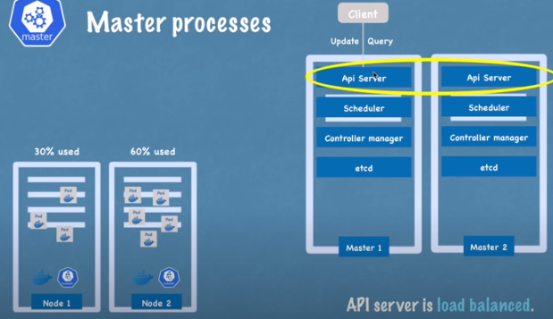

## Kubernetes - open source container orchestration tool by Google
**More microservices apps, more containers, hence need K8**  

###### Jobs of orchestration tool
1. High availability
2. Scalability
3. Managing and maintaing containers  

## K8 componenets
1. **Pod** - smallest unit (abstraction over container, additional layer over container, why, k8 interact with pod, because container runtime can change (mostly docker is used)), each pod gets IP, which is used to communicate between diff. pods
2. **Service** - permanent IP to pod, since pods may die, new pod is created, then IP would be diff. to avoid this - service, passes req from ingress to pod
3. **Ingress - External service -** allow external world (browser) to connect to pod, by passing the req, to internal services
4. **ConfigMap** - Env vars - no need to rebuild pod/images
5. **Secret** - Secret env vars - stores data in base64 format (encryption can be done)
6. **Volumes** - Data storage, can store (locally - in same host, or remote - on cloud)
7. **Deployment** - Blueprint for pods creation - relation - pods as to container (abstraction), similarly deployment as to pods
8. **StatefulSet** - (takes care of DB inconsistencies) In deployment we add replicas for a pod, so one pod dies, other is their to handle the req, same thing can't be done with DB pods, since DB is stateful, to handle this we have StatefulSet component, all DB pods should be created using this, same as deployment (i.e blueprint) but for DBs. Preferred to store DB outside of K8 cluster

## K8 architecture
  
1. **Worker Node** - (Machine physical/virtual), **Cluster** - Group of nodes, each node must have (1. Kube proxy (pass request from services to pods), 2. container runtime (docker), 3. Kublet (interacts with container and node to create pods))
2. **Master Node** - has 4 processes  
a. **API server** - client (kubelet) interacts with this api server to deploy app in K8 cluster, also does authentication of client  
b. **Scheduler** - intelligent (checks CPU, RAM) to decide on which node next pod needs to be scheduled, just schedules  
c. **Controller Manager (CM)** - Detect state changes like crashing of pods, and try to recover the cluster/node state by calling scheduler  
d. **etcd** - (cluster brain) - key value store of a cluster state, any state change like pod died/started is stored in this key-value store, CM checks this to understand cluster health, and scheduler check this key store to determine where next pod should be created  
