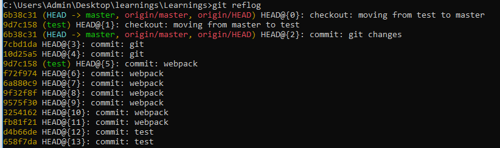
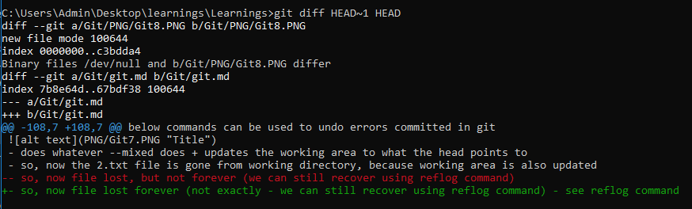
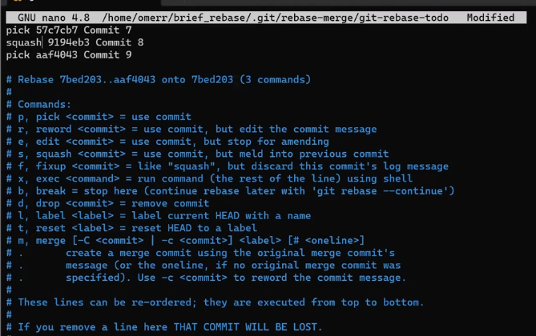
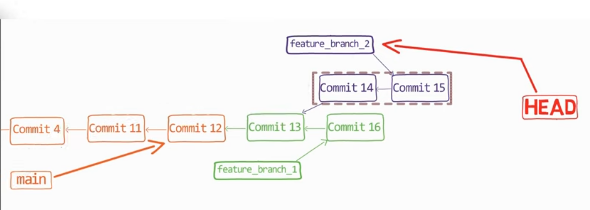
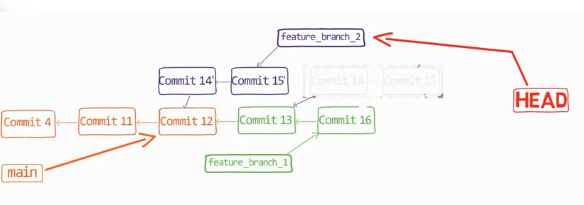
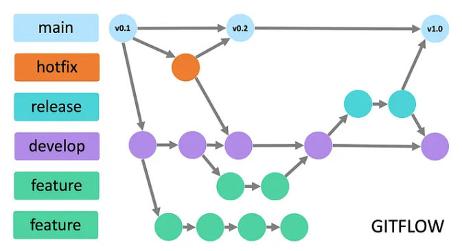

# GIT - version controlling system (VCS)
- distributed VCS

## Git objects 
- building blocks of Git’s storage model
- 3 git objects
- each object is identified by it's hash aka SHA1

#### 1. Blob - (Binary large object)
- stores content of file

#### 2. Tree
- similar to directory
- stores reference of blob and other trees

#### 3. Commits
- snapshot of the repository at a point in time.
- Contains - 
1. pointer to a tree
2. pointer to parent commit(s)
3. committer
4. commit message
5. timestamp

  

**What happens when we change content of few files in the subsequent commits?**  
- A new blob is created for each changed file
- The commit object points to new blobs / trees, where as the commit obj, references to same blobs / trees which are unchanged
- thus, each commit refers to entire snaphot of the repo at a given time

- look below, when a new commit is created when contents of Hello world, changes, but other files remain same, (follow SHA1s with red color)
  

## Branch
- it is just a named reference to a commit
- how does git know which branch we are on?
- git uses a special pointer - **HEAD** - to know on which branch / commit we are currently on
- generally **HEAD** points to a branch, but if it points to a specific commit, then we call it as **detached head**
- ```git branch test``` - if we run this command (let's say from main branch), new branch with name test is created, which points to the latest commit of main branch, so both test and main branches point to the same commit, but HEAD is still pointing to main brach
- ```git checkout test``` - now head will point to test branch. so basically this command just moves head
- ```git checkout -b test``` - it is combination of (above 2 commands), created a new brnach test and also points HEAD to test

**SUMMARY - branch is just named reference to a commit, and HEAD is a pointer to a specific branch or commit**

## .git folder structure
  

#### 1. objects - this folder contains all the objs (blob, tree and commits)
- notice how the object's folder is nested like (12 -> AFD389...) - this is for fater searching, the outer folder - 12 is the first 2 digits of SHA1, and the inner folder - is the remaining digits of SHA1 - this makes git faster to search a particualt SHA1

#### 2 - HEAD
- this is just a file - which has contents like - ref: refs/heads/master - tells git where the HEAD is pointed to

#### 3 - refs
- this is a folder, containing files for each brnach - so if we have 2 branches - main and test
- the refs folder will have 2 files main and test, and the contents of each file will be the commit to which a particular branch points to

#### 4 Index
- this is a file which stores metadata of all the files which are to be staged to the next commit
- so it is a snapshot of the current staging area
- once we commit, INDEX file will have contents of the latest commit

## Git areas
1. Working directory - your code editor files
2. Staging / Index area - this files which are now tracked by git, but not yet committed (creating a permanent record)
3. Local repository - collection of commits (changes stored permanenlty in git)
4. Remote repository - on cloud

## Undoing errors in git
below commands can be used to undo errors committed in git
1. reset
2. cherry-pick
3. revert
4. reflog


## 1. Reset command
- used to manipulate git history
- **moves the branch pointer to a given commit, which interns also moves the head pointer**
- useful when you want to manipulat commits on local hostory, but not yet pused to remote repo
- although we can use this command to manipulate remote repo as well, but it is not recommended, we can use revert command instead
- **git reset HEAD~1** - move the bracnh and head pointer to the previous commit, now the local repo is a snapshot of the previos commit, as if the latest commit didn't even happen
- 3 modes in rebase - --soft, --mixed (default), --hard

**scenario for below 3 examples**
1. commit 1 - adds 1.txt
2. commit 2 - add 2.txt

  

**so our head and branch pointer points to commit 2, which interns point to commit 1**
#### E.g. 1 --soft
```git reset HEAD~1 --soft```
  
- now our branch pointer points to commit 1, and since head points to master, it also points to commit 1
- staging area and working directory remains unaffected


#### E.g. 2 --mixed (default), so not required to pass
```git reset HEAD~1 --mixed```
  
- does whatever --soft does + updates the staging area to what the head points to
- so, now the 2.txt file is gone from staging area, because staging area is also updated

#### E.g. 3 --hard 
```git reset HEAD~1 --hard```
  
- does whatever --mixed does + updates the working area to what the head points to
- so, now the 2.txt file is gone from working directory, because working area is also updated
- so, now file lost forever (not exactly - we can still recover using reflog command) - see reflog command

#### When to use which flag
- reset is mainly used to manipulte local repo, not remote repo
- **split commits** - if you already made a commit in local repo, and if you want to create 2 diff commits of the same commit - use ```git reset HEAD~1 --mixed``` - this way, the chnges are now only in working dir, now you can add files one by one and do multiple commits
- **merge 2 different commits to 1** - ```git reset HEAD~2 --soft``` - this way now both commi's changes are present in index, now just run git commit -m "only 1 commit for 2 chnages"
- **modify files of a given commit** - you commited a file, but had typo or some other mistake, and want that change to go in the same commit, or even if you want to change a commit message = ```git reast HEAD~1 --soft``` - now changes are in staging, the last commit is gone, add desired changes to the changed file, run git add ., then git commit -m "changing commit message"
- **latest commit to a diff branch**- you accidently commited the changes to main, but wanted them on feature-branch - git branch feature-branch - by this - now you commit is also present in feature-branch, but you haven't checked out to the feature-branch, so head is still pointingto main brnach, then run ```git reset HEAD~1 --hard``` - acceditently pushed to main is now gone, but still available in feature-branch

## 2. cherry-pick command
- copies the changes from an existing commit and creates a new commit with a new hash on the current branch
- we saw we can use git branch and then git reset --hard if we mistakenly pushed a commit to a undesired branch such as main, but this only works for latest commit, and it the brnach is not created already, but what if we want to pick nth commit from test brnach and add it do dev branch?
- use cherry-pick
```git cherry-pick <SHA1>``` - checkout to dev brnach - do cherry-pick and add SHA1 of the commit which you want to be picked from test, and add to dev
- this will create a new commit on dev branch

## 3. revert command
- rebase is very useful to manipulate git history, but not recommended when the bad commits are already pushed to the remote repo, in that case, we use revert command
- lets say you pushed a commit, and you want to revert all the changes that commit made, then run this command
- this command will create a new commit and will do exact opposiyte chnages of the given commit 
- ```git revert <commit-hash>``` - all the changes intrduced by coomit-hash will get reversed using this command

## 4. reflog
- we did ```git reset --hard HEAD~1``` - all changes made lost forever (not exctly)
- git by default stores wherever the head has moved
- so when we run git reflog we get all the commits which HEAD had pointed to, even if the commits are not reachable from any branch
- so using this command, get the commit which was lost because of --hard, and then run
- ```git reset --hard <SHA1>``` here SHA1 is the commit of the lost changes, which we need

  -
see how ```git reflog``` - gives all the commits to which the head was pointed to, along with the commit message, so if you know the commit message which, in which the files were present, get the commit id and run ```reset --hard <SHA1>```  
- notice in the git reflog response, how we also know from git reflog, thet which branches we have swtiched in the past, since checking out a brnach also moves head
- the data in reflog will be available only till certain days - 
- 90 days -if the commit is rechable
- 30 days if the commit is not reachable

## Diff and patch
- diff - git uses some alog to compute diff between 2 commits / files / string
- patch - extension of diff, such that by reading patch file, git excalty knows who to get to a particular version of a file by reading patch

  -
- when we run ```git diff HEAD~1 HEAD``` - it gives the excat changes the last commit had pushed  
- oberve the output - the imp part is patch head (everythign between to @@)
- this tells git that starting from line 108 in file from prev version, 7 lines got changed (inclusing context lines), and in new versio of the file - staring from line 108, 7 lines got changed
- --- means lines removed in newer version
- +++ lines added in new version
- all other lines not having + or - are called context lines, git references these lines to know where excatly the changes are done
- when we run ```git diff HEAD~1 HEAD > my-patch.patch``` - git copies the output of git diff and stores in in my-patch.patch file, later we can apply this patch using ```git apply my-patch.patch```
- summary - **patch is a text file that represents the differences (changes) between two versions of code.**, so git can ready this file and can apply changes

## Merge
- When we say we are merging 2 branches, we are acutally merging 2 commits of the branches where the respective branches point to
- **3 way merge**
- 1. git finds the common commit between the 2 branches - it is called as base-commit
- 2. git calculates diff between branch-1 pointer and base-commit (patch 1) as well as bracnh-2 pointer and base-commit (patch 2)
- 3. git then apply both the patches to the brnach on which merge is performed
- **merge commits** - once all the patches are applied, git run the commit for us, which is called as merge-commit, and it has pointer to both the commits of the 2 branches
- so merge commits has 2 parents, thats how git know that this is a merge commit

### Merge cases
#### 1. fast forward
- when you create a brnach from main, push commits and then merge it back to main, if main branch has not changes, git does fast-forward and branches are merged
#### 2. diverged branched
- if main brach is updated with new commits, git will still merge your brnach if there are no conflicts
- even if the common file is changed in both the branches, git can still auto merge as long as context lines are not conflicting as we discussed in diff and patch section
#### 3. conflicts
- if conflicts occur, if multiple devs change same file, which have common context lines (i.e. same line numbers changed), git ask users to manually resolve the conflicts

## Rebase
- it re-writes history
- if you are on main branch and run ```git rebase dev```
1. git finds the merge-base commit of both the branched
2. replays all the commits from merge-base upto main branch pointer into branch dev
3. move current branch pointer (main) to the last replayed commit 

**before rebase**
A---B---C (dev)
     \
      D---E (main)

run ```git rebase dev```

**after rebase**
A---B---C (dev)
         \
          D'---E' (main)

**Why to rebase?** - to make history clean, using interactive rebase
e.g. - on dev you pushed 5 commits, but those should be part of a single commit
- then we can do interactive rebase  
```git rebase -i dev``` - 
  -
- git will open editor and from the merge-base, all the commits that are going to be replayed, git will allow us the option to pick, drop or squash for each of the commit
- pick - picks the commit, drop - git will not replay that commit, squash -git will merge that commit to it's parent commit, so only one commit will be shown in the history

- **remember in the project Estore - I pushed all trial and error commits in dev branch to fix a P1 issue, by bypassing the branch policy and directly commiting to dev, meanwhile, all other devs pushed there commits, and once the issue was identified, I did an interactive rebase and removed (drop) all my trial and error commits, and kept all the other dev's commits**  
- **had to do interactive rebase - because my commits were above and below of other dev's changes**

**Scenario** - 
  -
you created a brnach from feature-brnach_1, but actually wanted to create it from main, you already have multiple commits on your new brnach (feature_branch_2), and feature-branch_1 from which you created the brnach was already ahead of the main branch.
-- now after 10 days, you want your feature-brnach_2 to have been created from main branch (Commit 12 and not commit 13)  

- switch to feature-branch_2
- run ```git rebase --onto main <SHA1 of commit-13>```
- this command will replay all the commits of feature-branch-2 (commit 13 and 14) on the main brnach commit (commit 12) 

**desired result** - 
  -

- syntax of rebase --onto - 
- ```git rebase --onto <new -parent-of commits to be replaced> <old-parent of commits to be replaced>```

## Fork
- in open source projects, no one apart from mainteainers will have access to the repo, because not feasible to give thousands of user write access to the open source repo, but people still need to contribute, in that case fork is used
- A fork is your own copy of someone else’s repo **under your account**. - so now you have full access to the repo under your account
- when you fork, a link is generated between the 2 repo's (original repo, and repo under your account)
- repo under your account is nothing but a clone, with a link to parent repo
- note- you still need to clone the forked repo, to bring the repo to your machine
- you make changes and create a PR against the original repo, where maintainers can approve, and your changes would be merged

## Branching strategies
1. Gitflow
2. Github flow
3. Trunk based development

### 1. Git flow

- **feature branch** - multiple - allow multiple features to be developed parallely
- **develop branch** - The integration branch. All new features are merged here before moving to a release. (deployed to dev)
- **release branch** - when a set of features is ready for release, a release brnach from the dev is created, this brnach is then deployed to an env (lets's say tst), where testers test the app for 1-2 sprints and raise any bugs. If bugs are found, then small lived brnaches are created from release brnach and fixes are applied. Once app is stable in tst, the release branch is merged to both main and dev brnach (merged in dev, so that the fixes are available in dev as well). Also other devs can still work on their individual feature brnaches for the features that will be deployed in the future release
- **hotfix brnach** - the only branch that can be created directly from main and merged to main, to fix P1 issues
- **main branch** - The production branch. Every commit here represents a deployed version. Versions are tagged (v1.0, v1.1,…).

**usecase -** big team, long release cycles

### 3. Trunk based development
- **main / trunk branch** - the only long lived branch
- **feature / bugix** - all branches created from main brnach and are very short lived, changes merged daily to main.
- **IMP** - if feature is not fully developed, how can I commit to trunk / main? Using feature toggles
- **feature toggles** - even if feature is still being developed, we use feature toggles, so that the code does not tun in prod
- **build run on each brnach** - run build on each branch so we now the build is green and code can be merged to main, because the incomplete feature is not breaking anything during build

**usecase -** small team, short release cycles, np long PRs, since changes are daily merged to main

## Git worktrees (work on multiple bracnhes at the same time, now popluar because AI agents can parallely work on diff branches)
- Need to change branch inbetween current work
- git does not allow switching branch unless current working tree is clean
- need to commit changes anyhow (not a good practice), or stash the changes
- stash is good, but with AI into the picture, when we stash, we can at a time work on only one brnach
- we know how slow claude is, so can't run these AI agents on multiple branches at once
- **solution - use git worktrees - let you check out multiple branches of the same repository into different directories at the same time.**

#### working of git worktrees
- when you create a new git worktree - it created new directory in your local computer
- with the branch you specify while creating the worktree
- so multiple folders of same repo on local, allowing you run work on diff branches simultaneously
- this is not a clone, if you still do git fetch in any of the worktree, all the worktrees are updated
- so you cd to the newly created folder and start working and comitting the changes

#### Commands
- Create a new worktree (existing branch)
  ```git worktree add ../feature-branch feature-branch``` - ../feature-branch is the destination folder in your comp, where this code will be downloaded

- Create a new worktree (new branch)
  ```git worktree add -b feature-branch ../feature-branch```

- List all worktrees
  ```git worktree list```

- Remove a worktree
  ```git worktree remove ../feature-branch```

- Clean up stale worktrees
  ```git worktree prune```

- download only bare repo - by default, when you clone, the latest commit of default brnach of the rpo is downloaded in your comp
- if we don't want the code base to be downloaded on local, and if we only work work on worktrees, the use below command 
  ```git clone <repo-url> --bare .git``` 
  - this will only download the .git folder
  - from hereon, you can create worktress and work on the desired branches