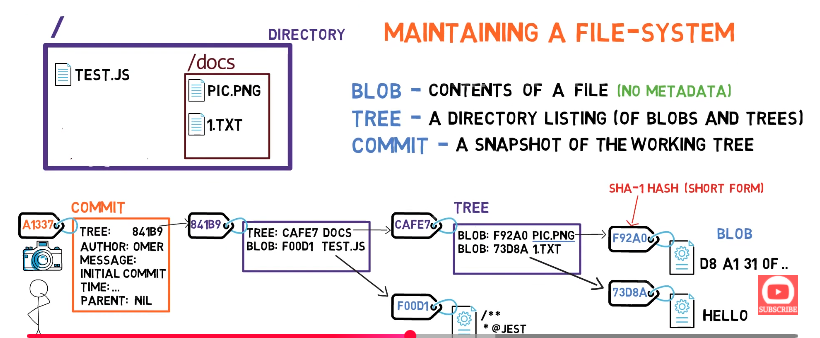
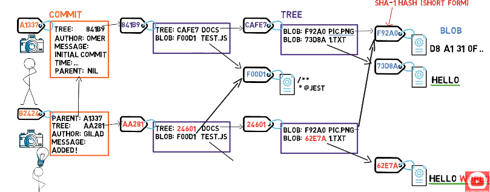
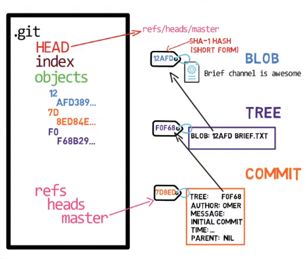
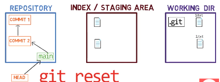
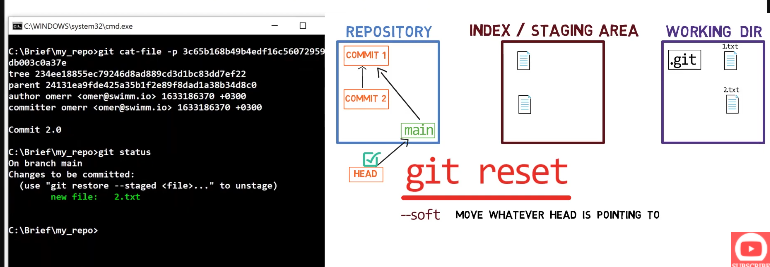
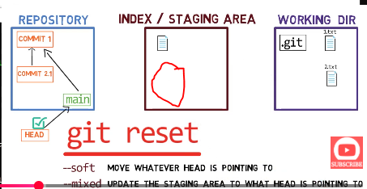
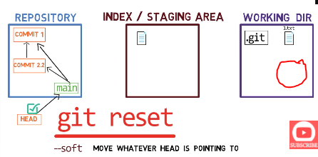

# GIT - version controlling system (VCS)
- distributed VCS

## Git objects 
- building blocks of Git’s storage model
- 3 git objects
- each object is identified by it's hash aka SHA1

#### 1. Blob - (Binary large object)
- stores content of file

#### 2. Tree
- similar to directory
- stores reference of blob and other trees

#### 3. Commits
- snapshot of the repository at a point in time.
- Contains - 
1. pointer to a tree
2. pointer to parent commit(s)
3. committer
4. commit message
5. timestamp

  

**What happens when we change content of few files in the subsequent commits?**  
- A new blob is created for each changed file
- The commit object points to new blobs / trees, where as the commit obj, references to same blobs / trees which are unchanged
- thus, each commit refers to entire snaphot of the repo at a given time

- look below, when a new commit is created when contents of Hello world, changes, but other files remain same, (follow SHA1s with red color)
  

## Branch
- it is just a named reference to a commit
- how does git know which branch we are on?
- git uses a special pointer - **HEAD** - to know on which branch / commit we are currently on
- generally **HEAD** points to a branch, but if it points to a specific commit, then we call it as **detached head**
- ```git branch test``` - if we run this command (let's say from main branch), new branch with name test is created, which points to the latest commit of main branch, so both test and main branches point to the same commit, but HEAD is still pointing to main brach
- ```git checkout test``` - now head will point to test branch. so basically this command just moves head
- ```git checkout -b test``` - it is combination of (above 2 commands), created a new brnach test and also points HEAD to test

**SUMMARY - branch is just named reference to a commit, and HEAD is a pointer to a specific branch or commit**

## .git folder structure
  

#### 1. objects - this folder contains all the objs (blob, tree and commits)
- notice how the object's folder is nested like (12 -> AFD389...) - this is for fater searching, the outer folder - 12 is the first 2 digits of SHA1, and the inner folder - is the remaining digits of SHA1 - this makes git faster to search a particualt SHA1

#### 2 - HEAD
- this is just a file - which has contents like - ref: refs/heads/master - tells git where the HEAD is pointed to

#### 3 - refs
- this is a folder, containing files for each brnach - so if we have 2 branches - main and test
- the refs folder will have 2 files main and test, and the contents of each file will be the commit to which a particular branch points to

#### 4 Index
- this is a file which stores metadata of all the files which are to be staged to the next commit
- so it is a snapshot of the current staging area
- once we commit, INDEX file will have contents of the latest commit

## Git areas
1. Working directory - your code editor files
2. Staging / Index area - this files which are now tracked by git, but not yet committed (creating a permanent record)
3. Local repository - collection of commits (changes stored permanenlty in git)
4. Remote repository - on cloud

## Undoing errors in git
below commands can be used to undo errors committed in git
1. reset
2. cherry-pick
3. revert
4. reflog


## 1. Reset command
- used to manipulate git history
- **moves the branch pointer to a given commit, which interns also moves the head pointer**
- useful when you want to manipulat commits on local hostory, but not yet pused to remote repo
- although we can use this command to manipulate remote repo as well, but it is not recommended, we can use revert command instead
- **git reset HEAD~1** - move the bracnh and head pointer to the previous commit, now the local repo is a snapshot of the previos commit, as if the latest commit didn't even happen
- 3 modes in rebase - --soft, --mixed (default), --hard

**scenario for below 3 examples**
1. commit 1 - adds 1.txt
2. commit 2 - add 2.txt

  

**so our head and branch pointer points to commit 2, which interns point to commit 1**
#### E.g. 1 --soft
```git reset HEAD~1 --soft```
  
- now our branch pointer points to commit 1, and since head points to master, it also points to commit 1
- staging area and working directory remains unaffected


#### E.g. 2 --mixed (default), so not required to pass
```git reset HEAD~1 --mixed```
  
- does whatever --soft does + updates the staging area to what the head points to
- so, now the 2.txt file is gone from staging area, because staging area is also updated

#### E.g. 3 --hard 
```git reset HEAD~1 --hard```
  
- does whatever --mixed does + updates the working area to what the head points to
- so, now the 2.txt file is gone from working directory, because working area is also updated
- so, now file lost, but not forever (we can still recover using reflog command)

#### When to use which flag
- reset is mainly used to manipulte local repo, not remote repo
- **split commits** - if you already made a commit in local repo, and if you want to create 2 diff commits of the same commit - use ```git reset HEAD~1 --mixed``` - this way, the chnges are now only in working dir, now you can add files one by one and do multiple commits
- **merge 2 different commits to 1** - ```git reset HEAD~2 --soft``` - this way now both commi's changes are present in index, now just run git commit -m "only 1 commit for 2 chnages"
- **modify files of a given commit** - you commited a file, but had typo or some other mistake, and want that change to go in the same commit, or even if you want to change a commit message = ```git reast HEAD~1 --soft``` - now changes are in staging, the last commit is gone, add desired changes to the changed file, run git add ., then git commit -m "changing commit message"
- **latest commit to a diff branch**- you accidently commited the changes to main, but wanted them on feature-branch - git branch feature-branch - by this - now you commit is also present in feature-branch, but you haven't checked out to the feature-branch, so head is still pointingto main brnach, then run ```git reset HEAD~1 --hard``` - acceditently pushed to main is now gone, but still available in feature-branch

## 2. cherry-pick command
- copies the changes from an existing commit and creates a new commit with a new hash on the current branch
- we saw we can use git branch and then git reset --hard if we mistakenly pushed a commit to a undesired branch such as main, but this only works for latest commit, and it the brnach is not created already, but what if we want to pick nth commit from test brnach and add it do dev branch?
- use cherry-pick
```git cherry-pick <SHA1>``` - checkout to dev brnach - do cherry-pick and add SHA1 of the commit which you want to be picked from test, and add to dev
- this will create a new commit on dev branch

## 3. revert command
- rebase is very useful to manipulate git history, but not recommended when the bad commits are already pushed to the remote repo, in that case, we use revert command
- lets say you pushed a commit, and you want to revert all the changes that commit made, then run this command
- this command will create a new commit and will do exact opposiyte chnages of the given commit 
- ```git revert <commit-hash>``` - all the changes intrduced by coomit-hash will get reversed using this command

## 4. reflog
