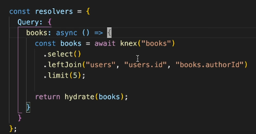

# GraphQL - query language for API

## GraphQL

### GraphQL vs REST Comparison Table

| Feature            | GraphQL                                                                                                                                                                            | REST                                                                                                                                                    |
| ------------------ | ---------------------------------------------------------------------------------------------------------------------------------------------------------------------------------- | ------------------------------------------------------------------------------------------------------------------------------------------------------- |
| **API Structure**  | Single endpoint (`/graphql`) for all queries.                                                                                                                                      | Multiple endpoints for different resources (`/users`, `/posts`, etc.).                                                                                  |
| **Data Fetching**  | Fetches only the data you request.                                                                                                                                                 | Fetches fixed data based on the endpoint, often leading to over-fetching or under-fetching.                                                             |
| **Versioning**     | No need for versioning (clients control the data).                                                                                                                                 | Typically requires versioning (`/v1/users`, `/v2/users`).                                                                                               |
| **Over-fetching**  | No over-fetching (exact data specified).                                                                                                                                           | Possible over-fetching due to fixed endpoints and responses.                                                                                            |
| **Under-fetching** | No under-fetching (all needed fields in one query).                                                                                                                                | Can lead to under-fetching, requiring multiple requests.                                                                                                |
| **Flexibility**    | Highly flexible, query exactly what you need.                                                                                                                                      | Less flexible, responses are tied to predefined endpoints.                                                                                              |
| **Error Handling** | Single response with detailed errors.                                                                                                                                              | HTTP status codes for errors; errors spread across multiple endpoints.                                                                                  |
| **Type System**    | Strongly typed with a schema.                                                                                                                                                      | No built-in type system, dependent on server implementation.                                                                                            |
| **Tooling**        | Rich tooling (GraphiQL, Apollo DevTools).                                                                                                                                          | Tools like Postman, but generally less interactive.                                                                                                     |
| **Caching**        | No Native caching support from GraphQL, need to implement caching solutions in GraphQL                                                                                             | For REST APIs caching is easy due to its native integration with the HTTP protocol and standardized caching mechanisms, like using ETAG headers and all |
| **Usecase**        | When data is to be fetched from multiple DB sources, since each datafield will have a resolver, and each resolver can fetch data from different DB source, making the code modular | simple CRUD operations                                                                                                                                  |

## Client queires

## Client queries in javascript

## Pagination

## Infamous N+1 problem (see resolver.js to understand the problem)

#### 1. Use dataloader library

Data loader will batch multiple Ids and make only one query to DB.  
This doesn't happen automatically, we have to write the in condition in the query, only thing is dataloader will send us the array of ids, instead of sending them one by one

**STEP - 1 Implement batch loading function**

```javascript
const DataLoader = require("dataloader");
// Batch loading function
async function batchAuthors(authorIds) {
  // Fetch authors in a single query, using the provided list of author IDs
  const authors = await db.author.find({ where: { id: { in: authorIds } } });
  // Map each authorId to the respective author object
  const authorMap = authors.reduce((map, author) => {
    map[author.id] = author;
    return map;
  }, {});
  // Return authors in the same order as requested by DataLoader
  return authorIds.map((id) => authorMap[id]);
}
// Create the DataLoader instance
const authorLoader = new DataLoader(batchAuthors);
```

**STEP - 2 Pass dataloader object as context in gql**

```javascript
const server = new ApolloServer({
  typeDefs,
  resolvers,
  context: () => ({
    authorLoader,
  }),
});
```

**Step - 3 Use data loader in the resolvers**

```javascript
const resolvers = {
  Post: {
    author: (post, args, context) => {
      // Use the DataLoader to fetch the author for this post
      return context.authorLoader.load(post.authorId);
    },
  },
};
```

**But still using auth loader, we are making 2 DB calls, 1 to get books and second to get list of authors, to avoid this use below solutions**

#### 2. Have a join condition at the parent resolver



The join condition in the parent resolver will gets all data from DB, inclduing data required by child resolvers, so that in child resolver
does not make DB call, instead uses the parent arg.
**Issues with using joins** -

1. Joins will only work if different tables are in the same DB and not in different DBs (which is the case 99% of time)
2. overfetching data, what if the clint query does not have nested objects, still we are trigrring joins

#### 3. conditional-joins


**doesPathExist is a custom function to check if the client is looking for nested queries**

the resolver gets 4 args (parentArgs, ownArgs, context, info)
context - an object shared by all resolvers in a specific execution. It's used to store information such as: Authorization information, Database connection information,
info arg - this has the information related to what query the client has made
info.fieldNodes - will give all the feilds the user has request for
based on this field, we can decide if we want to use join in the parent resolver or not
