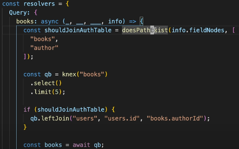
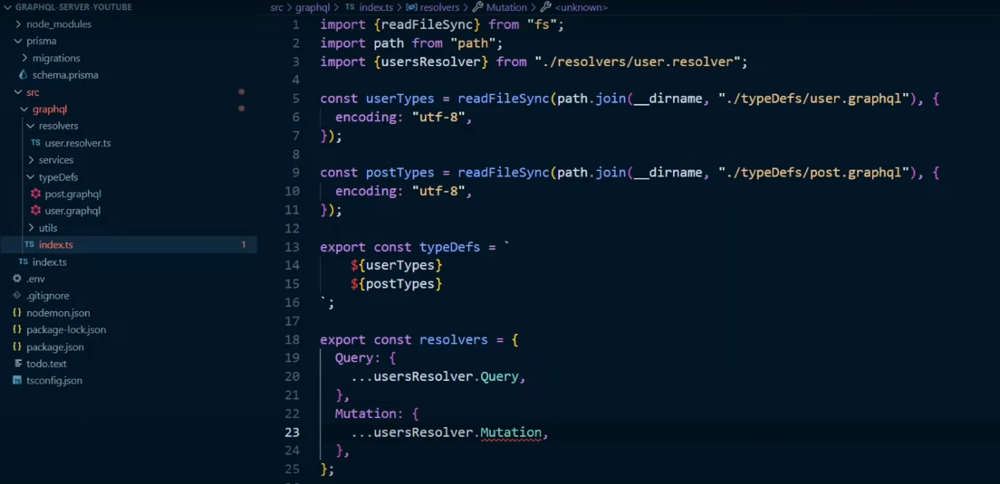

# GraphQL - query language for API

### GraphQL vs REST Comparison Table

| Feature            | GraphQL                                                                                                                                                                            | REST                                                                                                                                                    |
| ------------------ | ---------------------------------------------------------------------------------------------------------------------------------------------------------------------------------- | ------------------------------------------------------------------------------------------------------------------------------------------------------- |
| **API Structure**  | Single endpoint (`/graphql`) for all queries.                                                                                                                                      | Multiple endpoints for different resources (`/users`, `/posts`, etc.).                                                                                  |
| **Data Fetching**  | Fetches only the data you request.                                                                                                                                                 | Fetches fixed data based on the endpoint, often leading to over-fetching or under-fetching.                                                             |
| **Versioning**     | No need for versioning (clients control the data).                                                                                                                                 | Typically requires versioning (`/v1/users`, `/v2/users`).                                                                                               |
| **Over-fetching**  | No over-fetching (exact data specified).                                                                                                                                           | Possible over-fetching due to fixed endpoints and responses.                                                                                            |
| **Under-fetching** | No under-fetching (all needed fields in one query).                                                                                                                                | Can lead to under-fetching, requiring multiple requests.                                                                                                |
| **Flexibility**    | Highly flexible, query exactly what you need.                                                                                                                                      | Less flexible, responses are tied to predefined endpoints.                                                                                              |
| **Error Handling** | Single response with detailed errors.                                                                                                                                              | HTTP status codes for errors; errors spread across multiple endpoints.                                                                                  |
| **Type System**    | Strongly typed with a schema.                                                                                                                                                      | No built-in type system, dependent on server implementation.                                                                                            |
| **Tooling**        | Rich tooling (GraphiQL, Apollo DevTools).                                                                                                                                          | Tools like Postman, but generally less interactive.                                                                                                     |
| **Caching**        | No Native caching support from GraphQL, need to implement caching solutions in GraphQL                                                                                             | For REST APIs caching is easy due to its native integration with the HTTP protocol and standardized caching mechanisms, like using ETAG headers and all |
| **Usecase**        | When data is to be fetched from multiple DB sources, since each datafield will have a resolver, and each resolver can fetch data from different DB source, making the code modular | simple CRUD operations                                                                                                                                  |

## Apollo server (see graphql-server)

### 1. Authentication

#### Using middlewares (context object)

While creating gql server using Apollo server, we can app another objct **context**, besides typeDef and resolvers

```javascript
const server = new ApolloServer({
  typeDefs,
  resolvers,
  plugins: [ApolloServerPluginDrainHttpServer({ httpServer })],
  // similar to express middlewares, context has access to request, response
  context: ({ req, res }) => {
    const token = req.headers.authorization || "";
    const user = getUserFromToken(token);
    return {
      user,
      getUserById: (id) => db.users.find((user) => user.id === id),
    };
  },
  // now every resolver will have context.user - which will have logged in user value
  // 1 catch here - context is applied to all the resolvers, we cannot create resolver specific contexts
  // hence no flexibility to create route based middlewares, as we had in express
  // so, we should not throw error in the context
  // any validation of user, we need to do that in the resolvers (see below)
});

// Resolver will have to  decide whether to throw error or not
const resolvers = {
  Query: {
    sensitiveData: (parent, args, context) => {
      // This resolver uses context data (e.g., user authentication)
      if (!context.user) {
        throw new AuthenticationError("You must be logged in!");
      }
      return getSensitiveData();
    },
    publicData: (parent, args) => {
      // This resolver doesn't need context
      return getPublicData();
    },
  },
};
```

**But before we can use the jwt token in the auth header, we need to login the user and generate the JWT token**

```javascript
type mutation {
  signInUser(user: UserInput): String
}
input UserInput {
  userName: String!
  password: String!
}

// create resolver
signInUser: (_, args) => {

  let user = db.collectionName.find({userName: args.userName})
  if(!user) throw new Error("user does not exists")
  // write code to comapre password
  // then use jwt to create token
  let token = jwt.sign({user}, SECRET_KEY;
    return token;
  )
}

// client query
// pass appropriate user variable
mutation signIn($user: UserInput!) {
  signInUser(user: $user) // this will return token
}
// but this is gql query
// how to pass token for all the gql queries as headers in client side?
// see Client queries section below
```

#### Implementing headers in gql-server resolvers

As we saw that we can get access to request object, in context, we can also get response object and we can set custom headers

```javascript
const server = new ApolloServer({
  typeDefs,
  resolvers,
  context: ({ req, res }) => {
    // VVIP - Make sure to return the `res` object to be accessible in resolvers
    // we can set headers here as well res.setHeader('X-First-Header', 'FirstValue')
    // but this will be applied to all resolver's response
    // instead just return req, and res to the resolvers, and inside resolvers
    // set headers based on resolver's usecase
    return { req, res };
  },
});

// resolver
const resolvers = {
  Query: {
    first: (parent, args, context) => {
      // Set a custom header for this resolver
      context.res.setHeader("X-First-Header", "FirstValue");
      return "First Resolver Response";
    },
    second: (parent, args, context) => {
      // Set a different custom header for this resolver
      context.res.setHeader("X-Second-Header", "SecondValue");
      return "Second Resolver Response";
    },
  },
};
```

### 2. Pagination

Two ways to achieve -

###### 1. limit and offset - similar to traditional SQL LIMIT and OFFSET

```graphql
#schema
type Query {
  books(limit: Int, offset: Int): [Book]
}
type Book {
  id: ID!
  title: String!
  author: String!
}

#resolver
const resolvers = {
  Query: {
    books: (_, { limit, offset }) => {
      return books.slice(offset, offset + limit); // Assuming 'books' is an array of book data
    },
  },
};

# client query
query {
  books(limit: 5, offset: 10) {
    id
    title
    author
  }
}
```

This approcah is inefficient if dataset is larger in size.

###### 2. using curosrs (efficient for larger data sets)

To implement cursor based pagination, the most important part to understand is designign the schema
Whichever type needs to be paginated, create schema in below format

```graphql
# for that entity create edges which would include
# edges and pageinfo
# edges will include 1. cursor and 2. node
# 1. cursor - someId which indicates, where the cursor position (it can be an autoincrement field from DB)
# 2. node - array of actual data that is supposed to be returned to client
# pageInfo to have hasNextPage, hasPrevioudPage like metadata about the page
type BookConnection {
  edges: [BookEdge]
  pageInfo: PageInfo
}

type BookEdge {
  cursor: String
  node: Book
}

type Book {
  id: ID!
  title: String!
  author: String!
}

type PageInfo {
  hasNextPage: Boolean!
  endCursor: String!
}

# the resolver must return the connection object which has the necessary fields for client for iteration
type Query {
  books(first: Int, after: String): BookConnection
}
# this pagination schema is industry standard, github also uses this pattern
```

Then create resolver which returns the ConnectionType we created above (in this case BookConnection)

```javascript
const resolvers = {
  Query: {
    books: (_, { first, after }) => {
      const startIndex = after
        ? books.findIndex((book) => book.id === after) + 1
        : 0;
      const paginatedBooks = books.slice(startIndex, startIndex + first);

      return {
        edges: paginatedBooks.map((book) => ({
          cursor: book.id, // Use the book's ID as the cursor
          // in real life from SQL use windowfunction for cursor
          // ROW_NUMBER() OVER (ORDER BY createdAt) AS cursor  -- Generating the cursor based on 'createdAt'
          node: book,
        })),
        pageInfo: {
          hasNextPage: startIndex + first < books.length,
          endCursor: paginatedBooks.length
            ? paginatedBooks[paginatedBooks.length - 1].id
            : null,
        },
      };
    },
  },
};

// client query
query {
  books(first: 5, after: "10") {
    edges {
      cursor
      node {
        id
        title
      }
    }
    pageInfo {
      hasNextPage
      endCursor
    }
  }
}

```

**Limit-Offest vs Cursor based pagination**  
| **Aspect** | **Limit-Offset Pagination** | **Cursor-Based Pagination** |
|---------------------------------------|-------------------------------------------------------------------|-----------------------------------------------------------|
| **Performance** | Needs to iterate over rows and may result in a full-table scan | Uses `WHERE` query to skip unwanted rows, more efficient |
| **Jumping to Any Page** | Allows jumping to any page (e.g., page 3, page 10) | Can only navigate to the next or previous page |
| **Handling Data Changes** | Can lead to inconsistent data when rows are added/removed | Consistent as it uses a stable cursor (like ID or timestamp)|
| **SQL** | `SELECT * FROM books LIMIT 10 OFFSET 1000;` | `SELECT * FROM books WHERE id > 'last_cursor' LIMIT 10;` |

## Client queires

How to create client queries is coverd as comments section in resolver.js file which includes

## Client queries in React using apollo-client

### 1. Initialize Apolloclient

`npm install @apollo/client graphql`

```javascript
import * as ReactDOM from "react-dom/client";
import { ApolloClient, InMemoryCache, ApolloProvider } from "@apollo/client";
import App from "./App";
// Create new apollo client
// this is similar to creating context
const client = new ApolloClient({
  // for client side apps, to setup env variables
  // we need to use .env (for dev) .env.production file (for prod)
  // for VITE apps, we need to prefix them VITE_, for react prefix with REACT_APP_
  // as opposed to node, no need to use dotenv package
  // IMP - these env variables are injected at the build time of the app and not at runtime as opposed to in nodejs
  // so this data would be available in the browser, only store config vars liek urls, don't store any secrets
  uri: import.meta.env.VITE_GRAPHQL_URL, // see syntx it is import.meta.env
  cache: new InMemoryCache(), // Apollo Client uses this to cache query results after fetching them
  headers: {
    // this is where we set the auth headers, for each gql query
    // this header would be availale in context middleware function of the gql
    authorization:
      localStorage.getItem("token") || "dummy token from ui client",
  },
  // there are some disadvantages of setting headers like this
  // 1. these header are available for all queries, even if some queries don't require it
  // 2. You now CANNOT change the headers for individual gql queries
  // instead use Apollo link middleware (see below)
});
const root = ReactDOM.createRoot(document.getElementById("root"));
root.render(
  <ApolloProvider client={client}>
    <App />
  </ApolloProvider>
);
```

**Apollo link middleware** -

```javascript
import { ApolloClient, InMemoryCache, HttpLink } from "@apollo/client";
import { setContext } from "@apollo/client/link/context";
const httpLink = new HttpLink({
  uri: import.meta.env.VITE_GRAPHQL_URL, // Set the GraphQL URI
});
const authLink = setContext((request, previousContext) => {
  // Dynamically get the token or other headers
  const token = localStorage.getItem("token") || "dummy token from ui client";
  // Check the request and customize headers accordingly
  // this is where we are dynamicallt setting the headers
  // based on qhich gql query is getting executed
  // this cannot be done if we firect set the headers
  if (request.operationName === "GetUserProfile") {
    // You can set a different token for specific operations, for example:
    const specialToken = "specialTokenForProfileQueries";
    return {
      headers: {
        ...previousContext.headers,
        authorization: `Bearer ${specialToken}`,
      },
    };
  }
  // For all other operations, use the regular token
  return {
    headers: {
      ...previousContext.headers, // Include any existing headers
      authorization: token ? `Bearer ${token}` : "",
    },
  };
});
const client = new ApolloClient({
  // if we are using link component from apollo
  // the url should be added in the HTTPLink component
  // we cannot add directly here as we did in above case
  link: authLink.concat(httpLink), // Combine authLink and httpLink
  cache: new InMemoryCache(),
});
```

### 2. useQuery hook from apollo client

**We don't have to use apollo client to fetch the queries, we can use fetch api, since gql is based on http**

##### 1. Method 1 - using fetch api

```javascript
useEffect(() => {
  fetch("http://localhost:4000", {
    method: "post", // note we are sending fetch request
    headers: {
      "Content-Type": "application/json", // we can pass custom headers, also we can pass auth headers
      // these headers can be extracted in the context function of apollo server
    },
    body: JSON.stringify({
      query: `
        query getUserById($userid: ID!) {
          user(_id: $userid) {
            _id
            firstName
            lastName
            email
          }
        }
      `,
      variables: {
        userid: "6190eb4163f4427a2b17d155",
      },
    }),
  })
    .then((res) => res.json())
    .then((data) => console.log(data));
});
```

**Then why to use apollo client**

1. Write more cleaner code
2. Apollo leverages caching by default, similar to react-query tanstack, so caching we get by default

```javascript
import { useQuery, gql } from "@apollo/client";

// React component which makes gql API call using useQuery hook
function DisplayBooks() {
  // useQuery needs 1 arg, the gqlQuery
  // this hooks is pretty much similar to useQuery from tanstack
  const { loading, error, data } = useQuery(GET_BOOKS);

  if (loading) return <p>Loading...</p>;
  if (error) return <p>Error : {error.message}</p>;
  return data.books.map(({ id, title, author }) => <div></div>);
}
const GET_BOOKS = gql`
  query GetBooks {
    books {
      id
      title
      author
    }
  }
`;
// now we can use the DisplayBook component in any component
function App() {
  return (
    <>
      Books Data
      <DisplayBooks />
    </>
  );
}
```

### 3. useMutation hook from apollo client

```javascript
// ADD_BOOK gql query
import { gql } from "@apollo/client";
export const ADD_BOOK = gql`
  mutation ADD_BOOK($input: BookInput!) {
    bookData: addBook(input: $input)
    # note that we are adding alias to the addBook function
    # this alias would rename fields in the response
    # normally whatever data is returned by resolver runned for this
    # the data is an object and key of that obj is the funcion name (in thia case addbook)
    # see below where these alias is used in the component
  }
`;

const AddBooks = () => {
  // useMutation needs 2 args
  // 1. the gql query
  // 2. optional obj
  const [addBook, { data, loading, error }] = useMutation(ADD_BOOK, {
    // in this optional object
    // all the listed queries would be refetched
    // remember apollo client by default catches the quereis, so any mutation won't get reflected immedaitely
    refetchQueries: [
      { query: GET_BOOKS }, // Refetch this query after this mutation is completed
      { query: GET_BOOK_BY_ID, variables: { id: 1 } }, // You can refetch with variables too
    ],
  });
  // but it returns an array of 2 objs, useQuery just returned 1 obj
  // the frst elem of returned array from useMutate is a funcition
  // this function we need to call whenever we need to call the gqlQuery (in this case ADD_BOOK)
  if (loading) return <p>Loading...</p>;
  if (error) return <p>Error : {error.message}</p>;
  const addBookHandler = () => {
    // notice, here we are calling the first array elem returned by useMutation hook
    // in this function, we need to paas the variables object
    // which would be required for the gql query (in this case ADD_BOOK)
    addBook({
      variables: {
        input: {
          author: "ABC",
          price: 200,
          title: "TEST",
        },
      },
    });
  };

  // notice in the redner we are rendring data?.bookData
  // we get this property bookData becuase we use alias above in the gql query
  return (
    <div>
      <button onClick={addBookHandler}>AddBook</button>
      <p>Response from server - {data?.bookData}</p>
    </div>
  );
};
```

### 4. useLazyQuery

1. **useQuery** - the gql query will get fired whenever the component is loaded / rendered
2. **useMutation** - used for mutation gql queries, The query will not run until you explicitly call the function returned by useMutation.
3. **useLazyQuery** - used ofr normal fetch gql queries The query will not run until you explicitly call the function returned by useLazyQuery.

```javascript
const UserComponent = () => {
  // the GET_USER gql query would get called only when we call the getUser function
  // used when we want to call a query on some event handler
  const [getUser, { loading, data, error }] = useLazyQuery(GET_USER);
  const handleFetchUser = () => {
    getUser({ variables: { id: "1" } }); // Trigger the query with variables
  };
};
```

#### Error handling at client side

Similar to link apollo middleware, we can use error middleware

```javascript
import { ApolloClient, HttpLink, InMemoryCache, from } from "@apollo/client";
import { onError } from "@apollo/client/link/error";
// errors in gql can be of 2 types, gqlErrors and network errors
const errorLink = onError(({ graphQLErrors, networkError }) => {
  if (graphQLErrors)
    graphQLErrors.forEach(({ message, locations, path }) =>
      console.log(
        `[GraphQL error]: Message: ${message}, Location: ${locations}, Path: ${path}`
      )
    );
  if (networkError) console.error(`[Network error]: ${networkError}`);
});
const httpLink = new HttpLink({ uri: "http://localhost:4000/graphql" });
const client = new ApolloClient({
  cache: new InMemoryCache(),
  link: from([errorLink, httpLink]),
});

// mainly this error middleware is used for logging
// to update the UI, we can use the error object returned from useQuery / useMutation hooks
```

## Caching

### 1. Caching in Apollo Client

In Apollo Client, the default cache behavior is to cache results indefinitely, meaning they will persist in the cache until they are explicitly removed or the cache is reset.

Also there is no option to set the cache expire time, like we have in useQuery hook from tankstack, we can provide cache-time / stale-time, no such config option available in apollo-client

**Cache policy in apollo client** -

| Fetch Policy              | Description                                                                       |
| ------------------------- | --------------------------------------------------------------------------------- |
| **cache-first (Default)** | Returns cached data if available; otherwise, it fetches from the server.          |
| **network-only**          | Always fetches from the server, bypassing the cache.                              |
| **cache-only**            | Only returns data from the cache; if not found, it returns null.                  |
| **no-cache**              | Always fetches from the server and does not store the result in the cache.        |
| **cache-and-network**     | Returns cached data first and then fetches from the server for an updated result. |

**Managing cache policy** -

```javascript
const { data, loading, error } = useQuery(MY_QUERY, {
  fetchPolicy: "network-only", // Set fetch policy for this query
});
```

### 2. Caching in Apollo server

## Infamous N+1 problem (see resolver.js to understand the problem)

#### 1. Use dataloader library

Data loader will batch multiple Ids and make only one query to DB.  
This doesn't happen automatically, we have to write the in condition in the query, only thing is dataloader will send us the array of ids, instead of sending them one by one

**STEP - 1 Implement batch loading function**

```javascript
const DataLoader = require("dataloader");
// Batch loading function
async function batchAuthors(authorIds) {
  // Fetch authors in a single query, using the provided list of author IDs
  const authors = await db.author.find({ where: { id: { in: authorIds } } });
  // Map each authorId to the respective author object
  const authorMap = authors.reduce((map, author) => {
    map[author.id] = author;
    return map;
  }, {});
  // Return authors in the same order as requested by DataLoader
  return authorIds.map((id) => authorMap[id]);
}
// Create the DataLoader instance
const authorLoader = new DataLoader(batchAuthors);
```

**STEP - 2 Pass dataloader object as context in gql**

```javascript
const server = new ApolloServer({
  typeDefs,
  resolvers,
  context: () => ({
    authorLoader,
  }),
});
```

**Step - 3 Use data loader in the resolvers**

```javascript
const resolvers = {
  Post: {
    author: (post, args, context) => {
      // Use the DataLoader to fetch the author for this post
      return context.authorLoader.load(post.authorId);
    },
  },
};
```

**But still using auth loader, we are making 2 DB calls, 1 to get books and second to get list of authors, to avoid this use below solutions**

#### 2. Have a join condition at the parent resolver


The join condition in the parent resolver will gets all data from DB, inclduing data required by child resolvers, so that in child resolver
does not make DB call, instead uses the parent arg.
**Issues with using joins** -

1. Joins will only work if different tables are in the same DB and not in different DBs (which is the case 99% of time)
2. overfetching data, what if the clint query does not have nested objects, still we are trigrring joins

#### 3. conditional-joins



**doesPathExist is a custom function to check if the client is looking for nested queries**

the resolver gets 4 args (parentArgs, ownArgs, context, info)
context - an object shared by all resolvers in a specific execution. It's used to store information such as: Authorization information, Database connection information,
info arg - this has the information related to what query the client has made
info.fieldNodes - will give all the feilds the user has request for
based on this field, we can decide if we want to use join in the parent resolver or not

## Scaling GraphQL server

For bigger applications with lot of resolvers and schema types, use below module style


