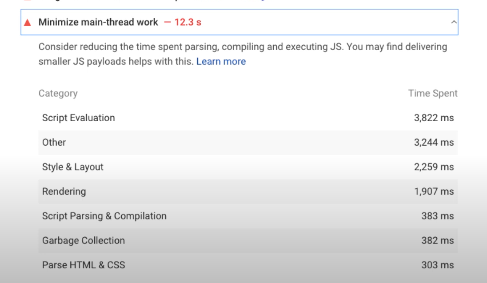
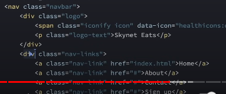
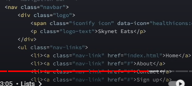
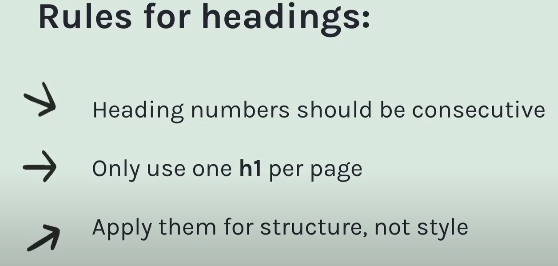
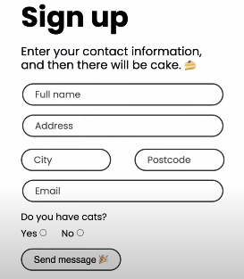
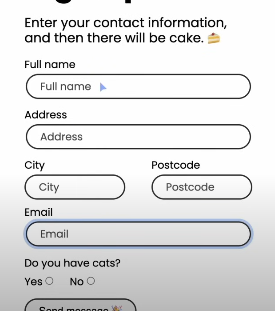
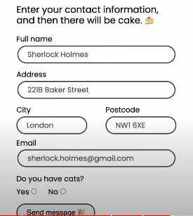
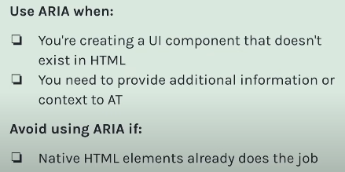

# Core Web vitals + Accessibility

## 1. Core web vitals

A set of specific metrics defined by Google to measure key aspects of user experience on a webpage.  
3 key areas

1. Largest Contentful Painy (LCP)
2. First Input Delay (FID), now replaced by INP (Interaction to Next Paint)
3. Cummulative Layout Shift (CLS)

These performances can be measured in chrome devtools -> lighthouse. or goto - [PageSpeed Insight ](https://pagespeed.web.dev/)
The scores for your website would be different for mobile and desktop devices.

**Note the score you see in lighthouse is Lab Data** - because this score doesnot simulate actual user's experience.  
For this google uses **Field data** - data generated when actual users visit your page.  
You can use goolge analytics to see which devices real users are using and then test the web vital score on those devices

Earlier these 3 metrics were just guidelines that google published to imporve site performance, but now Goolge has mentioned that these scores will impact SEO ranking, so these are imp

## 1. LCP (< 2.5s)

- how long it takes for the **largest visible content in the viewport** (like images or text) on a page to load
- LCP only masures time for largest elem (like image or text) which is **above the fold**, meaning the content that is seen on the screen without user scroll

### Improving LCP score

1. Optimize images **(most impactful)**

Images have largest size as compared to any other resource that needs to be downloaded.  
Let's say you have high resolution img, `` tag will download the file, and even if you set width=800 in html, browser will still download the high resolution img from it's source, but this is not needed, width is set to 200px.
We can have same imgae with multiple sizes, and instruct the browser to download smaller image if width is 200px. See below code on how this is done

```HTML

```

1.a. - use optimized image formats liek WebP (see below on WebP formats)

2. Minify CSS / JS files
3. Use defer attribute for script tags `<script defer src="abc.js />"`, this will ensure JS is downloaded parallely without blocking the browser tp parse HTML, and js will be executed only after full hTML is loaded and parsed

4. use `font-style: swap` in css, this ensures text is visible while the font is loading

We can use normal font-familly

```css
@font-face {
  font-family: "FontName";
  src: url("path-to-font-file.woff2") format("woff2"), url("path-to-font-file.woff")
      format("woff"); /*download necessary fonts*/
  font-weight: normal;
  font-display: swap; /* Ensures text is visible while the font is loading */
}
```

5. use CDN

## 2. FID (< 100ms) / INP (< 200ms>)

- how long it takes for the site to respond on **first user action** (like button click or inputting value in elem)

### Improving FID score

In the lab data (lighthouse or page speed insight), we cannot get FID score, because to measure FOD score user action is required.  
So we need to measure **(Total Blocking Time) TBT score** in lab tools like lighthouse, **less TBT = less FID**

1. Reduce JS execution time

- minify js
- use web workers to minimize main thread work

2. Minimize 3rd part Js code on client

- in Nextjs use server components while using 3rd party libraries

  
Here Page speed insights show you which part is taking time and based on time takes, fix those issues.

**From March 2024, google would be replacing FID with INP (Interaction to Next Paint)**

## 2. INP similar to FID

- time after which the site becomes interactive
- it will take the largest time (if button resopons to action in 100ms, and hamburger icon opens after 400ms), then INP = 400ms
- improving INP - same stpes to take which improves FID
- use throttling in scroll events

## 3. CLS (< 0.1)

- how much content shifts unexpectedly on the screen as the page loads
- **CLS = (Impact fraction \* Distance Fraction)**
- Impact fraction - what % of the view port is getting shifted? e.g. last 10 lines within the viewport gets shifted when the imgae is loaded in the middle (consider as 10%)
- Distance Fraction - the % distance the imapcted elements are shifted, e.g. ptags shifted 100px below out of 1200px viewport size

### Improving CLS score

1. Always use width or height property for images, if you use width, browser will automatocally decide height based on image's aspect ratio
1. Optimize images

- use formats like WEBP (see below for WebP formats)
- set width of images, leave height, browser will calculate height based on original image's aspect ratio

2. Host your own fonts - if browser's system font is way different than your custom font, CLS can occur

- if you use 3rd party fonts, there would be lot of external network calls
- instead download the font and serve it from your server

#### WebP formats

- image format developed by Google
- compress images to great extent to reduce image sizes without compromizing image quality
- WebP images can be 25-34% smaller than JPEG or PNG images while maintaining similar quality

**COnverting imgaes to WebP format**

- first compress jpg/png images to redice size
- on the compressed images, convert them to WebP using online tools like - CloudConvert
- use bash command `cwebp image.png -o image.webp`

## 2. Accessibility

|                       | **Web Content Accessibility Guidelines (WCAG)**                                                                                                                                                                                                        |
| --------------------- | ------------------------------------------------------------------------------------------------------------------------------------------------------------------------------------------------------------------------------------------------------ |
| **Description**       | WCAG is a set of standards developed by the Web Accessibility Initiative (WAI) of the World Wide Web Consortium (W3C).                                                                                                                                 |
| **Purpose**           | It provides guidelines for making digital content accessible to individuals with disabilities, ensuring usability for all.                                                                                                                             |
| **Principles (POUR)** | - **Perceivable:** Presenting content so users can perceive it. <br> - **Operable:** Ensuring interaction is possible. <br> - **Understandable:** Making content clear and usable. <br> - **Robust:** Ensuring compatibility with various user agents. |

Again we can use lighthouse in chrome dev tools to generate accessibility report.  
`press ctrl + shift +c` and then whenever you hover over a html tag on the oage, it will give you accessibility details for that page

**3 Levels - A (very less accessible), AA (accessible), AAA (good to have)**

Lighthouse scores -

- 100% - AAA
- 80-100% - AA
- 60-80% - A (needs attentition)
- less than 60% - needs attentiion

### 3 things to look into to improve accessibility of a website

1. Color contrast
2. Use descriptive tags
3. Keyboard and skip navigation
4. Use ARIA attributes

### 1. Color contrast

- A level - < 2
- AA level - 4.5:1
- AAA level - 7:1

### 2. Use descriptive tags

#### 1. Use semantic HTML tags (see HTML.md file)

#### 2. Images - add alt text

#### 3. Lists

Instead of using divs for a series of consecutive items use ol or ul

**Bad example of using divs to place nav items**



**Good example** -



Adv of using lists is, screen readers can announce list start, list end and list items when encountering lists, not possible in divs

### 3. Keyboard and skip navigation

#### 1. Keyboard navigation

By default, below elemnts are accessible when keyboard tab is pressed

- all input elemnt types
- buttons, links, accordians
- audio, video

Default order of tabs is same as the order in which elements appear in the viewport

divs are not cauught by tabs, so use tabindex, if required in cases where you make div a button

```HTML
<div tabindex="0">THI IS DIV </div>
<!-- 0 - indicates the div would be highlighted as per it's order
 mostly it would be 0 only,
 however if we want to chage the order in which they are tabbed vs the order in which they are displayed
 then use positive integers in tabindex
 -->
```

#### 2. Skip navigation link (VVIP)

Mostly there are lot of links in the navbar, now normal users can directly choose to see the main content, not focusing on the nav / side bars  
For visually impaierd users, they need to press a ton of tab keys to get to the main content.

So we create a skip navigation link

```HTML
<!-- create a link, which should be the first elemtn of the body
 so that when users press tab, this link is shown
  which will point to the main content -->
<a href="#mainContent" class="skip-link">Skip to main content</a>
<nav>
    <ul>
        <li><a href="#home">Home</a></li>
        <li><a href="#about">About</a></li>
        <li><a href="#services">Services</a></li>
    </ul>
</nav>
<main id="mainContent">
    <h1>Main Content Title</h1>
    <p>This is the main content of the page.</p>
</main>

<!-- CSS is where the logic is -->
<style>
  /*  Make sure the link is positioned outside of the view port */
.skip-link {
    position: absolute; /* REAL LIFE USECASE OF ABSOULTE POSITION */
    top: -40px; /* Move off-screen */
    left: 0;
    z-index: 100; /* Ensure it’s above other elements */
}
  /*  as soon as tab is pressed, below css will be trigerred and we bring the link in the viewport */
.skip-link:focus {
    top: 10px; /* Move into view when focused */
}
<.style>
```

### 4. Heading tags (their purpose is for navigation and strucuture of the page)

H1-6 tags are not meant for sizing text, we can always use font-size for that



#### 5. Input elements

- placeholders don't provide accessibility, input elements must have label
- placeholders should be used an example values, but labels should be present
- use for attribute inside label, and id attribute inside input elems to associate label with input
- in react we use htmlFor, because for is a keyword in js

```HTML
 <!-- using for arrtibute provides 2 advantages
 1. helps assistive technologies to associate 2 elems
 2. when you click on the label, the input elemnt gets focused -->
<label for="username-input"> Enter user Name</label>
<input id="username-input" type="text" placeholder="">

<input id="1" type="checkbox" />
<label for="1" >Yes / No</label>

<!-- using this for attribute, wvwn if we click on the label Yes / No, the checkbox gets toggled -->
```

**bad form with no labels**

  
**form with lables, but redundant place holders**



**good example of a form**


- use fieldset and legend tags to group a section of input elemts

```HTML
<fieldset >
  <legend>Address</legend>
  <!-- add city, zip, flat-no input fields here -->
</fieldset>
```

### 3. ARIA (Accessible Rich Internet Applications) attributes

They provide additional information to assistive technologies like screen readers, that may not be adequately described using standard HTML

**Avoid using ARIA attributes if native HTML elems like button can do the job**  
In HTML, using css and javascript, we can make any tag to anything.  
E.g. - we can make a div tag a button, we can make p tag as h1, but there are specific tags created because

- they have inbuilt functionality like - roles which assist screen readers
- provide meaning to HTML strucuture, help in SEO
- buttons will be keyboard accessible by default

e.g. when we use button tag, we get default features

- button will have role="button" by default which will help screenreaders
- they will be focued and accessible via keyboard by default

the moment, we use div instead of a button, the features that button provide are lost

- div will not have any role
- div won't be accessible by keyboard by default

we have to explicitly add tabindex and role attributes to the div tag, for accessibility,

Hence - **Avoid using ARIA attributes if native HTML elems like button can do the job**

**But why would anyone use div tag instead of a button tag**  
If we are building a complex button component for a UI library



| ARIA Attribute          | Description & Use Case                                                                                                                                                                                                                                                 | Example                                                                                            |
| ----------------------- | ---------------------------------------------------------------------------------------------------------------------------------------------------------------------------------------------------------------------------------------------------------------------- | -------------------------------------------------------------------------------------------------- |
| `aria-label`            | Provides a text label that describes an element's purpose when a visible label is not present. Use it when adding a label to a button with an icon only.                                                                                                               | `<button aria-label="Close"></button>`                                                             |
| `aria-labelledby`       | screenreader will read content (innerHTML) of the elemnt whose id is mentioned in aria-labelledby (can have multiple ids), not same as `<label for >` attribute, for addes additional functionality like focus, aria labelledby is only used by assistive technologies | `<h1 id="form-title">Registration Form</h1> <input type="text" aria-labelledby="form-title">`      |
| `aria-describedby`      | Same as labelled by, just that screen reader will first read content of labelledby then content of describedby                                                                                                                                                         | `<input aria-describedby="instructions"> <div id="instructions">Please enter your username.</div>` |
| `aria-hidden`           | Indicates whether an element and its contents should be visible or hidden to **assistive technologies**, this doesnot affect the visibility of the element. Ideal for hiding decorative or redundant elements from screen readers.                                     | `<div aria-hidden="true" class="decorative-icon">some random SVG</div>`                            |
| `aria-disabled`         | Indicates whether an element is interactive or disabled. Use it for marking interactive elements as disabled.                                                                                                                                                          | `<button aria-disabled="true">Disabled</button>`                                                   |
| `aria-expanded`         | Indicates whether a collapsible element, such as an accordion, is currently expanded or collapsed. Use to show the state of expandable elements like accordions.                                                                                                       | `<button aria-expanded="true">Expand</button>`                                                     |
| `aria-controls`         | Lists the IDs of elements controlled by the current element, typically used with interactive controls. Use for connecting controls to elements they affect.                                                                                                            | `<button aria-controls="popup">Open Popup</button> <div id="popup"></div>`                         |
| `aria-haspopup`         | Indicates whether an element, such as a menu, has a popup menu, dialog, or submenu. Use to indicate that a button or element triggers a popup.                                                                                                                         | `<button aria-haspopup="true">Menu</button>`                                                       |
| `aria-live` (see below) | Indicates that content will be updated dynamically and how screen readers should handle those updates. Use for live updates (e.g., notifications) for screen reader users.                                                                                             | `<div aria-live="polite">New message: Hello!</div>`                                                |
| `role`                  | Defines the role or type of an element, providing semantic information about its purpose and behavior. Use to assign specific roles to custom elements.                                                                                                                | `<nav role="navigation"></nav>`                                                                    |
|                         |

**aria-live** - use when some content of a web page updates dynamically, like a form is submitted and the response is shown on the UI (loading / success / failure)  
It can have 3 values

- aria-live="off" - default
- aria-live="polite" - when the content in this tag changes, screen reader will read this content whenever there is a natural pause in screen reader (e.g. - on success responses of forms)
- aria-live="assertive" - screen reader will immediately read the content, halting any content that it was reading (e.g. error received from server in critical forms)

```HTML

<form id="contactForm" onsubmit="handleSubmit(event)">
    <label for="name">Name:</label>
    <input type="text" id="name" required>
    <button type="submit">Submit</button>
</form>

<!-- assume form handleSubmit make a DB call the the response is updated in the below div -->
<div id="submissionMessage" aria-live="polite" class="message" aria-hidden="true"></div>
<!-- since it has aria-live="polite", whenever the content of this div is updated, screenreader will read it -->
```
