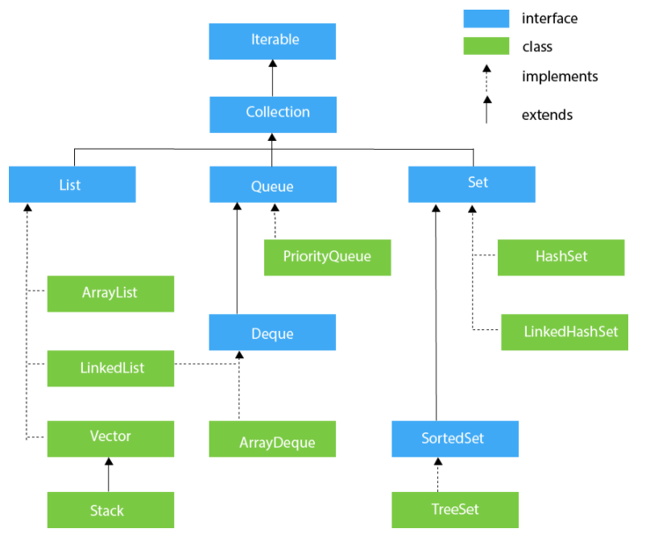

## Index
1. **Collections** - DS is how the data is represented inside the storage in memory. A collection is how it can be accessed. why(consistent API, Reduces programming effort, Increases program speed and quality)
2. **Iterators** - to retrieve elements one by one, (Iterator itr = al.iterator(), while (itr.hasNext()){int i=(Integer)itr.next()}, Iterator vs forEach - (iterator - to modify collection, foreach- nested for loops)
3. **Set** - no duplicate, unordered collection, (union, intersect, diff), Set<Integer> a = new HashSet<Integer>();
(1. HashSet O(1) - underlying DS(Hashtable), HashSet<E> hs = new HashSet<E>(int initialCapacity, float loadFactor); unordered, 2. LinkedHashSet - maintains insertion order, 3. TreeSet O(log(N))- underlytin DS(tree), sorted in asc by default, use when data volume is large)
4. **List** - ordered collection(insertion order), (1. ArrayList (dynamic arrays) - slower than standard arrays but can be helpful in programs where lots of manipulation in the array is needed, 2. Vector - same as ArrayList, but is synchronized hence poor performance in add/remove, 3. Stack - legacy class and inherits from Vector in Java, use ArrayDeque for stack implementation 4. LinkedList - elems not stored in contiguous locations, preferred over arrays in case of insert/delete, but not while searching, 5. Queues - (1. Priority Queue O(log(n)) - PriorityQueue Objs should be comparable, 2. Dequeue - double neded queue, use as stack))
5. **Map** - key(unique)-val, not subtype of collection interface, (1. HashMap O(1)- no order, HashMap<E> hs = new HashMap<E>(int initialCapacity, float loadFactor), 2. LinkedHashMap - insertion order 3. TreeMap - sorted(natural ordering of its keys, or by a Comparator) - TreeMap<Student, Integer> tm = new TreeMap<Student, Integer>(new Sortbyroll()), class Sortbyroll implements Comparator<Student> {public int compare(Student a, Student b){}})

## Collections
A Collection is a group of individual objects represented as a single unit.  

**Java Collections vs Data Structures**  
A data structure is how the data is represented inside the storage in memory. A collection is how it can be accessed. Stress on the word "can".  
If you store data in a LinkedList and sort it, the performance will drop. The same algorithm if you use a ArrayList the performance will enhance. Just by changing the way its represented in memory will help various factors  
**Java Collections**  
 

### 1. Iterators
Iterators are used in Collection framework in Java to retrieve elements one by one.   
It is a universal iterator as we can apply it to any Collection object. By using Iterator, we can perform both read and remove operations  
```java
//syntax
// Here "c" is any Collection object. itr is of
// type Iterator interface and refers to "c"
Iterator itr = c.iterator();
//e.g.
import java.util.ArrayList; 
import java.util.Iterator; 
public class Test 
{ 
    public static void main(String[] args) 
    { 
        ArrayList<Integer> al = new ArrayList<Integer>(); 
        for (int i = 0; i < 10; i++) 
            al.add(i); 
        System.out.println(al); 
        Iterator itr = al.iterator(); 
          while (itr.hasNext()) 
        { 
            int i = (Integer)itr.next(); 
            System.out.print(i + " "); 
            if (i % 2 != 0) 
               itr.remove();  
        } 
        System.out.println();  
        System.out.println(al); 
    } 
} 
//o/p
//[0, 1, 2, 3, 4, 5, 6, 7, 8, 9]
//0 1 2 3 4 5 6 7 8 9 
//[0, 2, 4, 6, 8]
//Only forward direction iterating is possible.
//Replacement and addition of new element is not supported by Iterator.
```
We also have ListIterators which iterate only lists  
They have additional methods like previous, add and others  
Syntax same as iterator  
**Iterator vs forEach**  
1. If we have to modify collection, we can use Iterator.  
2. While using nested for loops it is better to use for-each loop, consider the below code for better understanding.  

## 2. Collections
Before Collection Framework(or before JDK 1.2) was introduced, the standard methods for grouping Java objects (or collections) were Arrays or Vectors or Hashtables. All of these collections had no common interface (to add/remove element, each of the above objs had different methods. Need to remember all).  
Thus collections framework provide below advanatages  
1. Consistent API
2. Reduces programming effort
3. Increases program speed and quality  
Increases performance by providing high-performance implementations of useful data structures and algorithms because in this case, the programmer need not think of the best implementation of a specific data structure  

## 3. Set
Set is an unordered collection of objects in which duplicate values cannot be stored.  
```java
//syntax
// Obj is the type of the object to be stored in Set
Set<Obj> set = new HashSet<Obj> ();
```
The set interface allows the users to perform the basic mathematical operation on the set like union, intersect and difference  
```java
// Java program to demonstrate the 
// union, intersection and difference 
// operations on the Set 
import java.util.*;  
public class SetExample  
{  
    public static void main(String args[])  
    {  
        Set<Integer> a = new HashSet<Integer>();  
        a.addAll(Arrays.asList(new Integer[] {1, 3, 2, 4, 8, 9, 0}));  
        Set<Integer> b = new HashSet<Integer>();  
        b.addAll(Arrays.asList(new Integer[] {1, 3, 7, 5, 4, 0, 7, 5}));  
        Set<Integer> union = new HashSet<Integer>(a);  
        union.addAll(b);  
        System.out.print("Union of the two Set");  
        System.out.println(union);  
        Set<Integer> intersection = new HashSet<Integer>(a);  
        intersection.retainAll(b);  
        System.out.print("Intersection of the two Set");  
        System.out.println(intersection);  
        Set<Integer> difference = new HashSet<Integer>(a);  
        difference.removeAll(b);  
        System.out.print("Difference of the two Set");  
        System.out.println(difference);  
    }  
}
// o/p
// Union of the two Set[0, 1, 2, 3, 4, 5, 7, 8, 9]
// Intersection of the two Set[0, 1, 3, 4]
// Difference of the two Set[2, 8, 9] 
```

Classes which implement the Set interface in Java Collections
1. HashSet
2. LinkedHashSet
3. TreeSet

#### 1. HashSet
1. Implements Set Interface.
2. The underlying data structure for HashSet is Hashtable.
3. As it implements the Set Interface, duplicate values are not allowed.
4. Objects that you insert in HashSet are not guaranteed to be inserted in the same order. Objects are inserted based on their hash code.
5. NULL elements are allowed in HashSet.
```java
import java.util.*; 
class GFG{  
    public static void main(String[] args) 
    { 
        Set<String> h = new HashSet<String>(); 
        h.add("India"); 
        h.add("Australia"); 
        h.add("South Africa"); 
        h.add("India"); 
        System.out.println(h); 
        h.remove("Australia"); 
        System.out.println("Set after removing " + "Australia:" + h); 
        System.out.println("Iterating over set:"); 
        Iterator<String> i = h.iterator(); 
        while (i.hasNext()) 
            System.out.println(i.next()); 
    } 
}
// o/p
// [South Africa, Australia, India]
// Set after removing Australia:[South Africa, India]
// Iterating over set:
// South Africa
// India
```
Load Factor: The load factor is a measure of how full the HashSet is allowed to get before its capacity is automatically increased.  
**Load Factor = (No.of.Stored.elements.in.table)/(Size.of.Hash.Table)**  
If internal capacity is 16 and the load factor is 0.75 then the number of buckets will automatically get increased when the table has 12 elements in it.  
**Effect on performance:**  
A load factor of 0.75 provides very effective performance with respect to time and space complexity. If we increase the load factor value more than that then memory overhead will be reduced (because it will decrease internal rebuilding operation) but, it will affect the add and search operation in the hashtable.
```java
HashSet<E> hs = new HashSet<E>(int initialCapacity, float loadFactor);
```
Time Complexity of HashSet Operations: The underlying data structure for HashSet is hashtable. So amortize (average or usual case) time complexity for add, remove and look-up (contains method) operation of HashSet takes O(1) time.  

#### 2. LinkedHashSet
The LinkedHashSet is an ordered version of HashSet that maintains a doubly-linked List across all elements.  
When cycling through LinkedHashSet using an iterator, the elements will be returned in the order in which they were inserted.  
1. Contains unique elements only like HashSet. It extends the HashSet class and implements the Set interface.
2. Maintains insertion order.  
```java
LinkedHashSet<E> hs = new LinkedHashSet<E>(int capacity, int fillRatio)
```
When the number of elements exceeds the capacity of the hash set is multiplied with the fill ratio thus expanding the capacity of the LinkedHashSet.  
```java
// Java Program to illustrate the LinkedHashSet 
import java.util.LinkedHashSet;  
public class LinkedHashSetExample {   
    public static void main(String[] args) {   
        LinkedHashSet<String> linkedset =  new LinkedHashSet<String>();    
        linkedset.add("A");   
        linkedset.add("B");   
        linkedset.add("C");   
        linkedset.add("D");  
        // This will not add new element as A already exists  
        linkedset.add("A");  
        linkedset.add("E");   
        System.out.println("Size of LinkedHashSet = " + linkedset.size());   
        System.out.println("Original LinkedHashSet:" + linkedset);   
        System.out.println("Removing D from LinkedHashSet: " +linkedset.remove("D"));
        System.out.println("Trying to Remove Z which is not "+ "present: " + linkedset.remove("Z"));   
        System.out.println("Checking if A is present=" + linkedset.contains("A")); 
        System.out.println("Updated LinkedHashSet: " + linkedset);   
    	Iterator itr = hs.iterator(); 
        while (itr.hasNext()) 
            System.out.print(itr.next() + ", "); 
        System.out.println(); 
    }   
}
// Size of LinkedHashSet=5
// Original LinkedHashSet:[A, B, C, D, E]
// Removing D from LinkedHashSet: true
// Trying to Remove Z which is not present: false
// Checking if A is present=true
// Updated LinkedHashSet: [A, B, C, E]
// A, B, C, E
```

#### 3. TreeSet
TreeSet provides an implementation of the SortedSet Interface and SortedSet extends Set Interface. It behaves like simple set with the exception that it stores elements in sorted format  
1. TreeSet uses tree data structure for storage.
2. Objects are stored in sorted, ascending order. But we can iterate in descending order using method 
3. TreeSet.descendingIterator().
4. Access and retrieval times are very fast which make TreeSet an excellent choice for storage of large volume of data in sorted format.  
```java
import java.util.Iterator; 
import java.util.TreeSet; 
public class TreeSetExample { 
    public static void main(String[] args) { 
        TreeSet<Integer> ts = new TreeSet<Integer>(); 
        ts.add(10); 
        ts.add(61); 
        ts.add(87); 
        ts.add(39); 
        Iterator<Integer> iterator = ts.iterator(); 
        System.out.print("Tree set data: "); 
        // note that 87 being largest element, appears in 
        // the last. 
        while (iterator.hasNext()) 
            System.out.print(iterator.next() + " "); 
        System.out.println(); 
        // to check if treeset is empty or not. 
        if (ts.isEmpty()) 
            System.out.print("Tree Set is empty."); 
        else
            System.out.println("Tree Set size: " + ts.size()); 
        // To get the smallest element from the set 
        System.out.println("First data: " + ts.first()); 
        // To get the largest value from set 
        System.out.println("Last data: " + ts.last()); 
          // remove 61 from set. 
        if (ts.remove(61)) 
            System.out.println("Data is removed from tree set"); 
        else
            System.out.println("Data doesn't exist!"); 
          // Remove all 
        ts.clear(); 
        if (ts.isEmpty()) 
            System.out.print("Tree Set is empty."); 
        else
            System.out.println("Tree Set size: " + ts.size()); 
    } 
} 
// o/p
// Tree set data: 10 39 61 87 
// Tree Set size: 4
// First data: 10
// Last data: 87
// Data is removed from tree set
// Tree Set is empty.
```
TreeSet is basically an implementation of a self-balancing binary search tree like a Red-Black Tree. Therefore operations like add, remove, and search take O(log(N)) time.  
However, operations like printing N elements in the sorted order takes O(N) time.

## 4. List
The List interface provides a way to store the ordered collection.  
Since List preserves the insertion order, it allows positional access and insertion of elements  

Classes which implement the List Interface
1. ArrayList
2. Vector
3. Stack
4. LinkedList
4. 

#### 1. ArrayList
It provides us with dynamic arrays in Java. Though, it may be slower than standard arrays but can be helpful in programs where lots of manipulation in the array is needed.  
In Java, "normal" arrays are fixed-size. You have to give them a size and can't expand them or contract them. To change the size, you have to make a new array and copy the data you want - which is inefficient and a pain for you.  
```java
import java.util.*; 
public class GFG { 
    public static void main(String args[]) 
    { 
        ArrayList<String> al = new ArrayList<>(); 
        al.add("Geeks"); 
        al.add("Geeks"); 
        al.add(1, "For"); 
        System.out.println("Initial ArrayList " + al); 
        al.remove(1); 
        System.out.println("After the Index Removal " + al); 
        al.remove("Geeks"); 
        System.out.println("After the Object Removal " + al);
        Iterator<String> iter  = al.iterator(); 
        while (iter.hasNext()) { 
            System.out.print(iter.next() + " "); 
        }
    } 
} 
//Initial ArrayList [Geeks, For, Geeks]
//After the Index Removal [Geeks, Geeks]
//After the Object Removal [Geeks]
// Geeks
```

#### 2. Vector
1. Vector implements a dynamic array that means it can grow or shrink as required. Like an array, it contains components that can be accessed using an integer index
2. They are very similar to ArrayList but Vector is synchronized and has some legacy method that the collection framework does not contain.  
3. As it is synchronized, it gives a poor performance in adding, searching, delete and update of its elements.  
Implementation code - see ArrayList, replace ArrayList with Vector name  

#### 3. Stack
Stack class that models and implements a Stack data structure. The class is based on the basic principle of last-in-first-out. In addition to the basic push and pop operations, the class provides three more functions of empty, search, and peek. The class can also be said to extend Vector and treats the class as a stack with the five mentioned functions  
```java
import java.io.*; 
import java.util.*; 
class StackDemo { 
    public static void main(String[] args) 
    { 
        Stack<String> stack1 = new Stack<String>(); 
        stack1.push(4); 
        stack1.push("All"); 
        stack1.push("Geeks");
        // Displaying the Stack 
        System.out.println("Initial Stack: " + stack); 
        // Fetching top element of the Stack 
        // this does not remove top element
        System.out.println("The element at the top of the"+ " stack is: " + stack.peek());
        // Removing elements using pop() method 
        System.out.println("Popped element: "+ stack.pop());
```
Please note that the Stack class in Java is a legacy class and inherits from Vector in Java. It is a thread-safe class and hence involves overhead when we do not need thread safety. It is recommended to use ArrayDeque for stack implementation as it is more efficient in a single-threaded environment.  

#### 4. Linkedlist
1. Implementation of the LinkedList data structure which is a linear data structure
2. elements are not stored in contiguous locations and every element is a separate object with a data part and address part. 
3. The elements are linked using pointers and addresses. 
4. In case of insertions and deletions, they are preferred over the arrays. 
5. It also has few disadvantages like the nodes cannot be accessed directly instead we need to start from the head and follow through the link to reach to a node we wish to access.
```java
import java.util.*; 
public class Test { 
    public static void main(String args[]) 
    { 
        LinkedList<String> ll = new LinkedList<String>(); 
        ll.add("A"); 
        ll.add("B"); 
        ll.addLast("C"); 
        ll.addFirst("D"); 
        ll.add(2, "E"); 
        System.out.println(ll);   
        ll.remove("B"); 
        ll.remove(3); 
        ll.removeFirst(); 
        ll.removeLast(); 
        System.out.println(ll); 
        Iterator<String> iter  = ll.iterator(); 
        while (iter.hasNext()) { 
            System.out.print(iter.next() + " "); 
        }
    } 
} 
//o/p
//[D, A, E, B, C]
//[A]
// A
```
Find doubly Linked list class in Java

#### 5. Queues
**1. Priority queue**  
A PriorityQueue is used when the objects are supposed to be processed based on the priority.  
1. PriorityQueue doesn’t permit null.
2. We can’t create PriorityQueue of Objects that are non-comparable
3. The head of this queue is the least element with respect to the specified ordering. If multiple elements are tied for least value, the head is one of those elements — ties are broken arbitrarily.
4. It provides O(log(n)) time for add and poll methods.
```java
// Creates a PriorityQueue with the specified initial capacity 
// that orders its elements according to the specified comparator.
PriorityQueue<E> pq = PriorityQueue(int initialCapacity, Comparator<E> comparator);

import java.util.*; 
class PriorityQueueDemo { 
    public static void main(String args[]) 
    { 
        PriorityQueue<Integer> pQueue = new PriorityQueue<Integer>(); 
        pQueue.add(10); 
        pQueue.add(20); 
        pQueue.add(15); 
        // Printing the top element of PriorityQueue 
        System.out.println(pQueue.peek()); 
        // Printing the top element and removing it 
        // from the PriorityQueue container 
        System.out.println(pQueue.poll());   
        // Printing the top element again 
        System.out.println(pQueue.peek());
        Iterator iterator = pQueue.iterator(); 
        while (iterator.hasNext()) { 
            System.out.print(iterator.next() + " "); 
        } 
    } 
}
// o/p
//10
//10
//15
//15 20
```
**2. Deqeue**  
The Deque interface present in java.util package is a subtype of the queue interface. The Deque is related to the double-ended queue that supports addition or removal of elements from either end of the data structure. It can either be used as a queue(first-in-first-out/FIFO) or as a stack(last-in-first-out/LIFO). Deque is the acronym for double ended queue.  
```java
import java.util.*; 
public class ArrayDequeDemo { 
    public static void main(String[] args) 
    { 
        Deque<String> dq  = new ArrayDeque<String>(); 
        dq.add("For"); 
        dq.addFirst("Geeks"); 
        dq.addLast("Geeks");  
        System.out.println(dq); 
    } 
}
//o/p
//Geeks For Geeks
import java.util.*; 
public class DequeExample { 
    public static void main(String[] args) 
    { 
        Deque<String> deque = new LinkedList<String>(); 
        // We can add elements to the queue 
        // in various ways 
        // Add at the last 
        deque.add("Element 1 (Tail)"); 
        // Add at the first 
        deque.addFirst("Element 2 (Head)"); 
        // Add at the last 
        deque.addLast("Element 3 (Tail)"); 
        // Add at the first 
        deque.push("Element 4 (Head)"); 
        // Add at the last 
        deque.offer("Element 5 (Tail)"); 
        // Add at the first 
        deque.offerFirst("Element 6 (Head)"); 
        System.out.println(deque + "\n"); 
        // We can remove the first element 
        // or the last element. 
        deque.removeFirst(); 
        deque.removeLast(); 
        System.out.println("Deque after removing "+ "first and last: "+ deque); 
        for (Iterator itr = dq.iterator(); itr.hasNext();) { 
          //  System.out.print(itr.next() + " "); 
        } 
    } 
} 
//[Element 6 (Head), Element 4 (Head), Element 2 (Head), 
//Element 1 (Tail), Element 3 (Tail), Element 5 (Tail)]
//Deque after removing first and last: 
//[Element 4 (Head), Element 2 (Head), Element 1 (Tail), Element 3 (Tail)]
```

## 5. Map
It represents a mapping between a key and a value. The Map interface is not a subtype of the Collection interface. Therefore it behaves a bit differently from the rest of the collection types. A map contains unique keys  
1. A Map cannot contain duplicate keys and each key can map to at most one value. Some implementations allow null key and null value like the HashMap and LinkedHashMap, but some do not like the TreeMap.
2. The order of a map depends on the specific implementations. For example, TreeMap and LinkedHashMap have predictable order, while HashMap does not.  
Maps are perfect to use for key-value association mapping such as dictionaries. The maps are used to perform lookups by keys or when someone wants to retrieve and update elements by keys.  
**When to use**  
1. A map of error codes and their descriptions.
2. A map of zip codes and cities.
3. A map of managers and employees
```java

```

**Classes which implement the Map interface**  
1. HashMap
2. LinkedHashMap
3. TreeMap

#### 1. HashMap
1. HashMap doesn’t allow duplicate keys but allows duplicate values. 
2. HashMap allows null key also but only once and multiple null values.
3. This class makes no guarantees as to the order of the map; in particular, it does not guarantee that the order will remain constant over time. It is roughly similar to HashTable but is unsynchronized.
4.  HashMap is known as HashMap because it uses a technique called Hashing. Hashing is a technique of converting a large String to small String that represents the same String. A shorter value helps in indexing and faster searches. HashSet also uses HashMap internally.
**Performance of HashMap depends on 2 parameters:**  
1. Initial Capacity - It is the capacity of HashMap at the time of its creation (It is the number of buckets a HashMap can hold when the HashMap is instantiated). In java, it is 2^4=16 initially, meaning it can hold 16 key-value pairs.  
2. Load Factor -  It is the percent value of the capacity after which the capacity of Hashmap is to be increased  
From Java 8 onward, Java has started using Self Balancing BST instead of linked list for chaining. The advantage of self balancing bst is, we get worst case (when every key maps to same slot) search time as O(Log n).
```java
import java.util.HashMap; 
public class GFG { 
    public static void main(String[] args) 
    { 
        // Create an empty hash map 
        HashMap<String, Integer> map = new HashMap<>(); 
        // Add elements to the map 
        map.put("vishal", 10); 
        map.put("sachin", 30); 
        map.put("vaibhav", 20); 
        // Print size and content 
        System.out.println("Size of map is:- "+ map.size()); 
        System.out.println(map); 
        // Check if a key is present and if 
        // present, print value 
        if (map.containsKey("vishal")) { 
            Integer a = map.get("vishal"); 
            System.out.println("value for key" + " \"vishal\" is:- " + a); 
        }
         for (Map.Entry<String, Integer> e : map.entrySet()) 
            System.out.println(e.getKey() + " " + e.getValue()); 
    } 
} 
// Size of map is:- 3
// {vaibhav=20, vishal=10, sachin=30}
// value for key "vishal" is:- 10
//vaibhav 20
//vishal 10
//sachin 30
```
Complexity: get/put/containsKey() operations are O(1) in average case but we can’t guarantee that since it all depends on how much time does it take to compute the hash.  

#### 2. LinkedHashMap
The LinkedHashMap is just like HashMap with an additional feature of maintaining an order of elements inserted into it.  
1. It contains only unique elements.
2. It may have one null key and multiple null values.
3. It is non-synchronized.  
```java
import java.util.*; 
class UpdatingLinkedHashMap { 
    public static void main(String args[]) 
    { 
        LinkedHashMap<Integer, String> hm = new LinkedHashMap<Integer, String>(); 
        // Insert mappings using put() method 
        hm.put(3, "Geeks"); 
        hm.put(2, "Geeks"); 
        hm.put(1, "Geeks"); 
        // print mappings to the console 
        System.out.println("Initial map : " + hm); 
        // Update the value with key 2 
        hm.put(2, "For");  
        // print the updated map 
        System.out.println("Updated Map : " + hm); 
        // Remove the mapping with Key 4 
        hm.remove(1);
        System.out.println("Updated Map : " + hm);
        for (Map.Entry<Integer, String> mapElement : hm.entrySet()) { 
            Integer key = mapElement.getKey(); 
            String value = mapElement.getValue(); 
            System.out.println(key + " : " + value); 
        } 
    } 
}
//o/p
//Initial map : {3=Geeks, 2=Geeks, 1=Geeks}
//Updated Map : {3=Geeks, 2=For, 1=Geeks}
//Updated Map : {3=Geeks, 2=For}
//3 : Geeks
//2 : For
```

#### 3. TreeMap
The map is sorted according to the natural ordering of its keys, or by a Comparator provided at map creation time, depending on which constructor is used.  
```java
import java.util.*; 
class GFG { 
    public static void main(String args[]) 
    { 
        TreeMap<Integer, String> tm = new TreeMap<Integer, String>(); 
        tm.put(3, "Geeks"); 
        tm.put(2, "Geeks"); 
        tm.put(1, "Geeks"); 
        System.out.println(tm); 
        tm.put(2, "For"); 
        tm.remove(3); 
        System.out.println(tm); 
         for (Map.Entry mapElement : tm.entrySet()) { 
            int key = (int)mapElement.getKey(); 
            // Finding the value 
            String value = (String)mapElement.getValue(); 
            System.out.println(key + " : "+ value); 
        }
    } 
} 
//o/p
//{1=Geeks, 2=Geeks, 3=Geeks}
//{1=Geeks, 2=For}
//1 : Geeks
//2 : For
```

```java
// Java program to demonstrate 
// an example of TreeMap using 
// a comparator constructor 
  
import java.util.*; 
import java.util.concurrent.*; 
// A class to represent a student. 
class Student { 
    int rollno; 
    String name, address; 
    public Student(int rollno, String name, String address) {
        this.rollno = rollno; 
        this.name = name; 
        this.address = address; 
    } 
    public String toString()   { 
        return this.rollno + " "+ this.name + " "+ this.address; 
    } 
} 
// Comparator implementattion 
class Sortbyroll implements Comparator<Student> { 
    // Used for sorting in ascending order of 
    // roll number 
    public int compare(Student a, Student b) { 
        return a.rollno - b.rollno; 
    } 
}
public class TreeMapImplementation { 
    static void Example2ndConstructor() {
        TreeMap<Student, Integer> tree_map = new TreeMap<Student, Integer>(new Sortbyroll()); 
        // Mapping string values to int keys 
        tree_map.put(new Student(111, "bbbb", "london"), 2); 
        tree_map.put(new Student(131, "aaaa", "nyc"), 3); 
        tree_map.put(new Student(121, "cccc", "jaipur"), 1); 
        // Displaying the TreeMap 
        System.out.println("TreeMap: " + tree_map); 
    } 
    public static void main(String[] args) { 
    System.out.println("TreeMap using "+ "TreeMap(Comparator)"+ " constructor:\n");Example2ndConstructor(); 
    } 
} 
```

**Iterators vs forEach loop**
```java
//syntaxes
   // Iterating over collection 'c' using terator
   for (Iterator i = c.iterator(); i.hasNext(); ) 
       System.out.println(i.next())

   // Iterating over collection 'c' using for-each 
   for (Element e: c)
       System.out.println(e);
```
1. If we have to modify collection, we can use Iterator.
2. While using nested for loops it is better to use for-each loop.