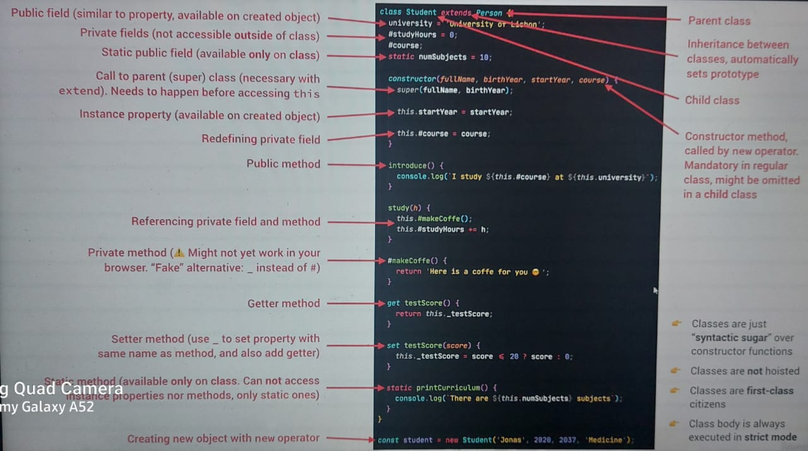

```javascript
// syntax
class MyClass {
  // class methods
  constructor() { ... }
  method1() { ... }
  method2() { ... }
  method3() { ... }
  ...
}

class Person {
  constructor(name, age) {
    this.name = name;
    this.age = age;
  }

  sayHello() {
    console.log(`Hello, my name is ${this.name}.`);
  }
}

const person1 = new Person('Alice', 30);
person1.sayHello(); // 'Hello, my name is Alice.'

console.log(typeof Person); // 'function' (not 'class' or 'Person')
console.log(typeof person1); // 'object'
```

Object-oriented programming (OOP) concepts are essential to understand when working with JavaScript classes. Here are some key OOP concepts along with code examples in JavaScript:

1. **Classes and Objects:**
   - **Class Definition:** In JavaScript, you can define a class using the `class` keyword. A class is a blueprint for creating objects.
   - **Object Creation:** You can create objects (instances) from a class using the `new` keyword.

   ```javascript
   class Person {
     constructor(name, age) {
       this.name = name;
       this.age = age;
     }
   }

   const person1 = new Person('Alice', 30);
   ```

2. **Constructor:**
   - A constructor is a special method inside a class that gets executed when you create an object from the class. It is used to initialize object properties.

   ```javascript
   class Person {
     constructor(name, age) {
       this.name = name;
       this.age = age;
     }
   }
   ```

3. **Properties:**
   - Properties are variables associated with objects created from a class.
   - They are defined inside the constructor and can have default values.

   ```javascript
   class Person {
     constructor(name, age) {
       this.name = name;
       this.age = age;
     }
   }
   ```

4. **Methods:**
   - Methods are functions defined inside a class that describe the behavior of objects created from that class.

   ```javascript
   class Person {
     constructor(name, age) {
       this.name = name;
       this.age = age;
     }

     sayHello() {
       console.log(`Hello, my name is ${this.name}.`);
     }
   }
   ```

5. **Inheritance:**
   - Inheritance allows you to create a new class (subclass) that inherits properties and methods from an existing class (parent class).

   ```javascript
   class Student extends Person {
     constructor(name, age, studentId) {
       super(name, age); // Call the parent class constructor
       this.studentId = studentId;
     }

     study() {
       console.log(`${this.name} is studying.`);
     }
   }
   ```

6. **Encapsulation:**
   - Encapsulation is the concept of bundling data (properties) and the methods that operate on that data (methods) into a single unit (class).
   - You can control access to properties by using private or protected variables (not directly supported in JavaScript).

   ```javascript
   class Circle {
     constructor(radius) {
       this._radius = radius; // Convention for a "protected" property
     }

     getRadius() {
       return this._radius;
     }

     setRadius(radius) {
       if (radius > 0) {
         this._radius = radius;
       }
     }

     calculateArea() {
       return Math.PI * this._radius ** 2;
     }
   }
   ```

7. **Polymorphism:**
   - Polymorphism allows objects of different classes to be treated as objects of a common parent class.
   - It enables method overriding, where a subclass can provide a specific implementation for a method defined in the parent class.

   ```javascript
   class Shape {
     calculateArea() {
       return 0;
     }
   }

   class Circle extends Shape {
     constructor(radius) {
       super();
       this.radius = radius;
     }
     calculateArea() {
       return Math.PI * this.radius ** 2;
     }
   }
   class Rectangle extends Shape {
     constructor(width, height) {
       super();
       this.width = width;
       this.height = height;
     }
     calculateArea() {
       return this.width * this.height;
     
     }
    }

   ```

These are the fundamental OOP concepts in JavaScript. While JavaScript's OOP is prototype-based, ES6 introduced class syntax that makes it easier to work with classes and objects in a more familiar way for developers coming from traditional OOP backgrounds.

### getters and setters
They don't directly create private members, they provide a way to implement encapsulation and control how properties are accessed and modified.  
In ES6, there's also a proposal for private class fields and methods, denoted with a # prefix, which would provide true privacy in classes.   

**Usecases**
1. Validation
2. Encapsulation - By controlling access to properties through methods, you can hide the implementation details and provide a clear interface for interacting with the object.
3. Backward Compatibility - If you initially expose a property directly and later need to add validation or computation

```javascript
class Circle {
  constructor(radius) {
    this._radius = radius; // Convention for a "protected" property
  }

  get radius() {
    return this._radius;
  }

  set radius(newRadius) {
    // you can add validations here - like radios can't be less than 1
    if (newRadius > 0) {
      this._radius = newRadius;
    }
  }
}

const myCircle = new Circle(5);
myCircle.radius = 10; // Setting the radius property using a setter
console.log(myCircle.radius); // Accessing the radius property after setting
```

**and now private members can be created using # symbol**
```javascript
class Something {
  #property;

  constructor(){
    this.#property = "test";
  }

  #privateMethod() {
    return 'hello world';
  }

  getPrivateMessage() {
      return this.#property;
  }
}

const instance = new Something();
console.log(instance.property); //=> undefined
console.log(instance.privateMethod); //=> undefined
console.log(instance.getPrivateMessage()); //=> test
console.log(instance.#property); //=> Syntax error
```

```javascript
new User().sayHi(); // Hello, John!
//The important difference of class fields is that they are set on individual objects, not User.prototype:
let user = new User();
alert(user.name); // John
alert(User.prototype.name); // undefined
```

## Inheritance using constructor functions
```javascript

const Person = function (firstName, birthYear) {
  this.firstName = firstName;
  this.birthYear = birthYear;
};

Person.prototype.calcAge = function () {
  console.log(2037 - this.birthYear);
};

const Student = function (firstName, birthYear, course) {
// this is needed because if we directly call Person(), then its a function call and this would be // undefined in the parent constructor
  Person.call(this, firstName, birthYear);
  this.course = course;I
};

Student.prototype. introduce = function () {
  console.log('My name is ${this.firstName} and Istudy `${this.course}`');
};
const mike = new Student ('Mike', 2020, 'Computer Science');
mike.introduce();

```
## Class inheritance
Similar to prototyping in objects
```javascript
//syntax
class Child extends Parent
```
#### Overriding a method
If same method name is used in child class it is method overriding, same as java  
To call both parent and child method use super
```javascript
class Animal {
  constructor(name) {
    this.speed = 0;
    this.name = name;
  }
  run(speed) {
    this.speed = speed;
    alert(`${this.name} runs with speed ${this.speed}.`);
  }
  stop() {
    this.speed = 0;
    alert(`${this.name} stands still.`);
  }
}
class Rabbit extends Animal {
  hide() {
    alert(`${this.name} hides!`);
  }
  stop() {
    super.stop(); // call parent stop //Arrow functions have no super
    this.hide(); // and then hide
  }
}
let rabbit = new Rabbit("White Rabbit");
rabbit.run(5); // White Rabbit runs with speed 5.
rabbit.stop(); // White Rabbit stands still. White rabbit hides!
```
Constructors in inheriting classes must call super(...), and (!) do it before using this

### Static methods
static methods are used to implement functions/properties that belong to the class, but not to any particular object of it. same as java
```javascript
class User {
  // static property
  static publisher = "Ilya Kantor";
  //static function
  static staticMethod() {
    alert(this === User);
  }
}
User.staticMethod(); // true
```
inheritance works both for regular and static methods/properties.
But when a buil-in class (Array, Map) is inherited, in this case, it's static methods/fields are not inherited. it is an exception

### Private and protected properties and methods
Protected fields are implemented in JavaScript using # symbol

```javascript

class Account {
  // Public fields (instances)
  locale=navigator.language;
  // Private fields (instances)
  #movements = [];
  #pin;
  constructor (owner, currency, pin) {
    this.owner = owner;
    this.currency = currency;
    // Protected property
    this.#pin = pin;
    // this._movements = [];
    // this.locale = navigator.language;
    console.log(`Thanks for opening an account', owner);
  }
  // Public methods
  // Public interface
  getMovements () {
  return this.#movements;
  }
  // private methods
  #deposit(val) {
  this.#movements.push(val);
  }
}
// using # sybmol, we cannot access class fields/methods outside the class since they become private members of the class 
```

### Mixins
In JavaScript we can only inherit from a single object. i.e, multiple inheritance not possible, same as java.  
To solve this, JS has a concept of Mixins.  
A mixin is a class containing methods that can be used by other classes without a need to inherit from it.  
The simplest way to implement a mixin in JavaScript is to make an object with useful methods, so that we can easily merge them into a prototype of any class.
```javascript
// mixin
let sayHiMixin = {
  sayHi() {
    alert(`Hello ${this.name}`);
  },
  sayBye() {
    alert(`Bye ${this.name}`);
  }
};
// usage:
class User {
  constructor(name) {
    this.name = name;
  }
}
// copy the methods, .assign method does the job here
Object.assign(User.prototype, sayHiMixin);
// now User can say hi
new User("Dude").sayHi(); // Hello Dude!
//There’s no inheritance, but a simple method copying. So User may inherit from another class and also include the mixin to “mix-in” the additional methods
```

### ES6 features
1. Arrow functions
2. Classes
3. Let const
4. Tepmplate String
5. Destructuring
6. Rest, Spread and default parameters
The rest parameter syntax allows us to represent an indefinite number of arguments as an array.  
Rest parameter must be the last argument.  
The arguments object is not a real array, while rest parameters are Array instances, meaning methods like sort, map, forEach or pop can be applied on it directly;  
```javascript
function f(a, b, ...theArgs) {
  // ...
}
```  
Spread syntax (...) allows an iterable such as an array expression or string to be expanded in places where zero or more arguments (for function calls) or elements (for array literals) are expected  
A better way to concatenate arrays  
```javascript
myFunction(...iterableObj);

let arr1 = [0, 1, 2];
let arr2 = [3, 4, 5]; 
//  Append all items from arr2 onto arr1
arr1 = arr1.concat(arr2);

let arr1 = [0, 1, 2];
let arr2 = [3, 4, 5];
arr1 = [...arr1, ...arr2]; 
//  arr1 is now [0, 1, 2, 3, 4, 5]
// if we de arr2 = [1,2, arr1] we get nested array
```
7. Iterators
8. Generators
9. Modules
10. map + set + weakmap + weakset