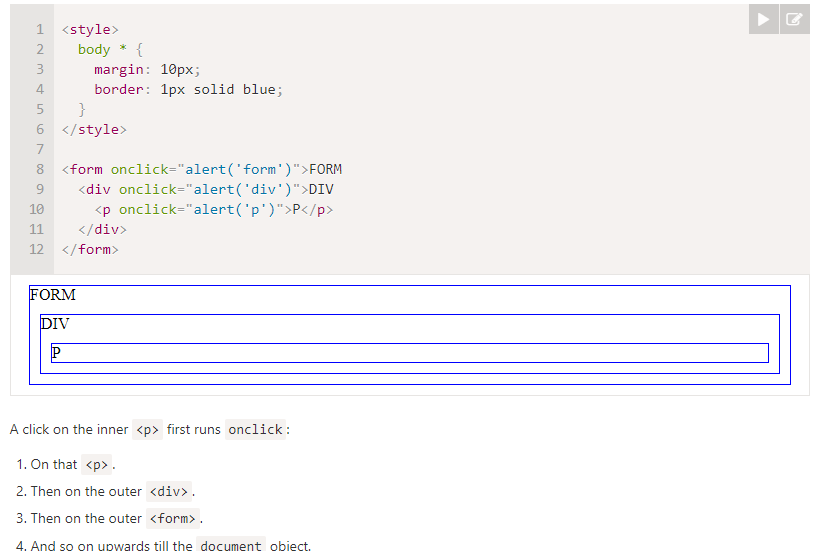
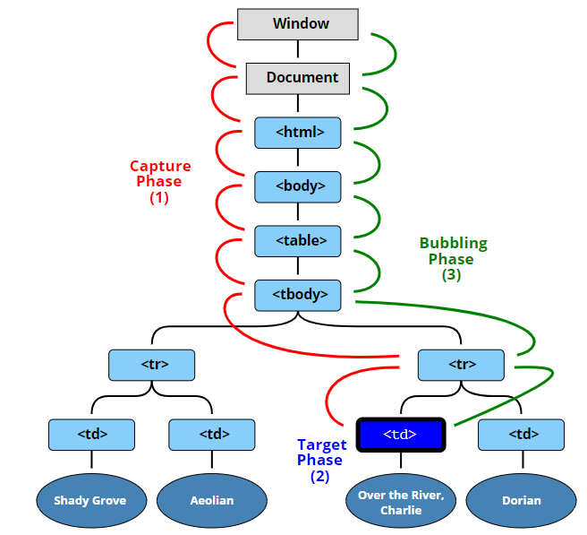

## Index
1. **Browser events** - An event is a signal that something has happened. All DOM nodes generate signals. Mouse (click, contextmenu(rt-clck), mouseup/down/move), Keyboard(keyup/down), other (submit, focus, DOMContentLoaded, transitioned)
2. **Event Handlers** - function that runs when event occurs, Only one event handler can be added, 3 ways to add evnt listner (HTML attribute: onclick="...", elem.onclick = function, evnt listener(preferred since multiple can be added))
3. **Event listeners** - multiple evnt listners can be added, elem.add/removeEventListener(event, handler, [options]) options(once(T/F - rm once trigerred)/capture(T/F - Capturing)/passive(T/F - T-no call to preventDefault()))
4. **Event bubbling** - when event occurs it first runs the handlers on it, then on its parent, then all the way up on other ancestors (till doc root), event.stopPropagation(), bubbling is default for all elems exception(focus and few other), why bubbling is default - (click an img inside button, button onClick still works), only stop if required
4. **Event capturing** - opp. of bubbling, elem.addEventListener(event, handler, {capture: T}), evnt propogation step (1.event moves down from the document root to event.target(elem where event occured), calling all ancestor elem handlers where capture=T, 2.handlers are called on the target element 3.event bubbles up from event.target to the root, calling handlers assigned where capture=F) usecase - where bubbling is unavailable (old browsers/bubbling-exception)
5. **Event delegation** - bubbling + capturing, powerful event handling pattern, if we have a lot of elements handled in a similar way, then instead of assigning a handler to each of them – we put a single handler on their common ancestor, highlight/change color of a cell (in a table having 1000 cells) onClick, steps (1.Put a single handler on the container 2.In the handler – check the source element event.target, 3.If the event happened inside an element that interests us, then handle the event.), benifits (save memory, less code), drawback(cpu load - container-level handler gets called even if target elem is not of our interest)
6. **Dispatching custom events** - event = new Event(type(helowrld,[options]), opts(bubbles T/F, cancelleable - T/F, if T -default actiion is prevented), then elem.addEvntListner('helowrld'), elem.dispatchEvnt(event), usecase - to do analytics with proper evnt names
7. **Mutation observer**- built-in obj, observes a DOM element and fires a callback when elem changes, after React (due to state) now not used, observ = new MutationObserver(cb); observ.observe(node, conf) conf('changes to watch'(childList, subtree, attributes))

## Browser events 
An event is a signal that something has happened. **All DOM nodes generate such signals**  
**Mouse events:**
1. click – when the mouse clicks on an element (touchscreen devices generate it on a tap).
2. contextmenu – when the mouse right-clicks on an element.
3. mouseover / mouseout – when the mouse cursor comes over / leaves an element.
4. mousedown / mouseup – when the mouse button is pressed / released over an element.
5. mousemove – when the mouse is moved.  
**keyboard events**  
1. keydown and keyup – when a keyboard key is pressed and released
**Form element events:**  
1. submit – when the visitor submits a <form>.
2. focus – when the visitor focuses on an element, e.g. on an <input>.
**Document events:**  
1. DOMContentLoaded – when the HTML is loaded and processed, DOM is fully built.
**CSS events:**
1. transitionend – when a CSS-animation finishes.

#### Event handlers
To react on events we can assign a handler – a function that runs in case of an event.  
Handlers are a way to run JavaScript code in case of user actions.  
Only one event handler can be added  
```javascript
<input type="button" id="elem" onclick="alert('Before')" value="Click me">
<script>
  elem.onclick = function() { // overwrites the existing handler
    alert('After'); // only this will be shown
  };
</script>

/// right
button.onclick = sayThanks;
// wrong
button.onclick = sayThanks();
```

#### Event listerners
The fundamental problem of the ways to assign handlers – we can’t assign multiple handlers to one event.  
To solve this, there is an alternative way of managing handlers using special methods addEventListener and removeEventListener
```javascript
element.addEventListener(event, handler, [options]);
element.removeEventListener(event, handler, [options]);

//options
//1. once: if true, then the listener is automatically removed after it triggers.
//2. capture (false/true): the phase where to handle the event, to be covered later 
//in the chapter Bubbling and capturing. For historical reasons.
//3. passive: if true, then the handler will not call preventDefault()

//Multiple calls to addEventListener allow to add multiple handlers, like this:
<input id="elem" type="button" value="Click me"/>
<script>
  function handler1() {
    alert('Thanks!');
  };
  function handler2() {
    alert('Thanks again!');
  }
  elem.onclick = () => alert("Hello");
  elem.addEventListener("click", handler1); // Thanks!
  elem.addEventListener("click", handler2); // Thanks again!
</script>

///Removal requires the same function
//this doesn't work
elem.addEventListener( "click" , () => alert('Thanks!'));
elem.removeEventListener( "click", () => alert('Thanks!'));
//if we don’t store the function in a variable, then we can’t remove it. 
//There’s no way to “read back” handlers assigned by addEventListener
```
So, There are 3 ways to assign event handlers:
1. HTML attribute: onclick="...".
2. DOM property: elem.onclick = function.
3. Methods: elem.addEventListener(event, handler[, phase]) to add, removeEventListener to remove.  
**Which to use**  
When we assign an event handler to the document object, we should always use addEventListener, not document.on<event>, because the latter will cause conflicts: new handlers overwrite old ones.  
For real projects it’s normal that there are many handlers on document set by different parts of the code.  
So always 3 is better, 1 is only restricted to htmls  

## Event Bubbling and capturing  
When an event happens on an element, it first runs the handlers on it, then on its parent, then all the way up on other ancestors.
  
Almost all events bubble. (a focus event does not bubble)  

**Stopping event bubbling**  
The method for it is event.stopPropagation()
```javascript
<body onclick="alert(`the bubbling doesn't reach here`)">
  <button onclick="event.stopPropagation()">Click me</button>
</body>

// if you click on the button, alert won't be called
// if you click anywhere else on the body, alert is called
```

Don’t stop bubbling without a need! Why? Why do bubbling exist?  
If you click on an image inside a button, you also click on the button.  
This means you just need to add the event to the button element, rather than also adding it to every (img in this case) element inside it.  

When to stop bubbling?  
When you don't want parent's event handler to execute  
When you have an img, where onclick enlarges the image, and inside that image you have a button which shoes modal, when button is clicked modal is shown (which is ok) and img also enlarges (not ok)  

## Event capturing
DOM Events have 3 phases of event propagation:  
1. Capturing phase – the event goes down to the element.
2. Target phase – the event reached the target element.
3. Bubbling phase – the event bubbles up from the element.  

Capturing is opposite of bubbling and when event happens first capture phase starts  
To catch an event on the capturing phase, we need to set the handler capture option to true:
```javascript
elem.addEventListener(event, handler, {capture: true})
```
  
When capture is set to true, all event-handlers having capturing set to true are executed starting from the outermost parent to the target element where the event happened in above case on a <td>, and then bubbling happens in reverse order  
**Summary**  
1. When an event happens – the most nested element where it happens gets labeled as the “target element” (event.target).
2. Then the event moves down from the document root to event.target, calling handlers assigned with addEventListener(..., true) on the way (true is a shorthand for {capture: true}).
3. Then handlers are called on the target element itself.
4. Then the event bubbles up from event.target to the root, calling handlers assigned using on<event>, HTML attributes and addEventListener without the 3rd argument or with the 3rd argument false/{capture:false}.  

## Event delegation 
Bubbling and capturing lay the foundation for “event delegation” – an extremely powerful event handling pattern  
The idea is that if we have a lot of elements handled in a similar way, then instead of assigning a handler to each of them – we put a single handler on their common ancestor.  
E.g. - highlight/change color of a cell <td> on click.  
The table could have many cells 99 or 9999, doesn’t matter.  
Adding onClick on each td is not feasible/recommended  
Instead of assigning an onclick handler to each <td> (can be many) – we’ll setup the “catch-all” handler on <table> element.  
It will use event.target to get the clicked element and highlight it.  
```javascript
let selectedTd;
table.onclick = function(event) {
  let target = event.target; // where was the click?
  if (target.tagName != 'TD') return; // not on TD? Then we're not interested
  highlight(target); // highlight it
};
function highlight(td) {
  if (selectedTd) { // remove the existing highlight if any
    selectedTd.classList.remove('highlight');
  }
  selectedTd = td;
  selectedTd.classList.add('highlight'); // highlight the new td
}
```
Becuse of bubbling, click on <td> will also trigger click on <table>  
Still, there’s a drawback.  
The click may occur not on the <td>, but inside it.  
```javascript
<td>
  <strong>Northwest</strong>
  ...
</td>
```
if a click happens on that <strong> then it becomes the value of event.target and our code will fail  
```javascript
//improved code
table.onclick = function(event) {
  let td = event.target.closest('td'); // (1)
  if (!td) return; // (2)
  if (!table.contains(td)) return; // (3)
  highlight(td); // (4)
};
```
It’s often used to add the same handling for many similar elements, but not only for that.  
**Event delegation algorithm**  
1. Put a single handler on the container.
2. In the handler – check the source element event.target.
3. If the event happened inside an element that interests us, then handle the event.  

**The “behavior” pattern**  
We can also use event delegation to add “behaviors” to elements declaratively, with special attributes and classes.  
The pattern has two parts:  
We add a custom attribute to an element that describes its behavior.  
A document-wide handler tracks events, and if an event happens on an attributed element – performs the action.  
For instance, here the attribute data-counter adds a behavior: “increase value on click” to buttons:
```javascript
Counter: <input type="button" value="1" data-counter>
One more counter: <input type="button" value="2" data-counter>
<script>
  document.addEventListener('click', function(event) {
    if (event.target.dataset.counter != undefined) { // if the attribute exists...
      event.target.value++;
    }
  });
</script>
```

**Benifits of event delegation**  
1. Simplifies initialization and saves memory: no need to add many handlers.
2. Less code: when adding or removing elements, no need to add/remove handlers.
3. DOM modifications: we can mass add/remove elements with innerHTML and the like.  
**Disadvantages**  
1. The event must be bubbling. Some events do not bubble. Also, low-level handlers should not use event.stopPropagation().
2. The delegation may add CPU load, because the container-level handler reacts on events in any place of the container, no matter whether they interest us or not. But usually the load is negligible, so we don’t take it into account.

## Dispatching custom events
Event constructor  
```javascript
let event = new Event(type[, options]);
```
1. type – event type, a string like "click" or our own like "my-event".
2. options – the object with two optional properties:  
bubbles: true/false – if true, then the event bubbles.  
cancelable: true/false – if true, then the “default action” may be prevented.  
```javascript
<button id="elem" onclick="alert('Click!');">Autoclick</button>
<script>
  let event = new Event("click");
  elem.dispatchEvent(event);
</script>
```
There is a way to tell a “real” user event from a script-generated one.  
The property event.isTrusted is true for events that come from real user actions and false for script-generated events.  
We should use addEventListener for our custom events, because on<event> only exists for built-in events, document.onhello doesn’t work.  

**Custom events**  
completely new events types like "hello" we should use new CustomEvent  
we can add an additional property detail for any custom information that we want to pass with the event.
```javascript
<h1 id="elem">Hello for John!</h1>
<script>
  /// additional details come with the event to the handler
  elem.addEventListener("hello", function(event) {
    alert(event.detail.name);
  });
  elem.dispatchEvent(new CustomEvent("hello", {
    detail: { name: "John" }
  }));
</script>
```
Custom events with our own names are often generated for architectural purposes, to signal what happens inside our menus, sliders, carousels etc.  
Kind of analytics  

## Mutation Observer
MutationObserver is a built-in object that observes a DOM element and fires a callback when it detects a change.  
```javascript
//First, we create an observer with a callback-function:
let observer = new MutationObserver(callback);

observer.observe(node, config);
```
config is an object with boolean options “what kind of changes to react on”:  
1. childList – changes in the direct children of node,
2. subtree – in all descendants of node,
3. attributes – attributes of node,
4. attributeFilter – an array of attribute names, to observe only selected ones.
5. haracterData – whether to observe node.data (text content)  

For example, here’s a <div> with a contentEditable attribute. That attribute allows us to focus on it and edit.
```javascript
<div contentEditable id="elem">Click and <b>edit</b>, please</div>
<script>
let observer = new MutationObserver(mutationRecords => {
  console.log(mutationRecords); // console.log(the changes)
});
// observe everything except attributes
observer.observe(elem, {
  childList: true, // observe direct children
  subtree: true, // and lower descendants too
  characterDataOldValue: true // pass old data to callback
});
</script>
```
**Usage**  
Imagine the situation when you need to add a third-party script that contains useful functionality, but also does something unwanted, e.g. shows ads <div class="ads">Unwanted ads</div>.  
Using MutationObserver, we can detect when the unwanted element appears in our DOM and remove it.  
Now-a-days, since we use React, state variables are used to observe changes, so rarely used  
