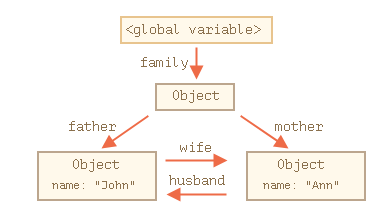

## Index
1. Javascript - (dynamic, oo, scripting), compiled/interpreted(hoisting, let error, JIT)
2. Event Loop - runtime(heap, stack), web/dom apis, event queue, ES6 job queue
3. automatic semicolon insertion
4. use strict - no var declare, still executes in non-strict, classes modules already include strict mode
5. let var const - block/hoisting/redeclaration
6. IIFE - to not pollute gloval env
7. Data types - (8), null (can be assigned) vs undefined (if not assigned), use of symbol (using shared lib's obj)
8. Alert, Confirm, Prompt
9. Type conversion - + to string others (/,*,-) to number/NAN, Strict equality, different types are converted to numbers by the equality operator ==
10. Nullish coalesing operator - ?? - || returns the first truthy value. ?? returns the first defined value.
11. Hoisting - only declaration/var/fun declare not initialization/let/fun express 
12. Closure - child fun accessing parent's lexical env. - to create private fun - with IIFE
13. Garbage collection - remove from memory if not reachable
14. Module, defer, async - (**export** (4 - before/after decl (named), as, (when?(util/class))default(only 1, can be combined with named)) (**import** - named - {}, default without {}, for dynamic -  import()) - same module imported into multiple other places, its code is executed only the first time
15. Callback, promises, async await - callback(hell-remove) - libraries(filter example, readfile), (Promise.all (run concurrenntly), race, any), (await- syntax diff)
16. Cookies, localstorage, session storage - (cookie - (doc.cookie, auth, <4KB, 20/domain), options-(path, max-age, secure, http-only)), (loclstorage - (getItem()/setItem() <2MB, server can't manipulate, same within multiple windows(!websession)) - auto-form-fill)

## Javascript
Javascript is  
1. Dynamically typed: same variable can be assigned to multiple datatypes
2. Object-oriented: It is an object-oriented language.
3. Scripting Language: is a programming language for a special run-time environment (in case of JS it is the browser) that automates the execution of tasks  

**compiled or interpreted**  
**more of a Compiled language:** - proof  
1. compilers use parsers, JS code is also parsed, that's why hoisting works. If it was not parsed, then how can we call before it's definition (hositing) 
2. declaring 2 let variables with same name gives error immediately, if it was interpreted, then error would have thorwn at the line where the second let was declared 
3. It uses JIT compilers where only the part of code is compiled. If else block is not executed, it is not compiled

## Javascript event loop. 
[Javascript event loop](https://www.youtube.com/watch?v=8aGhZQkoFbQ)
Javascript event loop elements are  
1. Javascript Runtime (heap and stack)
2. Web Apis (DOM APIs, AJAX (n/w requests), setTimeout)
3. Task/callback queue 
4. ES6 Job Queue 

ES6 has new element **4. ES6 Job Queue** in addition to the **callback queue**    
It's a way to execute the result of an **async function** as soon as possible, rather than being put at the end of the call stack.  
Promises that resolve before the current function ends will be executed right after the current function.  
```javascript
const bar = () => console.log('bar')
const baz = () => console.log('baz')
const foo = () => {
  console.log('foo')
  setTimeout(bar, 0)
  new Promise((resolve, reject) =>
    resolve('promise')
  ).then(resolve => console.log(resolve))
  baz()
}
foo()
//output in ES6         // output before ES6
// foo                   // foo
// baz                   // baz
// promise               // bar
// bar                   // promise
// because of job queue added in ES6
```

------------------------------------------------------------------------------
The old HTML standard, HTML4, required a script to have a type. Usually it was type="text/javascript". It’s not required anymore. Now, it is used for JavaScript modules.

#### Automatic semicolon insertion
A semicolon may be omitted in most cases when a line break exists.  
JavaScript interprets the line break as an “implicit” semicolon. This is called an automatic semicolon insertion.

But there are situations where JavaScript “fails” to assume a semicolon where it is really needed.

```javascript
alert("There will be an error")

[1, 2].forEach(alert)
// Now if we run the code, only the first alert is shown and then we have an error!
// if semicolon is inserted after the 1st alert, it would work fine
// The error in the no-semicolon variant occurs because JavaScript does not assume a semicolon before square brackets [...]
```

#### The modern mode, "use strict"

```javascript
// note: no "use strict" in this example

num = 5; // the variable "num" is created if it didn't exist
// not declaring a variable makes it a global variable, no errors
alert(num); // 5

"use strict";

num = 5; // error: num is not defined
```

Modern JavaScript supports “classes” and “modules” – advanced language structures, that enable use strict automatically. So we don’t need to add the "use strict" directive, if we use them.  

------------------------------------------------------------------------------
#### Let, var, const

###### let ve var
1. let has a block scope, var ha no block scope, Variables, declared with var, are either function-wide or global.
2. “var” tolerates redeclarations
```javascript
let user;
let user; // SyntaxError: 'user' has already been declared

var user = "Pete";
var user = "John"; // this "var" does nothing (already declared)
// ...it doesn't trigger an error
alert(user); // John
```
3. var is hoisted but not let
```javascript
console.log(typeof name); // undefined
var name = "John";

console.log(typeof name); // ReferenceError
let name = "John";
```

##### IIFE Immediately invoked function expression
```javascript
(function() {
  var foo = "bar";
  console.log(foo);
})();
```
**use of IIFE**
As in the past there was only var, and it has no block-level visibility, programmers invented a way to emulate it. 
Local variables declared using the var keyword are scoped to the enclosing function. If no such function exists, the variables will be created as global variables instead, thus polluting the global scope. To prevent this, we can use an IIFE to create a function wrapper for local variables  
nowadays there’s no reason to use IIFE.

When the value of a constant is known prior to execution, name it with capital letters, when value is calculated during execution, use camelcase

```javascript
const COLOR_RED = "#F00";
const pageLoadTime = /* time taken by a webpage to load */;
```

------------------------------------------------------------------------------
#### Datatypes in JS
There are eight basic data types in JavaScript  
We can put any type in a variable  
```javascript
// no error
let message = "hello";
message = 123456;
```
Programming languages that allow such things, are called “dynamically typed”, meaning that there exist data types, but variables are not bound to any of them.  

1. **number** - for numbers of any kind: integer or floating-point, integers are limited by ±2(raise to 53).
2. **bigint** is for integer numbers of arbitrary length. A BigInt value is created by appending n to the end of an integer
3. **string** for strings. A string may have zero or more characters, there’s no separate single-character type.
4. **boolean** for true/false.
5. **null** for unknown values – a standalone type that has a single value null. Null as an assignment value. So you can assign the value null to any variable which basically means it’s blank.
6. **undefined** for unassigned values – a standalone type that has a single value undefined. Undefined is a variable that has been declared but not assigned a value.
7. **object** for more complex data structures.
8. **symbol** for unique identifiers.  
A “symbol” represents a unique identifier.  
```javascript
//syntax
let id = Symbol();

let user = { // belongs to another code
  name: "John"
};
let id = Symbol("id");
user[id] = 1;
alert( user[id] ); // we can access the data using the symbol as the key
```
What’s the benefit of using Symbol("id") over a string "id"?  
As user objects belongs to another code, and that code also works with them, we shouldn’t just add any fields to it. That’s unsafe. But a symbol cannot be accessed accidentally, the third-party code probably won’t even see it, so it’s probably all right to do.  
Also, imagine that another script wants to have its own identifier inside user, for its own purposes. That may be another JavaScript library, so that the scripts are completely unaware of each other.  

The typeof operator allows us to see which type is stored in a variable.  
typeof x or typeof(x)  
Both are same 1st one is operator and later one is a function  

------------------------------------------------------------------------------
## Interaction: alert, prompt, confirm
```javascript
// 1 alert
alert("Hello");

// 2 prompt
// title - text to show to user
// default - default value
// result - i/p entered by user
result = prompt(title, [default]);

// 3 confirm
let isBoss = confirm("Are you the boss?");

alert( isBoss ); // true if OK is pressed
```


------------------------------------------------------------------------------
## Type Conversions
#### String Conversion
```javascript
let value = true;
alert(typeof value); // boolean

value = String(value); // now value is a string "true"
alert(typeof value); // string

alert(2 + 2 + '1' ); // "41" and not "221"
// Note that if any of the operands is a string, then the other one is converted to a string too
// The binary + is the only operator that supports strings in such a way. Other arithmetic operators work only with numbers and always convert their operands to numbers.
alert( 6 - '2' ); // 4, converts '2' to a number
alert( '6' / '2' ); // 3, converts both operands to numbers
```

#### Numeric conversion
```javascript
// 1
alert( "6" / "2" ); // 3, strings are converted to numbers

// 2
let str = "123";
alert(typeof str); // string
let num = Number(str); // becomes a number 123
alert(typeof num); // number
// Explicit conversion is usually required when we read a value from a string-based source like a text form but expect a number to be entered.

// 3
alert( Number("   123   ") ); // 123
alert( Number("123z") );      // NaN (error reading a number at "z")
alert( Number(true) );        // 1
alert( Number(false) );       // 0
```

#### Boolean conversion
```javascript
alert( Boolean(1) ); // true
alert( Boolean(0) ); // false

alert( Boolean("hello") ); // true
alert( Boolean("") ); // false
```

#### Strict equality
```javascript
alert( '' == false ); // true
// This happens because operands of different types are converted to numbers by the equality operator ==. An empty string, just like false, becomes a zero.  
// A strict equality operator === checks the equality without type conversion.
alert( 0 === false ); // false, because the types are different
```

#### Nullish coalescing operator '??'
The nullish coalescing operator ?? provides a short syntax for selecting a first “defined” variable from the list.  

The result of a ?? b is:  
a if it’s not null or undefined,  
b, otherwise.  
```javascript
// So, x = a ?? b is a short equivalent to
x = (a !== null && a !== undefined) ? a : b;

let firstName = null;
let lastName = null;
let nickName = "Supercoder";

// show the first not-null/undefined value
alert(firstName ?? lastName ?? nickName ?? "Anonymous"); // Supercoder
```
**?? vs ||**
The important difference is that:  
|| returns the first truthy value.  
?? returns the first defined value.

------------------------------------------------------------------------------
## Hoisting
JavaScript’s behavior of moving declarations (variable and function) to the top of their current scope (function or global).  
1. Code is not moved but at compile time, variables and functions are put in memory (lexical scoping), before the execution pahse begins
2. Only the declaration is hoisted and not the initialization
```javascript
console.log(a); // undefined instead of error-> not declared
var a = 5;

// after hoisting
var a;
console.log(a);
a=5;
```
3. Function declaration is hoised and not function expression
```javascript
// function declaration
abc(); // ouptput abc
function abc() {
  console.log('abc');
}

// function expression
abc(); // error
var abc = function(defaultValue = 0) { //FYI -> adding default parameter in a function
  console.log('abc');
}
```

------------------------------------------------------------------------------
## Closure
- **Defination**
Closure is created when a child function keep the environment of the parent scope even after the parent function has already executed
```javascript
function foo(outer_arg) { 
    function inner(inner_arg) { 
        return outer_arg + inner_arg; 
    } 
    return inner; 
} 
var get_func_inner = foo(5); 
console.log(get_func_inner(4)); //outputs 9
console.log(get_func_inner(3)); //outputs 8
```
We can access the variable outer_arg (value 5) which is defined in function foo() through function inner() as the later preserves the scope chain of enclosing function at the time of execution of enclosing function i.e. the inner function knows the value of outer_arg through it’s scope chain.
This is closure in action that is inner function can have access to the outer function variables as well as all the global variables.
```javascript
// another example
function outer()  
{ 
    var arr = []; 
    var i; 
    for (i = 0; i < 4; i++)  
    { 
        // storing anonymus function 
        arr[i] = function () { return i; } 
    }  
    // returning the array. 
    return arr; 
}
var get_arr = outer(); 
console.log(get_arr[0]());  // 4
console.log(get_arr[1]());  // 4
console.log(get_arr[2]());  // 4
console.log(get_arr[3]());  // 4
// due to closure
```
**Use case**  
To create private functions/variables  
```javascript
a = (function () {
    var privatefunction = function () {
        alert('hello');
    }
    return {
        publicfunction : function () {
            privatefunction();
        }
    }
})();
```  
As you can see there, a is now an object, with a method publicfunction ( a.publicfunction() ) which calls privatefunction, which only exists inside the closure. You can NOT call privatefunction directly (i.e. a.privatefunction() ), just publicfunction()

------------------------------------------------------------------------------

#### Garbage collection
The main concept of memory management in JavaScript is reachability.

“reachable” values are those that are accessible or usable somehow. They are guaranteed to be stored in memory.

```javascript
// user has a reference to the object
let user = {
  name: "John"
};
user = null;
// Now John becomes unreachable. There’s no way to access it, no references to it. Garbage collector will junk the data and free the memory.

let user = {
  name: "John"
};
let admin = user;
user = null
// Then the object is still reachable via admin global variable, so it’s in memory. If we overwrite admin too, then it can be removed.

// Interlinked objects
function marry(man, woman) {
  woman.husband = man;
  man.wife = woman;
  return {
    father: man,
    mother: woman
  }
}
let family = marry({
  name: "John"
}, {
  name: "Ann"
});
// resulting memory structure
```

```javascript
delete family.father;
delete family.mother.husband;
// Outgoing references do not matter. Only incoming ones can make an object reachable. So, John is now unreachable and will be removed from the memory with all its data that also became unaccessible
```
Idle-time collection – the garbage collector tries to run only while the CPU is idle, to reduce the possible effect on the execution.

------------------------------------------------------------------------------
## Modules
A module is just a file. One script is one module. As simple as that.
```javascript
//import export
// 📁 sayHi.js
export function sayHi(user) {
  alert(`Hello, ${user}!`);
}
import {sayHi} from './sayHi.js';
alert(sayHi); // function...
sayHi('John'); // Hello, John!

//more export examples
// 1. Export before declarations
// export an array
export let months = ['Jan', 'Feb', 'Mar','Apr', 'Aug', 'Sep', 'Oct', 'Nov', 'Dec'];
// export a constant
export const MODULES_BECAME_STANDARD_YEAR = 2015;
// export a class
export class User {
  constructor(name) {
    this.name = name;
  }
}

// 2. Export apart from declarations
// 📁 say.js
function sayHi(user) {
  alert(`Hello, ${user}!`);
}
function sayBye(user) {
  alert(`Bye, ${user}!`);
}
export {sayHi, sayBye}; // a list of exported variables

// 3. export as
export {sayHi as hi, sayBye as bye};
import * as say from './say.js';

// 4. Export default
// In practice, there are mainly two kinds of modules.
// 1. Modules that contain a library, pack of functions, like say.js above.
// 2. Modules that declare a single entity, e.g. a module user.js exports only class User.
// Mostly, the second approach is preferred, so that every “thing” resides in its own module.
//Modules provide a special export default
// 📁 user.js
// with default name can be skopped
export default class User { // just add "default"
  constructor(name) {
    this.name = name;
  }
}
// and then import it without curly braces
// 📁 main.js
// in imoport nay name can be given, but always give the name as class name
// as multiple devs can give diff. name and cause confustion
import User from './user.js'; // not {User}, just User

new User('John');
// there can only be one export default per module
// we can use default with named exports (see above) as well 

//Named export                                 Default export
//export class User {...}                      export default class User {...}
//import {User} from ...                       import User from ...

**Dynamic imports**
// using The import() expression
// The import(module) expression loads the module and returns a promise that resolves into a module object that contains all its exports. It can be called from any place in the code.
// We can use it dynamically in any place of the code, for instance:
let modulePath = prompt("Which module to load?");
import(modulePath)
  .then(obj => <module object>)
  .catch(err => <loading error, e.g. if no such module>)
//using await
let obj = await import('./say.js');
let say = obj.default;
// or, in one line: let {default: say} = await import('./say.js');
say();
```

1. Top-level variables and functions from a module are not seen in other scripts.
2. If the same module is imported into multiple other places, its code is executed only the first time
```javascript
// 📁 alert.js
alert("Module is evaluated!");
// 📁 1.js
import `./alert.js`; // Module is evaluated!
// 📁 2.js
import `./alert.js`; // (shows nothing)
```
4. When a module exports an object:
```javascript
// 📁 admin.js
export let admin = {
  name: "John"
};
// If this module is imported from multiple files, the module is only evaluated the first time, admin object is created, and then passed to all further importers.
// All importers get exactly the one and only admin object:

// 📁 1.js
import {admin} from './admin.js';
admin.name = "Pete";
// 📁 2.js
import {admin} from './admin.js';
alert(admin.name); // Pete
// Both 1.js and 2.js imported the same obje
```
the module is executed only once. Exports are generated, and then they are shared between importers, so if something changes the admin object, other modules will see that.  

**Module scripts are deferred same effect as defer attribute**  
1. downloading external module scripts doesn’t block HTML processing, they load in parallel with other resources
2. module scripts wait until the HTML document is fully ready (even if they are tiny and load faster than HTML), and then run.
3. relative order of scripts is maintained: scripts that go first in the document, execute first.
```java
<script type="module">
  alert(typeof button); // object: the script can 'see' the button below
  // as modules are deferred, the script runs after the whole page is loaded
</script>
Compare to regular script below:
<script>
  alert(typeof button); // Error: button is undefined, the script can't see elements below
  // regular scripts run immediately, before the rest of the page is processed
</script>
<button id="button">Button</button>
// the second script actually runs before the first! So we’ll see undefined first, and then object
```
4. External scripts that have type="module" - they run only once even if included multiple times on a page and they require cors headers for security purpose i.e, the remote server must supply a header Access-Control-Allow-Origin allowing the fetch.
6. Async
```javascript
// all dependencies are fetched (analytics.js), and the script runs
// doesn't wait for the document or other <script> tags to get loaded
<script async type="module">
  import {counter} from './analytics.js';
  counter.count();
  </script>
```

------------------------------------------------------------------------------
## Callbacks, promises and async-await
#### Callbacks
Functions are objects in JS  
A callback function is a function that is passed as an argument to another function, to be “called back” at a later time. A function that accepts other functions as arguments is called a higher-order function, which contains the logic for when the callback function gets executed.  
```javascript
// passing annonymous function
function doHomework(subject, callback) {
  alert(`Starting my ${subject} homework.`);
  callback();
}

doHomework('math', function() {
  alert('Finished my homework');
});

// callback functions don’t always have to be defined in our function call

function doHomework(subject, callback) {
  alert(`Starting my ${subject} homework.`);
  callback();
}
function alertFinished(){
  alert('Finished my homework');
}
doHomework('math', alertFinished);
```

**Callbacks can be synchronous and asynchronous**  
Above code is synchronous callback, if we call a callback inside settimeout then it is an asynchronous callback

##### But then why callback?
In the above code, alertFinished() can be called at last line of function doHomework(), then why to pass a callback?  
1. In this case callback is not required, but framework or library doesn't know the name of the function you'll want called after code is finished executing so passing the function you want called later as an argument i.e, callback is the option  
Example of filter
```javascript
let oddNumbers = numbers.filter(number => number % 2);
```
filter is an inbuit function, and you pass an anonymous function as an argument to filter function (this is a callback). so filter does it's thing and when it is done, it will call the callback (anonymous function passed), so filter does not know the function name but can execute it.  
Also JS libraries pass arguments to the callback  
In filter case, it passes number as an argument in our anonymous callback function  
Another eample -> 
```javascript
fs.readFile('demo.txt', (err, data) => { 
    console.log(data); 
 })

// so now you know where the err and data params are coming from
// second arg to readFile is a callback fn, and when readfile does it's thing, it calls our callback with the args, which contains file data
// usually err is passed as the frst argument in the callback function
```
2. JS in asynchronous and thus, you can pass the callbacks to ensure those are executed once the async code is run

##### Problem with callbacks
Callback hell -> It consists of multiple nested callbacks which makes code hard to read and debug.  
```javascript
var form = document.querySelector('form')
form.onsubmit = function (submitEvent) {
  var name = document.querySelector('input').value
  request({
    uri: "http://example.com/upload",
    body: name,
    method: "POST"
  }, function (err, response, body) {
    var statusMessage = document.querySelector('.status')
    if (err) return statusMessage.value = err
    statusMessage.value = body
  })
}
```
Myth -> Promises are used to prevent callback hell, so use promises  
Truth -> You don't need promises or async-await to perevent callback hell  

Callback hell can be prevented as follows for above code
1. keep your code shallow  
provide names to unnecessary anonymous functions and separate them out
```javascript
document.querySelector('form').onsubmit = formSubmit

function formSubmit (submitEvent) {
  var name = document.querySelector('input').value
  request({
    uri: "http://example.com/upload",
    body: name,
    method: "POST"
  }, postResponse)
}

function postResponse (err, response, body) {
  var statusMessage = document.querySelector('.status')
  if (err) return statusMessage.value = err
  statusMessage.value = body
}
```  
2. Modularize your code
Move functions to different modules, then import and use them
```javascript
var formUploader = require('formuploader')
document.querySelector('form').onsubmit = formUploader.submit
```
Summary
1. Don't nest functions. 
2. Give them names and place them at the top level of your program
3. Use function hoisting to your advantage to move functions 'below the fold'

#### Promises
A promise is an object that may produce a single value some time in the future: either a resolved value, or a reason that it’s not resolved (e.g., a network error occurred). A promise may be in one of 3 possible states: fulfilled, rejected, or pending.

3 possible states:
1. Fulfilled: onFulfilled() will be called (e.g., resolve() was called)
2. Rejected: onRejected() will be called (e.g., reject() was called)
3. Pending: not yet fulfilled or rejected  
4. Settled: promise is either fulfilled or rejected

E.g.
```javascript
   function add_positivenos_async(n1, n2) {
      let p = new Promise(function (resolve, reject) {
         if (n1 >= 0 && n2 >= 0) {
            //do some complex time consuming work
            resolve(n1 + n2)
         }
         else
            reject('NOT_Postive_Number_Passed')
      })
      return p;
   }

   add_positivenos_async(10,20)
   .then(function(result){
      console.log("first result",result)
      return add_positivenos_async(result,result)
   }).then(function(result){
   console.log("second result",result)
      return add_positivenos_async(result,result)
   }).then(function(result){
      console.log("third result",result)
   })

   console.log('end')

//O/p
//end
//first result 30
//second result 60
//third result 120
```

###### Promise methods
1. Promise.all()
Syntax-> Promise.all(iterable);  
Wait for all promises to be resolved, or for any to be rejected.
E.g. 
```javascript
function add_positivenos_async(n1, n2) {
      let p = new Promise(function (resolve, reject) {
         if (n1 >= 0 && n2 >= 0) {
            //do some complex time consuming work
            resolve(n1 + n2)
         }
         else
            reject('NOT_Postive_Number_Passed')
      })

      return p;
   }
   //Promise.all(iterable)

Promise.all([add_positivenos_async(10,20),add_positivenos_async(30,40),add_positivenos_async(50,60)])
   .then(function(resolveValue){
      console.log(resolveValue[0])
      console.log(resolveValue[1])
      console.log(resolveValue[2])
      console.log('all add operations done')
   })
   .catch(function(err){
      console.log('Error',err)
   })
   console.log('end')
```
2. Promise.allSettled()
Syntax-> Promise.allSettled(iterable);  
Wait until all promises have settled (each may resolve or reject)  

Promise.all() vs Promise.allSettled()
1. Promise.all() rejects as soon as a promise within the iterable object rejected.
2. Promise.allSettled() resolves regardless of rejected promise(s) within the iterable object.  

3. Promise.race()
Syntax-> Promise.race(iterable);  
Wait until any of the promises is resolved or rejected.
If the returned promise resolves, it is resolved with the value of the first promise in the iterable that resolved.
If it rejects, it is rejected with the reason from the first promise that was rejected. 

4. Promise.any()
Syntax-> Promise.any(iterable);  

Promise.any() resolves with the first promise to fulfil, even if a promise rejects first. This is in contrast to Promise.race(), which resolves or rejects with the first promise to settle.  

When a .then() lacks the appropriate function, processing simply continues to the next link of the chain.  Therefore, a chain can safely omit every handleRejection until the final .catch(). Similarly, .catch() is really just a .then() without a slot for handleFulfilled.

**Promisification**  
It’s the conversion of a function that accepts a callback into a function that returns a promise.

**Running promises concurrently**  
JS does not run promises in parallel, it runs them concurrently since it's a single threaded event loop architecture  
```javascript
// concurrently
await Promise.all(items.map(async item => { await fetchItem(item) }))
// sequentially
for (let i = 0; i < items.length; i++) {
    await fetchItem(items[i])
}
```

------------------------------------------------------------------------------
#### Async/Await
No differency if compared with promises  
##### Async
There’s a special syntax to work with promises in a more comfortable fashion, called “async/await”. It’s surprisingly easy to understand and use.  
The word “async” before a function means one simple thing: a function always returns a promise.  If returned value is not a promise object, then it is converted to promise and then returned

```javascript
async function f() {
  return 1;
}
f().then(alert); // 1
//We could explicitly return a promise, which would be the same
async function f() {
  return Promise.resolve(1);
}
f().then(alert); // 1
```

**So, async ensures that the function returns a promise, and wraps non-promises in it**  
in above e.g. we are returning 1 which is non-promise object, so async wraps promise around it.  

##### Await
The keyword await makes JavaScript wait until that promise settles and returns its result.

```javascript
let response = await fetch('/article/promise-chaining/user.json');
let user = await response.json();
```

**Caution**
1. await won’t work in the top-level code
```javascript
// syntax error in top-level code
let response = await fetch('/article/promise-chaining/user.json');
let user = await response.json();

//FIX
(async () => {
  let response = await fetch('/article/promise-chaining/user.json');
  let user = await response.json();
  ...
})();
```
------------------------------------------------------------------------------

## Cookies
1. Cookies are small strings of data that are stored directly in the browser. 
2. Cookies are usually set by a web-server using response Set-Cookie HTTP-header. Then the browser automatically adds them to (almost) every request to the same domain using Cookie HTTP-header.
3. Mostly used for authentication
4. We can also access cookies from the browser, using document.cookie property.
5. document.cookie = "user=John"; to write a cookie in broowser
6. should not exceed 4KB. So we can’t store anything huge in a cookie.
7. The total number of cookies per domain is limited to around 20+, the exact limit depends on a browser.

e.g. cookie - document.cookie = "user=John; path=/; expires=Tue, 19 Jan 2038 03:14:07 GMT" 
#### Cookie options (The options are listed after key=value, delimited by ;)
1. Path
The url path prefix, the cookie will be accessible for pages under that path. Must be absolute. By default, it’s the current path.
If a cookie is set with path=/admin, it’s visible at pages /admin and /admin/something, but not at /home or /adminpage.
Usually, we should set path to the root: path=/ to make the cookie accessible from all website pages.
2. domain
By default, a cookie is accessible only at the domain that set it. So, if the cookie was set by site.com, we won’t get it other.com. Not even accissible to subdomain.
3. expires, max-age
If not present, cookie expires when the browser is closed
4. secure
The cookie should be transferred only over HTTPS. By default, if we set a cookie at http://site.com, then it also appears at https://site.com and vice versa.
5. httpOnly
The web-server uses Set-Cookie header to set a cookie. And it may set the httpOnly option.  
This option forbids any JavaScript access to the cookie. We can’t see such cookie or manipulate it using document.cookie.  
That’s used as a precaution measure, to protect from certain attacks when a hacker injects his own JavaScript code into a page and waits for a user to visit that page. That shouldn’t be possible at all, a hacker should not be able to inject their code into our site, but there may be bugs that let hackers do it.

## LocalStorage, sessionStorage (Web storage objects)
##### LocalStorage
1. Unlike cookies, web storage objects are not sent to server with each request
2. Can store upto 2 MB data
3. Also unlike cookies, the server can’t manipulate storage objects via HTTP headers. Everything’s done in JavaScript.
4. The storage is bound to the origin (domain/protocol/port triplet). That is, different protocols or subdomains infer different storage objects, they can’t access data from each other.
5. Both storage objects provide same methods and properties:
```javascript
setItem(key, value) – store key/value pair.
getItem(key) – get the value by key.
removeItem(key) – remove the key with its value.
clear() – delete everything.
key(index) – get the key on a given position.
length – the number of stored items.

// store in browser
localStorage.setItem('test', 1);
// get from browser
alert( localStorage.getItem('test') ); // 1
```
We only have to be on the same origin (domain/port/protocol), the url path can be different.
The localStorage is shared between all windows with the same origin, so if we set the data in one window, the change becomes visible in another one.

##### Sessionstorage
1. Properties and methods are the same as local storage, but it’s much more limited
2. The sessionStorage exists only within the current browser tab.
Another tab with the same page will have a different storage.  
sessionStorage.setItem('test', 1);  
sessionStorage.getItem('test')
