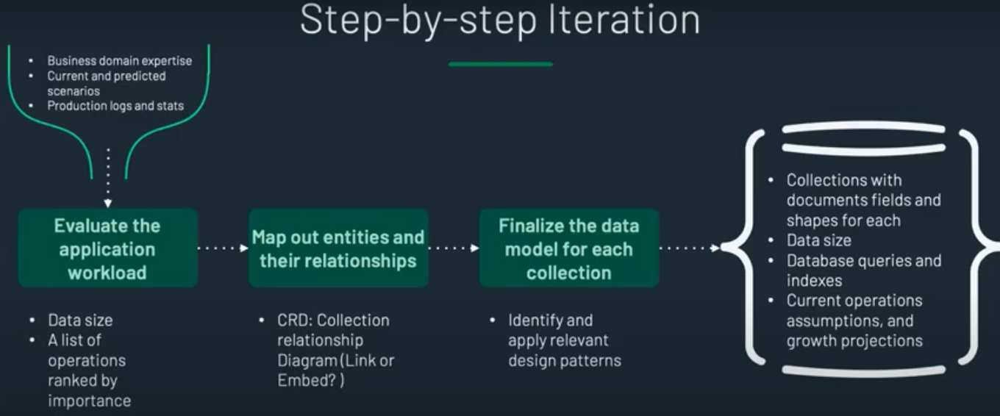
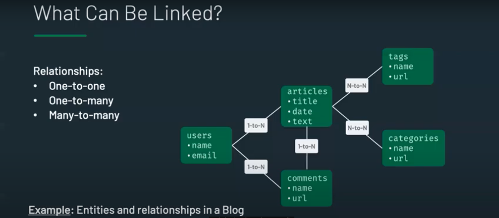
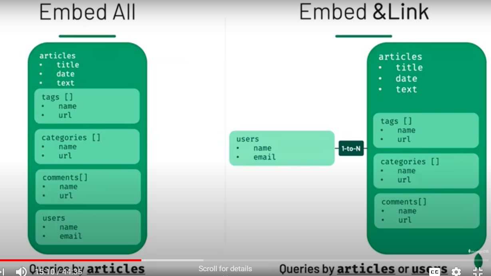
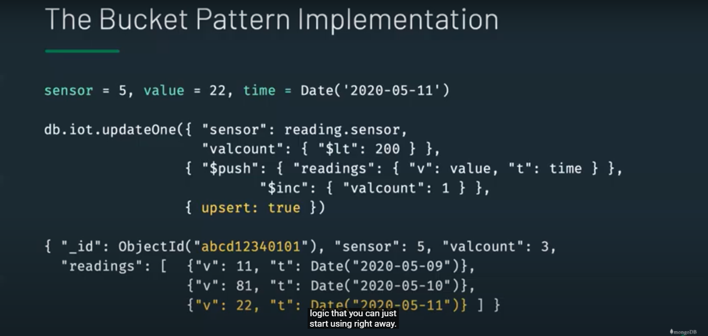

## MongoDB
It is document based NoSQL DB

## Commands
1. show dbs - shows list of all DBs (if a DB doesnot have any collection, then it is not listed)
2. use dbname - shell will be connected to dbname, if dbname does not exists, it will create new db and switch to that db
3. show collections - list all collections in the db
4. db.dropDatabase() - use this after command use dbname, deletes the db
5. db.createCollection('posts') - creates a new collection
6. db - gives name of current DB
7. exit - get out of the shell

#### 1. insert
```javascript
// 1. inser syntax - 
db.collectionName.insert(JSObject)

//e.g.
db.posts.insert({
	title: 'post title',
	body: 'post body',
	likes: 450,
	category: 'news',
	user: {
		name: 'Ashish',
		status: 'Author'
	},
	tags: ['news', 'events'],
	date: Date()
})

// 2 insermany syntax
db.collectionName.insertMany(ArrayofJSObjects)

// e.g.
db.post.insertMany([
	{
		title: 'post2 title',
		body: 'post2 body',
		likes: 45,
		category: 'news2',
		date: Date()
	},
	{
		title: 'post3 title',
		body: 'post3 body',
		likes: 415,
		category: 'news3',
		date: Date()
	}
])
```

#### 2. Read
```javascript
// syntax - 
db.collectioName.find()
db.posts.find();
db.posts.find().pretty() // pretty output
db.posts.find.sort({title: 1}) //sorts o/p by title
// for decending order use {title: -1}

// e.g. 2 using where clause
db.posts.find({category: 'news'})
// finds all dpcuments where category = news

db.posts.find({category: 'news'}).count()
db.posts.find({category: 'news'}).limit(2)
db.posts.find({category: 'news'}).sort({title: -1}).limit(2)

//forEach for custom output
db.posts.find().forEach(function(doc) {
	print('Blog Post '+ doc.title)
})

//findOne
db.posts.findOne({category: 'news'})
// returns the first doc which matched the where clause
```

#### 3. Update
```javascript
// e.g. 1
// replace entire doc
// syntax
db.collectionName.update({whereclause}, {data-to-be-updated}, {upsert: true})
// 3rd parameter is optional, is says if where clause is not matched
// then add new row, if not provided new row won't be created

db.posts.update({title: 'new post'}, 
	{
		title: 'Updated new post',
		body: 'Updaed ne body',
		date: Date()
	},
	{
		upsert: true
	}
)
// if other fields like categoory are not provided they are removed from the doc
// so in this update function we need to make sure all fields are passed, even
// if they are not required to be updated

// e.g. 2
//to eliminate above problem of not loosing fields
// we can use set operator
db.posts.update({title: 'new post'}, 
	{
		$set: {
		title: 'Updated new post',
		body: 'Updaed ne body',
		date: Date()
		}
	},
	{
		upsert: true
	}
)
// int this case, other fileds are still available, like categoory
// here set is an operator

// other operators
// 1. increment operator
db.posts.update({title: 'new post'}, {$inc: {likes: 2}})
//increase like count by 2

// 2. rename operator
db.posts.update({title: 'new post'}, {$rename: {likes: 'views'}})
// renames likes field to views
```

#### 4. delete
```javascript
db.posts.remove({title: 'new post'})

```
Note - everywhere is where clasue we have used title, but mostly **_id** attribute should be used in where clause
It is similar to primary key from relational DB  
Mongo creates a new Object attribute every time when a new doc is inserted which acts like a primary key  
it is **"_id": "ObjectId("234234cdaa4322243234")"**

#### Adding subdocuments
If post collection has a comments field, it can be a dub document (nested object) or a separate collection  
But what is preferred?
```javascript
db.posts.update({title: 'new post'},
	{
		$set: {
			comments[
			{
				user: 'Ashish',
				body: 'new comment',
				date: Date()
			},
			{
				user: 'Ashish S',
				body: 'new comment 2',
				date: Date()
			}
			]
		}
	}
)

//element match operator
// used in nested docs
db.posts.find({title: 'new post'},
	{
		comments: {
			$elemMatch: {
				user: 'Ashish'
			}
		}
	}
)
//gives all the comments from Ashish on post - new post

// less than greater than operators
db.posts.find({views: {$gt: 50}})
// find all posts where views is greater than 50
// use $gte for greater than or equal to
// similarly we have $lt and $lte 
```

#### Data Modelling
When designing data models, always consider the application usage of the data (i.e. queries, updates, and processing of the data) as well as the inherent structure of the data itself.  
**RDBMS VS NoSQL**  
in RDBMS, first data model is created, then app is developed and then improvement in app and data design.  
In NoSQL, first app id developed, then model is created (at application level), and then imporvement in model and app.  

###### Data modelling steps

1. Evaluate application workload  
See what current and predicted scenarios are and identify the data size and list of operations (read, write) ranked by importance  
2. Map out entities and their relationship (Collection relationship diagram)  
figure out relationsships  
  
Embedding vs linking  
a. Embedding (Denormalize data)  
Embedded documents capture relationships between data by storing related data in a single document structure. MongoDB documents make it possible to embed document structures in a field or array within a document.  
Use -  
embedding provides better performance for read operations, as well as the ability to request and retrieve related data in a single database operation.  

b. linking (Normalized data)  
store the relationships between data by including links or references from one document to another. Applications can resolve these references to access the related data.  
Use -  
when embedding would result in duplication of data but would not provide sufficient read performance advantages to outweigh the implications of the duplication.  
to represent more complex many-to-many relationships.  

**Also it vastly depends on what queries you would be firing more**
  
If all articles query is fired for majority of time then use embed method  
If articles and users query is fired equally, link users to article instead of embedding  

3. Finalize data model for each collection - Apply relevant design patterns  
a. Schema versioning pattern  
A schema is created, app is developed, later based on requirement, new schema os created (new version), older one is still there and applcation can quaery both schemas, by passing schema version. Eventually old schema version is removed  
b. Bucket pattern  

E.g. thermostat - imagine you want to store the temperature of all the rooms in the buliding per hour  
In this case data would be huge and the documents in the collections would be many if we create a new row for each reading  
what can be done is each THERMOSTAT document can contain an array of readings (see image), and when array size is 200, create a new document.  
What has happened in this case is a single document's size has increased a lot, but no. of documents per collection has reduced. Thus index size is reduces, as no. of documents is reduced and read query becomes more efficient.  
c. The computed pattern  
Avoid computing while doing aggregates  
Let say we want to calculate avg. rating of a product, in normal scenario we will have product name, rating object with rated date, rating comment, and rating. To calculate avg. rating, we will have to scan all documents, and find total and do the math. Insetead we can have 2 new fields, total and sum of ratings, and every time new row is added, this fields are incremented.  
There are many other patterns  
You can use multiple patterns for a single data model  

#### Indexing in MongoDB
Indexes support the efficient execution of queries in MongoDB. Without indexes, MongoDB must perform a collection scan, i.e. scan every document in a collection, to select those documents that match the query statement. If an appropriate index exists for a query, MongoDB can use the index to limit the number of documents it must inspect. MongoDB automatically creates a unique index on the **_id** field.  
Index defination  
Indexes are special data structures that store a small portion of the collection’s data set in an easy to traverse form.  

**How performance improves after indexing?**  
**Due to binary search instead of liner search** - Creating an index on a field in a table creates another data structure which holds the field value, and a pointer to the record it relates to. This index structure is then sorted, allowing Binary Searches to be performed on it.  

Drawbacks -  
1. Each index requires at least 8 kB of data space (in MongoDB).
2. Adding an index has some negative performance impact for write operations. For collections with high write-to-read ratio, indexes are expensive since each insert must also update any indexes.
```javascript
// creating an index
collection.createIndex( { <key and index type specification> }, function(err, result) {
   console.log(result);
   callback(result);
}

//The following example creates a single key descending index on the name field:
collection.createIndex( { name : -1 }, function(err, result) {
   console.log(result);
   callback(result);
}
```
The default name for an index is the concatenation of the indexed keys and each key’s direction in the index  
E.g. an index created on { item : 1, quantity: -1 } has the name item_1_quantity_-1
```javascript
//named index
db.products.createIndex(
  { item: 1, quantity: -1 } ,
  { name: "query for inventory" }
)

// drop an index
db.collection.dropIndex(indexName)
```

###### Index types
1. Single Field
index on single field  
2. Compound Index
on multiple fields  
The order of fields listed in a compound index has significance. For instance, if a compound index consists of { userid: 1, score: -1 }, the index sorts first by userid and then, within each userid value, sorts by score.  
db.products.createIndex({"item": 1, "stock": 1})  
3. Multikey Index
If you index a field that holds an array value, MongoDB creates separate index entries for every element of the array.  
same syntax, as asingle filed, just the field should be of type array.
4. Text indexes
MongoDB provides a text index type that supports searching for string content in a collection  
db.reviews.createIndex( { comments: "text" } )  
```javascript
db.reviews.createIndex( { comments: "text" } ) 
// create a text index on the fields subject and comments:
db.reviews.createIndex(
   {
     subject: "text",
     comments: "text"
   }
 )
```
Text vs single filed index  
Text indexes allow you to search for words inside texts  
single field create index for entire collection for that field
5. Hashed index
To support hash based sharding, MongoDB provides a hashed index type, which indexes the hash of the value of a field.  
```javascript
db.collection.createIndex( { _id: "hashed" } )

db.collection.createIndex( { "fieldA" : 1, "fieldB" : "hashed", "fieldC" : -1 } )
```

###### Index properties
1. Unique Indexes - A unique index ensures that the indexed fields do not store duplicate values
```javascript
db.collection.createIndex( <key and index type specification>, { unique: true } )
```
MongoDB cannot create a unique index on the specified index field(s) if the collection already contains data that would violate the unique constraint for the index.  

2. Partial Indexes -  
Partial indexes only index the documents in a collection that meet a specified filter expression. By indexing a subset of the documents in a collection, partial indexes have lower storage requirements and reduced performance costs for index creation and maintenance.
```javascript
db.restaurants.createIndex(
   { cuisine: 1, name: 1 },
   { partialFilterExpression: { rating: { $gt: 5 } } }
)
```
You can specify a partialFilterExpression option for all MongoDB index types.  
3. Sparse Indexes
Sparse indexes only contain entries for documents that have the indexed field, even if the index field contains a null value  
The index skips over any document that is missing the indexed field. The index is “sparse” because it does not include all documents of a collection.   
db.addresses.createIndex( { "xmpp_id": 1 }, { sparse: true } )  

###### Indexing strategy
The best indexes for your application must take a number of factors into account  
1. including the kinds of queries you expect  
2. the ratio of reads to writes  
3. the amount of free memory on your system.

**Create Indexes to Support Your Queries**  
Create a Single-Key Index if All Queries Use the Same, Single Key  
Create Compound Indexes to Support Several Different Queries  

**Ensure Indexes Fit in RAM**  
For the fastest processing, ensure that your indexes fit entirely in RAM so that the system can avoid reading the index from disk.  
To check the size of your indexes, use the db.collection.totalIndexSize() helper, which returns data in bytes  

**Create Queries that Ensure Selectivity**  
EXAMPLE
Suppose you have a field called status where the possible values are new and processed. If you add an index on status you’ve created a low-selectivity index. The index will be of little help in locating records.
A better strategy, depending on your queries, would be to create a compound index that includes the low-selectivity field and another field. For example, you could create a compound index on status and created_at.

### Sharding
