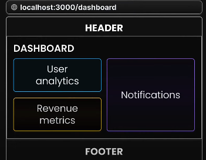
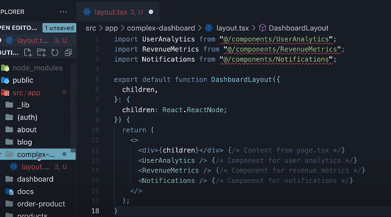
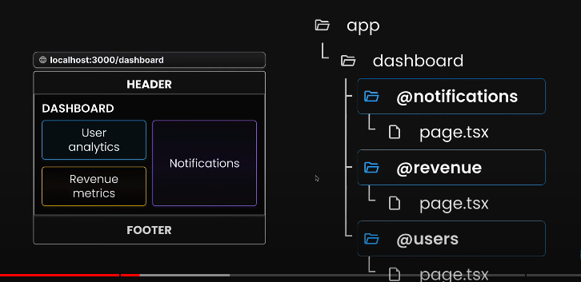
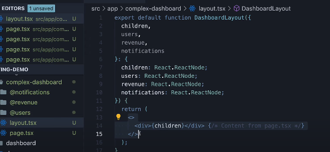
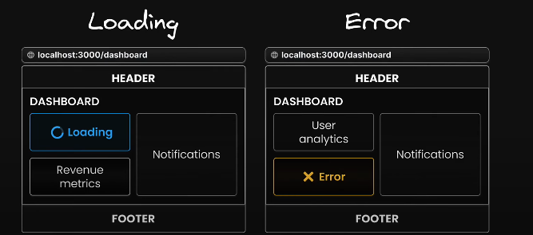
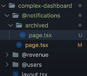
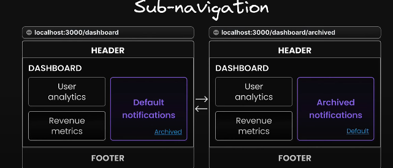
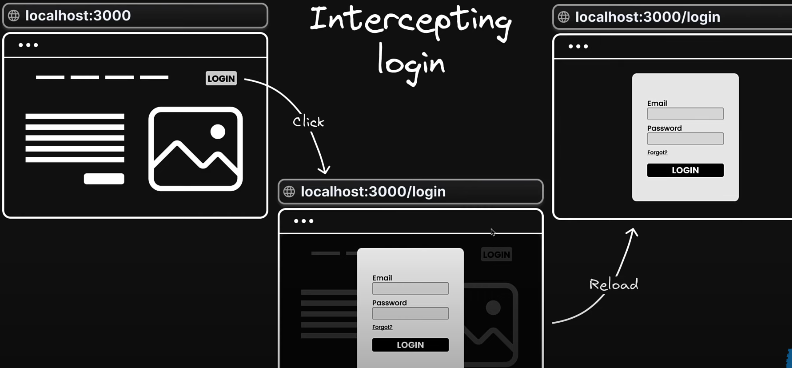
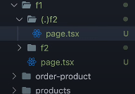

# App Router

## Reserved filename

### 1. page.tsx

### 2. layout.tsx

```typescript
export default function DashboardLayout({
  children, // will be a page or nested layout
}: {
  children: React.ReactNode;
}) {
  return (
    <section>
      {/* Include shared UI here e.g. a header or sidebar */}
      <nav></nav>

      {children}
    </section>
  );
}
```

### 3. template.tsx

**Template vs Layout**

1. Layouts persist across routes and maintain state, templates create a new instance for each of their children on navigation.
2. In terms of nesting, template.js is rendered between a layout and its children.

```javascript
<Layout>
  {/* Note that the template is given a unique key. */}
  <Template key={routeParam}>{children}</Template>
</Layout>
```

**use template if you want to reset the state of the child component, if you don't want to reset the state use layout**

### 4. loading.tsx

```javascript
// behind the scenes nextjs uses Suspense (so Suspense SSR strategy applies here)
// add this component is added as fallback in Suspense
import React from "react";
function Loading() {
  return <div>Loading</div>;
}
export default Loading;
```

### 5. not-found.tsx

In root app folder, it will work as global 404  
Inside nested route, we can programatically call this file

```typescript
// /about/not-found.tsx
import React from "react";
function NotFound() {
  return <div>not-found in about us</div>;
}
export default NotFound;

// /about/page.tsx
import Link from "next/link";
import { notFound } from "next/navigation";
import React from "react";

async function page() {
  const res = await fetch("https://jsonplaceholder.typicode.com/todos/1");
  const data = await res.json();
  if (!data) notFound(); // call the component level not-found.tsx programatically
  return <>About us</>;
}
```

### 6. error.ts

error.ts file work simialr to error boundary component in react.  
It does not handle other types of errors like API route errors, server-side errors, or build errors

```typescript
"use client"; // Error boundaries must be Client Components
import { useEffect } from "react";
export default function Error({
  error,
  reset,
}: {
  error: Error;
  reset: () => void; // function which will retry component rendering
  // use this function to ask user if they want to try again (see below)
}) {
  useEffect(() => {
    // Log the error to an error reporting service
    console.error(error);
  }, [error]);

  return (
    <div>
      <h2>Something went wrong!</h2>
      <button
        onClick={
          // Attempt to recover by trying to re-render the segment
          () => reset()
        }
      >
        Try again
      </button>
    </div>
  );
}
```

### 7. route.ts

Used to handle API requests and return data (e.g., JSON), status codes, headers, etc. (see Route-handler.md file)

### 8. middleware.ts

In Next.js, middleware allows you to execute code before a request is completed, enabling you to modify the request or response, redirect users, handle authentication, logging.  
**IMP** - middleware are run on Edge runtime and not on nodejs runtime  
**Nextjs has 2 runtimes**

1. **Nodejs runtime**
2. **Edge runtime** - this is a runtime env. which is closer to the user, reducing network latency, but does not have access to all the APIs that nodejs runtime has

NOTE - only one middleware.ts file is supported per project and at the root level

```typescript
// middleware.ts
import { NextResponse } from "next/server";
import type { NextRequest } from "next/server";
// this only accepts req obj, and not response obj
// res obj is imported from next/server
export function middleware(request: NextRequest) {
  const token = request.cookies.get("authToken");
  // If no auth token is present, redirect to login page
  if (!token) {
    return NextResponse.redirect(new URL("/login", request.url));
  }
  // Continue with the request if authenticated
  return NextResponse.next();
}
// Specify paths where this middleware should run
export const config = {
  matcher: ["/dashboard/:path*", "/profile/:path*"],
};

// e.g. matcher object
export const config = {
  matcher: [
    {
      source: "/api/*",
      regexp: "^/api/(.*)",
      has: [
        // run this middleware only when auth header is set ot has queryparam userId
        { type: "header", key: "Authorization", value: "Bearer Token" },
        { type: "query", key: "userId", value: "123" },
      ],
    },
  ],
};
```

### 9. default.ts

default.tsx file server as fallback to render the content, when framework cannont retrieve a slot's active state from the current url.

(You will understand more on this in the parallel routes section below)

### 10. instrumentation.ts (To-Do)

The instrumentation.js|ts file is used to integrate observability tools into your application, allowing you to track the performance and behavior, and to debug issues in production.

### Component hierarchy


## Dynamic routes

1. Folder name should be [productId].tsx
2. Inside this folder, create page.tsx file, which can handle route params

```typescript
// products/[productId]/page.tsx
export default function PageDetails({ params }) {
  return <p>Prodct details - {params.productId}</p>;
  // the productId name should be same as the folder name we created using square brackets
}
// example.com/products/12 - will return Product details -12

// we can alos have nested dynamic routes
// example.com/products/12/reviews/45
// here inside reviews/[reviewId]/page.tsx will have access to both path params (productId and reviewId)
```

**catch-all segment**
In dynamic routes we need to create nested routes if we have more path params  
`/docs/dockId/featureId/conceptId` - need to create 3 level of nested dynamic route  
if we need to catch all routes use catch-all segment

1. Folder name should be [...slug].tsx
2. The page.tsx file inside this folder can access params using  
   `params.slug[0] - return docId, params.slug[1] - retrun featureId and so on`

### Route segments

Lets say we have 3 paths for auth in our app

1. register - /app/register/page.tsx
2. login - /app/login/page.tsx
3. forgot-password - /app/forgot-password/page.tsx

As you can notice, our auth logic is scattered in the main app folder.  
For a good developer experience the folder strucutre should be

/app/auth/ (all the above 3 folders inside auth)  
So we know that all the auth logic is inside the app folder, but if we do this, then the url changes.  
The url would become - example.com/auth/login, example.com/auth/register.

We are getting this unnecessary auth in the url.

To remove this auth from the url, change the auth folder name to **(auth)**, add the folder name inside paranthesis ().  
**For dynamic routes, use [], for route groups use ()**, so any folder wrapped inside () will not have it's name in the url

### Adding metadata

For a page where you want to add metadata, just export the metadata object

```javascript
// page.tsx
export const metadata = {
  title: "Test",
  description: "Test",
};
export default function Page() {
  return <>Page</>;
}
// we can export metadata object in page / layout data

// what we did above is adding static metada
// we can add metadata dynamically as well
// use case - we need to change page tiltle based on the productId the user is viewing

// for this we need to write generateMetadata function
import { Metadata } from "next";
export const generateMetadata = ({ params }): Metadata => {
  return {
    title: `Product ${params.productId}`,
  };
};
```

### Navigation

```javascript
import Link from "next/link";

<Link href={"/about/as"}>as</Link>;

// programatically navigating
// this cannot be a server component
import { useRouter } from "next/navigation";
const router = useRouter();
router.push("/about");
```

### Parallel routes (render multiple routes in parallel, for complex dashboards)

See below complex dashboard page



This can be achieved via layout.tsx file as well



Acheiving same outcome using parallel routes -

#### Using parallel routes

The folder name should start with @, these folders are called as slots



Now the content returned from each of the page.tsx files from the slot folder is available as props in the layout file



Then why to use **parallel routes**

1. It gives independent routing for each slot  
   This means that notification / user slot folders can have individual error / loading / middleware (all reserved files) functionalities of their own.


We can see how we can show error / loading page for each individual component in a single dashboard page

If we have used layouts, then there would have been only one common errror / loading file

2. Parallel routes also provide the capability of sub-navigation  
   Similar defining error. loading pages for each slot, we can alos create nested folders which will act as nested routes within that slot

  
  
Notice the url, if the user click on archieved link in defaul notification component, the another component is shwon and the route also changes

But this will create issue, only the notifications slot has archieved route, but the other slots (user and revenut don't have them),
**so if the user is on the url - /complex-dashboard/archieved**, you will get 404 error, because archieved folder is not present in other folders

Now we maynot need archieved folder for all the slots, so to avoild 404, we can create a **special file (default.tsx)** for each of the slots who don't have archieved path and show the content of defaul.tsx file. Ideally the content of default.tsx file would be same for that of the page.tsx file, to add sub-navigation for missing slots.

**Hence, default.tsx file server as fallback to render the content, when framework cannont retrieve a slot's active state from the current url**

### Intercepting routes

Used to create sharable links (mainly used with modals)  


1. When you click on login button, it opens up a modal
2. Important thing to note is the url has changed
3. Now if this url is share with anyone else (or you reload the page), the plain login form is shown

Hence - **Intercepting routes "intercepts" the navigation to a certain route and display its content inside an existing view, without taking the user to a completely new page**, This helps in creating sharable links, when someone opend the new link generated, they will see only the content of the page and not the existing view

**Creating interceptors**

1. File name should be (.)filename.tsx



- if you use Link component or programatically navigate to /f1/f2, the (.)f2/page.tsx is rendered
- if you reload / share the page with url /f1/f2, the /f2/page.tsx is rendered and not the page within (.)f2/ folder
