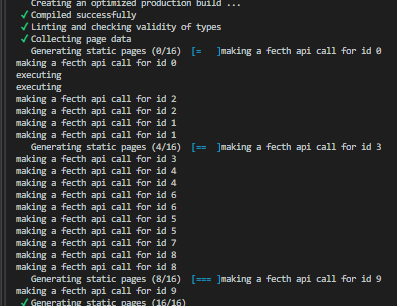
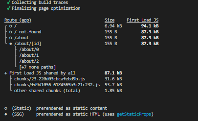
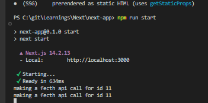

# Data Fetching

Data fecthing would include

1. Making external API calls
2. Fetching data from DB

Datafetching in Next can be done in 2 ways

1. Data fetching in server components (External API call, or DB query)
2. Data fecthing in client components (External API call, or call to route handler to get data from DB)

## 1. Data Fetching in server components

When to use server components for data fetching

1. Direct DB calls
2. Leveraging high computational powers for rendering server components and only sending generated HTML of server component to the client

No need to use useEffect, useState in server compeonts to fecth data, just need to make the component async

```javascript
export async function ServerComponent() {
  let data = await fetch("Some summy URL");
  data = await data.json();
  return (
    <ul>
      {data.map((item) => (
        <li>{item}</li>
      ))}
    </ul>
  );
}
```

Above code is great, but how do we handle errors and loading state? In client components, we can use useState and useEffect hooks? how to handle this in server components?

**Ans - using loading.tsx and error.tsx special files in Nextjs**

**Caching in server components**

Next.js 14 by default caches the returned values of **fetch operations** in **Data Cache**  
Note that only fetch operation's data is cached by Nextjs  
We can see this in the app's .next folder

  
The file with UUID name has the cached data for a particular fetch request made on the server component.

**Note Nextjs 15 is planning to remove this default behavior of cahcing return values of fetch apis from server components**

**Opting out of caching**

```javascript
// method 1 - setting cache to no-store in fetch request
export async function ServerComponent() {
  let data = await fetch("Some summy URL", {
    cache: "no-store",
  });
  data = await data.json();
}

// revalidating cache
// drwaback of using cache: no-store means the data is not at all cached
// what if we wanted to cache data for certain time - like for 5 mins, and then revlidate cache
// so any no of requests made within 5 mins will be served from cache
// requests made after 5 mins, the actual fecth api call would be made

export async function ServerComponent() {
  let data = await fetch("Some summy URL", {
    next: {
      revalidate: 10, // keep cache for 10s
    },
  });
  data = await data.json();
}

// another way to do this is to using ROUTE SEGMENT CONFIGURATION
export const revalidate = 10;
```

#### Segment route config

| Option           | Type                                                                                                                    | Default                    | Description                                                                                                                                                                     |
| ---------------- | ----------------------------------------------------------------------------------------------------------------------- | -------------------------- | ------------------------------------------------------------------------------------------------------------------------------------------------------------------------------- |
| experimental_ppr | 'true' \| 'false'                                                                                                       |                            | Enables experimental support for PPR.                                                                                                                                           |
| dynamic          | 'auto' \| 'force-dynamic' \| 'error' \| 'force-static'                                                                  | 'auto'                     | Controls page generation behavior (if not force-dynamic, then i the page would be built at buildtime unless the component uses any dynamic functions like header(), cookies()). |
| dynamicParams    | boolean                                                                                                                 | true                       | Determines if dynamic parameters are supported.                                                                                                                                 |
| revalidate       | false \| 0 \| number                                                                                                    | false                      | Specifies the revalidation interval for caching.                                                                                                                                |
| fetchCache       | 'auto' \| 'default-cache' \| 'only-cache' \| 'force-cache' \| 'force-no-store' \| 'default-no-store' \| 'only-no-store' | 'auto'                     | Sets caching strategy only for fetch requests.                                                                                                                                  |
| runtime          | 'nodejs' \| 'edge'                                                                                                      | 'nodejs'                   | Defines the runtime environment.                                                                                                                                                |
| preferredRegion  | 'auto' \| 'global' \| 'home' \| string \| string[]                                                                      | 'auto'                     | Specifies the preferred region for deployment.                                                                                                                                  |
| maxDuration      | number                                                                                                                  | Set by deployment platform | Maximum duration for execution, depending on the platform.                                                                                                                      |

**If you are using fecth api, or making a DB call, by default the page is generated at build time and not dynamicallt renderd unless the we are using dynamic functions like header() or cookie()**

To change this behaviour as seen above use `export const dynamic = 'force-dynamic'`

#### IMP caching behavior

Note - below behaviour only works in production mode

```javascript
import { unstable_cache } from "next/cache";
import { db, posts } from "@/lib/db";
const getPosts = unstable_cache(
  async () => {
    console.log(`this function would now be called only after 1 hour,
    but this does not mean that the page won't re-render,
    the page rendering is controlled by revalidate config segment`);

    return await db.select().from(posts);
  },
  ["posts"],
  { revalidate: 3600, tags: ["posts"] } // now this revalidation is handled by Nextjs
);

// set page revalidation to 10s
export const revalidate = 10; // this revalidation is also handled by Nextjs

export default async function Page() {
  const allPosts = await getPosts();
  console.log(`proof that this page will be rerendered,
  and this log message would show up after every 10s and not after 1 hour
  because revalidate is set to 10s`);
  return (
    <ul>
      {allPosts.map((post) => (
        <li key={post.id}>{post.title}</li>
      ))}
    </ul>
  );
}

// summary
// unstable_cache will memoize function value for specified duration
```

### generateStaticParams

Used to create dynamic, pre-rendered pages efficiently.  
This means that the pages will be built at runtime, any API / DB calls would be made at the build time, so when the page is invked in prod, the API call is not made (see below code)

```javascript
// for explaination of below code, see images
import { notFound } from "next/navigation";
// this function shoudl return reutrn array of objects
// the object should contain the key which is used as a dynamic param
// in this case the dynamic param is id
// so array should return [{id: 1}, {id:2} ...]
export function generateStaticParams() {
  // we are returning 10 static params
  // this means that api call below would be made at build time for params from 1-10
  return Array.from(Array(10).keys()).map((item) => ({ id: item.toString() }));
}
async function getPost(id: string) {
  // below console log for ids 1-10 is called at build time
  // when the page is called on prod with url /about/1
  // below console log is not called
  // for /about/11 - console log is called in prod
  console.log("making a fecth api call for id", id);
  const res = await fetch(`https://api.vercel.app/blog/${id}`);
  const post = await res.json();
  if (!post) notFound();
  return post;
}

export default async function Page({ params }: { params: { id: string } }) {
  const post = await getPost(params.id);
  return (
    <article>
      <h1>{post.title}</h1>
      <p>{post.content}</p>
    </article>
  );
}
```

**API calls made at build time for ids 1-10**


**this shouws that the pages for ids 1-10 is genereated at build time**


**no API call made in prod for ids 1-10, we see console log for id 11**


## 2. Data fetching in client components

It is exactly same as what we did in plain react, making api call to fetch data using combination of useState and useEffect hooks.  
But the recommended way to fecth data on client side is using **react-query tanstack** or using **SWR (stale-whle-revalidate)**
