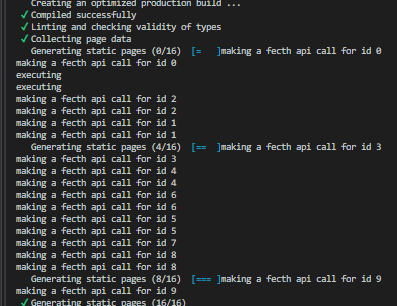
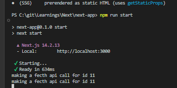

# Next.js (Fullstack React.js framework)

## TODO

1. Optimization - Images / Videos
2. Caching summary in nextjs

## 1. SPA (Client Side Rendering)

A Single Page Application (SPA) is a web application that loads a single HTML page and dynamically updates the content as the user interacts with the app, rather than loading new pages from the server for each interaction. SPAs rely heavily on client-side JavaScript to handle rendering and updating the user interface.

**React is heavily used to build SPAs** - Note - but we can build multi page applications using plain reactjs

In SPAs we can only render components at the client side

#### **Charcteristic of SPAs**

1. There is only one index.html file with a root div element
2. Apart from this div, there is not other application html available in the index.html.
3. In SPAs all of the html content is created by the bundle.js javascript file, so all the application html us created using javascript

#### **Network flow in SPAs** -


1. Client hits app url, server sends index.html
2. THe HTML is parsed (it has nothing but a root div + url for bundle.js)
3. Browser makes another network call to get the js file
4. Once Js file is received , it is parsed and all the app HTML code is now put inside root div using this javascript bundle
5. Until all the above 4 steps are complete, users see a blank page

#### Advantage of SPA

1. Dynamic HTML generation is offloaded from server to clients, saving server
2. Taks offloading to client works best with user have high end devices with strong internet
3. Subsequent calls to server will only include API call, no HTML / Js needs to be fetched again for different routes

### Disadvantages of SPA

1. Inital page load take a lot of time
2. SEOs won't be able to parse the page initially since the html only include root div and nothing else
3. Poor performance if users have lower end devices since user's browser need to generate HTML

## 2. Server Side Rendering


1. The HTML is genereated at the server and then sent back to the client the enitre static HTML page, instead of client generating the HTML page
2. It is important to note theat while the HTML is desplayed to the user, the UI is non-interactive, this means if the HTML generated on the server has button elemnt with onclick listener, only the button HTML is sent back to the client
3. If the user tries to click the button, it won't work, because only the static html is sent by the server


4. Now inside this static html, there would be a link to js file which browser is fetch, and once the js is loaded, parsed and executed, **AND THEN THE HYDRATION PROCESS STARTS**
5. THe job of the hydration process is to use the received JS file and add interactivity to the static HTML code (in this case from step 2 - attach the onClick listener to the button, which was included in the HTML sent by the server at very first step)


**Only when the hydration phase is complete the Non-interactive UI becomes interactive**


#### Disadvantages of SSR (remember "all or nothing waterfall problem" (see below))


**Drawback no 2 and 3 combined is called "all or nothing waterfall problem"**  
**Due to this waterfall problem, if a page has heavy component and small components, the hydration for small components still need to wait until heavy componet is loaded, because hydration starts only when all / entire js is loaded**.


**To solve this heavy component issue, React 18 introduced Suspense SSR architecture**

#### React Suspense SSR architecture (Uses HTML Streaming and Selective hydration)

1. With react 18 Suspense, instead of waterfall aproach, the server can send the HTML of all other conponents (not inside Suspense boundry) to the client as and when they are ready at the server. This HTML data is **Chunked and Streamed by the server** to the client.
2. All the data from step 1 is renderd on the client and also hydration starts for those components from step 1 (**this is called selective hydration**), meanwhile fallback component is displayed on the client for that heavy component
3. Whenever the heavy component is ready (lets say heavy component making the API call is finished), the server will render the component (i,e create HTML) and send this as a chunk to the client in the same network call from step 1.
4. Finally the heavy component is hydrated.
5. Now what if the heavy component takes a lot of time to load (lets say API call gets timeout), how long will the network call stay open? -> default I think is 30s, post which the connection would be closed, and only the fallback would be displayed of the heavy component


#### Drawback of Suspense SSR

1. Increased bundle sizes leading to excessive downloads for users
   e.g.

```javascript
// this library generated HTML that highlights code with color formatting.
import SyntaxHighlighter from "react-syntax-highlighter";
const Component = () => {
  const codeString = "(num) => num + 1";
  return (
    <SyntaxHighlighter language="javascript">{codeString}</SyntaxHighlighter>
  );
};
// size of this library is 286K gzipped
// but this still needs to be downloaded on the client
```

## 3. React Server Components (RSC)

1. In SSR, the HTML is generated at the server and then JS code is also sent to the client, then the app is hydrated to add the interactivity
2. In RSC, **server component's JS** is never sent to the client. This means there can be no interactivity in RSC, but this also means less bundle size
3. The issue we saw with SyntaxHighlighter, when we make the component which uses SyntaxHighlighter a server component, the js code for SyntaxHighlighter is never sent to the client, all the processing is done on the server, and only the HTML generated by SyntaxHighlighter is sent to the client.
4. Hence RSC reduces the bundle size

### RSC architecture

It has 2 components

1. **Client components** - Functionality wise, same as React components we use in React, **but these client components are rendered as SSR, meaning the initial HTML is rendered server-side, and then the client component hydrates and becomes interactive on the client**
2. **Server components** - components run on node server, can directly access DB, we cannot add interactivity

In Nextjs all components are server components by default, to make a component a client component add `'use client'` as the first line of the component.

#### Rendering of server components in RSC


3 strategies for rendeing server components

1. **Static rendering (Default)** - HTML pages generated at build time, see ISR section below
2. **Dynamic rendering** - HTML page genereated for each user request dynamically, if the comp uses dynamic func like **header(), cookie() or searchParams()**, then Nextjs will do dynamic rendering, and the HTML wouln't be geberated at build time. If the comp doesn't include any dynamic function and we still want to do synamic rendering, then export route config `export const dynamic = 'force-dynamic'`;
3. **Streaming HTML** - if we use suspense or loading.jsx file, that componen't HTML would be streamed later

- **2. Rendering of client components in RSC**

#### VVIP Interleaving client and Server Components

1. **Case 1 - server component within a server components (works by default)**
2. **Case 2 - client component within a client component (works by default)**, also remember that any component inside a client component becomes a client component, it is also advised to use client components as low in the hierarchy as possible
3. **Case 3 - client component within a server component (works by default)**
4. **Case 4 - server component within a client compnent (does not work)**, if server component is using any server side node api, like using fs module  
   To solve case 4 - Pass server component as a children in the client component (see code below)

```javascript
export function ServerComponent() {
  // read file using fs module
}

// client component
("use client");
export function ClientComponent() {
  // note that using server component directly inside client will brake UI
  // Browser will not be able to use fs module
  return (
    <>
      Client component
      <ServerComponent />
    </>
  );
}

//fix for above problem
("use client");
export function ClientComponent({ children }) {
  return (
    <>
      Client component
      {children}
    </>
  );
}

// now we can use the client component
// this is ligit
<ClientComponent>
  <ServerComponent />
</ClientComponent>

// BUT WHAT IS THE USECASE OF USING SERVER COMPONENT INSIDE A CLIENT COMPONENT
// USECASE - USING CONTEXT PROVIDER FOR APP THEME

// But still how nextjs works if
// while rendering below code
<ClientComponent>
  <ServerComponent />
</ClientComponent>
// once the server component is finished rendering at the server, only html of the server component is sent over the network
// so no fs module is sent
```

## Summary

1. CSR - all html generated by bundlejs on the client (issue inital page load)
2. SSR - HTML generated on server, later js sent to client, once js is available hydration starts and UI becomes interactive (inital page load solved, but UI non-interactive)
3. Suspense SSR - HTML streaming and does selective hydration (initial page load probelm + UI non-interactive problem solved, but cannot reduce bundle size)
4. RSC - server component never sent to client reducing bundle size (all above problems solved, but it cannot be interactve)

**Two other parts in SSR**

1. SSG (Static Site Generation) - static HTML content generated at build time only, saves server's computation power by generating HTML at run time. Limitation - **if there are 10's of 1000s pages, build will take time**
2. ISR (Incremental Static Regeneration) - **generate page at build time**, **ISR will rebuild pages in the background after a specified interval without redeploying the app**

**How does ISR rebuilds the pages in the background without redeploying**

### ISR is achieved via - exporting function generateStaticParams

Used to create dynamic, pre-rendered pages efficiently.  
This means that the pages will be built at runtime, any API / DB calls would be made at the build time, so when the page is invked in prod, the API call is not made (see below code)

```javascript
// for explaination of below code, see images
import { notFound } from "next/navigation";
// this function shoudl return reutrn array of objects
// the object should contain the key which is used as a dynamic param
// in this case the dynamic param is id
// so array should return [{id: 1}, {id:2} ...]
export function generateStaticParams() {
  // we are returning 10 static params
  // this means that api call below would be made at build time for params from 1-10
  return Array.from(Array(10).keys()).map((item) => ({ id: item.toString() }));
}
async function getPost(id: string) {
  // below console log for ids 1-10 is called at build time
  // when the page is called on prod with url /about/1
  // below console log is not called
  // for /about/11 - console log is called in prod
  console.log("making a fecth api call for id", id);
  const res = await fetch(`https://api.vercel.app/blog/${id}`);
  const post = await res.json();
  if (!post) notFound();
  return post;
}

export default async function Page({ params }: { params: { id: string } }) {
  const post = await getPost(params.id);
  return (
    <article>
      <h1>{post.title}</h1>
      <p>{post.content}</p>
    </article>
  );
}
```

**API calls made at build time for ids 1-10**


**this shouws that the pages for ids 1-10 is genereated at build time**


**no API call made in prod for ids 1-10, we see console log for id 11**


This is great, but how do we revalidate the stale pages?

1. **Time based revalidation** - using route configs - `export const revalidate = 60`, after 60s are passed, the next req, will server cached data and for next request, the page would be re-generated
2. **On Demand revalidation** - using `import { revalidatePath } from 'next/cache'; revalidatePath('/posts')` - useful in **server actions** (see route and server actions.md)

## Nextjs security

#### 1. use server-only package

lets say we have a utils function which access some confidential info like token secrets which is used in the server component
Now if we call this function from server component, everything is fine  
But we can also call this same utility function from the client compnents as well, which can make expose the secrets at the client side.

To avoid this use server-only npm package  
In the utility function withe this code at the start `import "server-only"`  
Now wherever if build the next app and if the utilty function is used in the client component, the buld fails
