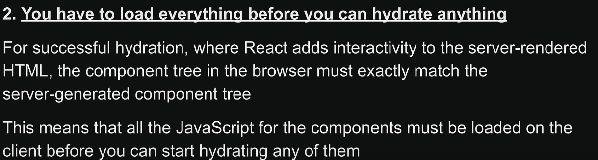

# Next.js

## 1. SPA (Client Side Rendering)

A Single Page Application (SPA) is a web application that loads a single HTML page and dynamically updates the content as the user interacts with the app, rather than loading new pages from the server for each interaction. SPAs rely heavily on client-side JavaScript to handle rendering and updating the user interface.

**React is heavily used to build SPAs** - Note - but we can build multi page applications using plain reactjs

In SPAs we can only render components at the client side

#### **Charcteristic of SPAs**

1. There is only one index.html file with a root div element
2. Apart from this div, there is not other application html available in the index.html.
3. In SPAs all of the html content is created by the bundle.js javascript file, so all the application html us created using javascript

#### **Network flow in SPAs** -


1. Client hits app url, server sends index.html
2. THe HTML is parsed (it has nothing but a root div + url for bundle.js)
3. Browser makes another network call to get the js file
4. Once Js file is received , it is parsed and all the app HTML code is now put inside root div using this javascript bundle
5. Until all the above 4 steps are complete, users see a blank page

#### Advantage of SPA

1. Dynamic HTML generation is offloaded from server to clients, saving server
2. Taks offloading to client works best with user have high end devices with strong internet
3. Subsequent calls to server will only include API call, no HTML / Js needs to be fetched again for different routes

### Disadvantages of SPA

1. Inital page load take a lot of time
2. SEOs won't be able to parse the page initially since the html only include root div and nothing else
3. Poor performance if users have lower end devices since user's browser need to generate HTML

## 2. Server Side Rendering


1. The HTML is genereated at the server and then sent back to the client the enitre static HTML page, instead of client generating the HTML page
2. It is important to note theat while the HTML is desplayed to the user, the UI is non-interactive, this means if the HTML generated on the server has button elemnt with onclick listener, only the button HTML is sent back to the client
3. If the user tries to click the button, it won't work, because only the static html is sent by the server


4. Now inside this static html, there would be a link to js file which browser is fetch, and once the js is loaded, parsed and executed, **AND THEN THE HYDRATION PROCESS STARTS**
5. THe job of the hydration process is to use the received JS file and add interactivity to the static HTML code (in this case from step 2 - attach the onClick listener to the button, which was included in the HTML sent by the server at very first step)


**Only when the hydration phase is complete the Non-interactive UI becomes interactive**


#### Disadvantages of SSR (remember "all or nothing waterfall problem" (see below))





**Drawback no 2 and 3 combined is called "all or nothing waterfall problem"**  
**Due to this waterfall problem, if a page has heavy component and small components, the hydration for small components still need to wait until heavy componet is loaded, because hydration starts only when all / entire js is loaded**.


**To solve this heavy component issue, React 18 introduced Suspense SSR architecture**

#### React Suspense SSR architecture (Uses HTML Streaming and Selective hydration)

1. With react 18 Suspense, instead of waterfall aproach, the server can send the HTML of all other conponents (not inside Suspense boundry) to the client as and when they are ready at the server. This HTML data is **Chunked and Streamed by the server** to the client.
2. All the data from step 1 is renderd on the client and also hydration starts for those components from step 1 (**this is called selective hydration**), meanwhile fallback component is displayed on the client for that heavy component
3. Whenever the heavy component is ready (lets say heavy component making the API call is finished), the server will render the component (i,e create HTML) and send this as a chunk to the client in the same network call from step 1.
4. Finally the heavy component is hydrated.
5. Now what if the heavy component takes a lot of time to load (lets say API call gets timeout), how long will the network call stay open? -> default I think is 30s, post which the connection would be closed, and only the fallback would be displayed of the heavy component


#### Drawback of Suspense SSR

1. Increased bundle sizes leading to excessive downloads for users
   e.g.

```javascript
// this library generated HTML that highlights code with color formatting.
import SyntaxHighlighter from "react-syntax-highlighter";
const Component = () => {
  const codeString = "(num) => num + 1";
  return (
    <SyntaxHighlighter language="javascript">{codeString}</SyntaxHighlighter>
  );
};
// size of this library is 286K gzipped
// but this still needs to be downloaded on the client
```

## 3. React Server Components (RSC)

1. In SSR, the HTML is generated at the server and then JS code is also sent to the client, then the app is hydrated to add the interactivity
2. In RSC, **server component's JS** is never sent to the client. This means there can be no interactivity in RSC, but this also means less bundle size
3. The issue we saw with SyntaxHighlighter, when we make the component which uses SyntaxHighlighter a server component, the js code for SyntaxHighlighter is never sent to the client, all the processing is done on the server, and only the HTML generated by SyntaxHighlighter is sent to the client.
4. Hence RSC reduces the bundle size

### RSC architecture

It has 2 components

1. **Client components** - Functionality wise, same as React components we use in React, **but these client components are rendered as SSR, meaning the initial HTML is rendered server-side, and then the client component hydrates and becomes interactive on the client**
2. **Server components** - components run on node server, can directly access DB, we cannot add interactivity

## Summary

1. CSR - all html generated by bundlejs on the client (issue inital page load)
2. SSR - HTML generated on server, later js sent to client, once js is available hydration starts and UI becomes interactive (inital page load solved, but UI non-interactive)
3. Suspense SSR - HTML streaming and does selective hydration (initial page load probelm + UI non-interactive problem solved, but cannot reduce bundle size)
4. RSC - server component never sent to client reducing bundle size (all above problems solved, but it cannot be interactve)

**Two other parts in SSR**

1. SSG (Static Site Generation) - static HTML content generated at build time only, saves server's computation power by generating HTML at run time. Limitation - **if there are 10's of 1000s pages, build will take time**
2. ISR (Incremental Static Regeneration) - **generate page at build time**, **ISR will rebuild pages in the background after a specified interval without redeploying the app**

**How does ISR rebuilds the pages in the background without redeploying**

1. You set revalidate: 60 in getStaticProps.
2. On a request, if 60 seconds have passed since the last regeneration, the cached page is served.
3. Meanwhile, the page is regenerated in the background with updated content.
4. The next user who visits the page gets the freshly rebuilt version.

**Regenerating page in the background is done by Next.js, we don't have to worry about it**

<Revisit below code once you know basics of getstatic paths and getstatic props>

```javascript
import { useRouter } from "next/router";
// The Post component displays a specific post's content
const Post = ({ post }) => {
  const router = useRouter();
  // If the page is not yet generated, show a fallback UI
  if (router.isFallback) {
    return <div>Loading...</div>;
  }
  return (
    <div>
      <h1>{post.title}</h1>
      <p>{post.content}</p>
    </div>
  );
};
// This function defines the dynamic routes for the page
export async function getStaticPaths() {
  // Fetch the list of posts from an API
  const res = await fetch("https://api.example.com/posts");
  const posts = await res.json();
  // Generate paths for each post, mapping post IDs to the URL
  const paths = posts.map((post) => ({
    params: { id: post.id.toString() }, // Convert ID to string for URL
  }));
  return {
    paths, // Paths to be statically generated
    fallback: true, // Enable fallback for ungenerated pages
  };
}
// This function fetches data for a specific post
export async function getStaticProps({ params }) {
  // Fetch data for the specific post based on the URL parameter
  const res = await fetch(`https://api.example.com/posts/${params.id}`);
  const post = await res.json();
  return {
    props: {
      post, // Pass the fetched post data as a prop
    },
    revalidate: 60, // Rebuild the page every 60 seconds
  };
}
export default Post; // Export the Post component as the default export
```
