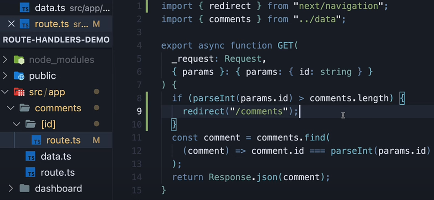

# Route handlers + Server Actions

## 1. Route handlers

1. They handle API requests and return data (e.g., JSON), status codes, headers, etc.
2. File name should always be route.ts/js
3. They are not used for rendering UI and cannot return JSX.
4. Similar to nested page.tsx, we can have nested routes.ts
5. So if the file is in /feature/lesson/route.ts - endpoint exposed would be example.com/feature/lesson
6. route.js file should need to return a function, and the name of the function should always be any one of the HTTP mthods
7. **IMP** - if **page.tsx and route.ts are in the same location, when you hit the corresponding url, route.ts would run and not page.tsx, this is similar to any other web app, if index.html is present in the root directory and if we do app.get("/", (req,res)), then app.get endpoint is called and not index.html**
8. Hence as a convention, route.ts file is always put into api folder within a nested route (see below)

  
now if we hit /profile, page.tsx will run, and /profile/api will run route.ts

```javascript
import fs from "fs";
export const GET = () => {
  console.log({ __dirname });
  const data = fs.readFileSync(__dirname + "/page.js", { encoding: "utf8" });
  // note response obj is made available in route.js to us by nextjs
  // we did not import it
  return Response.json(data);
};

// exposing a POST method on the same endpoint uri
export const POST = async (request: Request) => {
  let data = await requset.json();
  //..add this data to DB here

  // note here we are not doing Resopnse.json(), but returning a new Response obj
  // becasue Response.json() by default returns stataus code of 200
  return new Response(
    JSON.stringify(
      // since we are not doing Response.json, we manually have to Json.stringify the message
      { message: "Resource created" },
      {
        headers: {
          "Content-Type": "application/json",
        },
        status: 201,
      }
    )
  );
};
```

### handling route parameters

1. Unlike in express, where we do ``app.get(/api/comment/:id, (req, res))`, we cannot get route params using this approach in Nextjs
2. We need to take similar approach that we took while creating dynamic routes, i.e, we need to add the route.js file inside a dynamic route (foldername within square brackets [])



Note that this route file is inside [id] folder

To get the route parameter in the api, we need to use context argument (2nd argument passed into our api handler) which will have the Id

```javascript
export const GET = (request, context) => {
  // context arg above will have params obj, which will have the id
  // in the screenshot above, we are destructuring the context arg like this -  { params }
};

// similarly we can have PATCH, PUT, DELETE requests
// mostly PATCH, PUT, DELETE will require route parameter to get the id
// hence mostly they are created in [id]/route.js file only
```


Notice how redirect works in route handlers

### handling query parameters

```javascript
// to handle query parameters, we need to use the NextRequest instead of the plain Request object
import { NextRequest } from "next/server";

// instead of Request object, use NextRequest
export const GET = (request: NextRequest) => {
  // get all search params
  const searchParams = request.nextUrl.searchParams;
  //extract the param you want
  const query = searchParams.get("query");
};
```

### handling headers

```javascript
// reading headers
import { headers } from "next/headers";
export const GET = (_request: Request) => {
  const headerList = headers();
  const authHeader = headerList.get("Authorization");
  return Response.json({ authHeader });
};

// setting headers
return new Response(
  JSON.stringify(
    // since we are not doing Response.json, we manually have to Json.stringify the message
    { message: "Resource created" },
    {
      headers: {
        "Content-Type": "application/json",
      },
      status: 201,
    }
  )
);
```

### handling cookies

```javascript
// to handle cookies, we need to use the NextRequest instead of the plain Request object
import { NextRequest } from "next/server";
// instead of Request object, use NextRequest
export const GET = (request: NextRequest) => {
  const cookies = request.cookies.get("cookieName");

  // we can set cookie in headers
  return new Response("setting cookie", {
    headers: {
      "Set-Cookie": "mycookie",
    },
  });
};
```

### handling caching

Route handlers which expose GET method on a endpoint are cached by default in production by Nextjs.
Other HTTP Methods are ont cached

To opt-out of caching, we need to set segment-caching option

```javascript
export const dynamic = "force-dynamic";
// other values for dynamic -  'auto' | 'force-dynamic' | 'force-static'
// if we don't set dynamic to force-dynmic, we will get stale value
export const GET = () => {
  return ew Response.json((
    time: new Date()
  ));
};
```

## 2. Server Actions

Server actions are used to mutate data on the server side, without needing to create APIs  
Basically we can call server functions, directly from components (server component + client components)

**Points to note**

1. Server actions behind the scene uses HTTP post method to send data to server from browsers
2. So it is just an abstraction, and developers don't need to create routes and all
3. Server actions can only trigger **HTTP POST method**
4. To create server actions inside server components, the function must be async and should include a directive `use server`
5. We cannot directly create server actions in client components, but we ca create a separate actions.ts file, put all actions there and at the top of the file add `use server`, now in the client component, we can import the server actions
6. Note server action is different from server components
7. We cannot import server components from client components, we need to pass servercomponents as child to client components
8. However we can import server actions in client components, but we cannot define server actions in client components
9. Mostly server actions are added on form submissions or on button click

### 1. Server actions in server components

```javascript
import { revalidatePath } from "next/cache";
import React from "react";
const todoList = ["ABC", "PQR"];
function page() {
  // function must be async and must use directive user-server
  const addTodo = async (formData: FormData) => {
    "use server";
    // although below code is updating server variable
    // here we will directly added db call
    // mongo.db.insert()

    // reading form data
    const todo = formData.get("todo") as string;
    todoList.push(todo);

    revalidatePath("/about"); // revalidate path, so that new todList with the added todo is displayed below
  };
  return (
    <div>
      About page
      {/* server action must be passed in form action */}
      <form action={addTodo}>
        <label>Enter todo</label>
        <input name="todo" type="text"></input>
        <button type="submit">Submit</button>

        <br></br>
        <ol>
          {todoList.map((item) => (
            <li key={item}>{item}</li>
          ))}
        </ol>
      </form>
    </div>
  );
}
export default page;
```

Above code works, but what about error handling, doing form valiadtion on UI and showing pending state while the api runs?
Need to use server actions in client components

### 2. Server actions in client components

We cannot define server actions in client components, but we can import them

```javascript
"use client";
import React from "react";
import { addTodo } from "./actions"; // the todo action is same as we saw in the server component
import { useFormStatus } from "react-dom";
function Todoform() {
  // use form status to get the pending state
  const { pending } = useFormStatus();
  const firstValidateThenCallServerAction = async (formData: FormData) => {
    // here we can validate from
    // and use StateState to show any validation errors on UI
    console.log("form data");
    try {
      // this is where we can do error handling
      await addTodo(formData);
    } catch (err) {
      console.log(err); // show error on UI
    }
  };
  return (
    <div>
      <form action={(formData) => firstValidateThenCallServerAction(formData)}>
        <label>Enter todo</label>
        <input name="todo" type="text"></input>
        <button type="submit">Submit</button>
        <p>{pending}</p>
        {/* use the pending for loading purposes */}
        {pending ? "Adding todo" : "Todo Added"}
        <br></br>
      </form>
    </div>
  );
}
export default Todoform;
```

**We can call server actions in client components inside event handlers as well, and not just on form submission**

```javascript
"use client";
import { incrementLike } from "./actions";
import { useState } from "react";
export default function LikeButton({ initialLikes }: { initialLikes: number }) {
  const [likes, setLikes] = useState(initialLikes);
  return (
    <>
      <p>Total Likes: {likes}</p>
      <button
        onClick={async () => {
          // here we are calling the server action, and when it is success
          // we update the state in client using setState
          const updatedLikes = await incrementLike();
          setLikes(updatedLikes);
        }}
      >
        Like
      </button>
    </>
  );
}
```

### Server actions vs Route handlers

| Feature      | Server Actions             | Route Handlers                                           |
| ------------ | -------------------------- | -------------------------------------------------------- |
| HTTP Methods | Can only trigger HTTP POST | Supports all HTTP methods (GET, POST, PUT, DELETE, etc.) |
| Use Case     | Useful in form submissions | Useful for creating REST APIs                            |
