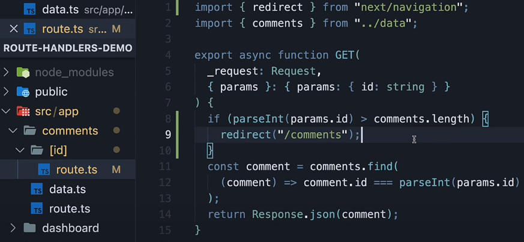

# Route handlers

1. They handle API requests and return data (e.g., JSON), status codes, headers, etc.
2. File name should always be route.ts/js
3. They are not used for rendering UI and cannot return JSX.
4. Similar to nested page.tsx, we can have nested routes.ts
5. So if the file is in /feature/lesson/route.ts - endpoint exposed would be example.com/feature/lesson
6. route.js file should need to return a function, and the name of the function should always be any one of the HTTP mthods
7. **IMP** - if **page.tsx and route.ts are in the same location, when you hit the corresponding url, route.ts would run and not page.tsx, this is similar to any other web app, if index.html is present in the root directory and if we do app.get("/", (req,res)), then app.get endpoint is called and not index.html**
8. Hence as a convention, route.ts file is always put into api folder within a nested route (see below)

  
now if we hit /profile, page.tsx will run, and /profile/api will run route.ts

```javascript
import fs from "fs";
export const GET = () => {
  console.log({ __dirname });
  const data = fs.readFileSync(__dirname + "/page.js", { encoding: "utf8" });
  // note response obj is made available in route.js to us by nextjs
  // we did not import it
  return Response.json(data);
};

// exposing a POST method on the same endpoint uri
export const POST = async (request: Request) => {
  let data = await requset.json();
  //..add this data to DB here

  // note here we are not doing Resopnse.json(), but returning a new Response obj
  // becasue Response.json() by default returns stataus code of 200
  return new Response(
    JSON.stringify(
      // since we are not doing Response.json, we manually have to Json.stringify the message
      { message: "Resource created" },
      {
        headers: {
          "Content-Type": "application/json",
        },
        status: 201,
      }
    )
  );
};
```

### handling route parameters

1. Unlike in express, where we do ``app.get(/api/comment/:id, (req, res))`, we cannot get route params using this approach in Nextjs
2. We need to take similar approach that we took while creating dynamic routes, i.e, we need to add the route.js file inside a dynamic route (foldername within square brackets [])



Note that this route file is inside [id] folder

To get the route parameter in the api, we need to use context argument (2nd argument passed into our api handler) which will have the Id

```javascript
export const GET = (request, context) => {
  // context arg above will have params obj, which will have the id
  // in the screenshot above, we are destructuring the context arg like this -  { params }
};

// similarly we can have PATCH, PUT, DELETE requests
// mostly PATCH, PUT, DELETE will require route parameter to get the id
// hence mostly they are created in [id]/route.js file only
```


Notice how redirect works in route handlers

### handling query parameters

```javascript
// to handle query parameters, we need to use the NextRequest instead of the plain Request object
import { NextRequest } from "next/server";

// instead of Request object, use NextRequest
export const GET = (request: NextRequest) => {
  // get all search params
  const searchParams = request.nextUrl.searchParams;
  //extract the param you want
  const query = searchParams.get("query");
};
```

### handling headers

```javascript
// reading headers
import { headers } from "next/headers";
export const GET = (_request: Request) => {
  const headerList = headers();
  const authHeader = headerList.get("Authorization");
  return Response.json({ authHeader });
};

// setting headers
return new Response(
  JSON.stringify(
    // since we are not doing Response.json, we manually have to Json.stringify the message
    { message: "Resource created" },
    {
      headers: {
        "Content-Type": "application/json",
      },
      status: 201,
    }
  )
);
```

### handling cookies

```javascript
// to handle cookies, we need to use the NextRequest instead of the plain Request object
import { NextRequest } from "next/server";
// instead of Request object, use NextRequest
export const GET = (request: NextRequest) => {
  const cookies = request.cookies.get("cookieName");

  // we can set cookie in headers
  return new Response("setting cookie", {
    headers: {
      "Set-Cookie": "mycookie",
    },
  });
};
```

### handling caching

Route handlers which expose GET method on a endpoint are cached by default in production by Nextjs.
Other HTTP Methods are ont cached

To opt-out of caching, we need to set segment-caching option

```javascript
export const dynamic = "force-dynamic";
// other values for dynamic -  'auto' | 'force-dynamic' | 'force-static'
// if we don't set dynamic to force-dynmic, we will get stale value
export const GET = () => {
  return ew Response.json((
    time: new Date()
  ));
};
```
