## Node.js

Node.js is an open-source and cross-platform JavaScript runtime environment.
Runs the V8 JavaScript engine, the core of Google Chrome, outside of the browser

process.env.variable_name - to read an env. variable in node.

## Why Node

1. All packages in node provide asynchronous APIs, so always asynchronous programming without threads
2. Uses npm
3. Node is fast
   runs on V8 engine which has optimised compilers - (see JS notes)

---

#### Read/Write from stdin/stdout

```javascript
const readline = require("readline").createInterface({
  input: process.stdin,
  output: process.stdout,
});

readline.on(`line`, (name) => {
  console.log(`Hi ${name}!`);
  readline.close();
});

// to convert string to number - use + unary operator before the string
// e.g. if num1 and num2 are strings containing integers, to add them use
// +num1 + num2
// use parseInt(num1, 10) base10
```

---

## Node.js modules: require, exports, imports

```javascript
(function (exports, require, module, __filename, __dirname) {
  module.exports = exports = {};
  // Your module code ...
  return module.exports;
});
//each Node.js module as a self-contained function like the following one
// this is hidden and present by default in each module
// so even if you define a global variable in a module, it is not
// accessible outside it, because it is still inside the hidden wrapper function
// then how to set a variable to global object
// use global.variableName
// global obj is similar to window obj.in browser
// this is now available in any node module (don't use global variables)
```

---

## Node.js event loop

### Libuv

Before understanding event loop, we need to understand what is libuv.  
Libuv is c code which is used to handle async non-blocking code.

#### **Libuv has 2 components** -

#### 1. **Thread pool**

no of threads available in the host machines (based on CPU cores) are available in this thread pool.

**If you run sync version of crypto, the hash time for last request would be hash time for its own + hash time of other 3 requests**  
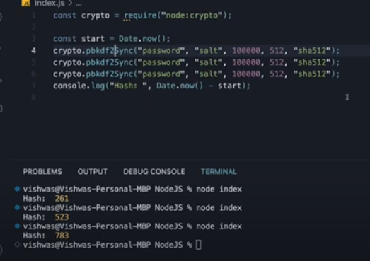

**Running them in async will give hast time same for all the hashes, because each async version of hash is run on a separate thread pool**  
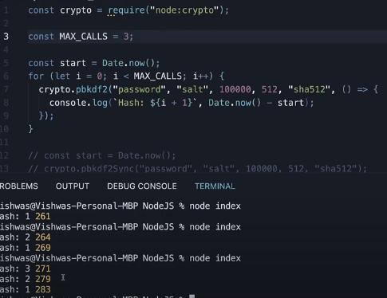

**IMP - default thradpool size is 4, see below example**  
As soon as max call is 5 or > 5, the hash time increases, because all 4 thread in the pool are busy and the 5th async task goes into queue and executes when only one of the thread from the pool becomes free

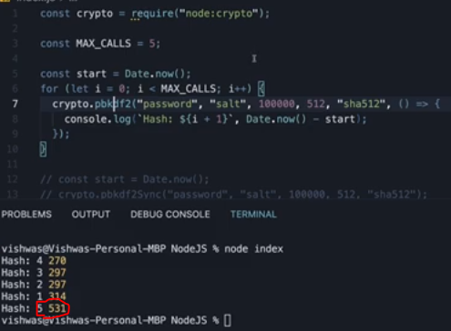

**IMP - to increase thread pool size - process.env.UV_THREADPOOL_SIZE = 8**  
**But you can increase the thread pool size maximum upto no. of cpu cores your machine has**

**Hence asyn operations are run on thread pool, but not all async operations are run on thread pool, see below** -
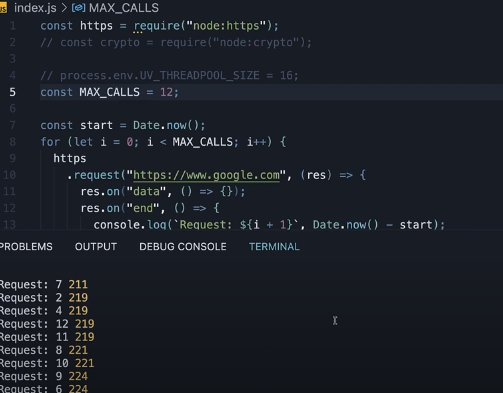  
**The Network I/O async tasks are not run on thread pool, because it is not a CPU bound operation, network I/O task is delegated to kernel by nodejs**

#### 2. **Event loop**

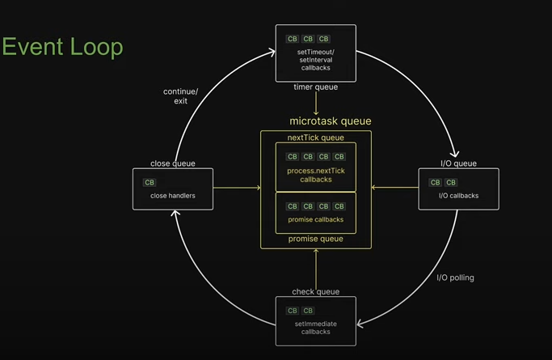

##### 1. Microtask queue (process.nextTick(), all usercreated promises)

##### 2. Timers queue (setTimeout, setInterval)

##### 3. I/O queue (fs, http)

##### 4. Check queue (setImmediate)

##### 5. Close queue (cbs associated with close events of asyns tasks, socket.on('close'))

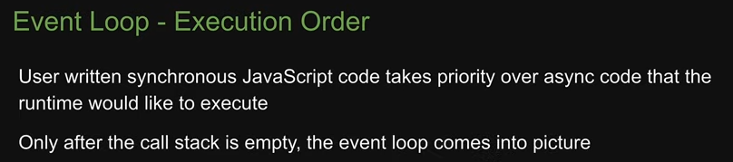  
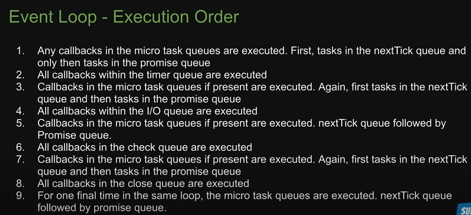

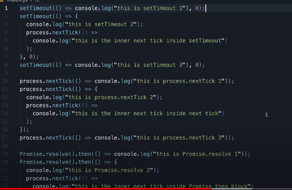  
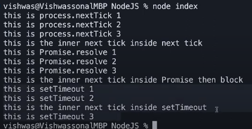  
**VVIP - Callbacks in microtask queue are executed in between the execution of callbacks in the timer queue**  
**VVIP - Callbacks in microtask queue are executed in between the execution of callbacks in the check (setImmediate) queue**

##### Unguranteed order of execution

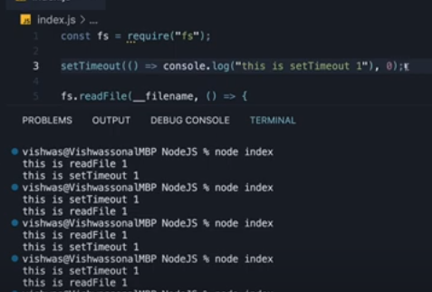  
**When running setTimeout with 0ms and async IO method, the order of execution can never be guranteed, because while the setTimeout is finished, the event loop might or might not have gone to IO callback queue, because main thread is empty and event queue is started**  
**In above example, we did not have any task running in main thread, if we add for loop for million times, then we know for sure, that cb of timeout is complete, and in this case, setimeout will always be ececuted before IO CB**

##### Usecases for process.nextTick and setImmediate

1. **process.nextTick**

```javascript
const EventEmitter = require("node:events");
type ClassData = {
  payload: string,
};
class MyClass extends EventEmitter {
  data: ClassData;
  constructor(data: ClassData) {
    super();
    this.data = data;
    // directly caaling this.emitEvent will not work, because liseners are not yet added
    // and event would be emitted before listeners are registered

    // this.emitEvent() - will not work
    // fix - first task to be executed after callstack is free
    // if can use setTimeout or setImmedaite as well, but those can get delayed since nextTick as highest priority
    process.nextTick(() => {
      this.emitEvent();
    });
  }
  emitEvent() {
    this.emit("initiate", this.data);
  }
}
const obj = new MyClass({ payload: "hello world" });
obj.on("initiate", (data) => {
  console.log("event intiated ", data);
});
```

Disadvantage of process.nextTick - everytime using process.nextTick will starve the event loop, so use wisely

### Scaling Nodejs app (Scale async tasks + sync tasks)

1. One way to scale is increase threads in the libuv pool, but this will scale only async tasks, because only async tasks can be executed in thread pool
2. What if we need to scale the tasks running on the main thread?
3. Use cluster module, **cluster module utilizes cpu cores and create multiple instances of nodeJS application based on CPU cores**
4. **Threadpool size to scale async tasks, cluster module to scale sync tasks**

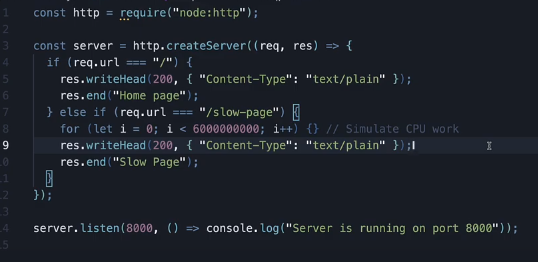 -

**In above code**  
**Case 1 - call / api (retured in few ms) and then call /slow-page (returned after 5 seconds)**
**Case 2 - call call /slow-page (returned after 5 seconds) and then call / api (retured in 5 seconds + few ms) because slow-page is still executing and / endpint is queued up**

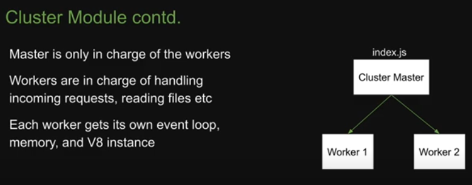  
Note - master node does not handle api calls, only worked nodes handle

Note - you can only fork the no. of processes as much as cpu cores are present in the operating system

#### using cluster module to load balance server

**standard code everytime**
CLuster module behind the scenes uses child_process module's fork api

```javascript
const cluster = require("cluster");
const http = require("http");
const numCPUs = require("os").cpus().length;
if (cluster.isMaster) {
  // Fork workers
  for (let i = 0; i < numCPUs; i++) {
    cluster.fork();
  }
  // Listen for dying workers and fork a new one
  cluster.on("exit", (worker, code, signal) => {
    console.log(`Worker ${worker.process.pid} died. Forking a new one...`);
    cluster.fork();
  });
} else {
  // Workers can share any TCP connection
  // In this case, it's an HTTP server
  http
    .createServer((req, res) => {
      res.writeHead(200);
      res.end("Hello, World!");
    })
    .listen(3000);

  console.log(`Worker ${process.pid} started`);
}
```

**problem with cluster**

1. caching becomes difficult as each worker process has different memory
2. managing user authentication sessions - // use sticky load balancers to solve this
   what it does if a uer is authenicated in a wroker process and that workers memory has session, then sticky load balancer will send the request to same worker is request comes from the same user

### PM2

1. Process manager for Node and other envs like python
2. Instead of using cluster module we can use pm2 to scale the nodejs app
3. `npm i -g pm2`
4. `pm2 start app.js -i 0` - 0 indicates, we ask pm2 to pick up optimal worker processes

---

### Working with worker threads

**focus on point 4 & 5 for cluster module vs worker threads**  
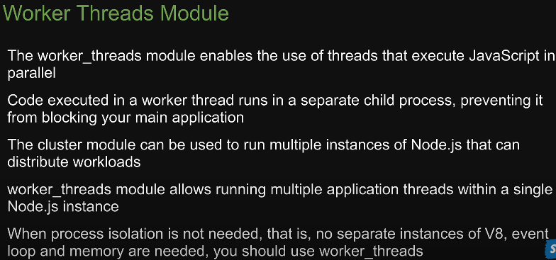

```javascript
// Parent file - index.js
const { Worker } = require("node:worker_threads");
// note while creating a worker only we need to pass the workerData
let worker = new Worker("./worker.js", {
  workerData: 5,
});
// listen to worker thread
worker.on("message", (dataFromWorker) => {
  console.log("data from worker ", dataFromWorker);
});
worker.on("error", (err) => {
  console.log(err);
});

// worker.js
const { parentPort, workerData } = require("node:worker_threads");
console.log("data from parent ", workerData);
parentPort.postMessage(workerData * 2);
```

##### Libuv thread pool vs worker threads vs cluster module (pm2)

1. **Libuv (scale async task)** - use multiple threads to scale only async tasks (promises) and not the synchronous tasks that run on main thread
2. **worker threads (scale sync task)** - use multiple threads to scale synchronous tasks and not async tasks
3. **cluster module (scale sync task)** - instead of using threads it creates multiple application instances (separate node instance, separate V8 engine), so it is multi processing as opposed to multi threading

**multi thread vs multi process** - multi thread uses shared memory for each thread

## Working with Event Emitters

It is an in-built module that implements **observer pattern** in Nodejs.

**Why to use event-emitters**

1. Decoupling components - components can communicate without needing direct references to each other
2. Async communication
3. useful in scenarios where you want to notify multiple components about a specific state change or action

```javascript
// 1. create event emitter class
// Import the EventEmitter class from Node.js
const EventEmitter  = require('events');
// Extend EventEmitter to create a custom event emitter class
export class OrderEventEmitter extends EventEmitter {
    // Additional custom methods or properties can be added here if needed
}

// 2. email servcice
import { OrderEventEmitter } from './OrderEventEmitter';
import { OrderPlaced } from './events';
export class EmailService {
    constructor(private eventEmitter: OrderEventEmitter) {
        // Register event handler
        this.eventEmitter.on(OrderPlaced, this.sendConfirmationEmail.bind(this));
    }
    sendConfirmationEmail(orderId: string, customerEmail: string): void {
        console.log(`Sending confirmation email to ${customerEmail} for order ${orderId}`);
    }
}
// 3. inventory service
import { OrderEventEmitter } from './OrderEventEmitter';
import { OrderPlaced } from './events';
export class InventoryService {
    constructor(private eventEmitter: OrderEventEmitter) {
        // Register event handler
        this.eventEmitter.on(OrderPlaced, this.updateInventory.bind(this));
    }
    updateInventory(orderId: string): void {
        console.log(`Updating inventory for order ${orderId}`);
    }
}
// 4. order service to emit the event
import { OrderEventEmitter } from './OrderEventEmitter';
import { OrderPlaced } from './events';
export class OrderService {
    private eventEmitter: OrderEventEmitter;
    constructor(eventEmitter: OrderEventEmitter) {
        this.eventEmitter = eventEmitter;
    }
    placeOrder(orderId: string, customerEmail: string): void {
        console.log(`Order ${orderId} placed`);
        // Emit the OrderPlaced event with relevant data
        this.eventEmitter.emit(OrderPlaced, orderId, customerEmail);
    }
}

// 5. app.js
import { OrderEventEmitter } from './OrderEventEmitter';
import { OrderService } from './OrderService';
import { EmailService } from './EmailService';
import { InventoryService } from './InventoryService';
// Instantiate the custom event emitter
const eventEmitter = new OrderEventEmitter();
// Instantiate services with the event emitter
new EmailService(eventEmitter);
new InventoryService(eventEmitter);
const orderService = new OrderService(eventEmitter);
// Place an order and trigger events
orderService.placeOrder('12345', 'customer@example.com');

```

**event emitter functions**

| Method                                   | Description                                                                                                        |
| ---------------------------------------- | ------------------------------------------------------------------------------------------------------------------ |
| `on(eventName, listener)`                | Adds a listener function to the specified event.                                                                   |
| `addListener(eventName, listener)`       | Alias for `on`.                                                                                                    |
| `once(eventName, listener)`              | Adds a one-time listener function for the specified event. The listener is removed after it's called once.         |
| `emit(eventName, [arg1], [arg2], [...])` | Emits the specified event, triggering all attached listeners. Additional arguments can be passed to the listeners. |
| `removeListener(eventName, listener)`    | Removes a specific listener for the specified event.                                                               |
| `removeAllListeners([eventName])`        | Removes all listeners for the specified event. If no event is provided, it removes all listeners for all events.   |
| `setMaxListeners(n)`                     | Sets the maximum number of listeners that can be added to an event. Default is unlimited.                          |
| `listeners(eventName)`                   | Returns an array of listeners for the specified event.                                                             |
| `eventNames()`                           | Returns an array of event names to which listeners are attached.                                                   |
| `listenerCount(eventName)`               | Returns the number of listeners for the specified event.                                                           |

1. similar to callbacks, but they trigger multiple listeners at once.

---

## Working with streams

It is a collection of data that might not br available all at once and don't have to fit in memory.

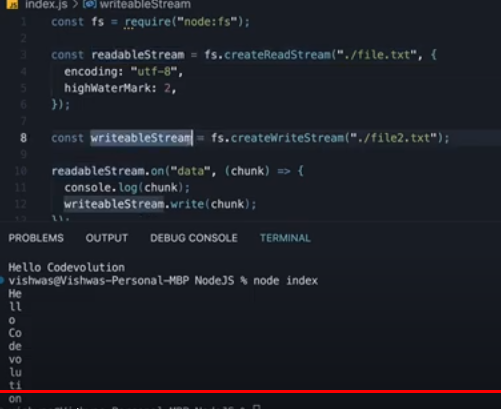  
**IMP potins**

1. Using above code we can copy 10s of GBs of file without node getting memory out of bound error
2. Notice the output, this is because of highWaterMark = 2, it indicates that the buffer can store only 2 bytes of data in memory and then need to flush the output to writable stream, default buffer size in nodejs is 64Kb

types of streams

| Stream Type                                 | Example Code                                                 | Description                                                              | Key Methods                                               |
| ------------------------------------------- | ------------------------------------------------------------ | ------------------------------------------------------------------------ | --------------------------------------------------------- |
| Readable Streams                            | `fs.createReadStream('file.txt').pipe(writableStream);`      | Represents a source of data that can be read.                            | `read()`, `on('data')`, `on('end')`, `on('error')`        |
| Writable Streams                            | `readableStream.pipe(fs.createWriteStream('output.txt'));`   | Represents a destination for data to be written.                         | `write()`, `end()`, `on('finish')`, `on('error')`         |
| Duplex Streams (e.g. - socket)              | `const duplexStream = net.connect(3000, 'localhost');`       | Represents a stream that is both readable and writable.                  | Combination of readable and writable stream methods       |
| Transform Streams (e.g. - file compression) | `readableStream.pipe(transformStream).pipe(writableStream);` | A type of duplex stream for data modification as it is written and read. | `transform(chunk, encoding, callback)`, `flush(callback)` |

```javascript
//e.g. serving file from a server
const fs = require("fs");
const http = require("http").createServer();
server.on("request", (req, res) => {
  // fs.readFile('./big.file', (err, data) => {
  //   if (err) throw err;
  //     res.end(data);
  // })

  // commented code is normal code and
  // 1. If the file is in GB and node does not have that much memory, commented code will throw memory error
  // 2. Both fs and res can be converted into streams and thus,
  // no matter how big the file is, data is sent in streams so chunk of data is stored in memory,
  // so it never goes out of memory.

  const src = fs.createReadStream("./big.file");

  // you can send the data to response stream as below
  src.pipe(res);

  // or read the data
  src.on("data", (chunk) => {
    console.log(`Received chunk: ${chunk}`);
  });
  src.on("end", () => {
    console.log("No more data to read.");
  });
});
server.listen(8000);
```

**Creating your own stream**

```javascript
// in above examples, the fs.createReadStream gives us the readble stream
// to create our own streams

// 1. Readable Stream
const { Readable } = require("stream");
class MyReadableStream extends Readable {
  constructor(options) {
    super(options);
  }
  // The read method gets executed each time the consumer is ready to consume more data
  // untill this.push(null) is called
  _read(size) {
    // in the read method we need to push the data
    // which would then be available in the on('data) event
    // Push each piece of data into the stream
    this.push(data);
    // this data can be anything, maybe a chunk from file or external datasource

    // at the end we need to push null, to notify that the stream has ended
    this.push(null);
    // if we don't push null, the read function would keep on running continuously since
    //read function is called by the stream implementation when the consumer is ready to receive more data
  }
}
// above data puched in this.push(data) would be available here
const myStream = new MyReadableStream();
myStream.on("data", (chunk) => {
  console.log(`Received chunk: ${chunk}`);
});

// 2. Writable stream
const { Writable } = require("stream");
class MyWritableStream extends Writable {
  constructor(options) {
    super(options);
  }
  // The write method gets executed each time data is written to the transform stream
  _write(chunk, encoding, callback) {
    // Simulate writing data to some destination
    console.log(`Writing data: ${chunk.toString()}`);
    // Call the callback to indicate that the write operation is complete
    callback();
  }
}
const myWritableStream = new MyWritableStream();
myWritableStream.write("Hello, ");
myWritableStream.write("world!");
myWritableStream.end(); // Indicate the end of the writable stream

// 3. Transform Stream
const { Transform } = require("stream");
class MyTransformStream extends Transform {
  constructor(options) {
    super(options);
  }
  // The _transform method gets executed each time data is written to the transform stream
  _transform(chunk, encoding, callback) {
    // Transform the data (convert to uppercase in this example)
    const transformedData = chunk.toString().toUpperCase();
    // Push the transformed data to the writable destination
    this.push(transformedData);
    // this data is available in the on('data') cb handler
    // Call the callback to indicate that the transformation is complete
    callback();
  }
}

myTransformStream.on("data", (transformedData) => {
  console.log(`Transformed data: ${transformedData}`);
});
```

#### Stream video file from server to the client

1. Server code

```javascript
const express = require("express");
const fs = require("fs");
const path = require("path");

const app = express();
const port = 3000;

app.get("/video", (req, res) => {
  // Specify the path to the video file
  const videoPath = path.join(__dirname, "path_to_your_video.mp4");

  // Retrieve file stats, including size
  const stat = fs.statSync(videoPath);
  const fileSize = stat.size;

  // Retrieve the 'Range' header from the request
  const range = req.headers.range;
  // this range header is sent automatically from the client
  // if the html tag used is <video> in the client side
  // the value of range variable looks like this
  // bytes=102400-204799
  // bytes=startposition-endposition

  if (range) {
    // Parse the 'Range' header to get the start and end byte positions
    const parts = range.replace(/bytes=/, "").split("-");
    const start = parseInt(parts[0], 10);
    const end = parts[1] ? parseInt(parts[1], 10) : fileSize - 1;
    // Calculate the size of the data chunk to be sent
    const chunkSize = end - start + 1;
    // Create a readable stream for the specified range of the video file
    const file = fs.createReadStream(videoPath, { start, end });
    // Set response headers for a partial content response
    const head = {
      "Content-Range": `bytes ${start}-${end}/${fileSize}`,
      "Accept-Ranges": "bytes",
      "Content-Length": chunkSize,
      "Content-Type": "video/mp4",
    };
    // Respond with a 206 (Partial Content) status code and send the data chunk
    res.writeHead(206, head);
    file.pipe(res);
  } else {
    // If no 'Range' header is present, send the entire video file
    const head = {
      "Content-Length": fileSize,
      "Content-Type": "video/mp4",
    };
    // Respond with a 200 (OK) status code and send the entire file
    res.writeHead(200, head);
    fs.createReadStream(videoPath).pipe(res);
  }
});
app.listen(port, () => {
  console.log(`Server is running at http://localhost:${port}`);
});
```

2. Client code

```html
<!DOCTYPE html>
<html lang="en">
  <head>
    <meta charset="UTF-8" />
    <meta name="viewport" content="width=device-width, initial-scale=1.0" />
    <title>Video Streaming Example</title>
  </head>
  <body>
    <video width="640" height="360" controls>
      <source src="http://localhost:3000/video" type="video/mp4" />
      Your browser does not support the video tag.
    </video>
  </body>
</html>
```

---

## Scaling node.js apps

### Child process

to scale node app, using multiple processes is the only option
use the cores that are provided by operating system
os modules - os.cpu().length gives is no. of cores in the operating system

child process module - inbuild module in node - this module enables us to use os functionality by running system command inside child process  
4 ways to create a child process

1. spwan() - creates new process - can run shell commands
2. exec() - same as spawn but opens new shell and o/p is stored in buffer
3. execfile() - same as exec but runs a shell file instead of opening shell and executing command
4. fork() - similar to spawn, it creates new process, and establishes the communication (using event emitters) between

```javascript
// e.g. using spaen
const {spawn} = require('child_process');
// in spawn we pass shell.cmd commands
const child = spawn('dir');
// for windows use
const child = spawn('dir', {shell: true})
// optional array of arguments is passed as
// second parameter if the command has arguments
// here child is an instance of event emmitters
// so we can emit events on child obj above
child.on('exit', (code, signal) => {
  console.log('CHild process exited with code', code)
});
child.stdout.on('data', (data) => {
  console.log(data);
})
// other events available - disconnect, error, message, close
// stdio objects avaialble - child.stdin, child.stdout
// close event occurs when the stdio on child is closed
// exit when the child process done the execution

//e.g. 2 using exec
// frst arg in exec is the exact command we pass in shell
const {exec} = require('child_process');
exec('npm --version', (err, stdout, stderr) => {
  if(err)return error;
  console.log('output ', stdout);
  // output is stored in stdout variable
});

//use spawn when o/p of command is big, as we can use streams
//use ecec if o/p is small, as data is stored in buffer

//e.g. 3 fork
// parent.js
const {fork} = require('child_process');
const forked = fork('child.js');
forked.on('message', (msg) => {
  console.log('Message from child', msg);
});
forked.send({hello: 'world'});

// child.js
process.on('message', (msg) => {
  console.log('Message from parent', msg)l
})
let counter = 0;
setInterval(() => {
  process.send({counter: counter++});
},1000);
// on child -
// process.send(msg)
// process.on('message', function(msg) {})
```

## Node js Security

### 1. Helmet - secures express / Nestjs apps by setting HTTP response headers

```javascript
import express from "express";
import helmet from "helmet";
const app = express();
// Use Helmet!
app.use(helmet());
app.get("/", (req, res) => {
  res.send("Hello world!");
});
```

#### Default headers set by Helmet

##### 1. **Content-Security-Policy**

- CSP defines rules on where resources can come from (scripts, images, styles).
- When the browser renders a page, the browser enforces these rules by blocking unauthorized resources.

1. **XSS attack** - attacker injects malicious executable scripts into the code  
   **XSS attack - Cross site scripting attack** -
   You have an input and also have document.getElemntById("a").innerHTML = userInput, and you are getting input from the url = /?userInput="", if userInput is not sanitised, whatever is passed in innerHTML wil get rendered  
   ` {
  if (event.origin === "https://your-domain.com") {
    // Check the origin for security
    console.log("Received message:", event.data); // Log the message content
  } else {
    console.warn("Untrusted origin:", event.origin);
  }
});
//The message event is fired on a Window object when the window receives a message,
// for example from a call to Window.postMessage() from another browsing context
```

TO avoid an cross comunication between different domains (which can result in data leak), set the cross origin openeer policy header

```javascript
// default value set by helment-
// Cross-Origin-Opener-Policy: same-origin

// configuing in helmet
// Sets "Cross-Origin-Opener-Policy: same-origin-allow-popups"
app.use(
  helmet({
    crossOriginOpenerPolicy: { policy: "same-origin-allow-popups" },
  })
);
```

##### 3. Referrer policy (more of a privacy header as opposed to security header)

When your app has a link to some different site, browser automatically sets referrer header - which will include your app url (including query params), which is available for the site where the user is redirected to.  
Now if your apps query params has some info, like user_name or something, it is shared with the new site when user redirects to that site from your site (like button or link click), let's say your site has a link to YT video, then query params are also shared with YT site which has username in it.

**Browsers by default add referrer details for logging and statistics purposes**

To avoid this, use this header

```javascript
app.use(
  helmet({
    referrerPolicy: {
      policy: "no-referrer", // referrer header is not added by the browser when user is getting redirected
    },
  })
);
```

**In modern browsers, there is a new value (which is also a default value) - strict-origin-when-cross-origin**

**strict-origin-when-cross-origin** -

- for same origin, enire url including query params is sent
- for cross origins - only domain name is sent
- for https to http redirects - no-referrer gets applied

##### 4. Strict Transport Security

Informs browsers that the site should only be accessed using HTTPS, and that any future attempts to access it using HTTP should automatically be converted to HTTPS.

```javascript
// Sets "Strict-Transport-Security: max-age=15552000; includeSubDomains"
app.use(helmet());
// even subdomains need to be using https
```

##### 4. X-Powered-By

Helmet removes the X-Powered-By header, which is set by default in Express and some other frameworks

```javascript
// Not required, but recommended for Express users:
app.disable("x-powered-by");

// Ask Helmet to ignore the X-Powered-By header.
app.use(
  helmet({
    xPoweredBy: false,
  })
);
```

### 2. CORS (cross-origin-resource-sharing)

**Note - helmet does not have capability to configure this header, hence need to use cors header separatley**

- By default, web browsers block cross-origin requests for security reasons.
- CORS provides a way for a server to allow some cross-origin requests while rejecting others.

**3 concepts in CORS**

1. **Preflight request** - browser first sends an OPTIONS request (other than GET/HEAD/POST) to the server to check if the CORS policy allows the actual request.
2. **Response headers** - Access-Control-Allow-Origin, Access-Control-Allow-Methods, Access-Control-Allow-Headers
3. **Credentials** - Cookies or authentication headers are sent only if the server permits it with the Access-Control-Allow-Credentials header set to true

```javascript
app.use(cors({
  origin: 'www.example.com',
  methods: ['GET', 'POST'] // if a client sends del req, then it gets blocked
  credentials: true // by default cookies are blocked when using cors header
}))

// the origin property above can take a function as well to dynamically configure origins
// lets say one originA should access only endpointA and originB should access only endpointB
// in this cases we can dynamically configure cors
const express = require('express');
const cors = require('cors');
const app = express();
// Define your CORS configuration function
const corsOptions = (req, res, next) => {
  const origin = req.headers.origin;
  // Define allowed origins and their respective endpoints
  const allowedOrigins = {
    'https://allowed-origin-1.com': ['/endpoint1'],
    'https://allowed-origin-2.com': ['/endpoint2'],
  };
  // Get the paths of the requested endpoint
  const requestedPath = req.path;
  // Check if the origin is allowed for the requested path
  for (const [allowedOrigin, paths] of Object.entries(allowedOrigins)) {
    if (origin === allowedOrigin && paths.includes(requestedPath)) {
      res.header('Access-Control-Allow-Origin', origin);
      res.header('Access-Control-Allow-Methods', 'GET, POST, PUT, DELETE, OPTIONS');
      res.header('Access-Control-Allow-Headers', 'Content-Type, Authorization');
      if (req.method === 'OPTIONS') {
        return res.sendStatus(200);
      }
      return next();
    }
  }
  // If origin is not allowed for the requested path, respond with a 403 error
  res.status(403).json({ message: 'Forbidden' });
};
// Use the CORS configuration middleware
app.use(cors(corsOptions));
// only origin1 can access below endpoint1
// origin2 cannot access endpoint1
app.get('/endpoint1', (req, res) => {
  res.send('This is endpoint 1');
});
app.get('/endpoint2', (req, res) => {
  res.send('This is endpoint 2');
});
```

### 3. DoS attack

### 4. SQL Injection

- Use ORM / query builders
- Need to learn Prisma

### 5. Input Sanitization

- use validator - for input sanitizing, but doesn't prevent XSS attacks
- use DOMPurify npm package - to prevent XSS attacks
- use zod to validate input schema (frontend + backend)

1. validator - for sanitising and escaping inputs

```javascript
var validator = require("validator");
validator.isEmail("foo@bar.com");
// is jwt, isDate and mainy other functions available on validator
// mainly we need to use escape to safely parse any malformed data
validator.escapt(input); // replace <, >, &, ', " and / with HTML entities.
```

2. DOMPurify -

```javascript
// DOMPurify on client
import DOMPurify from "dompurify";
const clean = DOMPurify.sanitize("<b>hello there</b>");
// now we can safely add above clean object as innerHTML

DOMPurify.sanitize(""); // becomes 

// DOMPurify on server
// DOMPurify is required in server incases
// where we need to store HTML like data on the backend
// if we are storing data from rich text editor on server
const createDOMPurify = require("dompurify");
const { JSDOM } = require("jsdom");
const window = new JSDOM("").window;
const DOMPurify = createDOMPurify(window);
const clean = DOMPurify.sanitize("<b>hello there</b>");
```

Zod - see Zod usage at the bottom

### 6. Authentication + Authorization

## Nodejs Performance

### 1. Profile Nodejs app to gather performance report

- nodejs inspect
- performance observer

### 2. Use cluster module / pm2 / libuv increase thread pool size

### 3. gzip

### 4. Promise.all

### 5. Streaming

### 6. Caching - Redis

## Nodejs Error handling

### Using express middleware

By default if we thrown error in route handlers in express, the response is not returned and the thread os blocked, and the error is not handled.

**Normal route handler**

```javascript
const express = require("express");
const app = express();
app.use("/login", (req, res) => {
  if (!req.user) {
    throw new Error("error"); // never do this,
  }
  res.json({ message: "login successful" });
  // this response is never returned and we lost 1 thread
  // always use try cacth above and return 500 errro response in catch block
  // this will be tedious to do for every api handler
});
```

**create a generic middleware**

```javascript
// middleware.js file
// note the frst arg is error and only if we provide 4 args
// the express knows that this is a error middleware
// also this app.use should be called after every route handler is defined

// the purpose of this file is to throw specific errors
// the control to throw specific errors is with resp route handlers
const AppError = require("../AppError");
const errorHandler = (error, req, res, next) => {
  console.log(error);

  // check for validation error
  if (error.name === "ValidationError") {
    return res.status(400).send({
      type: "ValidationError",
      details: error.details,
    });
  }
  // check if we are throwing custom error
  // this way route handler can decide what error it needs to throw
  if (error instanceof AppError) {
    return res.status(error.statusCode).json({
      errorCode: error.errorCode,
    });
  }
  return res.status(500).send("Something went wrong");
};
module.exports = errorHandler;
```

**custom error class**

```javascript
// AppError.js
class AppError extends Error {
  // nothing specific, just extends the Error class
  constructor(errorCode, message, statusCode) {
    super(message);
    this.errorCode = errorCode;
    this.statusCode = statusCode;
  }
}

module.exports = AppError;
```

**create generic tryCatch**

```javascript
// it is like a higher order function
// it takes a function and addes a try catch behaviour
export const tryCatch = (controller) => async (req, res, next) => {
  try {
    await controller(req, res);
  } catch (error) {
    // note, we are just forwarding the error to nect middleware
    // ultimately the error handler middleware will handle this error
    return next(error);
  }
};
```

**now after adding custom error class, generic trycatch and error handling middleware** - all the routes are noe error handled as shown below

```javascript
// now in all route handlers, just wrap it in tryCatch and
// throw any error without breaking the app
app.get()"/test", tryCatch(async (req, res) => {
  const user = getUser();
  if (!user) {
    throw new Error("User not found");
  }

  return res.status(200).json({ success: true });
})
```

## Zod (Zero dependencies, very light weight)

It is a schema declaration and validation library  
Zod works where TS fails -
E.g.

```typescript
type Product = {
  id: number;
  name: string;
};
// somewhere in the component
fetch("/api/products")
  .then((res) => res.json())
  .then((data: Products) => {
    // use data as intended
  });
// this works TS won't throw any error
// but TS is only at compile time
// what if the /api/products changed which is not in your control
// and now name is not returned and we you doing somethig link
data.name.toUperCase(); // this will fail in above case
// TS won;t catch this becuse it checked the types at compile time only

// use Zod
```

Where all we should use Zod?

1. On client side, when data comes from

- api call from backed
- api call from thirdparty
- url prarams
- user inputs from from data

2. On server, when data comes from

- client
- webhooks
- filesystem
- DB (not necessary if we use ORMs)

**Zod usage**

```javascript
const { z } = require("zod");
// Define a schema for user input validation
// create all scehmas in separate files
// for schema common on ui and server
// create lib folder accessible to both
const userSchema = z.object({
  username: z.string().min(3, "Username must be at least 3 characters long"),
  email: z.string().email("Invalid email address"),
  age: z.number().int().positive("Age must be a positive integer"),
  subscribed: z.boolean().optional(), // Optional field
});
// Simulate user input
const inputData = {
  username: "JohnDoe",
  email: "johndoe@example.com",
  age: 28,
  subscribed: true,
};
// Validate input using Zod schema
const validationResult = userSchema.safeParse(inputData);
// validationResult is an object with success, error and data properties

// NOTE THAT WE NEED TO USE validationResult and not inputData further in the code
if (validationResult.success) {
  console.log("Validation passed", validationResult.data);
} else {
  console.log("Validation failed", validationResult.error.errors);
}
```

**Aprat from being lightweight library, another big benofot is we can create TS types using Zod schema directly making Zod schema, a single source of truth**  
E.g.

```javascript
let product = productdatafromAPI;
// validate product again the schema
const validationResult = productSchema.safeParse(product);
// now we can continue using validationResult safely
// but lets say we have utility function which takes this product as input

const utilityFunc = (product: Product) {
  // process product
}

// we need to things to check the types
// 1. zod schema
const productSchema = z.object({
  name: z.string(),
  price: z.number(),
});

// 2. TS type
// because utility function will need Product type
// otherwise TS will complain
type Product = {
  name: string,
  price: number,
};

// creating a zod schema and TS interface for product is redundant
// because we know both will name and price

// so instead of creating a TS type again with same attributes
// we can infer the type from Zod Schema
type Product = z.infer<typeof productSchema>;

// hence not Zod becomes a single source of truth

```

**Common Zod types** -

| Zod Type      | Description with Chaining Example                                                                      |
| ------------- | ------------------------------------------------------------------------------------------------------ |
| `z.string()`  | `z.string().min(2, "Must be at least 2 characters")` - Validates string length.                        |
| `z.number()`  | `z.number().int().positive("Must be a positive integer")` - Validates numbers.                         |
| `z.boolean()` | `z.boolean().optional()` - Validates boolean values, allowing it to be optional.                       |
| `z.object()`  | `z.object({ name: z.string(), age: z.number().optional() })` - Validates objects with key-value pairs. |
| `z.array()`   | `z.array(z.string()).nonempty("Array cannot be empty")` - Validates non-empty arrays of strings.       |

**Applying custom validation logic using refine() method** -

```javascript
const passwordSchema = z
  .object({
    password: z.string().min(6, "Password must be at least 6 characters long"),
    confirmPassword: z
      .string()
      .min(6, "Confirm Password must be at least 6 characters long"),
  })
  .refine(
    (data) => data.password === data.confirmPassword, // Custom validation: passwords must match
    {
      message: "Passwords do not match", // Error message
    }
  );
```
