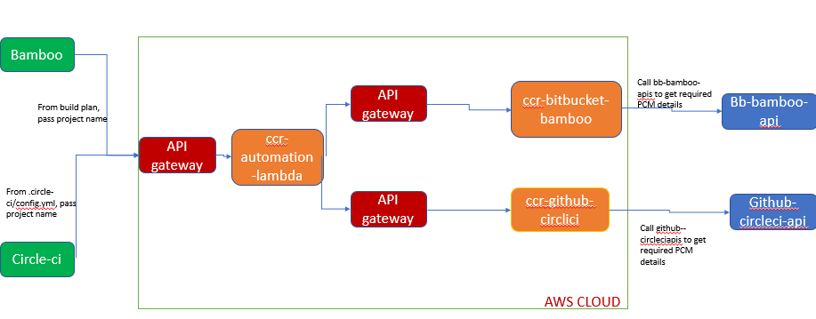

# Change Release automation

Purpose - To automate PCM

## Requirements

PCM requires  

1. PCM 1st and 2nd level approver - (coming from last PR approvers), 3rd level - manual PCM
2. PCM creater - PR creator
3. PCM deploy date - 24hrs from PCM approve (PCM automatically approved using this automation)
4. Change log - PR description

## Working

3 Lambda functions - (ccr-bitbucket-bamboo, ccr-github-circleci, ccr-automation)  
 

### Lambda function

```javascript
// method name needs to be handler, which will get called when lambda function runs
export const handler = async (event, context) => {
  // ebent contains anything that is passed to lambda function
  const length = event.length;
  const width = event.width;
    
  // context contains info like runtime env. and where the logs are stored  
  console.log('CloudWatch log group: ', context.logGroupName);

    return JSON.stringify(data);
    
};
```

### Lambda trigger - 
1. S3
2. update in dynamoDB
3. API gateway

### API Gateway - we used api gateway with api key to trigger lambda function
1. login to API gateway
2. create API - Rest api (other options HTTP)
3. create resource - get / post
4. while creating resource specigy lambda function name which needs to be trigerred
5. anything passed in post methid will be availble in **events** param of handler method of lambda

### Serverless deploy
1. used serverless deploy to deploy lambda functions via CICD
2. npm i -g serverless
3. then run command serverless deploy

**serverless.yml** - 

```yml
service: aws-node-rest-api

frameworkVersion: "3"
provider:
  name: aws
  runtime: nodejs18.x
  lambdaHashingVersion: '20201221'

functions:
  hello:
    handler: handler.hello # hello is name of function of your local file which needs to be deployed
    events:
      - http:
          path: /
          method: get
```

### CircleCI

THen in CircleCI - in config.yml file run serverless deploy command, which will read serverless.yml file and to the deployment
