# Index

1. **ER Model** - Entity(Object) have attributes(simple, multivalued, derived, composite), relationship(association between entities, are also tables, e.g.(cutomer is 1 table, account is another table, thus depositor is relation with attributes(custID, accntNum, access-date) since access date/other related attributes don't make sense in cust/acct table)), cardinalities(1:1,1:many,many:many), keys(super(set of attributes uniquely identify tuple), candidate(minimal of super), primary(any 1 of candidate))
2. **SQL** - Rules - (**in select** - (distinct, all, as(for display), limit, rownum, top(useful to find nth greates/smallest - to find 5th greatest- nested query find top 5, then min of 5), aggregate(min, max, sum, cnt, avg)), **in from** - (as - (imp when querying same table again (find all branches where asset greater then brooklyn branch), same table as branchNM and asset), in from branch as T, branch as S, where T.asset>S.asset, select - T.branchNM), **in where** - (and, between, like(to match substring), **order by** - only attributes from select, desc, for sorting in display, **group by - cloumnNm** - group multiple tuples having same val, then use aggregate funcs), **having - aggr func** - predicates in having clause are applied after groups are created)
3. **Nested queries** - after where clause - (in, not in, some, all, exists, not exists, unique) get tuples from 1 qurey and use that as input for outer query (both queries having different table makes this powerful), similar to join
(joins can be faster - (because the server might be able to optimize it better), nested queries - better readibility)
4. **Joins** - combine data or rows from two or more tables based on a common field, types(inner, left/right/full outer), inside from (table-1 join type table-2 on cloumnNm), natural - (ordering of tuples, frst common, thrn of left tsble then right - table-1 natural full outer join table-2)
5. **Functional dependencies** - func dep(A->B), rules(reflexivity(B subset of A e.g.(XY->X n XY->Y), augmentation(A->C then AB->CB), transitivity, union(A->B, A->C then A->BC), decomposition(oppo. of union), pseutransitivity(A->B, YB->C, then AY->C), if AB determine all other columns of the table then AB is a candidate key)
6. **Normalization** - why(avoid data redundancy n modification anamolies), 1-NF(must have a key, all attributes must have atomic(is relative, if system req. full date every time, then full date is atomic otherwise DD,MM n YY are atomic) values), 2-NF(1-NF + non key attributes(not part of candidate key) must not depend on subset of candidate key, convert to 2-NF - if func dep A->B violates, then move column A,B to new table n A is primary key), 3-NF(2-NF + non-prime attributes must be non-transitively dependent on every super key(non-prime key must be dependent on superkey), convert to 3-NF same as 2-NF), BCNF(non-prime **+ prime attributes** must depend on super/candidate key), EKNF(less strict than BCNF - instead of all attributes, only some/managable attributes), Denormalization(normalization not good for analytical systema - harms performance, do de-normalization after normalization, store query result in table/materialized view)
7. **DB design steps** - (1. Req. gathering 2. create ER diagram 3. convert ER to tables(1. create table for each entity, 2. for 1:many relations, use foreign key in manywala table, 3. form many:many relations - create new table na dd PK of both tables as FK in new table) 4. Idenfity Func deps 5. Normalize 6. Modify ER after Normalize 7. Create DB 8. Create queries 9. do Indexing)
8. **DB indexing** - index file(constins search key and pointer to actual record), types(**1. Ordered** - (1. Primary - (order of tuples and order of index is same, for secondary index (must be dense), not same), mostly search key is primary key), 2. Dense index - all unique vals for key also available in index search key, sparse - !all available), 3. Multilevel **2. Hash index** - search keys are uniformly distributed among buckets using hash func
9. **Hashing** - 1. static(only maps search leys to fixed set of buckets, if DB size grows, still this hashing maps to same set of buckets) 2. dynamic(hash func modifies dynamically (hash finc to check only i bits(LSB), so buckets = 2 raise to i, buckets full, i++) 3. consistent, (for range Queries ordered indeices are preferred)
10. **Stored procedures** - grp of SQL statements, same as funcs in programming, syntax (create Procedure ProcNM @Gender nvarchar(10) @empCnt int output as Begin <<SQL query>>) call (Declare @cnt int Execute ProcNM 'Male' @cnt out if(@cnt is null) print 'null' else print @cnt), inbuilt procs - sp_help procedure_name, sp_depends proc_nm

## SQL

  
DBMS (Database management systems) like SqlServer, MySQL, Oracle, PostgreSQL they read the SQL queries and then actually do the CRUD operations in physical DB.
Users cannot directly work with DB, they use any one of the DBMS

### Datatypes

1. MySQL
| Data Type     | Description                                            |
|---------------|--------------------------------------------------------|
| INT(n)        | Integer                                                |
| VARCHAR(n)    | Variable-length character string (e.g., CHAR(50), if "ashish" is stored, memory used is 50 bytes; in VARCHAR(50), if "ashish" is stored, memory used is 6 bytes) |
| CHAR(n)       | Fixed-length character string                          |
| TEXT          | Variable-length text                                    |
| DATE          | Date                                                   |
| TIME          | Time                                                   |
| DATETIME      | Date and time                                          |
| FLOAT(p, d)   | Floating-point number                                  |
| DOUBLE(p, d)  | Double-precision floating-point number                 |
| DECIMAL(p, d) | Fixed-point number                                     |
| BOOLEAN       | Boolean value                                          |
| ENUM('val1', 'val2', ...) | Enumeration                           |
| SET('val1', 'val2', ...)  | Set of values                           |
| BLOB          | Binary large object                                    |
| JSON          | JavaScript Object Notation                             |

2. SQL
| Data Type          | Description                                                    |
|--------------------|----------------------------------------------------------------|
| int                | Integer                                                        |
| bigint             | Big integer                                                    |
| smallint           | Small integer                                                  |
| tinyint            | Tiny integer                                                   |
| decimal(p, s)      | Fixed precision and scale numeric                              |
| numeric(p, s)      | Fixed precision and scale numeric                              |
| float(n)           | Floating point number                                          |
| real               | Real number                                                    |
| money              | Monetary values                                                |
| smallmoney         | Monetary values, small range                                   |
| char(n)            | Fixed-length character string                                  |
| varchar(n)         | Variable-length character string                               |
| text               | Variable-length text                                           |
| nchar(n)           | Fixed-length Unicode character string                          |
| nvarchar(n)        | Variable-length Unicode character string                       |
| ntext              | Variable-length Unicode text                                   |
| binary(n)          | Fixed-length binary data                                       |
| varbinary(n)       | Variable-length binary data                                    |
| image              | Variable-length binary data (deprecated)                       |
| datetime           | Date and time                                                  |
| smalldatetime      | Date and time with smaller range                               |
| datetime2(p)       | Date and time with fractional seconds                          |
| datetimeoffset(p)  | Date and time with time zone                                   |
| date               | Date                                                           |
| time(p)            | Time without time zone                                         |
| timestamp          | Row version                                                    |
| uniqueidentifier   | Unique identifier (GUID)                                       |
| xml                | XML data type                                                  |
| sql_variant        | Stores values of various SQL Server-supported data types       |
| geography          | Spatial data representing points, lines, and polygons           |
| geometry           | Spatial data representing points, lines, and polygons           |
| hierarchyid        | Represents a position in a hierarchy                           |


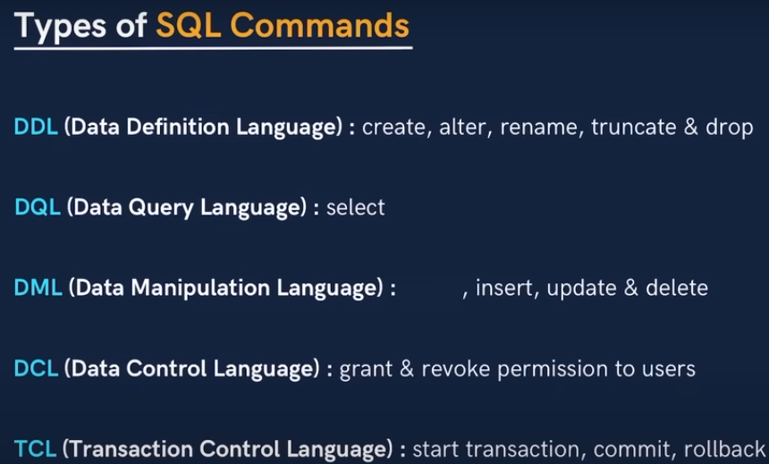

### DB related queries

| Query Syntax                                       |
|----------------------------------------------------|
| CREATE DATABASE IF NOT EXISTS database_name;                     |
| DROP DATABASE IF NOT EXISTS database_name;                       |
| USE database_name;                                 |

### Table related queries

| Query Syntax                                           |
|--------------------------------------------------------|
| CREATE TABLE table_name (column1 datatype, column2 datatype, ...);                                      |
| ALTER TABLE table_name ADD column_name datatype;                                       |
| ALTER TABLE table_name DROP COLUMN column_name;                                        |
| ALTER TABLE table_name MODIFY COLUMN column_name datatype;                              |
| ALTER TABLE table_name RENAME TO new_table_name;                                        |
| ALTER TABLE table_name ADD CONSTRAINT constraint_name PRIMARY KEY (column_name);          |
| ALTER TABLE table_name DROP PRIMARY KEY;                                                 |
| ALTER TABLE table_name ADD INDEX index_name (column_name);                                |
| ALTER TABLE table_name DROP INDEX index_name;                                             |
| ALTER TABLE table_name ADD FOREIGN KEY (column_name) REFERENCES other_table(other_column); |
| ALTER TABLE table_name DROP FOREIGN KEY fk_name;                                          |
| SHOW TABLES;                                                                             |
| SHOW COLUMNS FROM table_name;                                                            |
| SHOW CREATE TABLE table_name;                                                            |
| DROP TABLE table_name;                                                                   |

### Constraints

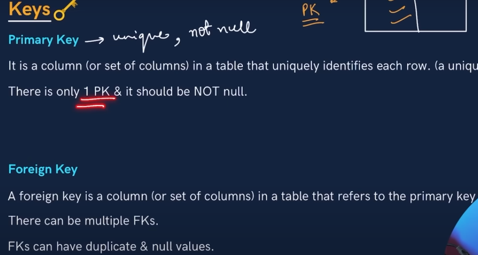
Foreign key refers to primary key of another table

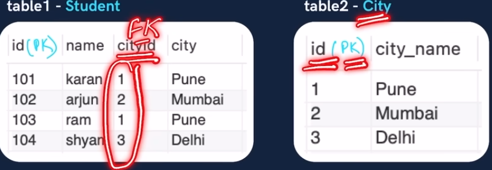

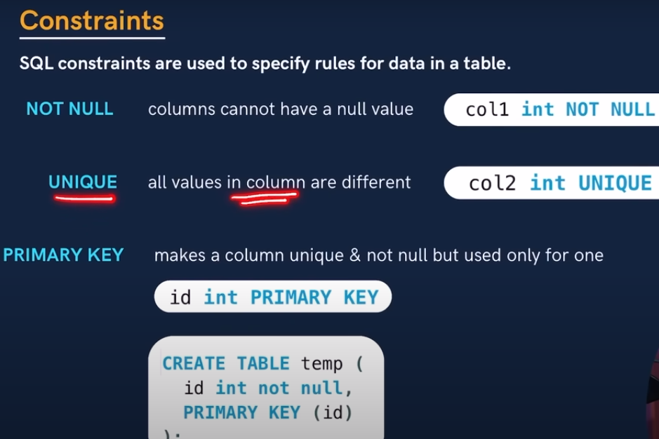

###### Primary key syntax

```SQL
CREATE TABLE table_name (
    column1 datatype PRIMARY KEY,
    column2 datatype,   
);
CREATE TABLE table_name (
    column1 datatype,
    column2 datatype,
    PRIMARY KEY (column1, column2)
);
ALTER TABLE table_name
ADD PRIMARY KEY (column1);
ALTER TABLE table_name
DROP PRIMARY KEY;
```

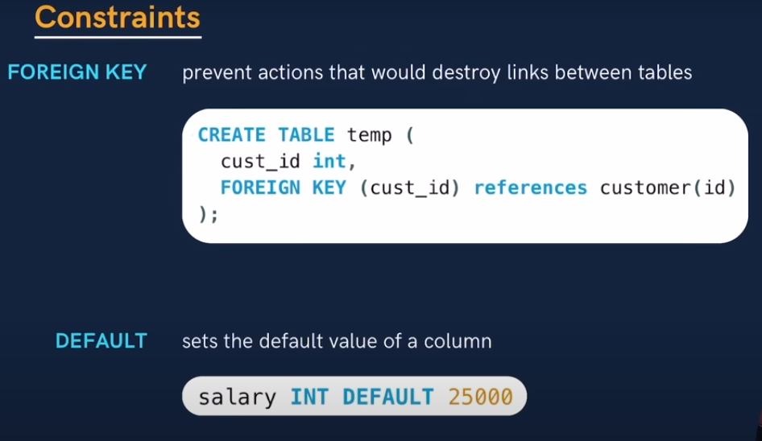

###### Cascading foreign keys

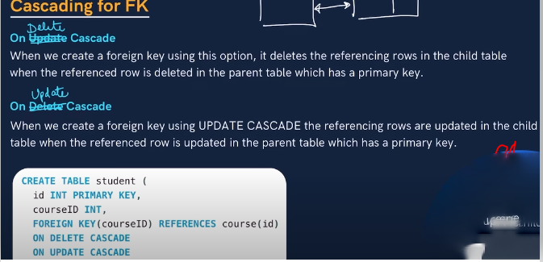

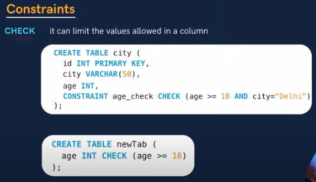

### Select clause

| Keyword/Function    | Description                                                      | Example                                                              |
|---------------------|------------------------------------------------------------------|----------------------------------------------------------------------|
| Column Names        | Select specific columns from a table.                            | `SELECT column1, column2 FROM table_name;`                           |
| \* (Asterisk)      | Select all columns from a table.                                 | `SELECT * FROM table_name;`                                          |
| DISTINCT            | Return unique values in the result set.                           | `SELECT DISTINCT column_name FROM table_name;`                       |
| AS                  | Alias column names or expressions.                               | `SELECT column_name AS alias_name FROM table_name;`                  |
| CONCAT              | Concatenate strings.                                             | `SELECT CONCAT(column1, column2) AS concatenated_column FROM table_name;` |
| Mathematical Operators | Perform arithmetic operations.                                 | `SELECT column1 + column2 AS sum FROM table_name;`                   |
| Aggregate Functions | Perform calculations on a set of values.                         | `SELECT COUNT(column1) AS count FROM table_name;`                    |

If multiple columns are used in DISTINCT like `select distinct rollno, name`, then the combination of rollno and name would be unique

### Where Clause

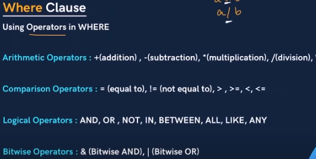

All and ANY Compares a value to each value returned by a subquery.  
Example: `column_name = ANY (subquery), column_name > ALL (subquery)`

## Aggregate funcs

1. MIN
2. MAX
3. COUNT
4. AVG
5. SUM

```SQL
select MAX(marks) from students;
```

### Sub queries

Subqueries can be written inside select, from and where clause (mostly written inside where clause)  

#### Question - Get nth highest / lowest salary

Logic - get top n employees salary in a subquery  
use this query as a table (which is called subquery) and on that data to Min / Max

```SQL
-- get 3rd highest salary
-- in MySql
-- note how we are using subquery in the from caluse, mostly ued in where clause
select MIN(emp.salary) from (
select salary
from employee
order by salary desc
limit 3) as emp;

-- in Sql server
SELECT MIN(emp.salary)
FROM (
    SELECT TOP 3 salary
    FROM employee
    ORDER BY salary DESC
) AS emp;
```

### Group by clause

It groups the result of the query based on the the columns listed in group by clause then on thet grouped columns aggregate functions are run

```SQL
select city, count(name)
from students
group by city
```

In above query, all the tuples having same city name are grouped and on that group count func is run  

**Multiple columns group by Note - all the columns listed in select clause apart from aggregate functions need to be listed in the group by clause (see below query)**  -

```SQL
select city, name, count(name)
from students
group by city, name
```

In above query, the tuples returned from the students table are grouped based on city and name column as a new group,  
**Understand this** - (So if there are 2 unique cities and 2 unique names, then the group by wil return 2 raise to 2 = 4 rows, if 3 unique names for 2 cities then 2 raise to 3 = 8 rows)

**basically - each unique combination of name and city would be a new group**

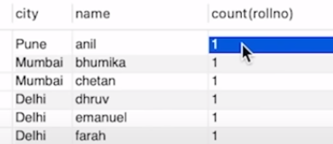  
So if there are 2 Anils in Pune city, the count of frst row would be 2

### Having clause

We frst need to understamd order of ececution of SQL query  

1. **from clause** is run to get the initial data from the table
2. **join** is run if data is to be retireved from multiple tables
3. **where clause** is run to filter the data
4. **group by clause** is run to further reduce the tuples by grouping them
5. **having clause** is run to further filter the grouped data
6. **select clause** is run to determine which columns to include in the result
7. **distinct** to further filter the data by removing duplicate rows
8. **order by**
9. **limit**

so basically having cluase is similar to where clause but where clause applies condition on rows, and having applies condition on grouped results  
**(Note - don't assume that having condition needs to have columns from group by clause)**
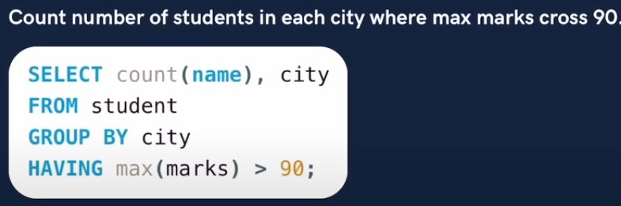

## Table realted queries

### 1. Update

```SQL
UPDATE table_name
SET column1 = value1, column2 = value2, ...
WHERE condition;
```

GROUP BY and HAVING clauses are not directly supported in the UPDATE / DELETE statement  
**workaround - use subqueries**

```SQL
UPDATE table_name
SET column1 = value1
WHERE id IN (
    SELECT id
    FROM table_name
    GROUP BY column2
    HAVING COUNT(*) > 1
);
```

### 2. Delete

```SQL
DELETE FROM table_name
WHERE condition;
```

We can use above workaround in DELETE query as well

### 3. Alter - to change table schema

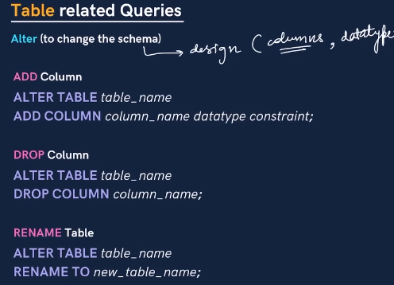
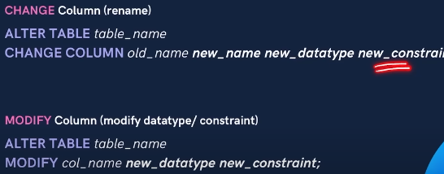

If we modify the datatype of a column  

1. If the datatype is compatible (changing from int to BigInt - works, BigInt to Int - data loss)
2. If datatpe if incompatible (varchar to int) - modify command will fail, need to manually address the datatype conversion

### 4. Truncate

```SQL
TRUNCATE TABLE TABLE_NAME
```

**Drop table** - deletes entire table  
**truncate table** - deletes all the data of the table and not the table

**delete from table (without where clause) vs truncate table** -  

1. DELETE FROM table can be rolled back using a transaction if the database supports it, TRUNCATE TABLE cannot be rolled back.
2. Truncate removes all rows from a table but does not log individual row deletions, making it faster than DELETE FROM table  
3. Truncate is DDL and delete is DML

### SQL Joins

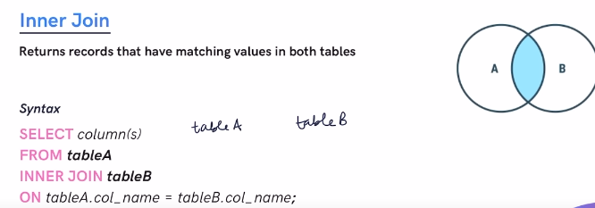
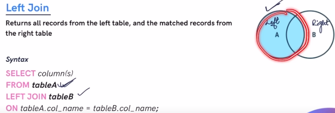

**LEFT JOIN** - Remember the table used in from is the left table, and table used in left join is the right table, so all values from table A and common values from table A and B would be returned.  

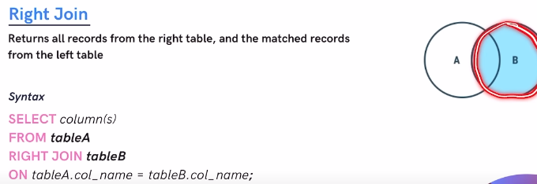

**In MySQL we don't have FULL OUTER JOIN functionality by default**  -
(Workaround)  - First do left join then right join in 2 tables then do union (see below image)
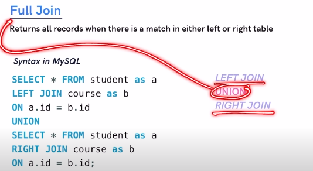

in SqlServer we have full outer join  -  

```SQL
select t1.col1, t2.col2
from table1 t1
full outer join table t2
on t1.col1 = t2.col2
```

**Self join** - if we want to get data in different form from a single table e.g (emp table has emp badgeId, emp name and mgr badgeId), but again mgr is also an employee,  
sp to get employee name and manager name from the same table  


**instead of b.name as managerName, it would be a.name as managerName in above screenshot**

Note - in self join, self is not a keyword, self join is mostly ussed with inner join, or can be used woth any other join, self join only means joining with the same table, it is more of a terminology in SQL than a feature

Same functionality using subquery -  

```SQL
SELECT
    (SELECT name FROM employee WHERE id = b.mgrID) AS managerName,
    b.name AS empName
FROM
    employee AS b;
```

using my thinking

```SQL
with mgrDetails as(
select a.name, a.id
from emp a
where a.id in (select mgrId from emp))

select b.name, mgrDetails.name as MGRNAME from
emp b, mgrDetails
where b.mgrId = mgrDetails.id;
```

**corss join** - it returns the cartesion product of 2 tables, hence no on condition is required in this join

  

Both employee and dept tables have 10 records each, so output of cross join = 10 * 10 = 100;
the first table with every row from the second table, resulting in a potentially large number of rows in the output.  

**usecase for cross joins** - mostly used if a table has one record and it needs to be added in the result set  

In above query company table has only one row, and we need to add it in the result set

**natural join** -  

1. in natural join SQL determines on which column/s the join should happen (hence no on condition to be added in natural join)
2. it works as inner join if the column name is same in the tow tables that are beinged join
3. if there are more that 1 columns which have same name in both the tables, then inner join will happen and in on condtion all the same columns would be added
4. the there is no column with same name in both the tables, natural join will work as cross join

```SQL
select * 
from employee
natural join department -- notice no on condtion is required, since SQL will determine
```

### Union

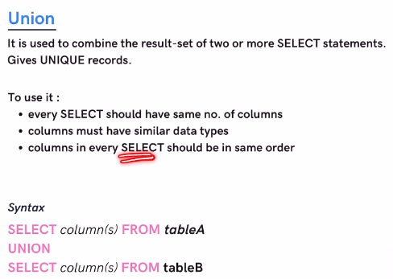

Union removes duplicate records from tableA and tableB, if we want duplicate records use **UNION ALL**

### With and View

#### 1. With

1. WITH clauses, also known as Common Table Expressions (CTEs), are temporary result sets.
2. exist only for the duration of the query execution.
3. used to improve the readability and maintainability of complex queries

```SQL
with mgrDetails as(
select a.name, a.id
from emp a
where a.id in (select mgrId from emp))

select b.name, mgrDetails.name as MGRNAME from
emp b, mgrDetails
where b.mgrId = mgrDetails.id;
```

#### 2. View

1. Views are virtual tables that are defined by a query and stored (**note the result that view returns is not stored, only view schema is stored**) permanently in the database.
2. Views can be queried, updated, and deleted just like tables, but the underlying data is not stored separately from the tables it references
3. Views are useful for enforcing security policies

```SQL
CREATE VIEW SalesByRegion AS
SELECT Region, SUM(SalesAmount) AS TotalSales
FROM Sales
GROUP BY Region;

SELECT * FROM SalesByRegion;

DROP VIEW SalesByRegion -- to permanently remove the view
```

**In DBs like postgres sql, we have materialized view, which stores the result of the query in memory even after the query is executed, similar to caching in nodejs**

## Stored procedures

```SQL
-- in MySQL
-- we need to use Delimiter to indicte end of stroed procedure
DELIMITER //
CREATE PROCEDURE GetEmployee(IN emp_id INT, OUT EMPNAME varchar(50)) -- if IN / OUT is not provided then default is IN
BEGIN
    declare newVariable int; -- declaring new variables
    SELECT name into EMPNAME FROM emp WHERE id = emp_id;
END // 
DELIMITER ; -- change back delimiter to semicolon

-- calling SP
call GetEmployee(3, @empname);
-- empName variable will have name of employee whose id is 3 
select @empName;


-- in SQL server
CREATE PROCEDURE GetEmployee
    @emp_id INT
AS
BEGIN
    SELECT * FROM employees WHERE employee_id = @emp_id;
END
```

We can write if else statements in stored variables.  
We can do write multiple queries in stored procedures which is not possible without SP  

E.g. - you have 2 tables, products and sales, when user click on buy iphone in UI,
we need to check if the product quantity is available in products table, if yes,

1. Query 1 - subtract the product quantity with the requested quaniity
2. Query 2 - add record in sales table (order id, product_id, ord_dt)

instead of firing multiple queries (in this case node js will make multiple DB calls), this flow can be achieved in single SP

```SQL

create table products
(
 product_code   varchar(20) primary key,
 product_name   varchar(100),
 price     float,
 quantity_remaining  int,
 quantity_sold   int
);

create table sales
(
 order_id   int auto_increment primary key,
 order_date   date,
 product_code  varchar(20) references products(product_code),
 quantity_ordered int,
 sale_price   float
);


create procedure pr_buy_products (p_product_name varchar(50), p_quantity int)
begin
 declare v_cnt           int;
 declare v_product_code  varchar(20);
 declare v_price         int;

    -- first get product count from product table
    select count(*)
    into v_cnt
    from products
    where product_name = p_product_name
    and quantity_remaining >= p_quantity;

    -- if product count > requestd count
    if v_cnt > 0
    then
        select product_code, price
        into v_product_code, v_price -- store product details in variables (these details are to be inserted in the sales table)
        from products 
        where product_name = p_product_name
        and quantity_remaining >= p_quantity;

        insert into sales (order_date,product_code,quantity_ordered,sale_price)
  values (cast(now() as date), v_product_code, p_quantity, (v_price * p_quantity));

        update products
        set quantity_remaining = (quantity_remaining - p_quantity)
        , quantity_sold = (quantity_sold + p_quantity)
        where product_code = v_product_code;

        select 'Product sold!';
    else
        select 'Insufficient Quantity!';
    end if;
end$$
call pr_buy_products('AirPods Pro', 10) -- output - product sold
```

**loops in SP**

```SQL
CREATE PROCEDURE procedure_name()
BEGIN
    -- Declare variables
    DECLARE counter INT DEFAULT 0;
    -- Loop statement
    loop_label: LOOP
        -- Loop body
        -- Increment counter
        SET counter = counter + 1;
        -- Check loop termination condition
        IF counter > 10 THEN
            LEAVE loop_label;
        END IF;
        -- Continue to next iteration
        ITERATE loop_label;
    END LOOP loop_label;
    -- Additional statements after the loop
END;
```

## CURSORS

In DB the output that er get is resultset, it is a set, meaning set of records, the operation that we do in SQL queries is on set od records, but if we want to deal with individaul records from the resultset, we use cursors  

Cursors provide a way to process individual rows returned by a query and are commonly used within stored procedures or scripts to perform row-level operations, such as data manipulation, validation

Steps to create and use cursor 

```SQL
-- 1. Declare cursor
DECLARE cursor_name CURSOR FOR SELECT column1, column2 FROM table_name WHERE condition;

-- 2. Open cursor
OPEN cursor_name;

-- 3. fetch cursor
FETCH cursor_name INTO variable1, variable2;
--variable1, variable2: Variables to store the values of the columns fetched from the current row.

-- 4. Process all records
loop_label: LOOP
    FETCH cursor_name INTO variable1, variable2;
    -- Check if there are no more rows to fetch
    IF <condition_to_exit_loop> THEN
        LEAVE loop_label;
    END IF;
    -- Process the fetched row
    -- Perform operations on variable1 and variable2
END LOOP loop_label;


-- 5. close curosr
CLOSE cursor_name;

-- 6. deallocate cursor to free up the memory
DEALLOCATE cursor_name;
```

**cursors are mostly used in SP**

DECLARE CONTINUE HANDLER FOR NOT FOUND SET done = TRUE;
```SQL
DELIMITER //

CREATE PROCEDURE process_data()
BEGIN
    DECLARE done INT DEFAULT FALSE;
    DECLARE column1_data INT;
    DECLARE column2_data VARCHAR(255);

    DECLARE data_cursor CURSOR FOR SELECT column1, column2 FROM table_name;
     -- Declare continue handler for cursor
    DECLARE CONTINUE HANDLER FOR NOT FOUND SET done = TRUE;
    OPEN data_cursor;

    data_loop: LOOP
        FETCH data_cursor INTO column1_data, column2_data;
        IF done THEN
            LEAVE data_loop;
        END IF;

        -- Process the fetched row
        -- Perform operations on column1_data and column2_data
    END LOOP data_loop;

    CLOSE data_cursor;
    DEALLOCATE data_cursor;
END //
DELIMITER ;
```

**Cusror usecase** - might have some uses in report generation or mail merges, but it's probably more efficient to do the cursor-like work in an application that talks to the database, letting the database engine do what it does best

## Functions in SQL

Similar to SP they are DB objects  

Differences with stored procedured  

1. SP can have select as well as DML (insert, update, delete) queries, but functions can have only select statement
2. SP can return resultsets (more than 1 rows), function can return only one row
3. functions can be used in select, where caluse inside a SQL query, SP can't be used inside query
4. use functions mostly for math problems

```SQL
-- creating a function
DELIMITER //
CREATE FUNCTION get_employee_name1(emp_id INT)
RETURNS VARCHAR(100)
-- we need to specify what the function is going to do
-- it can do 1 of 3 things - 1. READS SQL DATA 2. DETERMINISTIC - for same input, same output 3. NO SQL
-- one of the above 3 values need to be added after returns statement
READS SQL DATA 
BEGIN
    DECLARE emp_name VARCHAR(100);
    -- Execute the SQL query to fetch the employee name
    SELECT name INTO emp_name FROM employee WHERE empId = emp_id LIMIT 1;
    -- Return the employee name
    RETURN emp_name;
END//
DELIMITER ;

SELECT get_employee_name1(1);
-- note now we can use this function in select / where clause
-- SP's can't do this

```

## Transcation

They adhere to ACID properties

Transactions in SQL don't have a body like stored procedures or functions. Instead, to initiate a transaction, you use the START TRANSACTION statement. All subsequent SQL statements executed until a COMMIT or ROLLBACK statement are considered part of the transaction.  

MySQL won't automatcially rollback a transaction, programmers have to do it manually

```SQL
-- Start a transaction
START TRANSACTION; -- instead of START TRANSACTION, we can also use BEGIN keyword
-- Deduct funds from account 1
UPDATE accounts SET balance = balance - 500 WHERE account_id = 1;
-- Add funds to account 2
UPDATE accounts SET balance = balance + 500 WHERE account_id = 2;
-- Commit the transaction if all updates are successful
COMMIT; -- or rollback based on business logic
-- check if both accounts are updated
select * from accounts;

-- even if we do not commit the changes can be seen in the accounts tbale, but changes are not permanently saved to the database,
-- they can still affect the data within the current session or transaction.
-- Other sessions or transactions will not see these changes until they are committed

-- if first update runs successfully and SQL query fails for second update
-- for exmple syntax error or runtime error, the transaction will still get commited since we are using COMMIT at the end
-- always use rollback / commit based on if condition

```

Transaction in nodejs mssql

```javascript
const sql = require('mssql');
async function executeTransaction() {
    try {
        // Create connection pool
        await sql.connect('connectionString');

        // Start transaction
        const transaction = new sql.Transaction();
        await transaction.begin();
        try {
            // Execute SQL statements within the transaction
            await sql.query`UPDATE your_table SET column1 = value1 WHERE condition`;
            await sql.query`UPDATE your_table SET column2 = value2 WHERE condition`;

            // Commit the transaction
            await transaction.commit();

            console.log('Transaction committed successfully.');
        } catch (error) {
            // Rollback the transaction if an error occurs
            await transaction.rollback();
            console.error('Transaction rolled back:', error.message);
        }
    } catch (error) {
        console.error('Error:', error.message);
    } finally {
        // Close connection pool
        await sql.close();
    }
}
// Call the function to execute the transaction
executeTransaction();

```

## Window functions

Add aggreage / window functions as a column to all the rows

1. Calculate total sales for each country

```SQL
select COUNTRY, SUM(SALES)
from ABC
GROUP BY COUNTRY
```

but what if we want this SUM as a separete column in a result set along with all the exiting columns of a given table?  

We need to add columns in select as well as in groupby, becasue columns in select must be in group by, and as we know about group by, each unique combination of columns listed in groupby will create a new group.  

**Using window functions is like giving each row its own little bubble(window) to do math (using aggregate / window functions) in**

```SQL
-- syntax
window_function() OVER (
    [PARTITION BY partition_column1, partition_column2, ...]
    [ORDER BY order_column [ASC|DESC]]
    [ROWS | RANGE frame_definition]
)
```

## Trigers

```SQL
-- syntax
-- create trigger trigger name
-- before / after insert / update / delete on <table_name>
-- for each row
-- sql statements


-- auditing usecase
CREATE TRIGGER orders_insert_trigger
AFTER INSERT ON orders
FOR EACH ROW
    INSERT INTO order_logs (action, order_id, new_total_amount)
    VALUES ('INSERT', NEW.order_id, NEW.total_amount); -- notice NEW keyword here - New.orderId

-- here we can use 2 keywords - NEW / OLD

-- In insert triggers - NEW contains the values being inserted into the table. OLD is not available
-- in update triggers - OLD contains the values of the row before the UPDATE operation. NEW contains the new values that will be or have been updated in the table.
-- in delete triggers - OLD contains the values of the row before it was deleted., NEW not available

```

#### Trigger usecase

1. Auditing -  Triggers can log changes made to database tables, providing an audit trail of who made the changes, when they were made, and what the changes were.
2. A table as employee pay on hourly basis (10$ per hour), so at the month end supervisor will just add horus worked for a month, and then we will have a trigger when hours are logged, salary gets updated based on hour log and employee's hourly pay
3. Data integrity user-defined checks

```SQL
-- data integrity user defined checks
DELIMITER //
CREATE TRIGGER enforce_order_amount_threshold
BEFORE INSERT ON orders
FOR EACH ROW
BEGIN
    DECLARE total_amount DECIMAL(10, 2);
    -- Calculate the total amount of the new order
    SET total_amount = NEW.total_amount;
    -- Check if the total amount exceeds the threshold
    IF total_amount > 1000 THEN
        SIGNAL SQLSTATE '45000'
        SET MESSAGE_TEXT = 'Order total amount exceeds the threshold of $1000';
    END IF;
END;
//
DELIMITER ;
insert into orders (order_id, customer_id, order_date, total_amount) values (2, 1, NOW(), 2000);
-- above insert query will throw error set in MESSAGE_TEXT
```

#### Working of window functions

1. Data us fetched from tables - from cluase
2. If window function as partiton by (it is optional btw), then group are created based on partition column listed (aka window frame)
3. Sorting - if order by is there then it is applied in that window frame (based on partiton by)
4. Window function calc is done, for each row

**commonly used window functions**  

1. row_number()
2. rank()
3. dense_rank()
4. lead()
5. lag()
6. all aggregate functions can be used as window function
7. first_value()
8. last_value()
9. nth_value()
10. ntile()

#### E.g

1. Calculate nth highest / lowest mark / salary of students / employee  
this can be done using normal sub queries we saw above

```SQL
select * from (
(select s.*, row_number() over( order by marks desc) as sturank1
from student s
)) as win
where win.sturank1 = 2;

-- focus on subquery, we are using row_number window func, which will assign
-- row number to each row along with all the columns in descending order of marks
-- so student with highest mrk 90 will have row_num (sturank1 alias) = 1 and student with mark 88 = 2
-- and now in outer query we get details of student where row-num = 2, this way we got second (nth) highest


-- Q - Calculate nth highest / lowest marks of student for each dept,
-- each dept means group by, but using group by finding nth highest will create a very complex query
-- use partition by which works similar to group by inside a window
select * from (
(select s.*, row_number() over( partition by deptId order by marks desc) as sturank1
from student s
)) as win
where win.sturank1 = 2;
-- here we will get second highest mark student for each dept

-- instaead of nth highest, if top 3 / 4 is asked then

select * from 
(select s.*, rank() over( partition by deptId order by marks desc) as sturank1
from student s
) as win
where win.sturank1 < 3

-- note in above query I was doing
(select s.*, rank() over( partition by deptId order by marks desc) as sturank1
from student s
where s.sturank1 < 3
);
-- but in where cluase s.sturank1 column not found, since it is an alias in the select clause and
-- select clause is executed after where clause, hence wrap the output in a subqeury
-- and use this query in form clause and in outside query we can apply sin.sturank1 < 3 condition
```

O/P of inner subquery from above query -

```SQL
(select s.*, row_number() over( partition by deptId order by marks desc) as sturank1
from student s
)
```


Q. Select top 3 students from each dept with highest marks

```SQL
select * from 
(select s.*, rank() over( partition by deptId order by marks desc) as sturank1
from student s
) as win
where win.sturank1 < 3
```

**rank() vs dense_rank() vs row_number()**  -

1. row_number() - alaways increment evene if values are same for the column listed in the order by clause (marks in our example)
2. rank() - assign same rank if the values are same for the column listed in the order by clause (marks in our example), but will skip a value for every duplicate value
3. dense_rank() - same as rank(), but won't skip value for duplicate values  

see below image -

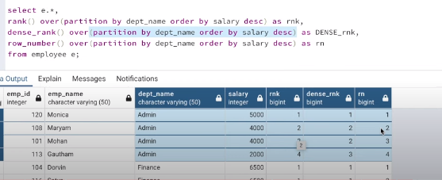

**lag and lead**  -

1. lag(<columnName>) - it will give previous row's column value listed in the lag() function
2. lead(<columnName>) - it will give next row's column value listed in the lead() function  
see below image

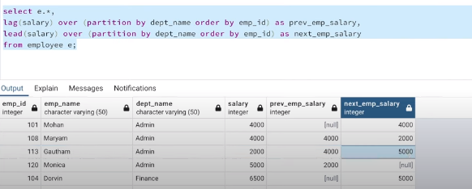  

**optional arguments for lead and lag** - lag(<columnName>, 2, 0) - 2 indicates pick column value of previous to previous row - 0 indicates default value (in case of lag(<colmnName, 2, 0>), the frst 2 rows will have value of 0 since there is no previous and previous to previous records )  

**Q. Find the salary of the employee is higher, lower or equal to previous employee for each dept** -
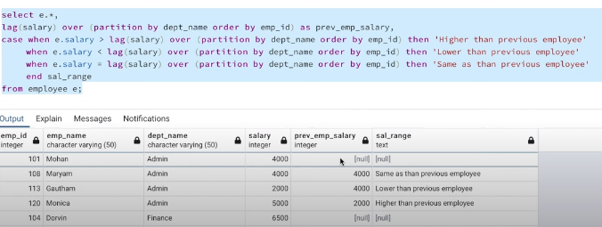  

**first_value(), last_value(),  nth_value and frame** -

1. Frame - we know a window is a partition (subset of results), frame is a partition of a window, so basically window of a window

   -  

In the output, first ranker is clear but we you look at the results from back_bencher, output is incorrect, for dept 1, back_bencher should have been David Martienez.  
This is because of Frames, bu default for last_value() and nth_value() functions, How SQL engine evaluates the query is after partition and sorting, for 1st row, it is also the last row, for second row, the last value is calculated between 1st and 2nd row, for third row last value is calculated betwwn 1,2, and 3rd row, but his is incorrect,  
hence we need to modify the frame - so the SQL query to get correct backbencher would be

```SQL
select s.*, row_number() over( partition by deptId order by marks desc) as sturank1,
first_value(name) over( partition by deptId order by marks desc) as First_ranker,
last_value(name) over( partition by deptId order by marks desc range between unbounded preceding and unbounded following) as back_bencher
from student s;

-- range between unbounded preceding and unbounded following
-- this is the frame condition, it says
-- within a given window, run the window function from start to end of the partition

-- default frame is
-- range between unbounded preceding and current row

-- of course another way to solve the problem would be 
first_value(name) over( partition by deptId order by marks asc) as back_bencher
-- use first value, but sort marks in ascending order
-- but to understand frame, we used above query

-- instaed of writing the over cluase and fram clause again and again, we can use this shortcut
select s.*, row_number() over w as sturank1,
first_value(name) over w as First_ranker,
last_value(name) over w as back_bencher,
nth_value(name, 2) over w as second_ranker
from student s
window w as (partition by deptId order by marks desc range between unbounded preceding and unbounded following)
-- also see how nth_value() function is used
```

**ntile()** - is used to divide a result set into a specified number of "buckets."  
NTILE distributes rows based on the order specified in the ORDER BY clause

```SQL
-- syntax
ntile(3) -- here 3 indicates number of buckets that we need to create
```

below query creates 3 buckets based on students marks -

 -

If we want buckets for each department

 -
here 3 buckets are created for each dept, we have 3 depts so total 9 buckets

**Q. Categorize students as toppers, average students and back benchers**

 -

Bu default NTILE() will create buckets and also which rows should go in which bucket based on numner of rows. If there are 10 rows and 3 buckets, 4 roes will go in frst bucket and 3 rows in remainign 2 buckets.  
If we want to create buckets based on some condition,  

```SQL
SELECT *,
       ROW_NUMBER() OVER (PARTITION BY partition_condition ORDER BY some_column) AS row_num
FROM (
    SELECT *,
           CASE 
               WHEN condition_column <= 10 THEN 'Bucket 1'
               WHEN condition_column <= 20 THEN 'Bucket 2'
               WHEN condition_column <= 30 THEN 'Bucket 3'
               ELSE 'Bucket 4'
           END AS partition_condition
    FROM your_table
) AS subquery;
```

**Q. remove duplicate rows from table**

```SQL
WITH CTE AS (
    SELECT *,
           ROW_NUMBER() OVER (PARTITION BY column1, column2, ... ORDER BY column1) AS row_num
    FROM your_table
)
DELETE FROM CTE WHERE row_num > 1;

```

## Recursion

**Syntax** -


note we need to call select * from cte to complete the recursion syntax or else syntax error is thrown

```SQL
-- Q Display numbers from 1 to n
with recursive oneton as (
  select 1 as n
  union
  select n+1 as n from
  oneton
  where n < 10
)
select * from oneton -- we need to call the recursion to complete the recursion syntax

```

**Q. find hierarchy**


## SQL MISC functions in MySQL

| Function              | Description                                                                                       | Example                                  |
|-----------------------|---------------------------------------------------------------------------------------------------|------------------------------------------|
| `LEN()`               | Returns the length of a string.                                                                   | `LEN('hello')` returns `5`              |
| `CONCAT()`            | Concatenates two or more strings.                                                                 | `CONCAT('hello', 'world')` returns `'helloworld'` |
| `NOW()`               | Returns the current date and time.                                                                | `NOW()` returns `'YYYY-MM-DD HH:MM:SS'` |
| `CURDATE()`           | Returns the current date.                                                                         | `CURDATE()` returns `'YYYY-MM-DD'`      |
| `CURTIME()`           | Returns the current time.                                                                         | `CURTIME()` returns `'HH:MM:SS'`        |
| `DATE_FORMAT()`       | Formats a date value as specified.                                                                | `DATE_FORMAT(NOW(), '%Y-%m-%d')` returns `'YYYY-MM-DD'` |
| `UPPER()`             | Converts a string to uppercase.                                                                   | `UPPER('hello')` returns `'HELLO'`      |
| `LOWER()`             | Converts a string to lowercase.                                                                   | `LOWER('HELLO')` returns `'hello'`      |
| `TRIM()`              | Removes leading and trailing spaces from a string.                                                 | `TRIM('  hello  ')` returns `'hello'`   |
| `SUBSTRING()`         | Returns a substring from a string.                                                                | `SUBSTRING('hello', 2, 3)` returns `'ell'` |
| `REPLACE()`           | Replaces occurrences of a specified string with another string.                                    | `REPLACE('hello world', 'world', 'there')` returns `'hello there'` |
| `ROUND()`             | Rounds a numeric value to a specified number of decimal places.                                    | `ROUND(3.14159, 2)` returns `3.14`      |
| `ABS()`               | Returns the absolute value of a number.                                                           | `ABS(-10)` returns `10`                 |

## Indexing

1. Improves performance for read queries
2. But slows down insert / update queries

**Hoew indexing work** -

1. the column on which indexing is applied, the DB engine physically sorts the data based on the column to be indexed
2. Then DB uses binary search algo to get search results faster

```SQL
create index myIndex on employee(empId);

alter table employee drop index myIndex;

-- (composite index) creating index on multiple columns
create index myIndex on employee(empId, name);

-- (fulltext index)
--  Full-text indexing enables efficient searching of textual data based on keywords, phrases

create fulltext  index myIndex on employee(name);
-- once fulltext index is created, we can use MATCH() and AGAINST() to utilize full text indexing capabilites
-- if we use like operator, indexing won't be in use
select * from EMPLOYEE where MATCH(name) against('John');
-- note above query will only retrun data when in against we specify a word / phrase
select * from EMPLOYEE where MATCH(name) against('Jo');
-- this will not return any data because comparison is done at word or phrase leve, not at character level
select * from EMPLOYEE where MATCH(name) against('John doe'); -- this will return records

--  Full-text indexing is commonly used in document management systems to 
-- allow users to search and retrieve documents based on their content.

-- working on full text index
-- DB breakes the text content into words aka tokens
-- this tokens are indexed salong with their position inside the text

```

**Clusterd vs non clustered index** -

1. Clustered - A clustered index determines the physical order of rows in a table.
2. Non-clustered - It is a separate data structure from the actual table data. It consists of index pages containing pointers to the corresponding data rows in the table

## Query optimzation techniques

##### 1. Use indexes

##### 2. Optimizing Joins

1. If we create index for columns which are in join condtion, join will work faster
2. Avoid cartesian (cross joins)
3. Filter before joining to reduce number of intermediate rows used in query execution

```SQL
-- instaed of this
SELECT *
FROM table1
INNER JOIN table2 ON table1.join_column = table2.join_column
where table1.condition1

-- Filter before joining
SELECT *
FROM (
    SELECT *
    FROM table1
    WHERE condition1
) AS filtered_table1
INNER JOIN table2 ON filtered_table1.join_column = table2.join_column;
```

##### 3. Predicate pushdown

check more on this

##### 4. Pre aggregation

Calculate aggreagte values and store them in the summary table

##### 5. Limiting reault set using (limit / top clause)

##### 6. Analysing query exection plan

explains how query is being executed by DB engine with estimated and actual cost in terms of milliseconds

```SQL
-- to run analyze by adding explain analyze keyword
explain analyze select *
from employee e
inner join department d on e.deptId = d.deptId

-- ouput would be trre like data

-- -> Nested loop inner join  (cost=4.75 rows=10) (actual time=0.0488..0.0853 rows=10 loops=1)
--     -> Filter: (student.deptID is not null)  (cost=1.25 rows=10) (actual time=0.0345..0.0437 rows=10 loops=1)
--         -> Table scan on student  (cost=1.25 rows=10...    (START READING FROM HERE)

-- to read start from the inner most leaf of the tree
```

## Thinking in interview

1. Understand problem statement, understand how the calculation / output comes
2. Write steps / build logic on how to arrive to output
3. For cach step write CTE and build the query

### TODO

1. Calling stored procs from nodejs and nestjs
2. Techniques for handling large volumes of data efficiently. / Using partitioning and sharding for scalability. (to do in scalibility)
3. DB design - ER diagram to draw in system design
