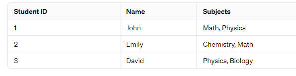

# RDBMS

## Normal forms

### 1NF

1. **Each column needs to be atomic** - values that cannot be divided further. For example, if you have a column for "Address", it should not contain multiple parts of the address like street, city, and zip code in a single field.
2. **No Repeating groups** - Each column should have a single value for each row. you shouldn't have multiple columns for phone numbers (like phone1, phone2, phone3). Instead, each student should have a single column for their phone number.

 

"Subjects" column violates 1NF because it is non-automic

### 2NF (In interview think of Ids and names as columns in same table, then remove names and keep only Ids)

**A candidate key** - is a set of one or more attributes (columns) within a relation (table) that uniquely identifies each tuple (row) in that relation.  

1. **1NF compliant**
2. **Removal of Partial Dependencies** - non-prime attribute is functionally dependent on **only one part** of the primary key.

  - 

In this example, the composite key (OrderID, ProductID) uniquely identifies each row. However, we can see that the "Customer Name" is functionally dependent only on "CustomerID" and not on the entire composite key. This violates 2NF because "Customer Name" is dependent on only a part of the primary key.  
Similarly Product name is dependnt on Product Id, and not on composit key

To make above table compliant to 2NF - 

 

## 3 NF

1. **1NF and 2 NF compliant**
3. **Removal of Transitive dependencies** - non-prime attribute should not be functionally dependent on another non-prime attribute. All non-prime attributes should be directly dependent on primary / composite key

 

 