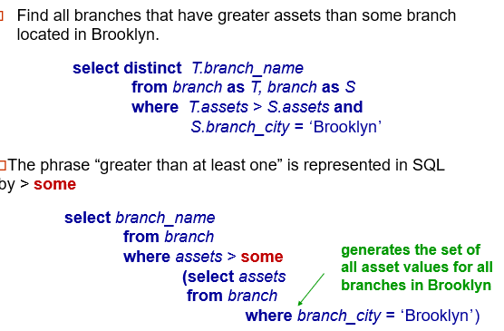

## 1. CREATE

```SQL
/* this is for sql server*/
CREATE DATABASE record_company;
DROP DATABASE record_company;

/* to use a particular db*/
USE record_company;

CREATE TABLE bands (
 id INT NOT NULL AUTO_INCREMENT,
 name VARCHAR(255) NOT NULL,
 PRIMARY KEY (id)
);

CREATE TABLE albums (
 id INT NOT NULL AUTO_INCREMENT,
 name VARCHAR(255) NOT NULL,
 release_year INT,
 band_id INT NOT NULL,
 PRIMARY KEY (id),
 /*define relationship between band_id and band table*/
 FOREIGN KEY (band_id) REFERENCES bands(id)/*create foreign key with band table(id col)*/
 /*SQL will not allow to insert any album whose band_id doesn't exists in band table (id col)*/
);

ALTER TABLE test

DROP TABLE 
```

## 2. Insert

```SQL
INSERT into bands (name) 
VALUES ('Iron Maiden')

/*multiple insert*/
INSERT into bands (name) 
VALUES ('Deuce'), ('Avenged'), ('Ankor')

INSERT INTO albums (name, release_year, band_id)
VALUES ('No of Beasts', 1985, 1),
  ('Nightmare', 2018, 2),
  ('Nightmare', null, 2);
```

## 3. Select

```SQL
SELECT * FROM bands LIMIT 2;

SELECT name AS 'BAND NAME' FROM bands;

SELECT * FROM bands ORDER BY name desc
```

## 4. Update

```SQL
UPDATE albums
SET release_year = 1982
WHERE id = 1;
```

## 5. Where clause

```SQL
SELECT * from albums
WHERE name LIKE '%night%' OR band_id = 2

/*OR, AND, BETWEEN (2000 AND 2019)*/
```

## JOINS

```SQL

/*default is inner join*/
SELECT * from bands
JOIN albums ON bands.id = albums.band_id;

/*left join*/
/*all rows from left table, and common rows from both table*/

SELECT * from bands
LEFT JOIN albums ON bands.id = albums.band_id;

SELECT * from bands
RIGHT JOIN albums ON bands.id = albums.band_id;

/*all joins, it's better to have the ON condition*/
```

## Query order of execution

1. Get data (FROM, JOIN)
The FROM clause, and subsequent JOINs are first executed to determine the total working set of data that is being queried. This includes subqueries in this clause
2. Filter the rows (Where)
3. Group rows (Group by)
The remaining rows after the WHERE constraints are applied are then grouped based on common values in the column specified in the GROUP BY clause. As a result of the grouping, there will only be as many rows as there are unique values in that column.
4. Aggregate funcs are run on those grouped rows, on each grouped rows, the aggreagte func is run
5. Fitler the groups (Having)
the constraints in the HAVING clause are then applied to the grouped rows, discard the grouped rows that don't satisfy the constraint
6. Return the expression (Select then distinct)
7. Order and Paging (Order by & Limit / offset)

## Aggregate, group by and having

```SQL
SELECT AVG(release_year) FROM albums;

SELECT band_id, COUNT(band_id) FROM albums;
GROUP BY band_id
/*get all the bands and see how many bands each og the album have
basically aggregate funcs return only 1 row  
but since we are using Group by, the count finc is run on all the grouped
band_ids and we get count for each band_id 
*/

/*SUM, COUNT*/

/*power of aggregate functions*/
/*find no. of albums for each band*/
SELECT b.name AS band_name, COUNT(a.id) AS num_albums
FROM bands AS band_id
LEFT JOIN albums AS a ON b.id = a.band_id
GROUP BY b.id;

/*having*/
/*having - same as where, but where is executed before group by and having after group by*/
/*find no. of albums for each band having no of albums = 1*/
SELECT b.name AS band_name, COUNT(a.id) AS num_albums
FROM bands AS band_id
LEFT JOIN albums AS a ON b.id = a.band_id
GROUP BY b.id;
HAVING num_albums = 1
```

## Practice queries

```SQL
/*Return all bands that have album*/
/* This assummes all bands have a unique name */
SELECT DISTINCT bands.name AS 'Band Name'
FROM bands
JOIN albums ON bands.id = albums.band_id;

/* If bands do not have a unique name then use this query */
SELECT bands.name AS 'Band Name'
FROM bands
JOIN albums ON bands.id = albums.band_id
GROUP BY albums.band_id
HAVING COUNT(albums.id) > 0;

/*Get all Bands that have No Albums*/
SELECT bands.name AS 'Band Name'
FROM bands
WHERE bands.id NOT IN (select band_id FROM albums)

```

## With clause to create views

WITH clause is used to define a temporary relation.  
When a query with a WITH clause is executed, first the query mentioned within the  clause is evaluated and the output of this evaluation is stored in a temporary relation. Following this, the main query associated with the WITH clause is finally executed that would use the temporary relation produced  

```SQL
/*Find all the employee whose salary is more than the average salary of all employees*/

/* the averageValue passed in with is comming from the avg(Salary) of the Select clause column
and this column is used in the main query - temporaryTable.avergaValue*/
WITH temporaryTable(averageValue) as
  (SELECT avg(Salary)
  from Employee)

SELECT EmployeeID,Name, Salary 
FROM Employee, temporaryTable 
WHERE Employee.Salary > temporaryTable.averageValue;

/*Without using with -Find all the employee whose salary is more than the average salary of all employees*/
/*self made answer try this*/
SELECT a.EmployeeID, a.Name, a.Salary 
FROM Employee a, 
Where a.salary > (SELECT AVG(salary)
FROM EMPLOYEE)

```


-------------------------------------------------------------------------------------------

### Queries


-------------------------------------------------------------------------------------------  
  

-------------------------------------------------------------------------------------------
  

-------------------------------------------------------------------------------------------
  

-------------------------------------------------------------------------------------------
  

-------------------------------------------------------------------------------------------
  

-------------------------------------------------------------------------------------------
  

-------------------------------------------------------------------------------------------
  

-------------------------------------------------------------------------------------------

#### Interview questions

1. Fetch duplicates  
use GROUP BY on and then use the HAVING clause to return only those fields whose count is greater than 1

```SQL
SELECT FullName COUNT(*)
FROM EmployeeDetails
GROUP BY FullName
HAVING COUNT(*) > 1;
```

2. delete duplicates - not same as above, since delete will delete all duplicates, we need one duplicate val

```SQL
delete from EMP
where EMPID not in (
  select MAX(EMPID) from EMP
  group by fullname
)
```

keep only maxId of EMP, delete rest of records whihc have duplicate fullname

3. nth highest salary  
From sub-query fetch top n sal in desc order, in main query get top 1 and in asc order  
For nth lowest sal - from sub-query get top n sal, but his time ord by asc, then in main query by desc

```SQL
SELECT TOP 1 Salary
FROM (
      SELECT DISTINCT TOP N Salary
      FROM Employee
      ORDER BY Salary DESC
      )
ORDER BY Salary ASC;
```

4. nth higest/lowest without using top/limit
SQL server provides a window function called ROW_NUMBER() func,  
Syntax - ROW_NUMBER() over (Salary desc)  
need to use this func in where clause, but this func can only be used in select  
So hack - use nested query, where output from sub-query can be used as column, which can then be used in
where clause

```SQL
SELECT Salary from (
   SELECT Salary, ROW_NUMBER() over (Salary desc) as ronnum
    FROM EmployeeSalary
) as emp   ----- note this alias which we add to result of sub-query
Where emp.rownum = N

```

5. last record from the table (Not worling in sql server)

```SQL
SELECT * FROM Table_Name WHERE Rowid = SELECT MAX(Rowid) from Table_Name;  
```

6. Show the first N characters of the string

```SQL
SELECT SUBSTRING(Column_Name, 1, N) from Table_Name;  
```

7. Extract frst nm and lastnm from comma separated fullname

```SQL
--E.g. Ashish, Sharma
select LEFT(FULLNAME, CHARINDEX(',', FULLNAME) -1) as firstName, -- here FULLNAME is the name of col in table
RIGHT(FULLNAME, LEN(FULLNAME) - CHARINDEX(',', FULLNAME)) as lastName
-- LEFT (col-nm, index) - start from left get all chars till the index is reached
-- RIGHT (col-nm, no-of-chars) - start from right, fetch no-of-chars
```

8. Get age from birthday  
Pre-requisite - datediff(<format>, fromDate, toDate) -- format - MM - returns difference from 2 dates (other vals - DD/YY)
```SQL
select datediff(YY, birthday, getdate()) as AGE
from EMP
--use YY to get age, here birthday is col-nm
```
