# SFMC
(Marketing automation tool)

Lead vs opportunity vs customer  

If there is a decision split, we use journey builder (JB) else automation studio (AS)  

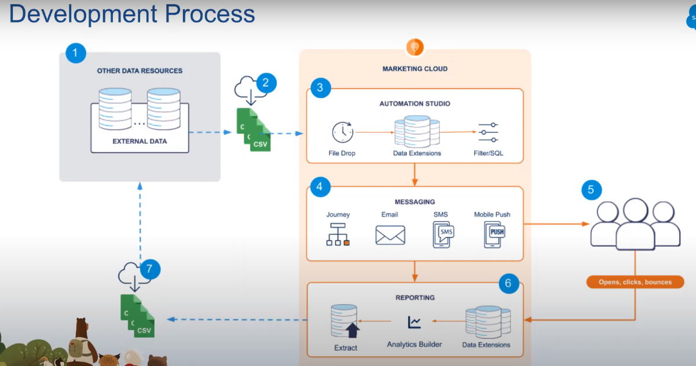   

## Data extensions
(Tables)  
Created under email studio / content builder  

To send emails from JB/AS with any DE as a sorce, it needs to be sendable  
Thus we need to add 1 mandatory field in DE with datatype as emailaddress (see below)  
emailaddr type should only be 1, if we need to store multiple emails, store others in text as a datatype

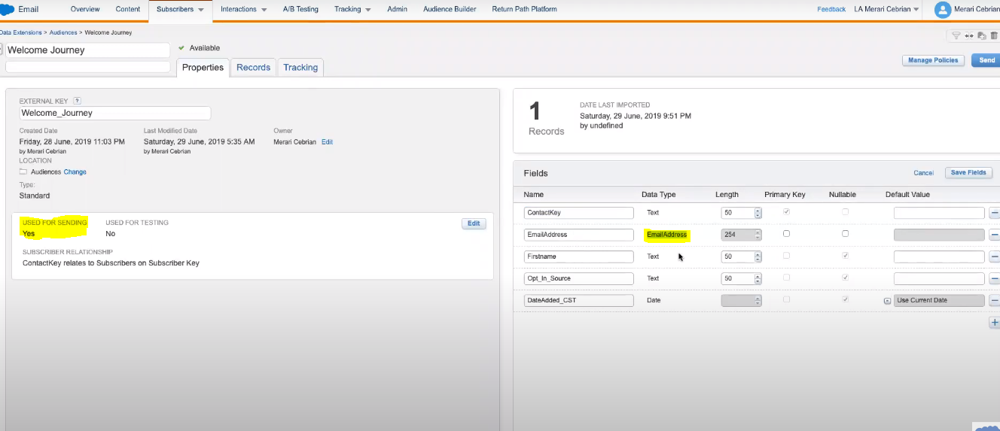  

use %%dataextensionfieldname%% when sending email in bulk like  
Hey %%firstName%%  

You can create shared DE under shared folder in parent's org.  
This way you can share data between multiple orgs

You can create DE from scratch / form other DE (aka filtered DE)

## Automation Studio  
Entry source can be file drop (any file put to SFMC ftp) or scheduled or trigerred (using API call)  
Below automation gets file from FTP location (based on file-name-patter) and add that data into DE  
It maps csv headers into DE fields, we can set failuer/success email alerts to devs
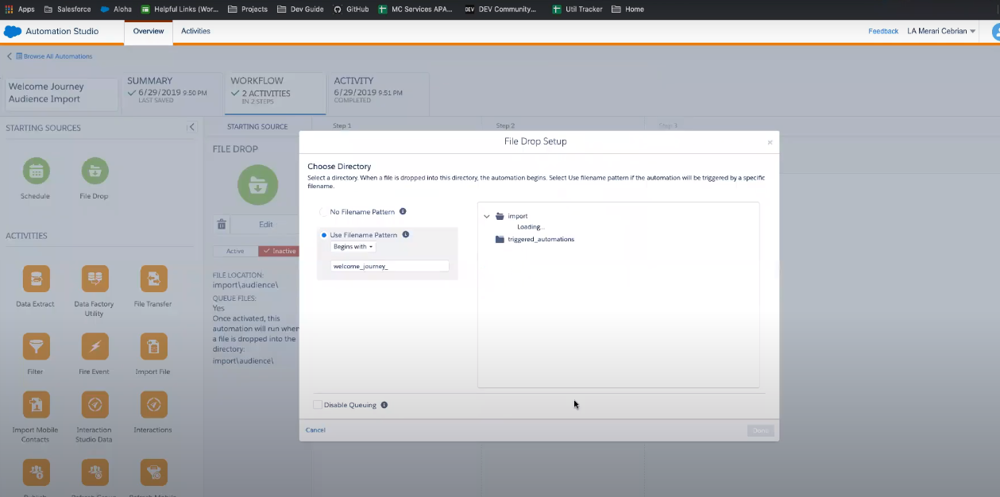    

AS activities
1. Send email
2. data extract - data can be extracted from DE, Tracking extract, mobile push extract etc
2. Sql query   - extract data from DE and store in anohter DE - (append, update, owerwrite)
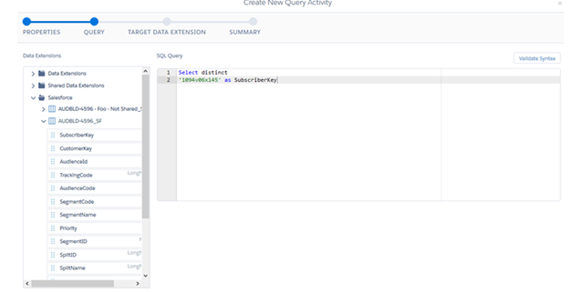  
3. File transfer  - using FTP to other location
4. Script activity - server side JS e.g. (Filter out those subscribers with a birthday in the next week) 
5. filter activity to filter records
6. Wait activity - why wait in AD? - send multiple emails after some wait time
7. import file activity - to update DE with external file
8. Data extract activity - data extract activity creates one or more zipped files for your use outside the Marketing Cloud application
9. verification activity - e.g. - if record count in DE < 10000 then stop automation, then send email to dev team


## Journey Builder
Entry sources - DE, API (external sources can inject contacts into this JB), Salesforce (SF)  
WHen SF is entry source - use case - (when a case in SF is closed, send email from SFMC)  
1. Entry source - SF
2. Select obj - case
3. add filters - select attribute = case, status = closed
4. Entry source configured, send email  

**Entry sources**  
1. DE - can schedule how often you want to check the data extension for updates, from hourly to yearly.
2. Audience - Create an audience in Contact Builder. Drag Audience onto the canvas.
3. API event - Create DE, vai API call add contacts to DE, then contact would be pushed to JB
4. GA 360
5. Salesforce data - we saw above
6. Cloud pages

**Goals** 
set goal at exit, if 10 out of 15 contacts go to path go, goal criteria met  
Exit criteria can remove customers who no longer fit the journey's purpose or for whom the journey's content is no longer relevant.  
e.g. - Set a Goal that removes a contact after they download the mobile app regardless of where they are in the journey. These contacts are counted as achieving the goal.  

**JB activities**  
1. spilt activities (random, decision, engagement)
2. join activity
3. customer update activities
4. custom activities
5. path optimizer - enables you to test up to 10 variations of a journey path to determine which path performs best.
6. Einstein split - 
7. Einstein STO - Send Time Optimization (STO) uses machine learning and 90 days of email or push notification engagement data to determine the best time within the next 24 hours to send a message to each contact


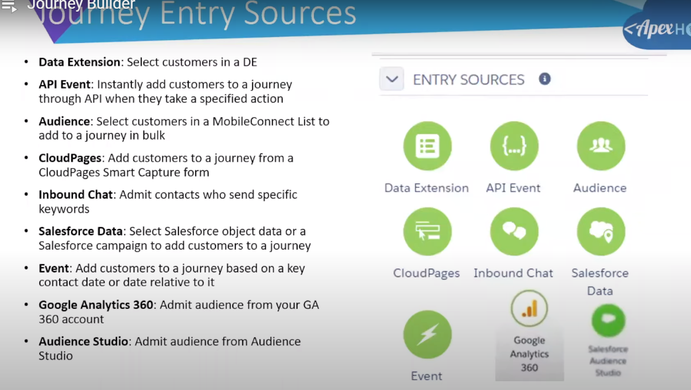
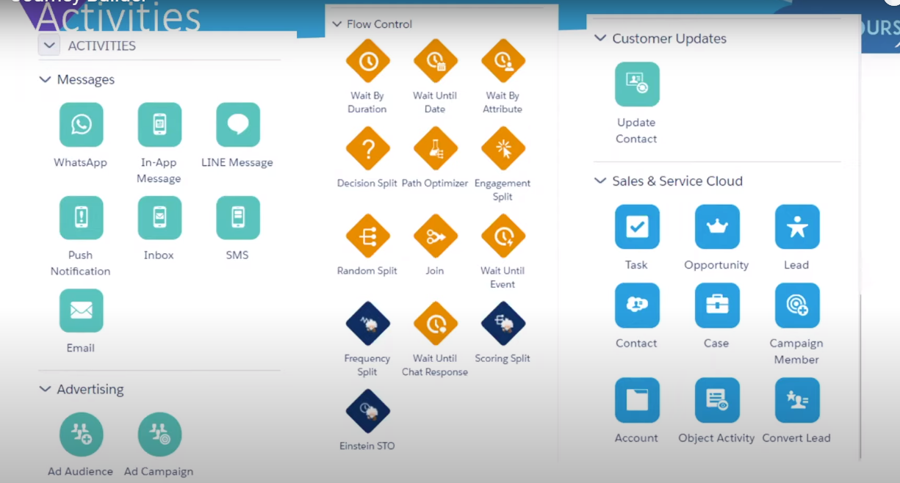  
Wait activity can be based on DE field - send email on B'day  
In Decision split - split based on DE filed  


While selecting DE, we can add a filter criterfia for DE rows

We can enable GA360 in JB  

**Einstein engagement score for email studio**  -
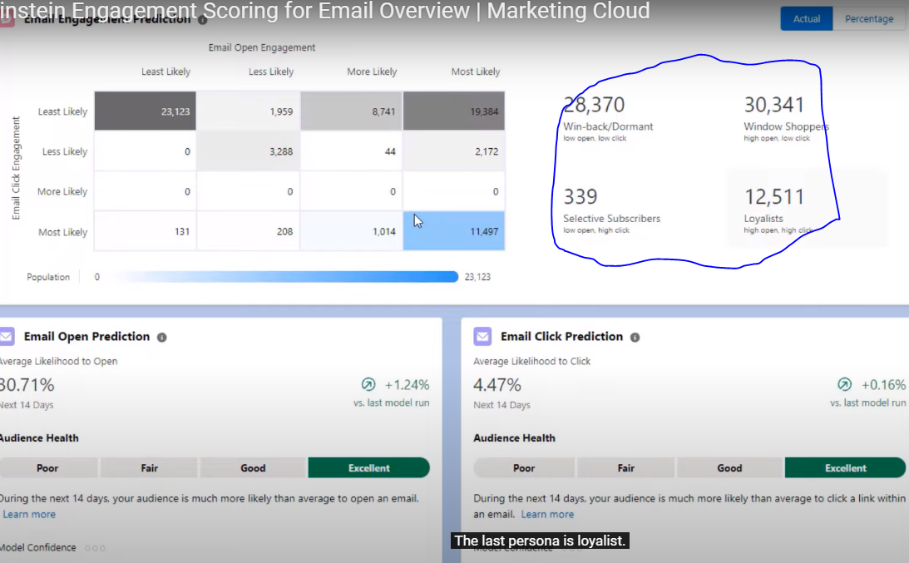  
it use ML to get the predecitve analysis 
Types of subscribers - 
1. Dormants - low open, low click
2. WindowShoppers - high open, low click
3. selective subscribers - low open, high click
4. loaylists - high open, high click

All Einstein's data is stored in DE - Einstein_MC_Predictive_Scores - we can use this DE to create subscribers segments (filter the subscribers)  
Then in JB we can use the Einstein scoring split activity to create multiple paths and send segment based personalized emails based on types of subscribers (dormants and others)  
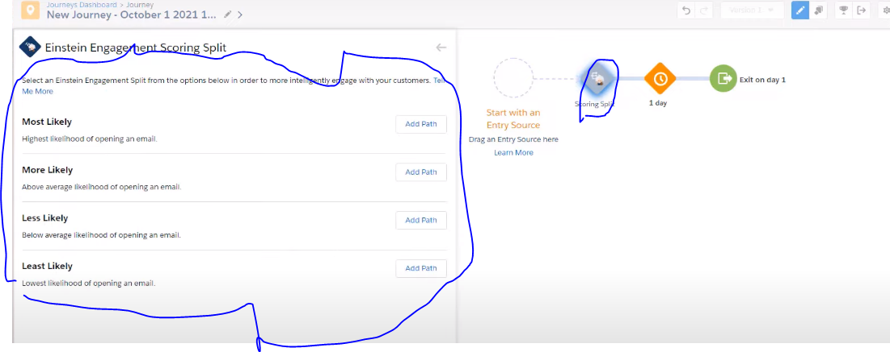  

## Email Studio  
Subscriber in ES  
1. Status - Active/In-active
2. key = email addr
3. profile attributes - frstNm/ lastNM  

### Pre-requisites for email studio
1. Configure Account Settings: Timezone and Date format, Physical Address Security settings, Headers and Footers
2. configure  Reply Mail Management (RMM) settings
3. purchase and confiure domain
4. 

**Auto supression list**
Suppression lists filter out email addresses and prevent those addresses from receiving Email Studio messages.
In Email Studio, 
1. click Admin.
2. Click Auto-Suppression Configuration under Send Management.
3. Click Create.

**IOS Universal link**  
The iOS Universal Link feature allows links in Email Studio messages to open directly into previously installed apps on iOS devices.  
After implementing this feature, you can specify the app and location to open on iOS devices  

**Also have android deep link**  

**What Happens When You Click Send**  
1.  OMM - Outbound Mail Management analyzes if the email is template-based or HTML-paste. Then OMM determines the subscriber source (a list, group, or data extension), 
2. OMM now builds the structure of the email -  The structure usually involves a header, footer, and body. If the email is template-based, the template is included in this step.
3. OMM Analyzes the Subscribers - If your email send contains personalization or dynamic content, it is during this process that OMM determines the appropriate content for each subscriber.
4. OMM Builds and Sends the Email

**Sending email**  
1. click on send
2. define properties - allows you to preview email - configure from address
3. configre audience - individual, DE or subscriber list
4. configure delivery - send immediately / scheduled

We can use litmus to test email in different browsers

De-duplication is a process Email Studio uses to remove duplicate instances of the same subscriber on a send, DE can have multiple rows with same emailaddr

**AMP script**  
it is a scripting language in SFMC. SFMC is the runtime env for AMP script.
```
for First_Name: %%[IF Empty(First_Name) == "False" THEN SET @FN = First_Name ELSE SET @FN = "Customer" ENDIF]%%Hi %%=v(@FN)=%%

%%xtmonth%%  
%%xtmonthnumeric%%
%%xtdayofweek%%
%%xtshortdate%%

```  
1. AMP scripts blocks - do not render output, just execute code must be insed square brackets []


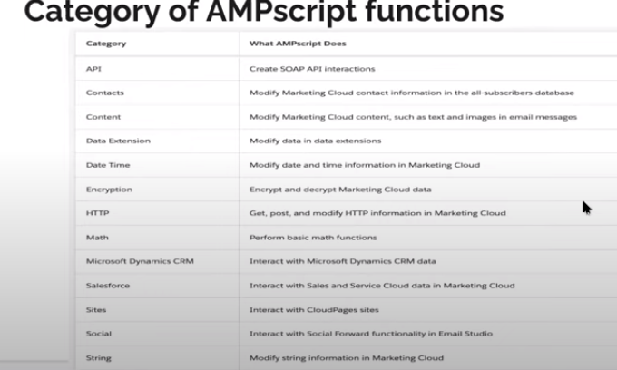  
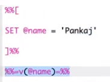  

AMP script lookups  - returns single column value
```
%%[
var @EmailAddress, @lookupValue

set @lookupValue = AttributeValue("_subscriberkey") /* value from attribute or DE column in send context */
set @lookupValue = "5497" /* or a literal value */

set @EmailAddress = Lookup("LoyaltyMembers","EmailAddress","SubscriberKey", @lookupValue)

]%%
EmailAddress: %%=v(@EmailAddress)=%%
```
Explaination - From LoyaltyMembers DE, fetch EmailAddress where SubscriberKey = 5497


AMP script lookuprows - returns a set of unordered rows from a Data Extension, can return all columns  
Below code also covers syntax for if-else and for loop
```
%%[
var @rows, @row, @rowCount, @region, @i

set @region = AttributeValue("Region") /* value from attribute or DE column in send context */
set @region = "North" /* or a literal value */
set @rows = LookupRows("LoyaltyMembers","region", @region)
set @rowCount = rowcount(@rows)

output(concat("region: ", @region))

if @rowCount > 0 then

  for @i = 1 to @rowCount do

    var @emailAddress, @firstName, @rank
    set @row = row(@rows, @i) /* get row based on counter */
    set @firstName = field(@row,"firstName")
    set @emailAddress = field(@row,"emailAddress")

    ]%%

    <br>Row %%=v(@i)=%%, firstName: %%=v(@firstName)=%%, emailAddress: %%=v(@emailAddress)=%%

    %%[
  next @i ]%%
%%[ else ]%%
No rows found
%%[ endif ]%%
```

**Content detective** -  helps you identify spam triggers in your email content  
1. Trigger words - e.g. - Absolutely Free, Accept Credit Cards, act now! don't hesitate!  

**Headers and footers** - customize how those headers and footers appear at an account level  
1. A link to any available profile center - 	%%profile_center_url%%
2. A link to any available unsubscription service	%%unsub_center_url%%
3. The name of your business	%%Member_Busname%%
4. The physical street address of your business	%%Member_Addr%%

**Email attachment** - 
Contact your account executive to have this feature enabled for your accoun  
Attachements can be stored in FTP location, content builder in SFMC

**A/B testing**  
It is a method in which you send two versions of your Marketing Cloud Email Studio communication to two test audiences from your subscriber list. Track which version receives the highest unique open rate or highest click-through rate and send that version to all remaining subscribers  
Before the system sends your emails, it must generate the A/B split. When the A/B test starts, the system chooses the subscribers, assigns Condition A or Condition B to those subscribers  

The system randomly selects which subscribers receive test and remainder, allowing you to use the same set of subscribers for A/B tests in the future  
You can also manually enter the percent of subscribers or number of subscribers that you want to test.  
Set winner criteria  
1. unique open rate
2. click through rate

**Tracking in email studio**  
tracks email open, clicks, undelivered messages, email forwards


Customers can change profile attributes when they click on settings in email send vai SFMC
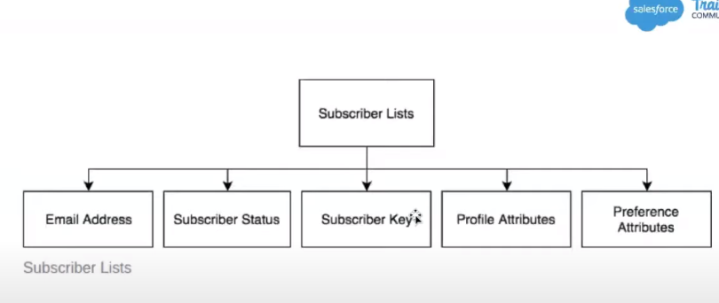 
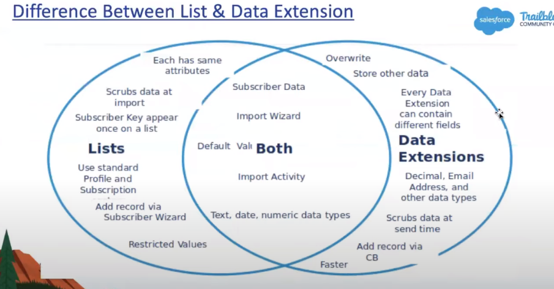 

## Marketing cloud connect
Connect with Salesforce CRM  
Steps  
1. Install the managed package
2. in Salesforce configure user page layout to add SFMC user details
3. in SFMC under user setting -> saleforce integration -> connect account -> login to salesforce -> connection successful
4. Create API user in SFMC (while creating user in SFMC, we have option to select API user)
5. Assign admin and SFMC admin roles to the api user
6. 

## Reporting
1. Email reporting
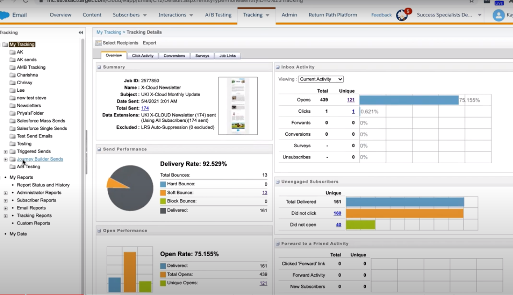   
Each matrix is a link, so clicking that number gives which subscribers fall in that number
2. Datorama reports (available for enterprise and corporate accounts), nnder analytics builder clcik on datorama reports  
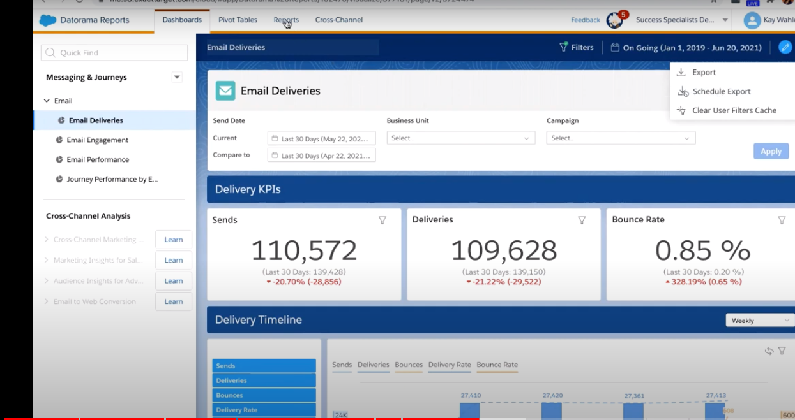  
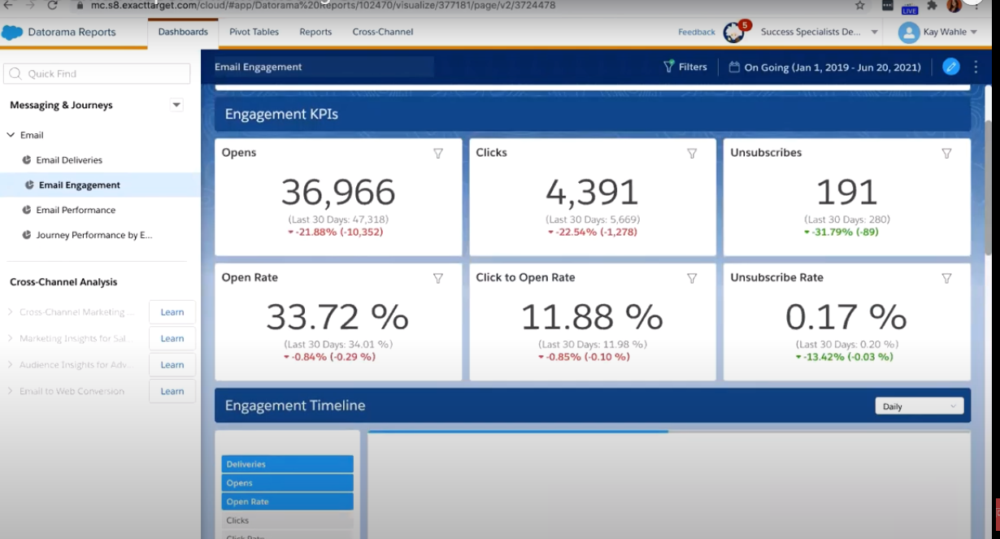  

We can use pivot tables in Datorama to create custom reports
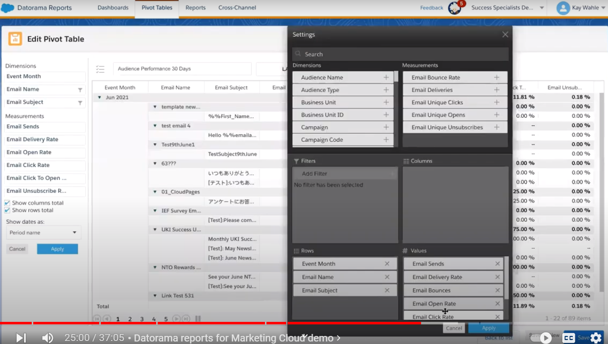  

JB reporting in datorama
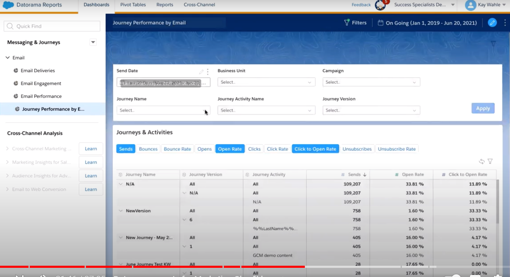  

3. Standard reports - (for non-enterprise / non corporate accounts)
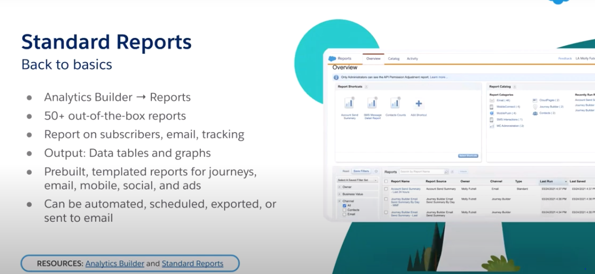  
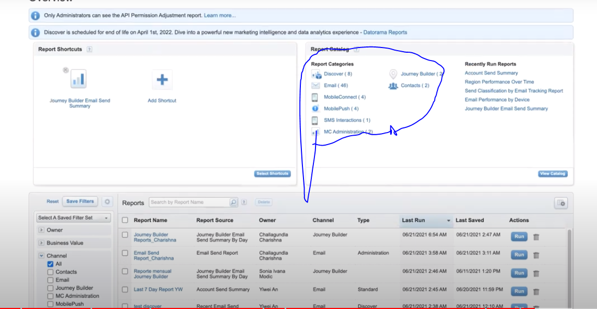  

All types of reports can be exported and scheduled and send to email or FTP location.
Sample report for tracking  
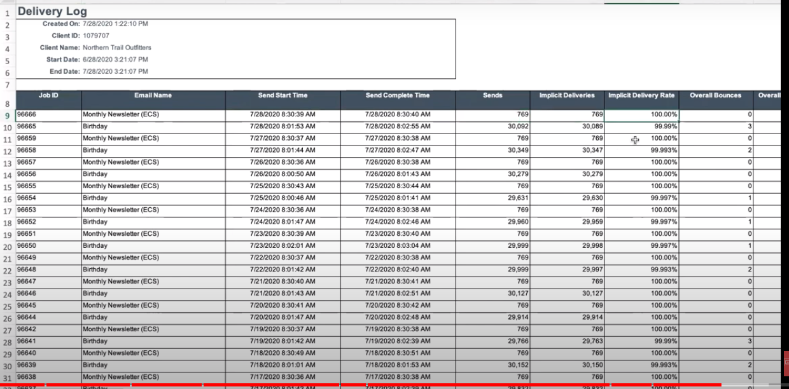  


## Super message 
It is a salesforce currency. Way for SFMC to charge you.  
1 super message = 20RS in India (not sure)  
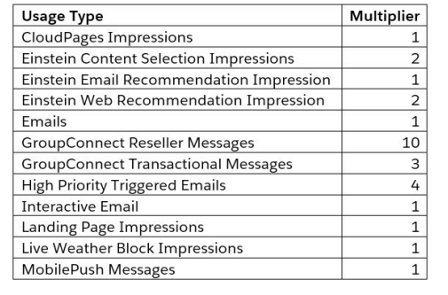  
So 1 high priority trigerred email = 4 SM = 100 RS

## My project
Webinar email campaign  
1. Send Webinar details
2. Send reminder emails after X days
3. Send thank you email after registration complete
4. Thank you email for attending

## To-do
cloud pages
project think through
BU
billing per super email / per sms