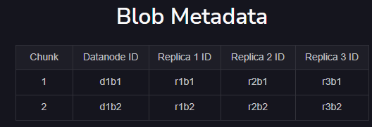

# Blob store

To store (unstructured data) photos, audio, videos, binary executable codes, or other multimedia items.  

Blob store is mostly used by applications with a particular business requirement called write once, read many (WORM).  


| System            | Blob Store         |
|-------------------|--------------------|
| Netflix           | S3                   |
| YouTube           | Google Cloud Storage |
| Facebook          | Tectonic            |

## Blob store system design

### 1. Requirements

#### Functional requirements

1. **Create, Delete, List a Container** - The users should be able to create containers in order to group blobs. A single blob store user can create many containers, and each container can have many blobs, as shown in the following illustration

  

**in AWS S3** - To store your data in Amazon S3, you first create a bucket (here bucket is container) and specify a bucket name and AWS Region. Then, you upload your data to that bucket as objects in Amazon S3. Each object has a key (or key name), which is the unique identifier for the object within the bucket.

2. **Put, Get, Delete blob store data**

#### Non-Functional requirements

1. Availability
2. Durability
3. Scalibility
4. Consistency

### Resource estimation

Assumptions:

- The number of daily active users who upload or watch videos is five million.
- The number of requests per second that a single blob store server can handle is 500.
- The average size of a video is 50 MB.
- The average size of a thumbnail is 20 KB.
- The number of videos uploaded per day is 250,000.
- The number of read requests by a single user per day is 20.

**Number of servers estimation** - From assumption 1 and 2 - 5 Million users / 500 req_per_sec = **10K servers**

**Storage estimation** - Total storage/day = No. of videos/day × (Storage/video + Storage/thumbnail) = **12.5 TB / day**

### Building blocks required to design bolb store

  

### 2. HLD

The client’s requests are received at the front-end servers that process the request. The front-end servers store the client’s blob onto the storage disks attached to them.

  

### 3. API design

1. ```createContainer(containerName)```
2. ```putBlob(containerPath, blobName, data)```
3. ```getBlob(blobPath)```
4. ```deleteBlob(blobPath)```
5. ```listBlob(blobPath)```
6. ```deleteContainer(containerPath)```
7. ```listContainers(accountID)```

#### Detailed design

- **Client:** Users or programs performing API functions.
- **Rate Limiter:** Limits requests based on subscription or IP address.
- **Load Balancer:** Distributes network traffic among servers and can reroute requests based on location.
- **Front-end Servers:** Forward user requests to appropriate storage servers.
- **Data Nodes:** Store blob data, divided into chunks; managed by master node.
- **Master Node:** Manages all data nodes, stores metadata (account, container, blob), and handles access privileges.
- **Metadata Storage:** Distributed database for storing metadata used by master node. Metadata includes which part of blob is stored under which storage server (aka Datanode)
- **Monitoring Service:** Monitors data nodes and master node, alerts administrators of disk failures or low disk space.
- **Administrator:** Handles notifications, conducts routine checkups to ensure reliability.

 

##### Write workflow

1. **Client Request:** Generates upload blob request.
2. **Rate Limiter Check:** Request passes through rate limiter.
3. **Load Balancer:** Forwards request to front-end server.
4. **Front-end Server:** Requests master node for data node information.
5. **Master Node:** Assigns unique ID, splits blob into chunks, determines data node mapping.
6. **Front-end Server:** Writes chunks to assigned data nodes.
7. **Chunk Replication:** Master node replicates chunks for redundancy.
8. **Metadata Storage:** Blob metadata stored in metadata storage.
9. **Return Path:** Fully qualified path returned to client, including user ID, container ID, blob ID, and access level.

##### Read workflow

1. **Front-end Request:** Front-end server requests blob metadata from master node.
2. **Authorization:** Master node checks authorization for the blob (public / private).
3. **Chunk Mapping:** Master node retrieves chunk mappings to data nodes.
4. **Response:** Master node returns chunk data and mappings to client.
5. **Data Retrieval:** Client reads chunk data from data nodes.

Partition the blobs based on the complete path of the blob. The partition key here is the combination of the account ID, container ID, and blob ID. This helps in co-locating the blobs for a single user on the same partition server, which enhances performance.