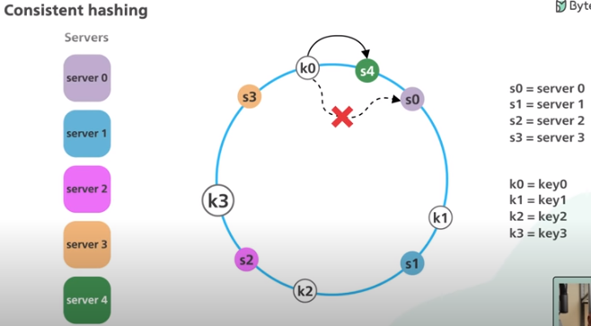

# Consistency

In distributed systems, consistency may mean many things.  

1. One is that each replica node has the same view of data at a given point in time. 
2. The other is that each read request gets the value of the recent write.

## Types of consistency

#### 1. Eventual consistency

1. Weakest consistency model
2. Ensures that all the replicas will eventually return the same value to the read request, but the returned value isn’t meant to be the latest value
3. Used in DNS system
4. Advantages - High availability

#### 2. Casual consistency

1. Ensures that the order of causally related operations in a distributed system is preserved
2. E.g - whatsapp group chat / facebook post reply, order is important
3. Implemented using Vector clock / dependency tracking 

#### Vector clocks
See Sequencer.md

#### Dependency tracking
Each message in in't metadata stores info about the message / action that is is dependent on

#### 3. Sequential consistency

1. Stronger than casual consistency model
2. In casual consistency only casually dependent operations order is preserved, but in sequential, all the event's orders are preserved

#### 4. Strict consistency

1. Strongest consistency model
2. Ensures that a read request from any replicas will get the latest write value
3. Synchronous replication ensures linearizability, in which an acknowledgment is not sent to the client until the new value is written to all replicas.

## **Consistent hasing algo** 

1. In Normal hasing we just has the data attribute and get the hash value
2. In consistent hashing 2 hash is calculated, 1 hash of data value (HD), 1 hash for the actual node (HN)
3. Theriotically, based on JD and HN values, they are placed in a ring (aka Hash ring)
4. Pratically - the library we use for consistent hashing compares HD and HN values, and based on their values they are placed close or farther away in the ring
5. When to want to get the shard on which the data needs to be found / inserted, HD is calculated and we find closest HN clockwise (in case of library HN > HD but HN - HD is smallest)
6. Hence for HD we get HN and we add / find data in that shard
7. If new node is added, then HN is calculated for new Node and placed inside the ring, and new data to be added / removed is calculated based on point no 5.
8. This way rebalancing is done only on the HN that is affected with the new node. (refer to image below)

   

In above example, If new DB server S4 is added, then only K0 keys need to be rebalanced to new DB server S4, no rebalancing required for any other keys 

**Please go through YT videos if consistent hashing isn't clear**

Same consistent hashing algo can be applied in load balancers, when new server is added, the reqeusts would be redirected to new server based on consistent hasing steps discussed above. (HD would be hash of the request url, HN would be hash of the new server)

**Consistent hashing in code**

```javascript
// npm library already available
const { HashRing } = require('hashring');
// Initialize the hash ring with some initial shards
const initialShards = ['shard1', 'shard2', 'shard3'];
const hashRing = new HashRing(initialShards);

// new HashRing(initialShards) - can take array of objects
// new HashRing(initialShards);

// Simulate adding a new shard
const newShard = 'newShard';
hashRing.add(newShard);

// Simulate placing data items
const dataItems = ['data1', 'data2', 'data3', 'data4', 'data5'];
dataItems.forEach(dataItem => {
    const shard = hashRing.get(dataItem);
    console.log(`Data item ${dataItem} is placed in shard ${shard}`);
});


/////////////////////////////////////////
// new HashRing(initialShards) - can take array of objects
// Weights or vnodes are used to give servers a bigger distribution in the HashRing
var ring = new HashRing({
  '127.0.0.1:11211': 200,
  '127.0.0.2:11211': { weight: 200 }, // same as above
  '127.0.0.3:11211': 3200
});

// In above example you have 3 servers where you want to distribute your keys over but not all servers are equal in capacity
// as 2 of those machines have 200mb of memory and the other has 3.2 gig of memory. 
// The last server is substantially bigger and there for should receive a greater distrubtion in the ring.

// Q. but how does adding weight works internally in consistent hasing
// ANS - by using multiple hash functions
// in above e.g. '127.0.0.3:11211': 3200 has highest weight, so this server is hashed with multiple hash functions, so for the same server
// we get multiple hash values, so same server insctance is placed multiple times in the hash ring
// hence by increasing footprints of high capacity servers on hash ring, chances are more requests are redirected to this server 
```
