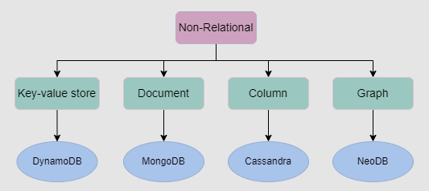
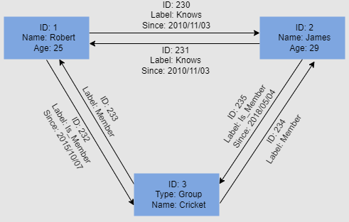
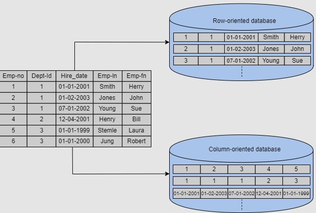
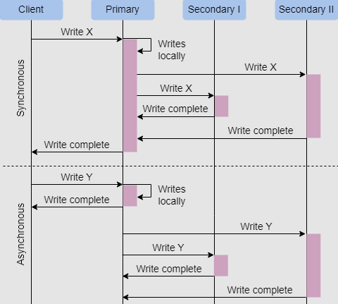
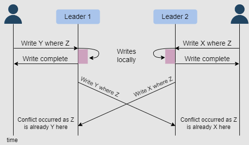
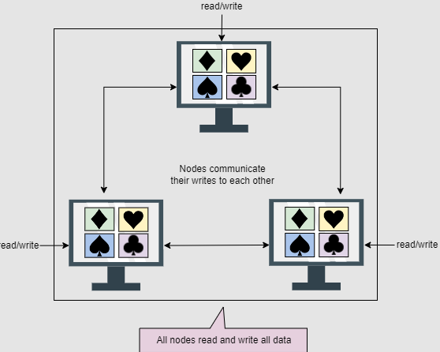

# DB

## NoSQL

1. It is not NoSQL but is it Not Only SQL
2. It is a non relational DB (no Tables)
3. Flexible DB used in big data and real-time web apps

## SQL vs NoSQL

| Aspect                              | SQL                                                          | NoSQL                                                       |
|-------------------------------------|--------------------------------------------------------------|--------------------------------------------------------------|
| Uses fixed tables                   | Uses separate tables with foreign keys for related data.     | Uses JSON objects to store data, allowing for flexible schemas. |
| Referential integrity for data consistency    | Yes                                                | No    |
| Insert and retrieval                | Requires joins to retrieve all required data.                | Retrieval is straightforward without the need for joins.     |
| Adding new columns                  | Expensive, requires locking the database to make changes.   | Easy due to the flexible schema.                            |
| ACID properties                     | Follows ACID properties, ensuring consistency.              | ACID properties not guaranteed, updates may cause inconsistencies. |
| Usage                               | Commonly used in financial systems and transactional databases. | Preferred for systems prioritizing availability over consistency. |
| Read efficiency                     | Efficient for specific data retrieval due to structured queries. | May read entire documents for each query, potentially less efficient. |
| Relations                           | Implicit relationships maintained through foreign keys.     | Relationships not implicit, must be managed manually.       |
| Joins                               | Supports joins for combining related data from multiple tables. | Joins are manual and often require merging data manually.   |
| Normalization                       | Follows normalization principles for data organization.      | Not applicable, normalization is not typically used.        |
| Horizontal scaling                  | Not easy          | NoSQL makes it easier to scale out since the data related to a specific employee is stored in one document instead of multiple tables over nodes|
| License cost                        | expensive                                                    | open source                                                  |

## Types of NoSql

  

### 1. Key value DB (Redis, Memcached and AWS Dynamo DB)  

1. Uses key-value methods like hash tables to store data in key-value pairs
2. Key serves as a unique or primary key, and the values can be anything ranging from simple scalar values to complex objects.
3. Allow easy partitioning and horizontal scaling of the data.

#### Usecases

1. Session-oriented applications

### 2. Document based DB (MongoDB, Google Cloud Firestore)

1. Store and retrieve documents (JSON, XML, BSON)

#### Usecases

1. Used in unstructured catalog data
2. e-commerce applications -  
a product has thousands of attributes, which is unfeasible to store in a relational database (need multiple joins from so many tables to get all product details)  
3. Storing user profile

```JSON
{
  "user_id": "123456",
  "username": "john_doe",
  "email": "john.doe@example.com",
  "full_name": "John Doe",
  "birthdate": "1990-05-15",
  "gender": "male",
  "address": {
    "street": "123 Main Street",
    "city": "New York",
    "state": "NY",
    "postal_code": "10001",
    "country": "USA"
  },
  "phone_numbers": [
    {
      "type": "mobile",
      "number": "123-456-7890"
    },
    {
      "type": "home",
      "number": "987-654-3210"
    }
  ],
  "social_media": {
    "twitter": "john_doe",
    "linkedin": "john.doe",
    "github": "johndoe"
  },
  "preferences": {
    "theme": "light",
    "language": "en",
    "notifications": {
      "email": true,
      "sms": false,
      "push": true
    }
  },
  "membership_status": "active",
  "registration_date": "2023-01-01",
  "last_login": "2024-02-05T10:15:30Z",
  "profile_picture": "https://example.com/profile.jpg",
  "bio": "Lorem ipsum dolor sit amet, consectetur adipiscing elit. Sed aliquam justo ac sem malesuada commodo."
}

```

**Note in one application only we can connect to both SQL and NoSql DB (store user profile in MongDB and other app data in MySql)**  -

```javascript
const mysql = require('mysql');
const { MongoClient } = require('mongodb');
const express = require('express');
const app = express();
// MySQL connection configuration
const mysqlConnection = mysql.createConnection({
  host: 'localhost',
  user: 'root',
  password: 'password',
  database: 'my_database'
});
// MongoDB connection URL
const mongoUrl = 'mongodb://localhost:27017/my_database';
// Promise to connect to MySQL
const connectToMySQL = new Promise((resolve, reject) => {
  mysqlConnection.connect((err) => {
    if (err) {
      reject(err);
      return;
    }
    console.log('Connected to MySQL');
    resolve();
  });
});
// Promise to connect to MongoDB
const connectToMongoDB = new Promise((resolve, reject) => {
  MongoClient.connect(mongoUrl, { useNewUrlParser: true, useUnifiedTopology: true })
    .then((mongoClient) => {
      console.log('Connected to MongoDB');
      resolve(mongoClient);
    })
    .catch((err) => {
      reject(err);
    });
});
// Start Express server only when both connections are successful
Promise.all([connectToMySQL, connectToMongoDB])
  .then(() => {
    console.log('All connections successful. Starting Express server...');
    app.listen(3000, () => {
      console.log('Express server started on port 3000');
    });
  })
  .catch((err) => {
    console.error('Error connecting to databases:', err);
    // Handle error and exit application
    process.exit(1);
  });
// Close MySQL connection when the Node.js process exits
process.on('exit', () => {
  mysqlConnection.end();
  console.log('MySQL connection closed');
});
```

## 3. Graph DB ( Neo4J, OrientDB, and InfiniteGraph)

1. Use the graph data structure to store data
2. Nodes represent entities, edges represent relationship between entities

  

#### Usecases

1. Social applications
2. To Drive analyses and decisions based on relationships between entities

## 4. Column based DB ( Cassandra, HBase, Hypertable, and Amazon SimpleDB)

1. Store data in columns instead of rows
2. Enable access to all entries in the database column quickly and efficiently

#### Usecases

1. Efficient for a large number of aggregation and data analytics queries  
(e.g. In financial institutions, there’s a need to sum the financial transaction over a period of time)

In traditional row based DB, to do sum, we need to traverse through each row  
In column based DB, just traverse through only 1 row and read all data sequentially

  

## DB replication

Replication refers to keeping multiple copies of the data at various nodes (preferably geographically distributed) to achieve

1. availability
2. scalability
3. performance

**If we just do daat replication, we mean that all the data is stored in a single node, and we replicate the same data across multiple nodes (If the data can't be stored in one node we use partitioning)**

#### Issues with Data replication

1. Data consistency / integrity
2. Network latency
3. Conflict resolution - when multiple copies of the same data are modified independently in different. (How to resolve conflicts? 1. Automatic - DBMS systems checks timestamp of 2 writes, last-writer-wins 2. Manual - DBMS admin manually resolves conflicts)
4. Scalability issues - due to network latency to replicate data will all nodes
5. Synchronization overhead
6. Performance degradation
7. Failure recovery

#### DB replication types

##### Synchronous and Asynchronous

| Aspect                 | Synchronous Replication                                | Asynchronous Replication                               |
|------------------------|--------------------------------------------------------|--------------------------------------------------------|
| **Define**             | Primary node to wait for ack from all nodes, and then send response to client | Primary node no wait            |
| Data Consistency       | Ensures strong consistency between replicas            | Eventual consistency                                   |
| Durability             | Guarantees that data is safely replicated before ACK    |Data eventaully replicated after ACK                   |
| Failure Handling       | Easier to detect failures and maintain consistency     | More fault-tolerant due to decoupled operation         |
| Read Scalability       | Generally better for read-heavy workloads               | May provide better read scalability with lagged replicas|
| Performance Impact     | Synchronous nature can introduce latency for writes     | Potential data loss in case of replica failure         |
| Network Dependency     | Relies heavily on stable and fast network connections  | Less dependent on network quality and latency          |
| Scalability            | May limit scalability due to synchronous nature        | Generally more scalable due to asynchronous operation  |
| Complexity             | Can introduce complexity in managing synchronous commits| Simplified configuration and management                |

  

##### Who does DB replication

| Entity                    | Examples                                      |
|---------------------------|-----------------------------------------------|
| Database Management Systems (DBMS) | SQL Server Replication, Oracle Data Guard, MySQL Replication, PostgreSQL streaming replication |
| Middleware Solutions      | IBM InfoSphere Data Replication, Oracle GoldenGate, Attunity Replicate |
| Third-party Replication Tools | SharePlex, HVR, Dbvisit Replicate |
| Cloud Service Providers   | Amazon RDS (Relational Database Service), Google Cloud SQL, Azure SQL Database |

##### DB replication in MySQL -  

1. **Prepare the Master Database**:
   - Ensure that binary logging is enabled on the MySQL server acting as the master.
   - Set the `log_bin` parameter in the MySQL configuration file (`my.cnf`).

2. **Create a Replication User on the Master**:
   - Create a dedicated MySQL user account for replication with appropriate privileges like `REPLICATION SLAVE` and `RELOAD`.

3. **Identify the Master's Binary Log File and Position**:
   - Note down the current binary log file and position on the master for replication initialization.

4. **Prepare the Slave Database**:
   - Install and configure MySQL on the slave node.
   - Ensure network connectivity between the master and slave nodes.

5. **Configure the Slave to Replicate from the Master**:
   - Edit the MySQL configuration file (`my.cnf`) on the slave to configure it as a replica.
   - Configure replication parameters (`master_host`, `master_port`, `master_user`, `master_password`, `master_log_file`, `master_log_pos`) using master's information.

6. **Start the Slave and Begin Replication**:
   - Start the MySQL server on the slave node.
   - Start replication process on the slave using `START SLAVE` command.

##### DB replication in MS SQL server -

1. **Configure Replication on the Primary Server**:
   - Launch SQL Server Management Studio (SSMS) and connect to the primary SQL Server instance.
   - Right-click on the primary database, navigate to Tasks > Replication > Configure Distribution.
   - Follow the wizard to configure distribution for the database. Choose the appropriate options based on your replication requirements.

2. **Select Replication Type**:
   - Choose the appropriate replication type based on your needs (e.g., transactional replication, snapshot replication, merge replication).

3. **Configure Publishers (Primary node)**:
   - Specify the publisher (primary server) for the replication topology.

4. **Install SQL Server on Subscriobers (Secondary Nodes)**:
   - Install SQL Server on the secondary nodes (replicas) where you want to replicate the database.
   - Use SQL Server Management Studio (SSMS) to configure each subscriber, specifying the publisher's connection properties,

5. **Initialize Subscribers**:
   - Initialize the subscribers by applying the initial snapshot or transaction log backup (depending on the replication type) to synchronize the data with the primary database.

### DB replication Models

Sync and Async DB replications are the type of replications, below are the models where either of (sync/async) replication can be used

### 1. primary-secondary replication (using sync / async)

- One node is designated as the primary. It’s responsible for processing any writes to data stored on the cluster
- Useful when workload is read heavy
- DB could be inconsistent if we use asynchronous replication
- Primary node is bottlneck and if primary node goes down any one of the secondary node (based on which node has most up-to-date data) becomes primary node

**3 ways in how DB does primary-secondary replication**

1. Statement based replication
   - primary node sends all SQL queries to secondary nodes
   - issue with nondeterministic functions in SQL queries, for e.g. NOW()
   - query seqeunce issue -  if second write query is sent first before the first write query to secondary nodes if first write query is slow

2. Write ahead log (WAL) shipping
   - primary node writes query to a log file and send archieve log files to secondary nodes (improved performance)
   - no issue of query sequence, since queries are logged first before execution

3. Row based replication
   - secondary nodes replicate the actual data changes rather then executing queries from primary node

### 2. multi-leader replication (using sync / async)

- There are multiple primary nodes that process the writes and send them to all other primary and secondary nodes to replicate.
- Better performance, scalobility and reliability
- Issue - write conflicts between multiple leaders

  

**Avoding conflicts**

- Last write wins - Using their local clock, all nodes assign a timestamp to each update.

### 3. peer-to-peer / leaderless replication (using sync / async)

 All the nodes have equal weightage and can accept reads and writes requests.

   

###### Interview

In interview ask this Qs to the interviewer  

- Do you need low latency to the client or more consistency
  - If low latency - async replication
  - If more consistency - sunc replication

- Is the workload readh-heavy or write-heavy?
  - Read heavy - primary secondary replication
  - write heavy - peer-to-peer replication
