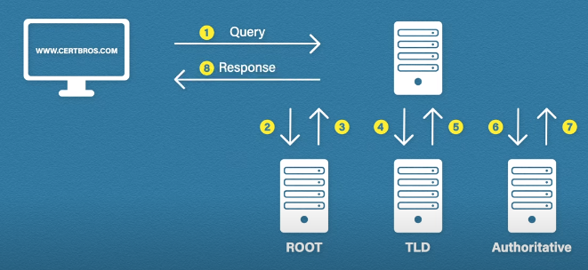
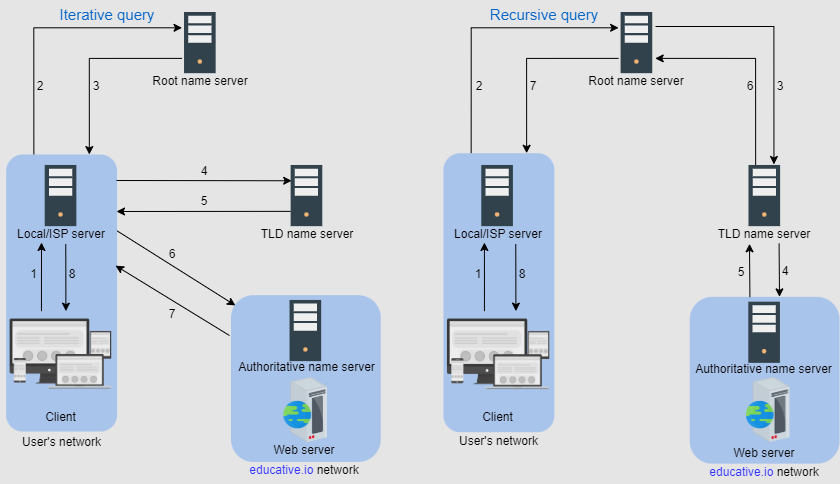

# DNS (Domain Name System - domain to IP address)

  

**When you hit abc.example.com in browser below things happen** (refer above image)  

1. DNS server on you machine checks if entry of that domain name is present
2. CHeck browser cache
3. Call **local DNS server** (aka Name server) (provided by ISP) and that server check's it cache
4. If Ip not found, Name server calls the **Root DNS server (root server is at the top of DNS hierarchy)** which returns which **Top level domain(TLD)** server to reach out to (e.g. reach out to .com, or .org. or .in TLD servers).   
 when a user requests the IP address of educative.io, root-level name servers will return a list of top-level domain (TLD) servers that hold the IP addresses of the .io domain
5. TLD server will refer to **Authorative name server** which should have the IP address 

#### 2 ways to perform DNS queries

  

1. Iterative 
2. Recursive

It looks like recursive is faster but to reduce load on DNS servers, and increase loads on ISP iterative process is used

### More info on DNS

1. There are 13 logical root name servers (named letter A through M) with many instances (around 1,000) spread throughout the globe. These servers are managed by 12 different organizations.
2. DNS uses UDP protocol for name lookups, then what about data loss. No issue A DNS resolver can resend the UDP request if it didn’t get a reply to a previous one

**For abc.exmaple.com - Root server will return .com, TLD will return example.com, Authorative NS will return abc.example.com**

### Types of DNS records

| Record Type | Purpose                                                | Example                    |
|-------------|--------------------------------------------------------|----------------------------|
| A           | Maps a hostname to an IPv4 address                     | example.com -> 192.0.2.1   |
| AAAA        | Maps a hostname to an IPv6 address                     | example.com -> 2001:0db8:85a3:0000:0000:8a2e:0370:7334 |
| CNAME       | Creates an alias for a hostname                        | fb.com -> facebook.com or www.example.com -> example.com |
| NS          | Specifies the authoritative DNS servers for a domain   | example.com -> ns1.example.com |
| MX          | Specifies the mail server for a domain                 | example.com -> mail.example.com |
