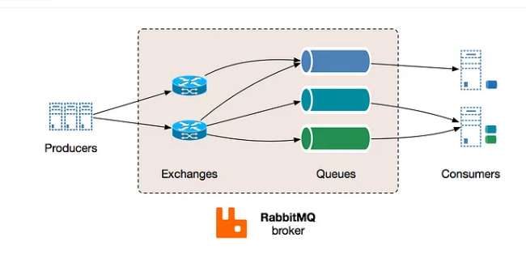

# Distributed Messaging queue

1. A messaging queue is an intermediate component between the interacting entities known as producers and consumers. The producer produces messages and places them in the queue, while the consumer retrieves the messages from the queue and processes them.
2. Messages are sent from one component of a system (node) to another (node).
3. Used in distributed systems, microservices architectures, and various other scenarios where different parts of a system need to communicate with each other in a loosely coupled manner
4. When multiple receivers are connected to the same channel in RabbitMQ, each message is delivered to exactly one consumer (as opposed to pub-sub model, where message is delivered to all the subscribers). in MQ, each message is delivered to exactly one consumer but, if there are multiple recievers, messages are distributed among the consumers in a round-robin manner (**so mutliple consumers meaning load balancing**)

## Distributed MQ lifecycle

1. Message Production by Producer and published to MQ server (RabbitMQ)
2. RabbitMQ receives the message and stores it in the specified queue
3. A consumer application, connected to the same queue, retrieves the message from RabbitMQ for processing.
4. Consumer acknowledges after successfully processing the message
5. When RabbitMQ receives (ack), message is deleted from queue 
6. If consumer fails / goes down and no ack sent, RabbitMQ may redeliver the message to another consumer (if exists)
7. If no cunsumer to recieve message, the message remains in the queue until time-to-live (TTL) isn't expired

## Rabbit MQ on local

1. Install Rabbit MQ server on local (in distribted systems, it would be installed on on of the nodes).
2. sender.js 
```javascript
const amqp = require('amqplib');
async function send() {
  const connection = await amqp.connect('amqp://localhost');
  const channel = await connection.createChannel();
  const queueName = 'hello';
  const message = 'Hello, RabbitMQ!';

  await channel.assertQueue(queueName); // ensures that the queue named queueName exists on the RabbitMQ server. If the queue does not exist, RabbitMQ will create it. 
  channel.sendToQueue(queueName, Buffer.from(message));
  console.log(`[x] Sent '${message}'`);

  setTimeout(() => {
    connection.close();
    process.exit(0);
  }, 500);
}
send().catch(console.error);
```
3. reciever.js
```javascript
const amqp = require('amqplib');
async function receive() {
  const connection = await amqp.connect('amqp://localhost');
  const channel = await connection.createChannel();
  const queueName = 'hello';
  await channel.assertQueue(queueName);
  console.log(`[*] Waiting for messages in ${queueName}. To exit press CTRL+C`);
  channel.consume(queueName, (msg) => {
    if (msg !== null) {
      console.log(`[x] Received '${msg.content.toString()}'`);
      channel.ack(msg); // acknowledging to RabbitMQ that message is consumed successfully and it can be removed from the queue
    }
  });
}
receive().catch(console.error);
```

**In dsitributed systems, sender.js and reciever.js will be scripts running on different nodes (machines), provided that they are connected to same RabbitMQ server**

## System Design of a Distributed messaging queue

### 1. Functional req

1. Create Queue
2. Send message
3. Recieve message
4. Delete message
5. Queue deletion

### 2. Non functional req

1. Durability - data stored in MQ shouldn't be lost
2. Scability
3. Availablity
4. Performance

### Design consideration

#### 1. Message ordering 

Need to ensure that messages need to be recieved at the reciever component in the same order as produced by the producer

**2 approaches** - 

1. Monotonically increasing numbers -  When the first message arrives to MQ serer, the server assigns it a number, such as 1. It then assigns the number 2 to the second message, and so on. (slow performance since Rabbit MQ qill be bottleneck for generating numbers)
2. Using time stamps based on synchronized clocks - assign timestamp for each message when produced by the producer, but producers can be running on different machines, hence timstamp would differ since different machines / nodes will have different timestamps, so use synchronized clocks

**Synchronized clocks** - aka network time protocol (NTP) synchronized clock, is a clock that is precisely set to the same time as other clocks within a network. This synchronization ensures that all devices in the network are using the same time reference. The time servers (any node assigned as main clock) periodically broadcast their time information to other devices on the network, and other devies replicate that timing

```javascript
const ntpClient = require('ntp-client');
// Fetch time from NTP server
// NTP server is a globally distributed network of servers that provide 
// accurate time synchronization services to clients over the Internet
ntpClient.getNetworkTime("pool.ntp.org", 123, (err, date) => {
  if (err) {
    console.error(err);
    return;
  }
  // Use synchronized time in your application
  console.log("Synchronized time:", date);
});
```

### HLD od Distributed MQ

In case of single-server MQ, design is straight forward, but it has limitations -  
1. Availibility - if single server MQ goes down
2. Scability - if lot of producers connected, MQ grows long, then it becomes bottleneck,

**Hence use Distributed MQ - (multiple MQ servers)** - 

1. Queue data is replicated using primary-secondary or peer-ro-peer model
2. We can use data partitioning if the queue gets too long to fit on a single server, use use a consistent hashing-like scheme to know when message is stored in which queue

  
Think of exchanges as servers with consistent-hasing algo, which will determine to which queue the message needs to be stored

# To-do 

1. learn RabbitMQ api
2. synchronized clocks.