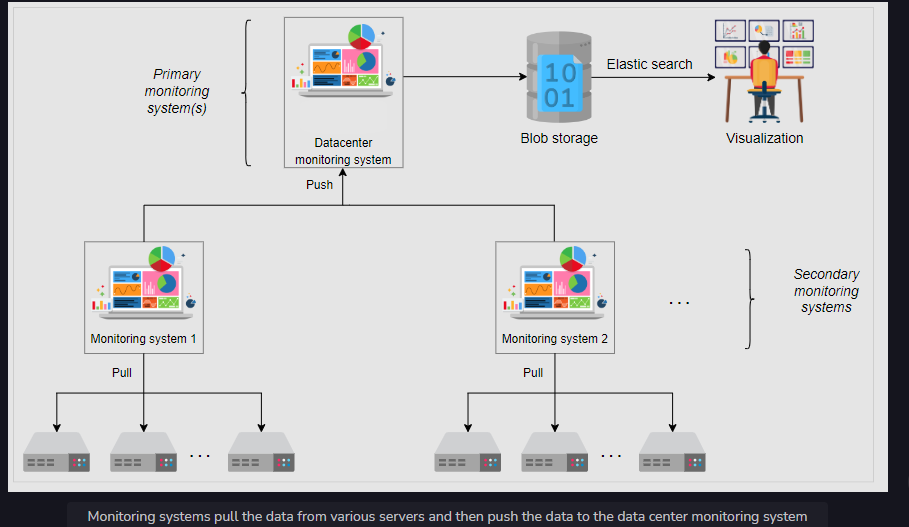
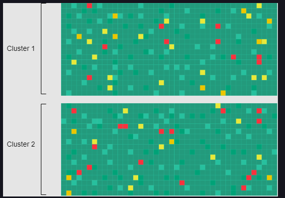

# Distributed-Monitoring

## Requirements

1. Monitor app logs
2. Monitor networks errors / active loadbalancers
3. Monitor storage / infra load logs
4. Generate alerts on failures

## 1. Monitoring server side errors

### HLD / Building blocks

  

We’ll use time-series databases to save the data locally on the server where our monitoring service is running.  

 

**Large data centers have millions of servers, and visualizing the health data for all of them is challenging.** - 

We’ll identify if a server is down by using heat maps.  

   

We can use heat maps for the globally distributed systems and continuously share the health information of a server.  
We can quickly find out which server is down by the red color and focus on the problematic parts.  
We can create similar heat maps to get a bird’s-eye view of any resource, like filesystems, networking switches, links, and so on.  

## 2. Monitoring client side errors  
