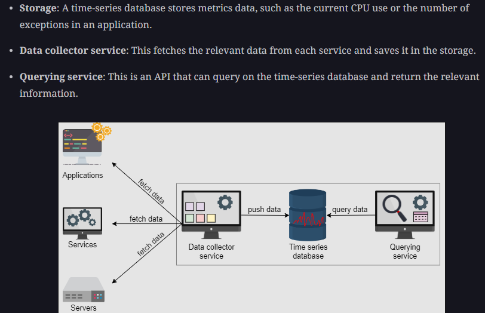

# Distributed-Monitoring

## Requirements

1. Monitor app logs
2. Monitor networks errors / active loadbalancers
3. Monitor storage / infra load logs
4. Generate alerts on failures

## HLD / Building blocks

  

We’ll use time-series databases to save the data locally on the server where our monitoring service is running.  

 