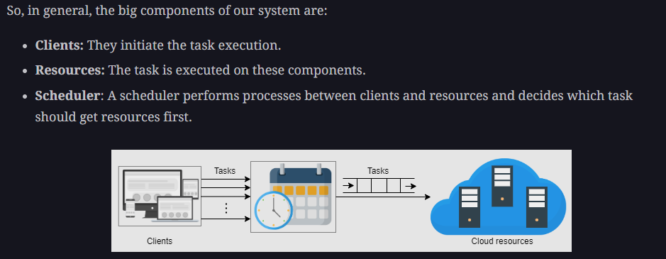

# Distributed-Task-Schedular (Gitlab task runner)

A task is a piece of computational work that requires resources (CPU time, memory, storage, network bandwidth, and so on) for some specified time.

## Requirements

1. Functional requirements

2. Non-functional requirements

1. Availability - we use rate limiter to ensure the system doesn't go down
2. Durability - We store the tasks in a persistent distributed database and push the tasks into the queue near their execution time
2. Scalibility -  task submitter is distributed in our design. We can add more nodes to the cluster to submit an increasing number of tasks

## Building blocks for Distributed Task schedular

  

**More building blocks-** - 

1. **Queue manager** - The queue manager deletes a task from the queue if it executes successfully. It retries for the allowed number of attempts for a task in case of a failed execution.
2. **Resource manager** -  The resource manager knows which of the resources are free. It pulls the tasks from the distributed queue and assigns them resources. The resource manager keeps track of the execution of each task and sends back their statuses to the queue manager. (We have manifest.yml file where we specify ram, cpu cores req, and resource manager has list of nodes and their capacity, using this 2 info we (resource manager) can decide if a job can run on a given node)

It is important to put the tasks in the queue, and the task schedular will decide which tasks to start (based on priority) and which tasks to keep on-hold (in queue) based on resources left in the Resources component.

The client needs to send below info to the task schedular  - 
1. Resource req - (how many CPU cores are required, RAM, ports)
2. OS dependencies - docker images, commands to be run

### DB schema

| Column Name         | Datatype | Description                                                                                           |
|---------------------|----------|-------------------------------------------------------------------------------------------------------|
| TaskID              | Integer  | Uniquely identifies each task.                                                                       |
| UserID              | Integer  | This is the ID of the task owner.                                                                    |
| SchedulingType      | VarChar  | This can be either once, daily, weekly, monthly, or annually.                                         |
| TotalAttempts       | Integer  | This is the maximum number of retries in case a task execution fails.                                 |
| ResourceRequirements | VarChar  | Clients have to specify the type of the offered resource categories, such as Basic, Regular, or Premium. The specified resource category is saved in the form of a string in the RDB. |
| ExecutionCap        | Time     | This is the maximum time allowed for the task execution. (This time starts when a resource is allocated to the task.) |
| Status              | VarChar  | This can be waiting, in progress, done, or failed.                                                    |
| DelayTolerance      | Time     | This indicates how much delay we can sustain before starting a task.                                   |
| ScriptPath          | VarChar  | The path of the script that needs to be executed. The script is a file placed in a file system. The file should be made accessible so that it can be executed |

To prioritize the tasks, the task scheduler maintains a delay tolerance parameter for each task and executes the task close to its delay tolerance. Delay tolerance is the maximum amount of time a task execution could be delayed. The task that has the shortest delay tolerance time is executed first.  

E.g. - Facebook, suggesting friends is not an urgent task. We can make a separate queue for tasks like this and execute them in off-peak times. (This is how friend suggestions in FB work using Distributed task schedular)

**Questions** - 
1. What if a long task is 90% executed, but before it completes, the machine that was executing this task fails?
 - Divide the taks into stages. Save logs or have a pub-sub system for such task, where each stage of long task is published and save the state of the task step where it failed, and re-run only those tasks
