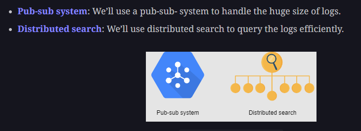

# Distributed Logging

In Distributed stystems, different logs are stored in different nodes

## Design

### 1. Functional requirement

1. Writing / Searching / Storing logs
2. Centralized logging visualizer - it should provide a unified view of globally separated services

### 2. Non-functional requirements

1. Low-latency
2. Availability 
3. Scalibility

### API design

1. ```write(unique_ID, message_to_be_logged)```
2. ```searching(keyword)```

### Building blocks



**Apart from building blocks we will need custom developer created components in the system**  

1. **Log accumulator** - An agent that collects logs from each node and dumps them into storage. So, if we want to know about a particular event, we don’t need to visit each node
2. **Storage** - We’ll choose blob storage to save our logs.
3. **Log indexer** - distributed search building block to search logs
4. **Visualizer UI** - To provide unified view of all logs

**Steps** - 

1. Each service will push its data to the log accumulator service (the data will include - node-id/service-id, log type (info, warn, error), log message, timestamp). 
2. Each service pushes log to accumulator in pub-sub pattern, this way logging doesn't affect the performance of other processes (we don't have to wait for accumulator to consume the log immediately), the service just publish the logs and the service thread is free for another user api request
3. Log accumulator consumes the log from pub-sub system and store it in Blob store