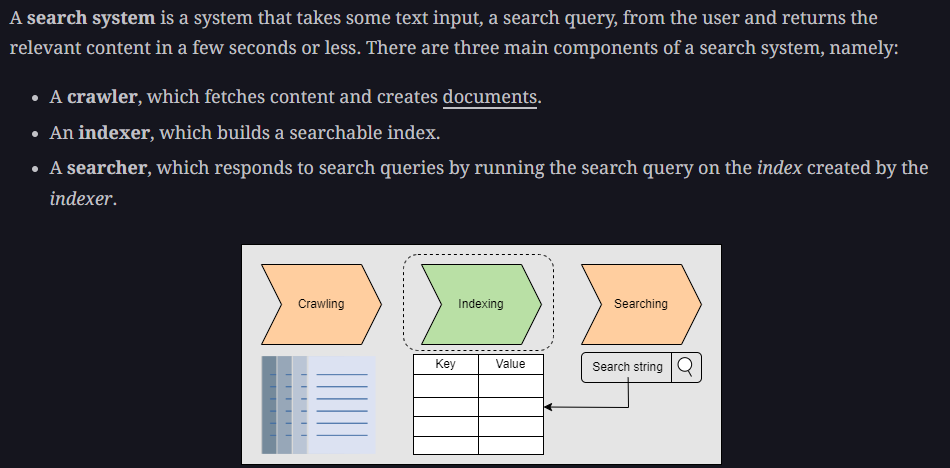
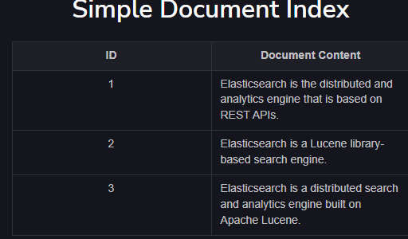
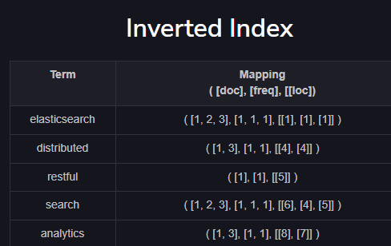

# Distributed Search

e.g. - Youtube / google search

  

## Distributed Search system design

### 1. Requirements

**Functional requirements**

1. Users should be able to search

**Non Functional requirements** - 

1. Availablity
2. Scalibility
3. Performance

### 2. Building block needed

1. Blob store to store the data that needs to be indexed

## Step 1 - Build Indexing

#### Search using Inverted indexing 

1. For each document we assign ID, so that we can refer those Ids when creating inverted index

 

2. Create Inverted Index  

  

**Understand how the mapping is created** - ([doc], [freq], [loc]),  
for example - the value for distributed is ([1, 3], [1, 1], [[4], [4]]) - this means  

1. **[1,3]** -  the word distributed is found in doc 1 and 3
2. **[1, 1]** -  in both the docs the frequency of this word is 1 
3. **[4, 4]** the word is found on 4th location for document 1 and document 3
