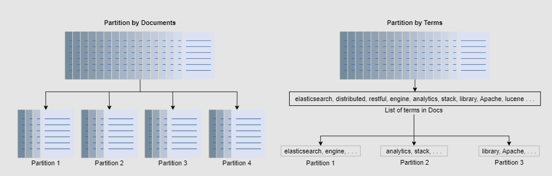
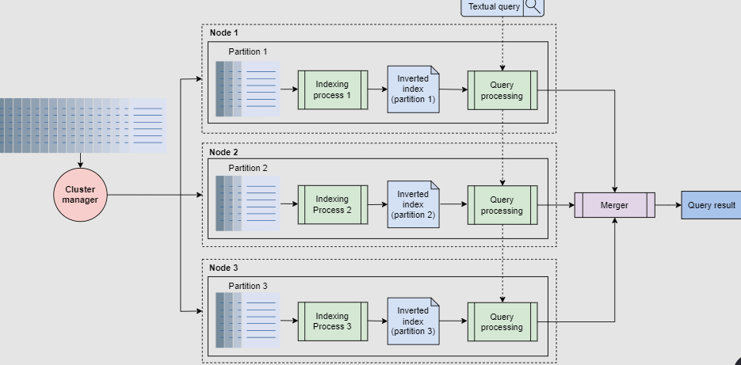

# Distributed Search

e.g. - Youtube / google search

  

## Distributed Search system design

### 1. Requirements

**Functional requirements**

1. Users should be able to search

**Non Functional requirements** -

1. Availablity
2. Scalibility
3. Performance

### 2. Building block needed

1. Blob store to store the data that needs to be indexed

## Step 1 - Build Indexing

#### Search using Inverted indexing (Map reducer function)

1. For each document we assign ID, so that we can refer those Ids when creating inverted index

2. Tokenization - remove frequently occuring words like (to, and the) from documents
3. Create Inverted Index  

  

**Understand how the mapping is created** - ([doc], [freq], [loc]),  
for example - the value for distributed is ([1, 3], [1, 1], [[4], [4]]) - this means  

1. **[1,3]** -  the word distributed is found in doc 1 and 3
2. **[1, 1]** -  in both the docs the frequency of this word is 1
3. **[4, 4]** the word is found on 4th location for document 1 and document 3  

**Similarly understand the mapping generated for elasticsearch keyword**  

4. Now when user searches for **search engine** - we get the mappings - 

  

5. Finally we rank the documents based on the frequency counts and return the doc list to the user

### 2. HLD

**Note - both crawling the documents and creating inverted index is done offile as a batch job and both crawling and indexing steps needs to be run when new doc is added / removed or updated**

**See in below image how crawling and indexing is an offline process**

  

1. The process begins with a crawler gathering textual content from a designated resource, like YouTube videos, including titles, descriptions, and annotations. This content is structured into JSON documents and stored in distributed storage.

2. Next, an indexer processes these documents using MapReduce on a distributed cluster, constructing an index table also stored in distributed storage.

3. When a user submits a search query, the searcher parses it and retrieves mappings from the index in distributed storage. It intelligently handles misspelled words by mapping them to the closest vocabulary terms, then finds documents containing all query words and ranks them for presentation to the user.

**But all og the above logic is for centralized search, how to work with Distributed search** - 

## Distributed Search

We need to partition the inverted index that is generated offline. That means different nodes will have their individual inverted index 

2 ways to do this 

1. **Document partitioning** - Each node gets subset of Documents, and the nodes perform inverted index on those subset of documents
2. **Term partitioning** - Terms are partitioned into subsets, and each node gets subset of Terms, and inverted index is generated for all documents but only for the terms assigned to that node

   

In term partitioning, a search query is sent to the nodes that correspond to the query terms. Here subset of query string is sent to different nodes based on their term mapping and then results are merged from different nodes. (**here lot of to and fro is required between different nodes which is costly**)  
In document partitioning, each query is distributed across all nodes, and the results from these nodes are merged before being shown to the user.  

**Document partitioning workflow** - 

   

1. **Offline process** - Here cluster manager will partition the documents to different Nodes based on Node's capacity and each node will run the indexing logic to generate inverted index.
2. **Online process** - when user sends search query, the query is run across all individual index and results are then merged and ranked based on the frequence of search keywords.

**Partitioning + Replica** - for each of this individual nodes, we can have replica of each od these nodes for replication, so even if one of the node fails, the replica will do indexing. Again repplica here can be **primary-secondary replication** which we learnt in DB replication.

**Note - computing index is a very resource intensive taks, hence if we create replica, we only create inverted index on primary node and share the inverted index (binary file) to the replica nodes**

