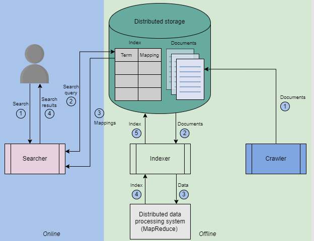

# Distributed Search

e.g. - Youtube / google search

  

## Distributed Search system design

### 1. Requirements

**Functional requirements**

1. Users should be able to search

**Non Functional requirements** -

1. Availablity
2. Scalibility
3. Performance

### 2. Building block needed

1. Blob store to store the data that needs to be indexed

## Step 1 - Build Indexing

#### Search using Inverted indexing

1. For each document we assign ID, so that we can refer those Ids when creating inverted index

2. Tokenization - remove frequently occuring words like (to, and the) from documents
3. Create Inverted Index  

  

**Understand how the mapping is created** - ([doc], [freq], [loc]),  
for example - the value for distributed is ([1, 3], [1, 1], [[4], [4]]) - this means  

1. **[1,3]** -  the word distributed is found in doc 1 and 3
2. **[1, 1]** -  in both the docs the frequency of this word is 1
3. **[4, 4]** the word is found on 4th location for document 1 and document 3  

**Similarly understand the mapping generated for elasticsearch keyword**  

4. Now when user searches for **search engine** - we get the mappings - 

  

5. Finally we rank the documents based on the frequency counts and return the doc list to the user

### 2. HLD

**Note - both crawling the documents and creating inverted index is done offile as a batch job and both crawling and indexing steps needs to be run when new doc is added / removed or updated**

**See in below image how crawling and indexing is an offline process**

  

1. The process begins with a crawler gathering textual content from a designated resource, like YouTube videos, including titles, descriptions, and annotations. This content is structured into JSON documents and stored in distributed storage.

2. Next, an indexer processes these documents using MapReduce on a distributed cluster, constructing an index table also stored in distributed storage.

3. When a user submits a search query, the searcher parses it and retrieves mappings from the index in distributed storage. It intelligently handles misspelled words by mapping them to the closest vocabulary terms, then finds documents containing all query words and ranks them for presentation to the user.

