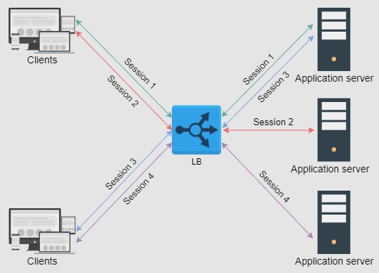

# Load Balancer

The job of the load balancer is to fairly divide all clients’ requests among the pool of available servers

LBs can be placed between  

1. between client and web / app server
2. between web (generally server static content) and app (app server has all the business logic) server
3. between app server and DB server

**What does load balancer do**  -

1. Healthcheck of servers in the pool
2. TLS termination (learn more about TLS) - since request is terminated at LB itself, end servers burden is reduced
3. Can avoid Denial of Service attack

## Types of load balancers

1. Global server load balancing (GSLB): GSLB involves the distribution of traffic load across multiple geographical regions.
2. Local load balancing: This refers to load balancing achieved within a data center. They behave like a reverse proxy.

**Stateless and Stateful load balancers**  

1. Stateful - The stateful LB incorporates state information in its algorithm to perform load balancing.
  
2. Stateless - maintains no state. Mostly uses consistent hashing algo to reroute requests