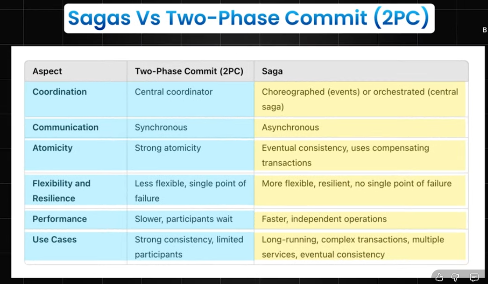

# Microservices pattern

## 1. Circuit breaker pattern
#### Problem it solves
- Prevents a service from being overwhelemed with requests when a dependant service is slow / unavailable 

#### Details
- if service A is dependant on service B, and if 100s of req/sec is made to service A, and if service B is down / slow, then because of issue in service B, service A's thread's are hung instead of returning immediately. This issue becomes exponentianlly critical, when requests keep on coming
- this problem cascades when service C is dependatnt on Service A, and service A has slowed down due to service B

**Similarly to curcuit breaker pattern, there is also a retry pattern, where basically a service retries the action (API call) after certain interval of time, but this pattern is only used if failures are transient failures (maybe network / temporary error), using retry pattern for persistant failures (like service is down), will be counter productive / anti-pattern**  

- When everything is working fine, the cercuit breaker is closed, when a service starts failing, the circuit breaker is opened

#### Key configurations

- **Timeout** – Maximum time to wait for a service response before treating the request as failed.
- **Failure Threshold** – Number (or percentage) of failures required to open the circuit.
- **Error Threshold Percentage** – Percentage of failed requests that triggers the circuit to open.
- **Sleep Window / Retry Timeout** – Time the circuit remains open before allowing a retry.
- **Half-Open Max Calls** – Number of test requests allowed while checking if the service has recovered.
- **Success Threshold** – Number of consecutive successful test requests required to close the circuit.

#### Implementation
- for nodejs we have npm package - **oppossum**  
```javascript
const CircuitBreaker = require('opossum');

function asyncFunctionThatCouldFail(x, y) {
  return new Promise((resolve, reject) => {
    // Do something, maybe on the network or a disk
  });
}

const options = {
  timeout: 3000, // If our function takes longer than 3 seconds, trigger a failure
  errorThresholdPercentage: 50, // When 50% of requests fail, trip the circuit
  resetTimeout: 30000 // After 30 seconds, try again for new client requests.
};
const breaker = new CircuitBreaker(asyncFunctionThatCouldFail, options);

breaker.fire(x, y)
  .then(console.log)
  .catch(console.error);
```

## 2. Distributed transactions
#### Problem it solves
- pattern that iguides mplementing ACID properties for distributed systems  

#### Details
- We have e-commerce site, for a user placing an order is 1 transaction, but behind the scenes, inventory count should be reduced by 1 for that item, payment service should be success, new record in shipping service needs to be added
- for user it is 1 transaction, but for distributed system, 3 microservice needs to be success, so either all services are success or none are 

**2 ways to implement distributed transactions**

#### 1. 2 phase commit (2PC)
1. Client starts a distributed transaction.
2. Transaction Coordinator sends a **PREPARE** request to every participating service.
3. Each participant:
   - Validates the request.
   - Acquires necessary locks/resources. (transaction is created, but not committed yet)
   - Replies **YES** or **NO** to the co-ordinator
4. If **all participants vote YES**, the coordinator sends **COMMIT** to everyone, then individual service will commit the transaction
5. If **any participant votes NO** (or times out), the coordinator sends **ROLLBACK** to everyone, transaction rollbacked
6. Every participant performs the instructed action and releases its locks.

**Zookeeper can be used to implement 2PC**  

**VVIP - 2PC is for strong consistency, saga is for eventual consistency, so for financial transactions use 2PC, for e-commerce saga is fine**  
**Addisitonal communication with co-ordintaor adds latency, but saga would be fast**  

#### Key config / constraints
- the services should always wait for co-ordinations decision, if co-ordinator dies, services should not rollback on their own, only if co-ordinations says rollback / commit only then do

#### 2. Saga pattern
- consists of sequence of local transactions, each updating a single service
- if any of the local transact fails, a compensating transaction (to undo the changes) is trigerred for all the other services  

##### 2 ways to implement saga pattern
##### 1. Saga Pattern - Orchestration  
A central **Saga Orchestrator** controls the entire workflow.  

```
                     +----------------------+
                     |       Client         |
                     +----------+-----------+
                                |
                                | Create Order
                                v
                  +-------------------------------+
                  |       Saga Orchestrator       |
                  +---------------+---------------+
                                  |
                 1. Create Order  |
                                  v
                       +------------------+
                       | Order Service    |
                       +--------+---------+
                                |
                         Success Event
                                |
                                v
                  +-------------------------------+
                  |       Saga Orchestrator       |
                  +---------------+---------------+
                                  |
                 2. Reserve Inventory
                                  |
                                  v
                     +----------------------+
                     | Inventory Service    |
                     +----------+-----------+
                                |
                         Success Event
                                |
                                v
                  +-------------------------------+
                  |       Saga Orchestrator       |
                  +---------------+---------------+
                                  |
                 3. Charge Payment
                                  |
                                  v
                      +---------------------+
                      | Payment Service     |
                      +----------+----------+
                                 |
                           Payment Failed ❌
                                 |
                                 v
                  +-------------------------------+
                  |       Saga Orchestrator       |
                  +---------------+---------------+
                                  |
                Execute Compensation
                                  |
                 +----------------+----------------+
                 |                                 |
                 v                                 v
        Cancel Order                  Release Inventory
```

##### Flow

1. If any step fails, the orchestrator triggers compensating transactions in reverse order.
2. The orchestrator maintains the state of the entire saga.

##### 2. **Saga Pattern - Choreography**

There is **no central coordinator**.

Each service publishes events, and other services react to those events.

```
             +----------------+
             |     Client     |
             +-------+--------+
                     |
             Create Order
                     |
                     v
          +---------------------+
          | Order Service       |
          +----------+----------+
                     |
        OrderCreated Event
                     |
                     v
               Message Broker
                     |
      ----------------------------------
      |                                |
      v                                v
+------------------+          +------------------+
| Inventory Service|          | Notification Svc |
+--------+---------+          +------------------+
         |
 Inventory Reserved
         |
         v
    Message Broker
         |
         v
+------------------+
| Payment Service  |
+--------+---------+
         |
 Payment Failed ❌
         |
 PaymentFailed Event
         |
         v
    Message Broker
         |
  ------------------------
  |                      |
  v                      v
+----------------+   +----------------+
| Inventory Svc  |   | Order Service  |
+-------+--------+   +-------+--------+
        |                    |
Release Inventory      Cancel Order
```

##### Flow
1. If payment fails, it publishes **PaymentFailed**.
2. Order and Inventory services consume the failure event and execute compensating transactions.

### Characteristics
- No central coordinator.
- Highly decoupled and scalable.
- Harder to trace and debug because business logic is distributed across services.

 